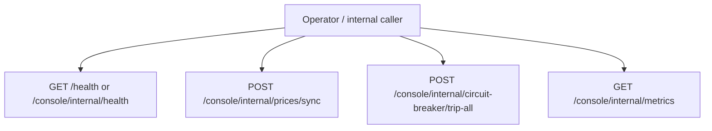

# Internal Operator Actions

← [BurnCloud Runtime Atlas](/)

## User Flow

Internal Router routes are registered before LiveView catch-all so they return JSON instead of SPA HTML.

## Source Evidence

- [`crates/router/src/lib.rs:L937-L965`](https://github.com/burncloud/burncloud/blob/main/crates/router/src/lib.rs#L937-L965)
- Top-level `/health`: [`crates/server/src/lib.rs:L59-L68`](https://github.com/burncloud/burncloud/blob/main/crates/server/src/lib.rs#L59-L68)
