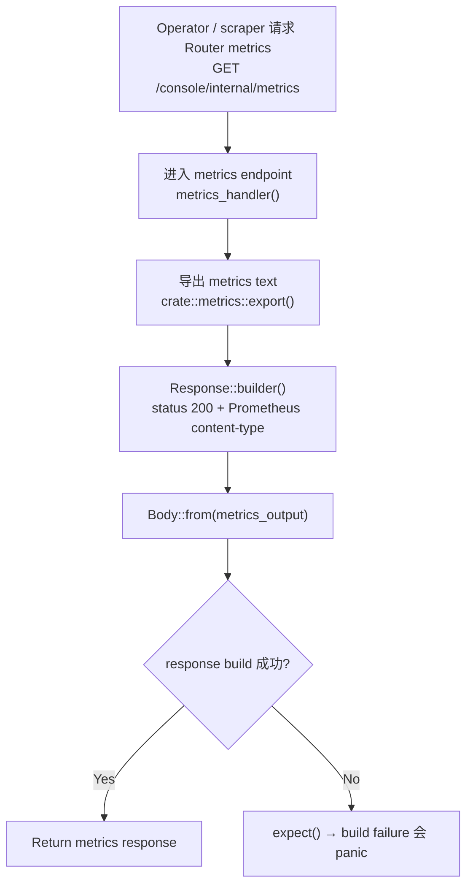

# Router Metrics

← [Internal Operator Actions](/operator/)

## What happens here?

`GET /console/internal/metrics` 进入 `metrics_handler()`。handler 调用 `crate::metrics::export()` 取得已经编码好的 Prometheus text exposition，然后构造 `200` response，并明确设置 `Content-Type: text/plain; version=0.0.4`。本页不推测 export 内部具体聚合哪些 counter；需要更深理解时应继续追踪 `metrics::export()` 源码。

## ICFG

## State / Side Effects

- This handler only reads the exported metrics representation in the visible function body.
- **⚠ Drill-down boundary:** metrics registry/export internals are intentionally not inferred on this page.

## Continue Drilling Down

→ Source: [`crate::metrics::export()` call site](https://github.com/burncloud/burncloud/blob/main/crates/router/src/lib.rs#L4322)

## Source Evidence

- Route registration: [`crates/router/src/lib.rs:L937-L952`](https://github.com/burncloud/burncloud/blob/main/crates/router/src/lib.rs#L937-L952)
- Handler: [`crates/router/src/lib.rs:L4319-L4328`](https://github.com/burncloud/burncloud/blob/main/crates/router/src/lib.rs#L4319-L4328)

**Confidence: HIGH — STATIC CONFIRMED for handler behavior.**
