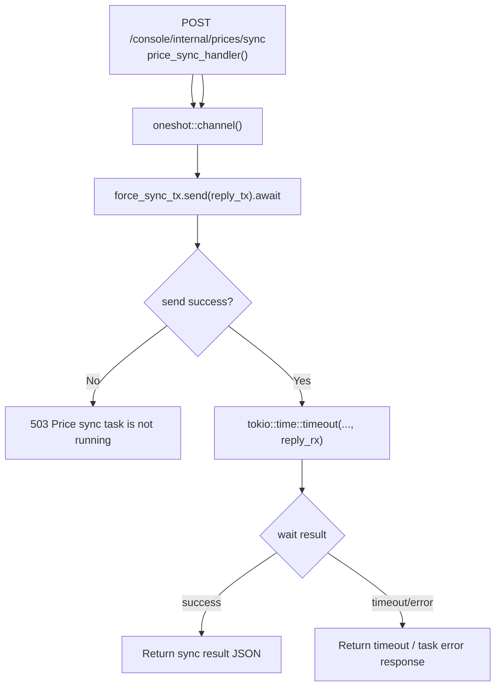

# Force Price Sync

← [Internal Operator Actions](/#/operator/)

## What happens here?

handler 创建 oneshot reply channel，把 sender 发送到 background price-sync task 的 `force_sync_tx`，然后最多等待配置的 timeout。background task 未运行时立即 503；超时 / channel closed 也有独立失败响应。

## ICFG

## State / Side Effects

- Async message to price-sync background task.
- Actual external price synchronization happens in that task; this handler is only the trigger/wait boundary.

## Source Evidence

- [`crates/router/src/lib.rs:L968-L1015`](https://github.com/burncloud/burncloud/blob/main/crates/router/src/lib.rs#L968-L1015)

**Confidence: HIGH for trigger/wait flow.**
