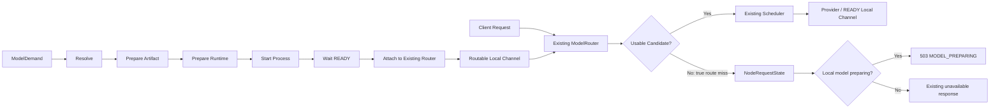
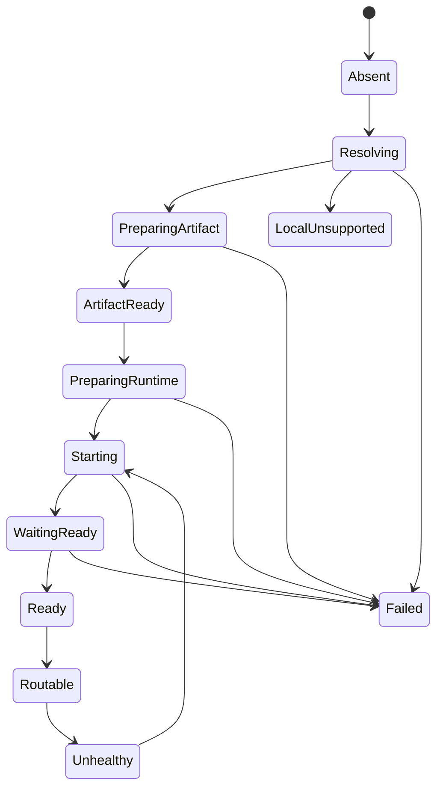

# BurnCloud Node 框架状态

BurnCloud Node 的**整体框架骨架已经实现**。当前完成的是生命周期、边界、组合关系和请求侧收口，不代表真实 GPU 探测、模型下载、Runtime 安装和本地推理执行已经全部产品化。

## 当前已经闭环的框架



框架已经明确：

- Node 只负责把本地能力从 `Absent` 推进到 `Routable`；
- Existing ModelRouter 继续负责当前请求的路由真相；
- Existing Scheduler 继续负责 Candidate 选择；
- Node 不创建第二个 HTTP Server、Router 或 Scheduler；
- 本地 Runtime 只有 READY 后才能被注册为 Local Channel；
- 真实 route miss 时，请求侧才允许查询 Node 是否正在准备；
- 准备失败会收敛到 `Failed`，不会无限停留在 Preparing；
- Routable Runtime 变成 Unhealthy 后会先变成 non-serving，再按 attachment id 精确摘除并进入恢复轨。

## Node 生命周期



## 已实现的框架合同

| 能力 | 当前框架状态 |
|---|---|
| Node Runtime attachment | 已完成 |
| Hardware / Artifact / Runtime / Process ports | 已完成 |
| Fake capability implementations | 已完成 |
| Node state rail | 已完成 |
| DemandReconciler skeleton | 已完成 |
| Application NodeOrchestrator | 已完成 |
| Supply-owned ModelResolver contract | 已完成 |
| RuntimeAdapter / ProcessPlan contract | 已完成 |
| Existing Router Local Channel attachment | 已完成 |
| Exact route detach / recovery receipt | 已完成 |
| Fake golden-path / recovery E2E | 已完成 |
| Unsupported local capability gate | 已完成 |
| `MODEL_PREPARING` request contract | 已完成 |
| Request-visible Node state synchronization | 已完成 |
| True route-miss-only `MODEL_PREPARING` gate | 已完成 |

## 当前明确还没有实现的产品能力

下面这些属于下一阶段真实实现，不再属于“框架收口”：

```text
真实 NVIDIA / GPU HardwareProbe
真实 Artifact 下载与校验
真实 Runtime 安装与准备
真实 llama.cpp / vLLM Adapter
真实进程 Spawn / Stop / Restart
真实 Readiness / Health Probe
生产环境 NodeOrchestrator 组合
ModelDemand 的真实触发来源
完整本地模型目录 / Variant Catalog
```

因此当前正确表述是：

> **BurnCloud Node Framework 已完成；BurnCloud Node Production Adapters 仍在实施。**

## 请求边界

```text
Existing ModelRouter 有可用 Candidate
    ↓
完全继续现有 Router / Scheduler
    ↓
Node 不插手

Existing ModelRouter 真正 0 Candidate
    ↓
查询 NodeRequestState
    ↓
Preparing → MODEL_PREPARING
其他状态 → 保持原 unavailable
```

特别注意：后续 protocol/path 过滤导致候选为空，不等于 ModelRouter 真正 route miss，不能因此返回 `MODEL_PREPARING`。

## 最重要的边界

> **Node 负责增加一个可用 Candidate；Node 不负责决定这个 Candidate 是否优先于其他 Candidate。**

所以当前框架不包含：

```text
LocalFirst
ExternalFirst
CostFirst
ProviderFirst
新的 Scheduler
第二个 Router
第二个 Gateway
第二套路由表
```

这条边界应持续保持。
