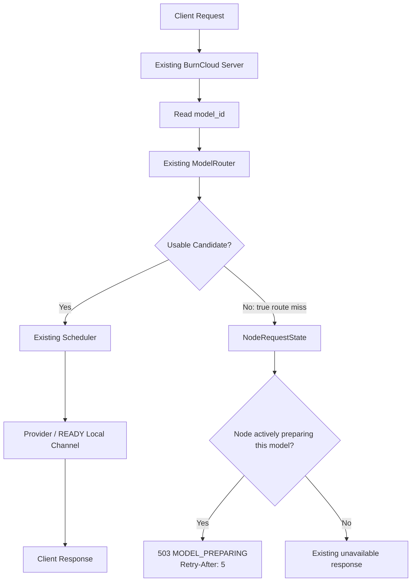
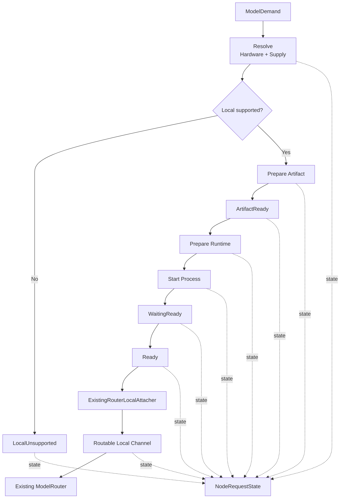
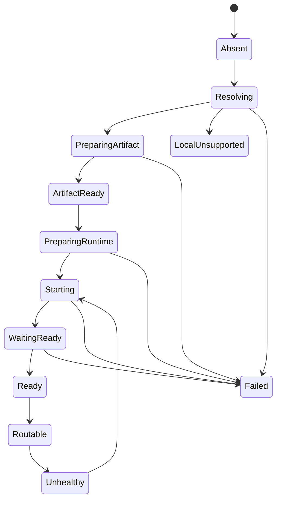
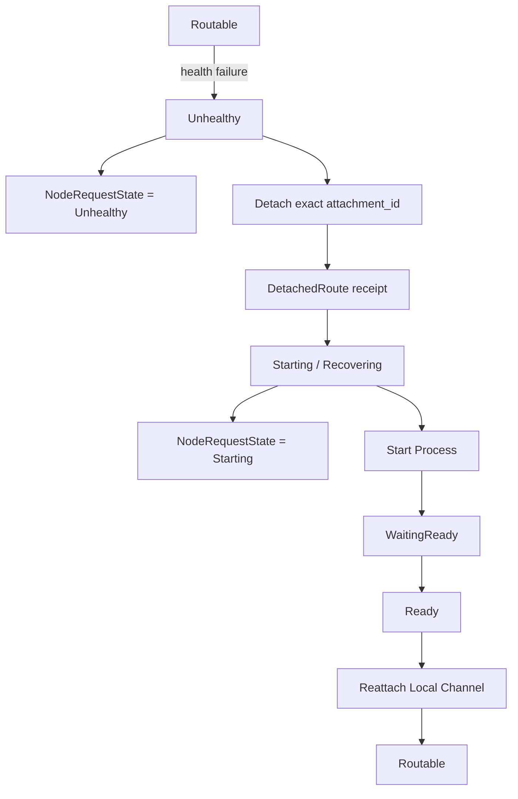

# BurnCloud Node 框架状态

BurnCloud Node 的**整体框架骨架已经实现**。当前完成的是生命周期、边界、组合关系和请求侧收口，不代表真实 GPU 探测、模型下载、Runtime 安装和本地推理执行已经全部产品化。

## 当前已经闭环的整体流程

为了兼顾桌面端和手机端，这里不再把所有关系塞进一张横向大图，而是拆成三张 Mermaid 图：

```text
① 请求主流程       → flowchart TD
② Node 生命周期    → stateDiagram-v2
③ 异常恢复流程     → flowchart TD
```

这样每张图只表达一种责任，手机窄屏也能保持可读。

### 1. 请求主流程



这张图只说明同步请求：

```text
Existing ModelRouter 有 Candidate
    ↓
完全继续 Existing Scheduler / Router
    ↓
Node 不参与 Candidate 优先级

Existing ModelRouter 真正 0 Candidate
    ↓
才查询 NodeRequestState
    ↓
Preparing → MODEL_PREPARING
其他状态 → Existing unavailable
```

特别注意：

> **protocol/path 后续过滤为空，不等于 Existing ModelRouter 真正 route miss。只有 Router 自己返回 0 Candidate 时，才允许查询 NodeRequestState。**

### 2. Node 后台准备流程



后台链的核心只有一句：

> **ModelDemand → Resolve → Artifact → Runtime → Process → READY → Attach → Routable。**

Node 只负责把本地能力变成一个 Existing ModelRouter 可以看见的 Candidate，不负责决定这个 Candidate 是否优先。

## Node 生命周期

生命周期单独使用 Mermaid `stateDiagram-v2`。状态图适合表达“状态 → 状态”的合法转换，也比大号 Flowchart 更适合手机阅读。



### 3. 异常恢复流程



如果 Resolve / Artifact / Runtime / Process / Readiness 任一步失败，则直接收敛：

```text
Preparing...
    ↓ error
Failed
    ↓
NodeRequestState = Failed
    ↓
不再错误返回 MODEL_PREPARING
```

因此当前框架可以压缩成：

```text
请求链：Existing Router 决定现在怎么走
后台链：Node 准备未来可用的 Local Candidate
状态图：定义 Node 合法生命周期
恢复链：Unhealthy → Detach → Recover → Reattach
```

框架边界保持不变：

- Node 不创建第二个 HTTP Server、Router 或 Scheduler；
- Existing ModelRouter 继续负责路由真相；
- Existing Scheduler 继续负责 Candidate 选择；
- 本地 Runtime 只有 READY 后才能注册 Local Channel；
- 真实 route miss 时，请求侧才允许查询 NodeRequestState；
- 准备失败必须收敛到 `Failed`；
- Routable Runtime 变成 Unhealthy 后先 non-serving，再精确摘除和恢复。

## 已实现的框架合同

| 能力 | 当前框架状态 |
|---|---|
| Node Runtime attachment | 已完成 |
| Hardware / Artifact / Runtime / Process ports | 已完成 |
| Fake capability implementations | 已完成 |
| Node state rail | 已完成 |
| DemandReconciler skeleton | 已完成 |
| Application NodeOrchestrator | 已完成 |
| Supply-owned ModelResolver contract | 已完成 |
| RuntimeAdapter / ProcessPlan contract | 已完成 |
| Existing Router Local Channel attachment | 已完成 |
| Exact route detach / recovery receipt | 已完成 |
| Fake golden-path / recovery E2E | 已完成 |
| Unsupported local capability gate | 已完成 |
| `MODEL_PREPARING` request contract | 已完成 |
| Request-visible Node state synchronization | 已完成 |
| True route-miss-only `MODEL_PREPARING` gate | 已完成 |

## 当前明确还没有实现的产品能力

下面这些属于下一阶段真实实现，不再属于“框架收口”：

```text
真实 NVIDIA / GPU HardwareProbe
真实 Artifact 下载与校验
真实 Runtime 安装与准备
真实 llama.cpp / vLLM Adapter
真实进程 Spawn / Stop / Restart
真实 Readiness / Health Probe
生产环境 NodeOrchestrator 组合
ModelDemand 的真实触发来源
完整本地模型目录 / Variant Catalog
```

因此当前正确表述是：

> **BurnCloud Node Framework 已完成；BurnCloud Node Production Adapters 仍在实施。**

## 请求边界

```text
Existing ModelRouter 有可用 Candidate
    ↓
完全继续现有 Router / Scheduler
    ↓
Node 不插手

Existing ModelRouter 真正 0 Candidate
    ↓
查询 NodeRequestState
    ↓
Preparing → MODEL_PREPARING
其他状态 → 保持原 unavailable
```

特别注意：后续 protocol/path 过滤导致候选为空，不等于 ModelRouter 真正 route miss，不能因此返回 `MODEL_PREPARING`。

## 最重要的边界

> **Node 负责增加一个可用 Candidate；Node 不负责决定这个 Candidate 是否优先于其他 Candidate。**

所以当前框架不包含：

```text
LocalFirst
ExternalFirst
CostFirst
ProviderFirst
新的 Scheduler
第二个 Router
第二个 Gateway
第二套路由表
```

这条边界应持续保持。
