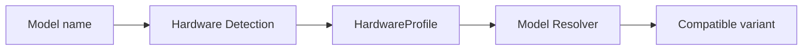

# Hardware Detection

Hardware Detection 把一台机器转换成 BurnCloud Node 可以理解的统一硬件能力描述，再交给 Model Resolver 判断哪些模型 Variant 可运行。

## 最小硬件画像

| 类别 | 字段示例 |
|---|---|
| OS | Windows / Linux / macOS |
| CPU | 架构、核心数、指令集 |
| Memory | 总 RAM、可用 RAM |
| GPU | Vendor、Model、数量 |
| VRAM | 总显存、可用显存 |
| Driver | 驱动 / Runtime 兼容信息 |
| Disk | 可用空间、模型缓存容量 |

```json
{
  "os": "windows",
  "cpu_arch": "x86_64",
  "ram_mb": 65536,
  "gpu": [{"vendor":"nvidia","model":"RTX 5090","vram_mb":32768}],
  "disk_free_mb": 390000
}
```

## 在请求流程中的位置



Hardware Detection 只提供真实能力，不直接决定下载哪个模型文件。

## 统一数据源

BurnCloud 应只有一份 `HardwareProfile`，供 Model Resolver、Runtime Manager、UI 和诊断系统共同使用，避免不同模块各自判断硬件。

静态信息可在启动时缓存；可用 RAM、VRAM、磁盘等动态资源在准备模型前重新检查。

## v0.1 硬件范围

`HardwareProfile` 的**数据模型保持 vendor-neutral**，因为未来需要表达 NVIDIA、AMD、Apple/Metal 以及其它加速设备。

但 Node v0.1 的 GPU 自动检测实现采用明确的 **NVIDIA-first** 范围：

```text
HardwareProfile abstraction
├── CPU / RAM / Disk    → v0.1
├── NVIDIA GPU / VRAM   → v0.1
├── NVIDIA Driver       → v0.1
├── AMD GPU             → Future
└── Apple Metal / other → Future
```

因此：

> **“HardwareProfile 可以表达多 Vendor”不等于“NODE-101~103 已经承诺 v0.1 自动检测所有 GPU Vendor”。**

如果机器存在 v0.1 尚未支持的 GPU 类型，正确行为是保留真实 `unsupported / unknown` 语义，而不是伪装成 NVIDIA、填 0 或猜测 Runtime compatibility。

## 失败情况

需要明确区分 GPU 驱动不可用、Runtime 不兼容、显存不足、RAM 不足、磁盘不足、设备权限不足等错误。

对尚未进入 v0.1 支持范围的 GPU Vendor，应返回明确的 unsupported/unknown diagnosis，而不是把“没有实现检测”写成“机器没有 GPU”。

## 当前源码 / 目标

- **✅ Current**：已有 CPU / memory / disk 等系统监控采集能力。
- **🎯 Node v0.1**：形成面向本地模型决策的统一 vendor-neutral `HardwareProfile`，并由 NODE-101~103 优先补齐 NVIDIA GPU、VRAM、Driver 与 Runtime compatibility。
- **🔭 Future**：AMD、Apple Metal 和其它 GPU Vendor 的自动检测作为后续独立 Implementation Plan 扩展，不扩大 NODE-101~103 的 v0.1 权限。
