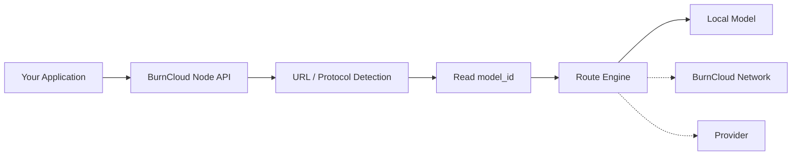
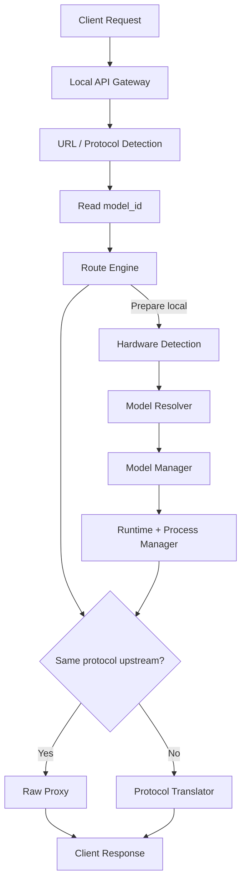

# BurnCloud Node

BurnCloud Node 是 BurnCloud 的本地运行节点。对应用来说，它首先暴露稳定的 AI API 入口，再根据 URL、协议和 Model ID 决定请求最终走向，同时尽可能保持客户端原始请求不变。

```text
http://localhost:3000
```



## 实施计划

如果准备基于现有 `burncloud/burncloud` 开始实现 BurnCloud Node，请先阅读：

- **[BurnCloud Node 实施计划](./implementation-plan)**：说明现有 BurnCloud 已具备哪些能力、Node 还需要补齐哪些功能、实施阶段以及 Node v0.1 的完成定义。

这份计划的核心原则是：**不重新实现现有 Gateway、Router、Downloader 和 Database，而是在现有 BurnCloud 上补齐本地模型执行链。**

## Node 的七个核心功能

| 功能 | 用户看到的结果 | 主要职责 |
|---|---|---|
| [Local API Gateway](./local-api-gateway) | 一个稳定 API 地址 | 接收 HTTP 请求、认证、流式传输、统一错误 |
| [Protocol Routing](./protocol-routing) | OpenAI / Anthropic / Gemini / Ollama 请求都可以进入同一套路由体系 | 根据 URL 识别协议、读取 model_id、选择 Raw Proxy 或 Translator |
| [Hardware Detection](./hardware-detection) | 自动知道机器能跑什么 | 识别 CPU、RAM、GPU、VRAM、磁盘等硬件能力 |
| [Model Resolver](./model-resolver) | 只写模型名 | 本地执行时，把逻辑模型解析成适合当前硬件的具体 Variant |
| [Model Manager](./model-manager) | 自动准备模型 | 下载、校验、缓存、删除和管理模型状态 |
| [Runtime Manager](./runtime-manager) | 不手工安装推理服务 | 准备、启动、停止和检查推理 Runtime |
| [Process Manager](./process-manager) | 模型服务保持可用 | 管理 PID、内部端口、健康检查、日志和恢复 |

## 一次请求的目标流程



## 最重要的四个原则

```text
URL      = 判断请求属于什么协议
Model ID = 用户要调用什么模型，也是主要路由键
Route    = 最终请求发往哪里
Data     = 相同协议时尽量原样透传
```

因此：

> **URL 决定如何识别协议，Model ID 决定请求什么，Route Engine 决定去哪里。相同协议原样透传，不同协议才转换。**

BurnCloud 不需要为所有厂商定义一套新的完整 AI 请求 Schema，也不应该因为上游新增一个字段就必须升级自己的统一请求结构。

## Raw Proxy First

BurnCloud 的默认数据面策略是：

```text
same protocol
    ↓
Raw Proxy

protocol mismatch
    ↓
Protocol Translator
```

例如客户端和上游都使用 OpenAI Chat 时，请求 Body 默认直接透传。BurnCloud 只提取完成路由所需的 `protocol`、`model_id` 等少量元数据。

连接不同 Provider 时，只修改代理必需的连接信息，例如 upstream base URL、Host、Authorization 和必要 Header；不主动重建整个 AI 请求 Body。

## API 与 Runtime 的边界

**API 是稳定边界，Runtime 是内部实现。** 应用不依赖 GGUF 文件名、量化 Variant、内部端口或模型 PID，也不应该因为底层从 llama.cpp 切换到 vLLM 而修改业务代码。

如果本地 Runtime 与入口使用相同协议，直接 Raw Proxy；如果只支持 Native API，才使用 Protocol Translator。

## 当前实现与 Node v0.1

- **✅ Current**：当前 BurnCloud 源码已经存在统一数据面、多个协议入口、Router、下载等基础能力。
- **🎯 Node v0.1**：把请求链明确为 URL → Protocol → Model ID → Route Engine → Raw Proxy / Protocol Translator，并继续完善硬件画像、本地 Variant 自动解析和 Runtime 生命周期。

建议先阅读实施计划，再按左侧菜单依次查看各功能页面。
