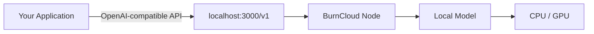
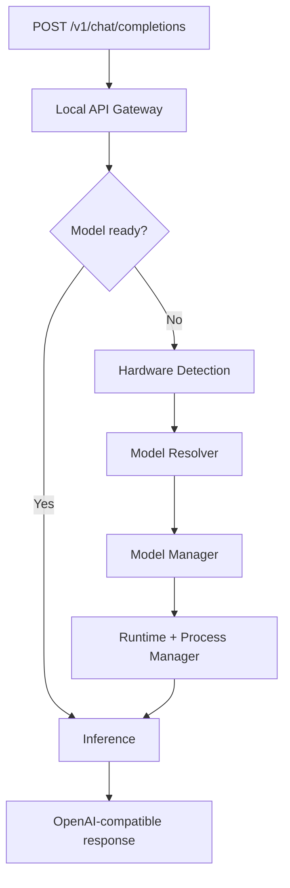

# BurnCloud Node

BurnCloud Node 是 BurnCloud 的本地运行节点。对应用来说，它首先只暴露一个稳定入口：

```text
http://localhost:3000/v1
```



## Node 的六个核心功能

| 功能 | 用户看到的结果 | 主要职责 |
|---|---|---|
| [Local API Gateway](./local-api-gateway) | 一个稳定 `/v1` 地址 | 接收兼容请求、解析模型、流式返回、统一错误 |
| [Hardware Detection](./hardware-detection) | 自动知道机器能跑什么 | 识别 CPU、RAM、GPU、VRAM、磁盘等硬件能力 |
| [Model Resolver](./model-resolver) | 只写模型名 | 把模型名解析成适合当前硬件的具体模型 Variant |
| [Model Manager](./model-manager) | 自动准备模型 | 下载、校验、缓存、删除和管理模型状态 |
| [Runtime Manager](./runtime-manager) | 不手工安装推理服务 | 准备、启动、停止和检查推理 Runtime |
| [Process Manager](./process-manager) | 模型服务保持可用 | 管理 PID、内部端口、健康检查、日志和恢复 |

## 一次请求的目标流程



## 最重要的设计边界

**API 是稳定边界，Runtime 是内部实现。** 应用只依赖 `/v1` 和模型名，不依赖 GGUF 文件名、量化 Variant、内部端口或模型 PID。

## 当前实现与 Node v0.1

- **✅ Current**：当前 BurnCloud 源码已经存在的统一数据面、Router、下载等基础能力。
- **🎯 Node v0.1**：硬件画像、模型 Variant 自动解析、本地 Runtime 与模型进程生命周期。

建议按左侧菜单依次阅读六个功能页面。每个页面都按 `What → Why → Flow → Interface → State → Failure → Source / Status` 展开。
