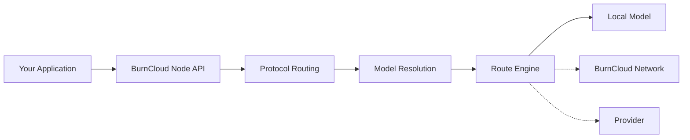
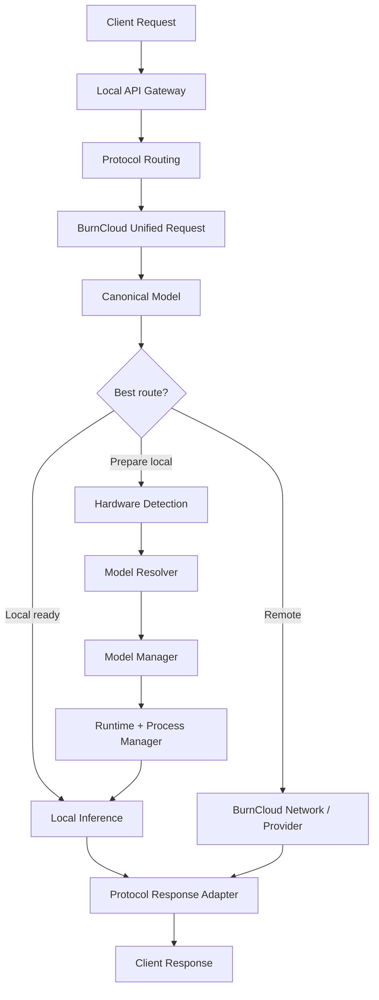

# BurnCloud Node

BurnCloud Node 是 BurnCloud 的本地运行节点。对应用来说，它首先暴露稳定的 AI API 入口，再把协议、模型、Runtime 和实际执行位置解耦。

```text
http://localhost:3000
```



## Node 的七个核心功能

| 功能 | 用户看到的结果 | 主要职责 |
|---|---|---|
| [Local API Gateway](./local-api-gateway) | 一个稳定 API 地址 | 接收 HTTP 请求、认证、流式传输、统一错误 |
| [Protocol Routing](./protocol-routing) | OpenAI / Anthropic / Gemini / Ollama 都能进入统一路由 | 识别协议、归一化请求、解析模型、衔接 Route Engine |
| [Hardware Detection](./hardware-detection) | 自动知道机器能跑什么 | 识别 CPU、RAM、GPU、VRAM、磁盘等硬件能力 |
| [Model Resolver](./model-resolver) | 只写模型名 | 本地执行时，把 canonical model 解析成适合当前硬件的具体 Variant |
| [Model Manager](./model-manager) | 自动准备模型 | 下载、校验、缓存、删除和管理模型状态 |
| [Runtime Manager](./runtime-manager) | 不手工安装推理服务 | 准备、启动、停止和检查推理 Runtime |
| [Process Manager](./process-manager) | 模型服务保持可用 | 管理 PID、内部端口、健康检查、日志和恢复 |

## 一次请求的目标流程



## 最重要的三个边界

```text
Protocol = 怎么理解客户端请求
Model    = 客户端真正想调用什么
Route    = 最终去哪里执行
```

因此：

> **Protocol 决定如何理解请求，Model 决定用户要什么，Router 决定去哪里执行。**

同一个模型可以通过 OpenAI、Anthropic 或其它协议访问；同一个 OpenAI-compatible 协议也可以调用 DeepSeek、Qwen、GLM、Kimi、Claude 或本地模型。

## API 与 Runtime 的边界

**API 是稳定边界，Runtime 是内部实现。** 应用不依赖 GGUF 文件名、量化 Variant、内部端口或模型 PID，也不应该因为底层从 llama.cpp 切换到 vLLM 而修改业务代码。

## 当前实现与 Node v0.1

- **✅ Current**：当前 BurnCloud 源码已经存在统一数据面、多个协议入口、Router、下载等基础能力。
- **🎯 Node v0.1**：把协议入口正式收敛为 Protocol Adapter → Unified Request → Model Resolution → Route Engine，并继续完善硬件画像、本地 Variant 自动解析和 Runtime 生命周期。

建议按左侧菜单依次阅读七个功能页面。
