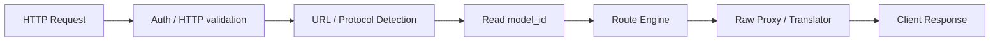

# Local API Gateway

Local API Gateway 是应用进入 BurnCloud Node 的稳定 HTTP 入口。

```text
http://localhost:3000
```

应用不应该关心模型具体运行在哪个内部端口、由哪个 Runtime 启动，也不应该因为底层路由目标变化而修改业务代码。

## 用户看到什么

OpenAI-compatible：

```bash
curl http://localhost:3000/v1/chat/completions \
  -H "Content-Type: application/json" \
  -d '{"model":"deepseek-v3","messages":[{"role":"user","content":"Hello"}]}'
```

同一个 Gateway 也可以接收 Anthropic、Gemini、Ollama 等入口，再交给 [Protocol Routing](/burncloud-node/protocol-routing/) 判断协议和请求走向。

## Gateway 的职责



- 监听稳定本地地址；
- 接收多种 AI API 路径；
- 处理认证、Header、HTTP 生命周期和基础校验；
- 保留原始 Method、Path、Query、Headers、Body 和流式语义；
- 根据 URL 把请求交给相应协议识别逻辑；
- 代理普通响应与流式响应；
- 统一 HTTP 层错误。

## Gateway 不负责什么

Gateway 不应该把所有 AI 请求转换成一套新的 BurnCloud Body，也不应该直接决定“这个请求必须调用哪家模型”。

```text
接收 HTTP / streaming             ✓
保留 raw request                   ✓
识别入口协议                       → Protocol Detection
读取 model_id                     → Model Registry / Routing
决定 Local / Network / Provider   → Route Engine
协议相同时原样转发                 → Raw Proxy
协议不同时格式转换                 → Protocol Translator
下载 GGUF                         → Model Manager
判断 VRAM                         → Hardware Detection
选择本地 Variant                  → Model Resolver
启动模型进程                       → Runtime / Process Manager
```

这条边界非常重要：

> **Gateway 管传输入口，Route Engine 管请求走向，Raw Proxy 负责同协议透传，Translator 只处理协议不一致。**

## 原始请求优先

BurnCloud 应尽可能保留客户端请求内容：

```text
Method
Path
Query
Body
Streaming semantics
Unknown vendor fields
```

连接到上游时，仅修改代理本身必须修改的连接信息，例如：

```text
upstream base URL
Host
Authorization / API Key
hop-by-hop headers
必要的 provider headers
```

如果某条 Route 必须映射上游模型名称，也只做最小字段修改，不重新构造整个 AI 请求。

## 状态

Gateway 至少需要表达：

```text
READY
MODEL_PREPARING
MODEL_UNAVAILABLE
RUNTIME_UNHEALTHY
UNSUPPORTED_PROTOCOL
INVALID_REQUEST
NODE_ERROR
```

协议无法识别时，Gateway 返回 HTTP 错误；模型不可用或正在准备时，则由后续路由层提供结构化状态。

## 当前源码 / 目标

- **✅ Current**：BurnCloud 已有统一数据面、`/v1/chat/completions`、`/v1/messages`、Gemini 等入口与 Router 请求链。
- **🎯 Node v0.1**：把 Gateway 收敛为稳定传输入口，并明确 Raw Request → URL/Protocol → model_id → Route Engine → Raw Proxy / Translator 的请求链。

现有真实接口继续参考 Technical Reference → HTTP / API → AI API / Data Plane。
