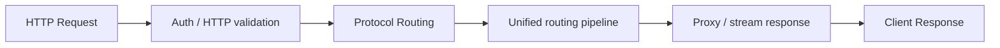

# Local API Gateway

Local API Gateway 是应用进入 BurnCloud Node 的稳定 HTTP 入口。

```text
http://localhost:3000
```

应用不应该关心模型具体运行在哪个内部端口、由哪个 Runtime 启动，也不应该因为底层模型或协议转换方式变化而修改业务代码。

## 用户看到什么

OpenAI-compatible：

```bash
curl http://localhost:3000/v1/chat/completions \
  -H "Content-Type: application/json" \
  -d '{"model":"deepseek-v3","messages":[{"role":"user","content":"Hello"}]}'
```

同一个 Gateway 后续也可以接收 Anthropic、Gemini、Ollama 等入口，再交给 [Protocol Routing](/burncloud-node/protocol-routing/) 统一处理。

## Gateway 的职责



- 监听稳定本地地址；
- 接收多种 AI API 路径；
- 处理认证、Header、HTTP 生命周期和基础校验；
- 把请求交给 Protocol Routing；
- 代理普通响应与流式响应；
- 统一 HTTP 层错误。

## Gateway 不负责什么

Gateway 不应该直接理解每一种模型厂商的业务语义，也不应该直接决定“这个请求必须调用哪家模型”。

```text
接收 HTTP / streaming         ✓
识别并转换具体协议             ✗ → Protocol Routing
决定 canonical model          ✗ → Model Resolution / Registry
决定 Local / Network / Provider ✗ → Route Engine
下载 GGUF                    ✗ → Model Manager
判断 VRAM                    ✗ → Hardware Detection
选择本地 Variant             ✗ → Model Resolver
启动模型进程                  ✗ → Runtime / Process Manager
```

这条边界非常重要：

> **Gateway 管入口，Protocol Routing 管格式，Router 管执行位置。**

外部只依赖稳定 BurnCloud API 地址，内部 Runtime 可以使用动态端口，例如 `127.0.0.1:39122`。

## 状态

Gateway 至少需要表达：

```text
READY
MODEL_PREPARING
MODEL_UNAVAILABLE
RUNTIME_UNHEALTHY
UNSUPPORTED_PROTOCOL
INVALID_REQUEST
NODE_ERROR
```

协议解析失败时，Gateway 返回 HTTP 错误；模型不可用或正在准备时，则由后续路由层提供结构化状态。

## 当前源码 / 目标

- **✅ Current**：BurnCloud 已有统一数据面、`/v1/chat/completions`、`/v1/messages`、Gemini 等入口与 Router 请求链。
- **🎯 Node v0.1**：把 Gateway 收敛为稳定传输入口，把协议解析与模型/路由选择正式下沉到 Protocol Routing 和 Route Engine。

现有真实接口继续参考 Technical Reference → HTTP / API → AI API / Data Plane。
