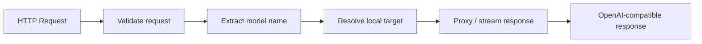

# Local API Gateway

Local API Gateway 是应用进入 BurnCloud Node 的稳定入口：

```text
http://localhost:3000/v1
```

应用不应该关心模型具体运行在哪个内部端口、由哪个 Runtime 启动，也不应该因为本地模型实现变化而修改接入代码。

## 用户看到什么

```bash
curl http://localhost:3000/v1/chat/completions \
  -H "Content-Type: application/json" \
  -d '{"model":"deepseek-r1-7b","messages":[{"role":"user","content":"Hello"}]}'
```

## Gateway 的职责



- 监听稳定本地地址；
- 兼容核心 `/v1` API；
- 解析模型名；
- 把请求交给已准备好的本地 Runtime；
- 代理普通响应与流式响应；
- 统一内部 Runtime 错误。

## 职责边界

```text
接收请求 / streaming     ✓
下载 GGUF               ✗ → Model Manager
判断 VRAM               ✗ → Hardware Detection
选择 Variant            ✗ → Model Resolver
启动模型进程             ✗ → Runtime / Process Manager
```

外部只依赖 `localhost:3000/v1`，内部 Runtime 可以使用动态端口，例如 `127.0.0.1:39122`。

## 状态

Gateway 至少需要表达 `READY`、`MODEL_PREPARING`、`MODEL_UNAVAILABLE`、`RUNTIME_UNHEALTHY` 和 `NODE_ERROR`。

## 当前源码 / 目标

- **✅ Current**：BurnCloud 已有统一 `/v1` 数据面与 Router 请求链。
- **🎯 Node v0.1**：进一步连接本地 Model Resolver 与本地 Runtime 生命周期。

现有真实接口继续参考 Technical Reference → HTTP / API → AI API / Data Plane。
