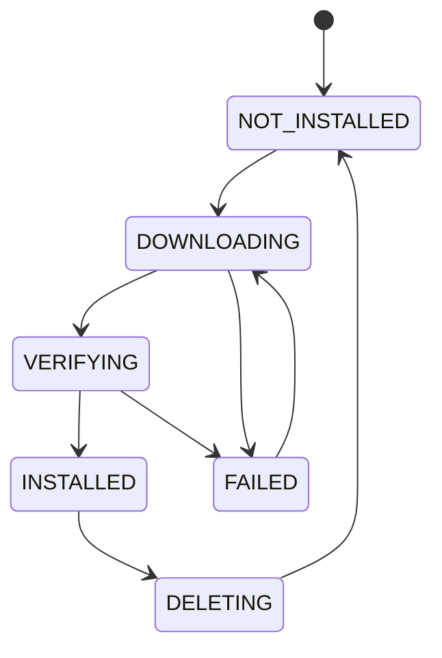

# Model Manager

Model Manager 管理 BurnCloud Node 本地模型 Artifact 生命周期。它接收 Model Resolver 已经选好的 `ResolvedModel`，负责把对应文件可靠地准备到本机，并让本地 Artifact 的库存、状态和安全删除可被统一管理。

## 最小职责

```text
download
resume
verify checksum
cache
list
delete
status
```

这些职责在 Implementation Plan 中有明确归属：

```text
NODE-301  Local Artifact State / status
NODE-302  download / resume / disk admission / dedup
NODE-303  verification / failure / recovery
NODE-304  inventory / cache / list / safe delete
```

因此 `cache / list / delete / status` 不再是“假设现有 ModelService 自然会处理”的隐含职责。

## 本地目录

```text
~/.burncloud/
├── models/
├── runtimes/
├── cache/
├── logs/
└── state/
```

模型 Artifact 不应该散落在业务应用目录里。

## 生命周期



Model Manager 需要支持断点续传、单 Artifact 去重下载、checksum 校验、临时文件隔离和 Node 重启后的任务恢复。

## Inventory 与 Cache

Node 应能从一份权威 Artifact inventory 看到：

```text
canonical model
variant / artifact
local state
size / disk usage
preparation / verification status
owned storage identity
in-use / protected status（可确认时）
```

Inventory 是现有 Model / Download / Artifact facts 的**投影**，不是第二份模型数据库。

`cache` 在 Node v0.1 中只表示本地已经存在、可安全复用的 Artifact 生命周期。复杂 LRU、自动磁盘回收、历史 demand warm-set 不属于 v0.1 必要前置条件。

## Delete 安全边界

删除是不可逆文件操作，因此默认 fail closed：

```text
owned + not in use + safe target => may delete
in use                         => reject
ownership unknown              => reject
outside managed storage        => reject
```

删除成功后，物理文件与 authoritative Artifact state 必须一致收敛，不能出现“文件已经没了但状态还是 READY”的 ghost state。

## 并发请求

多个请求同时触发同一个模型时，只允许存在一个准备任务：

```text
Request A ─┐
Request B ─┼─► one model preparation job
Request C ─┘
```

## 职责边界

Model Resolver 决定“要哪个文件”；Model Manager 确保“这个文件在本地可靠存在并被安全管理”。它不重新选择量化版本，也不直接启动推理进程。

```text
Resolver       → choose
Model Manager  → prepare / verify / inventory / delete
Runtime        → define how to run
Process        → own live process
Router         → decide where request goes
```

## 状态

Node 内部应能查询模型、Variant、状态、下载进度、已下载字节与总字节，使 Gateway 可以向调用方报告 `MODEL_PREPARING`，也让未来 UI/CLI 不必直接扫描模型目录猜状态。

## 失败情况

至少应区分：

```text
NETWORK_ERROR
DISK_FULL
CHECKSUM_MISMATCH
ARTIFACT_NOT_FOUND
PERMISSION_DENIED
DOWNLOAD_INTERRUPTED
ARTIFACT_IN_USE
ARTIFACT_OWNERSHIP_UNKNOWN
DELETE_FAILED
STATE_CONFLICT
```

## 当前源码 / 目标

- **✅ Current**：已有下载、进度监控、不完整下载恢复、ModelService CRUD 与受管理文件路径相关基础能力。
- **🎯 Node v0.1**：通过 NODE-301~304 收敛成面向本地模型 Artifact 的统一生命周期，并连接 Resolver / Runtime Manager。
