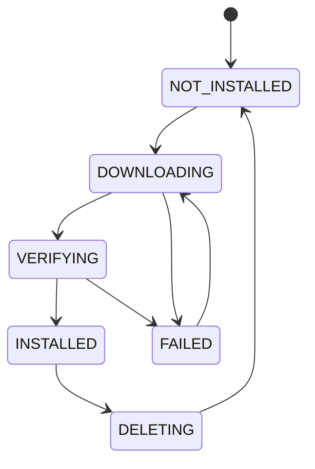

# Model Manager

Model Manager 管理 BurnCloud Node 本地模型 Artifact 生命周期。它接收 Model Resolver 已经选好的 `ResolvedModel`，负责把对应文件可靠地准备到本机。

## 最小职责

```text
download
resume
verify checksum
cache
list
delete
status
```

## 本地目录

```text
~/.burncloud/
├── models/
├── runtimes/
├── cache/
├── logs/
└── state/
```

模型 Artifact 不应该散落在业务应用目录里。

## 生命周期



Model Manager 需要支持断点续传、单 Artifact 去重下载、checksum 校验、临时文件隔离和 Node 重启后的任务恢复。

## 并发请求

多个请求同时触发同一个模型时，只允许存在一个准备任务：

```text
Request A ─┐
Request B ─┼─► one model preparation job
Request C ─┘
```

## 职责边界

Model Resolver 决定“要哪个文件”；Model Manager 确保“这个文件在本地可靠存在”。它不重新选择量化版本，也不直接启动推理进程。

## 状态

Node 内部应能查询模型、Variant、状态、下载进度、已下载字节与总字节，使 Gateway 可以向调用方报告 `MODEL_PREPARING`。

## 失败情况

应区分 `NETWORK_ERROR`、`DISK_FULL`、`CHECKSUM_MISMATCH`、`ARTIFACT_NOT_FOUND`、`PERMISSION_DENIED`、`DOWNLOAD_INTERRUPTED`。

## 当前源码 / 目标

- **✅ Current**：已有下载、进度监控和不完整下载恢复相关基础能力。
- **🎯 Node v0.1**：收敛成面向本地模型 Artifact 的统一 Model Manager，并连接 Resolver / Runtime Manager。
