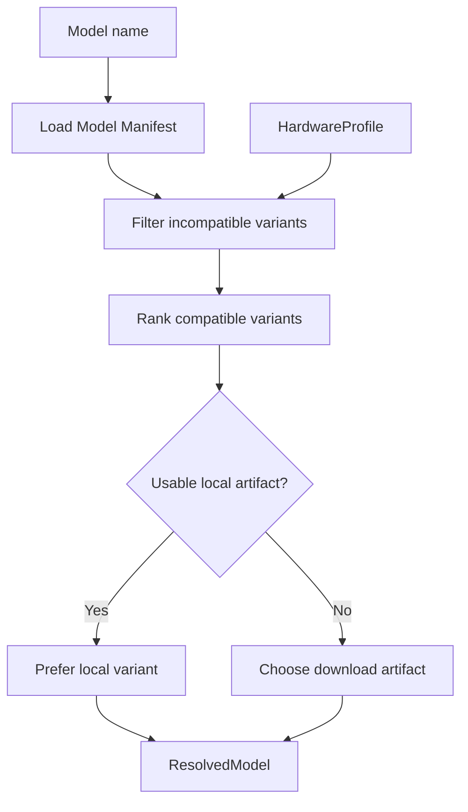

# Model Resolver

Model Resolver 把稳定模型名解析成当前机器真正应该使用的模型 Variant 和 Artifact。

用户请求：

```text
deepseek-r1-7b
```

而不是手工指定：

```text
DeepSeek-R1-Distill-Qwen-7B-Q4_K_M.gguf
```

> **Request a model, not a file.**

## 输入与输出

```text
Model name
+ HardwareProfile
+ Runtime capabilities
+ Local model state
        ↓
ResolvedModel
├─ canonical model id
├─ runtime
├─ format
├─ quantization / variant
├─ artifact URI
├─ checksum
└─ resource requirements
```

## 解析流程



## Manifest

一个模型可以存在多个 Variant，例如 `gguf-q4-k-m` 与 `gguf-q8-0`，每个 Variant 定义 Runtime、格式、量化、最低 RAM/VRAM 和 Artifact。

## 职责边界

Resolver 负责“选择”，不负责执行：下载交给 Model Manager，Runtime 准备交给 Runtime Manager，PID 管理交给 Process Manager。

Node v0.1 优先保证可运行和可解释：满足最低硬件要求 → 优先可用本地缓存 → 优先已准备 Runtime → 在资源允许范围内选择推荐质量。

## 无法解析时

应返回结构化原因，例如 `NO_MODEL_MANIFEST`、`NO_COMPATIBLE_VARIANT`、`INSUFFICIENT_RAM`、`INSUFFICIENT_VRAM`、`UNSUPPORTED_RUNTIME`。

## 当前源码 / 目标

- **🎯 Node v0.1**：新的本地 Node 核心抽象。
- 当前 Source Atlas 中的 `ModelRouter` 面向上游 Channel / Provider 路由，不应与本地 Model Resolver 混为同一职责。
