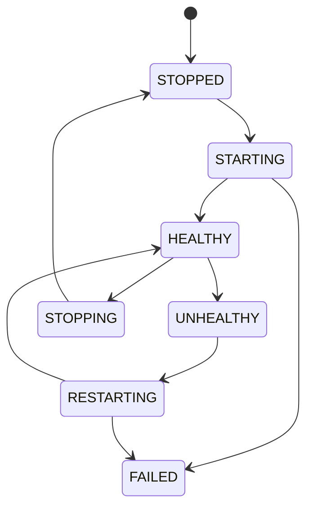

# Process Manager

Process Manager 负责真正运行起来的模型进程。Runtime Manager 决定“怎么启动”，Process Manager 负责“启动以后怎么管”。

## 运行状态

```text
model
runtime
PID
internal port
started_at
health
restart_count
log path
```

例如：

```text
deepseek-r1-7b
Runtime: llama.cpp
PID: 18282
Port: 39122
Status: HEALTHY
```

应用仍然只访问 `localhost:3000/v1`，内部端口不对外暴露。

## 生命周期



## Ready 与进程创建不同

正确流程是 `spawn → PID created → readiness / health check → HEALTHY → Gateway route`。不能只因为进程存在就认为模型已经完成加载。

## 崩溃与恢复

异常退出时记录 exit code、最后健康状态、restart count、日志位置，并对自动重启设置上限，避免无限 crash loop。

## 多模型

```text
BurnCloud Node
├── deepseek-r1-7b → :39122
├── qwen3-8b       → :39123
└── llama-3-8b     → :39124
```

Gateway 根据模型名路由到内部目标。Node v0.1 可以先追求可靠的单模型/少量模型生命周期，不必先追求大量常驻模型。

## 失败情况

应区分 `PROCESS_SPAWN_FAILED`、`PROCESS_EXITED`、`READINESS_TIMEOUT`、`HEALTH_CHECK_FAILED`、`PORT_CONFLICT`、`RESTART_LIMIT_REACHED`。

## 当前源码 / 目标

- **🎯 Node v0.1**：形成专门面向本地模型 Runtime 的进程状态管理。
- Headless Server 和 Desktop Node 应共享同一套核心 Process Manager，而不是把进程生命周期绑定到 UI。
