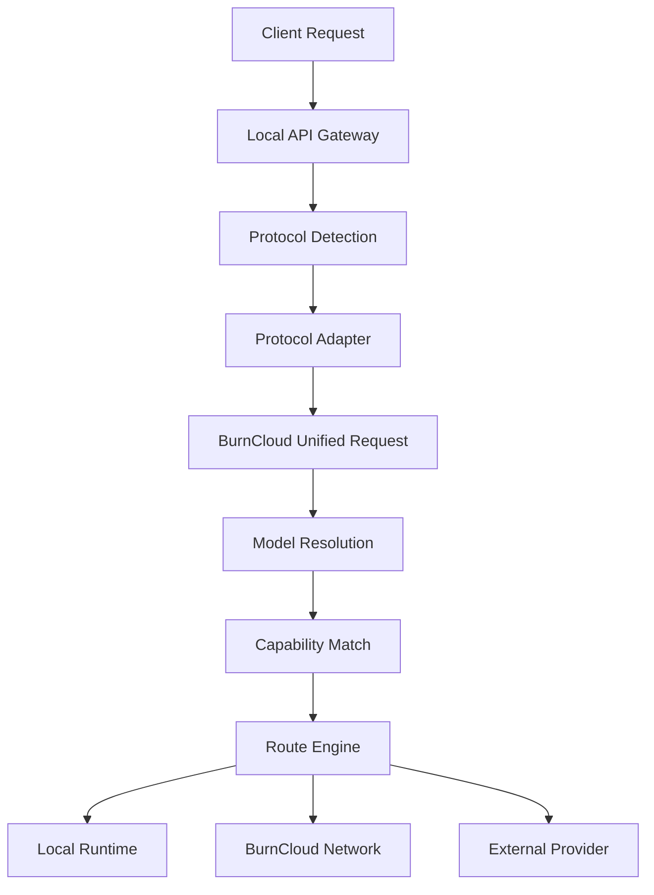

# Protocol Routing

Protocol Routing 定义 BurnCloud Node 如何理解不同 AI API 协议，并在协议、模型和实际执行位置之间建立清晰边界。

最重要的原则只有一句：

> **Protocol 决定如何理解请求，Model 决定用户要什么，Router 决定去哪里执行。**

协议不应该直接绑定某个厂商或某个模型。一个模型可以通过多种协议访问，同一种协议也可以承载很多不同模型。

## 为什么不能用协议直接绑定模型

例如下面三个请求都可能要求同一个 Claude 模型：

```text
POST /v1/messages
POST /v1/chat/completions
POST Bedrock Converse
```

反过来，一个 OpenAI-compatible 请求也可能调用：

```text
DeepSeek
Qwen
GLM
Kimi
Claude
Llama
```

因此 BurnCloud 不应维护这样的关系：

```text
/v1/messages      -> Claude
/v1/chat/...      -> DeepSeek
/v1beta/...       -> Gemini
```

而应该先把协议和模型解耦。

## 请求处理模型



处理顺序固定为：

```text
1. 识别协议
2. 解析请求
3. 归一化为 BurnCloud Unified Request
4. 解析 canonical model
5. 检查 capability
6. Route Engine 选择执行位置
7. Upstream Adapter 转成目标 Runtime / Provider 所需格式
8. 返回并转换响应
```

## 第一阶段协议族

BurnCloud 应按“协议族”维护 Adapter，而不是按厂商维护 Adapter。

| Protocol ID | 典型入口 | 核心结构 | 说明 |
|---|---|---|---|
| `openai-chat` | `/v1/chat/completions` | `messages[]` / `choices[]` | DeepSeek、Qwen、GLM、Kimi 等大量模型可归入这一类 |
| `openai-responses` | `/v1/responses` | `input` / `output[]` | OpenAI 新一代 Responses 数据模型 |
| `anthropic-messages` | `/v1/messages` | `messages[]` / content blocks | Claude 原生协议，也可被其它模型兼容 |
| `google-gemini` | `/v1beta/models/{model}:generateContent` | `contents[].parts[]` | Gemini 原生协议 |
| `ollama` | `/api/chat`、`/api/generate` | `messages` / `options` | 本地模型生态的重要原生协议 |

后续可以继续增加 `bedrock-converse`、`kserve-v2`、`llama.cpp-native` 等 Adapter，但它们不应改变 Route Engine 的核心模型。

## OpenAI-compatible 不等于厂商完全相同

DeepSeek、Qwen、GLM、Kimi 等可以使用 `openai-chat` 作为基础协议，但仍可能存在扩展字段。

建议分成两层：

```text
Protocol
└─ openai-chat

Vendor Extensions
├─ deepseek
├─ qwen
├─ glm
└─ kimi
```

例如：

```text
reasoning_content
enable_thinking
thinking
reasoning_effort
```

这些属于 Vendor Extension，不应该因此创建四套新的核心 Protocol。

## Unified Request

请求进入协议 Adapter 后，应尽快转换成 BurnCloud 内部统一结构。

目标数据模型示例：

```rust
struct BurnRequest {
    protocol: Protocol,
    model: String,
    messages: Vec<Message>,
    tools: Vec<Tool>,
    stream: bool,
    capabilities: CapabilitySet,
    extensions: VendorExtensions,
}
```

其中：

```text
protocol = 客户端使用什么语言和 BurnCloud 交流
model    = 客户端真正要求的模型
capabilities = chat / reasoning / tools / vision / embedding / streaming ...
extensions = 厂商特有但不能丢失的字段
```

协议特有 JSON 不应该继续穿透整个 BurnCloud 内部调用链。

## Model Resolution

模型名也需要与协议解耦。

例如：

```text
输入：deepseek-v3
        ↓
Model Registry
        ↓
canonical_model = deepseek/deepseek-v3
```

或者：

```text
输入：claude-sonnet
        ↓
anthropic/claude-sonnet
```

同一个 canonical model 可以拥有多个执行候选：

```text
deepseek/deepseek-v3
├─ local-vllm
├─ local-llama.cpp
├─ burncloud-network-node
├─ deepseek-official
└─ third-party-provider
```

## Route Engine

真正决定“走哪里”的是 Route Engine，而不是 URL Path。

建议路由输入至少包括：

```text
(protocol, model, capabilities)
```

路由候选再根据以下条件排序：

```text
availability
health
local preference
network preference
cost
latency
context length
tool support
reasoning support
vision support
runtime compatibility
```

一个候选可以表达为：

```rust
struct RouteCandidate {
    canonical_model: String,
    target: RouteTarget,
    upstream_protocol: Protocol,
    runtime: Option<Runtime>,
    capabilities: CapabilitySet,
    health: HealthState,
    cost: Option<Cost>,
    latency: Option<Latency>,
}
```

## 协议转换示例

### Anthropic 请求调用 DeepSeek

```text
/v1/messages
      ↓
anthropic-messages adapter
      ↓
BurnRequest
model = deepseek/deepseek-v3
      ↓
Route Engine
      ↓
DeepSeek Provider
      ↓
openai-chat upstream adapter
```

客户端使用 Anthropic 格式，不代表后端必须是 Anthropic。

### OpenAI 请求调用本地 GGUF

```text
/v1/chat/completions
      ↓
openai-chat adapter
      ↓
BurnRequest
model = qwen/qwen3-8b
      ↓
Route Engine
      ↓
Local Node
      ↓
llama.cpp Runtime
```

客户端也不需要知道底层到底是 llama.cpp、vLLM 还是其它 Runtime。

## 与其它 Node 组件的边界

```text
Local API Gateway
    负责 HTTP / auth / streaming / error envelope

Protocol Routing
    负责协议识别、解析、归一化、响应转换

Model Registry / Model Resolution
    负责模型名和 canonical model

Hardware Detection
    负责本机硬件能力

Model Resolver
    负责本地模型 Variant / Artifact 选择

Route Engine
    负责 Local / Network / Provider 的最终选择

Runtime Manager
    负责具体推理 Runtime 生命周期
```

尤其不要把两个概念混在一起：

- **Protocol Routing**：客户端请求格式与统一请求之间的转换；
- **Model Resolver**：在本机运行模型时选择哪个具体 Variant / Artifact。

## Node v0.1 建议

第一阶段优先实现：

```text
Inbound Protocols
├─ openai-chat
├─ anthropic-messages
├─ google-gemini
└─ ollama

Internal
└─ BurnRequest

Route Targets
├─ local
├─ burncloud-network
└─ provider
```

其中 DeepSeek、Qwen、GLM、Kimi 等优先复用 `openai-chat`，只有出现真正的数据模型差异时才新增 Protocol Adapter。

这能保证 BurnCloud 的协议数量保持小而稳定，同时模型、Provider 和 Runtime 可以持续扩展。

## 当前源码 / 目标

- **✅ Current**：BurnCloud 已存在 `/v1/chat/completions`、`/v1/messages`、Gemini `generateContent` 等多种数据面入口，以及现有 Router 执行链。
- **🎯 Node v0.1**：把这些入口正式收敛为 Protocol Adapter → Unified Request → Model Resolution → Route Engine 的明确边界。

现有真实 HTTP 执行链继续参考 Technical Reference → HTTP / API → AI API / Data Plane。
