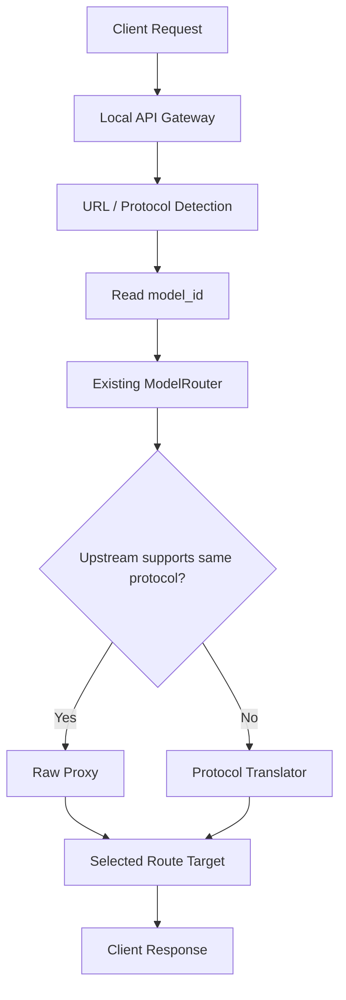

# Protocol Routing

BurnCloud 的协议路由原则不是把所有请求转换成一套新的内部 AI 请求格式，而是尽可能保持客户端请求原样，只提取完成路由所需的最少信息。

> **URL 决定如何识别协议，Model ID 决定用户要调用什么模型，Route Engine 决定请求最终发往哪里。**

默认策略：

> **Raw Proxy First：协议相同，原样透传；协议不同，才进行转换。**

## 核心请求流程



处理顺序：

```text
1. URL / Path 识别入口协议
2. 提取完成路由所需的 model_id
3. Existing ModelRouter 选择当前可服务目标
4. 协议一致 → Raw Proxy
5. 协议不一致 → Protocol Translator
6. 返回原协议语义的普通响应或流式响应
```

## BurnCloud 不创建第五套 AI 请求协议

BurnCloud 不要求所有请求先变成 `BurnCloud Unified Request`、`BurnRequest` 或其它完整统一 AI Body。

例如：

```http
POST /v1/chat/completions
```

```json
{
  "model": "deepseek-v3",
  "messages": [
    {"role": "user", "content": "Hello"}
  ],
  "reasoning_effort": "high",
  "future_vendor_field": {
    "enabled": true
  }
}
```

路由层只需要提取：

```text
protocol = openai-chat
model_id = deepseek-v3
```

其它内容默认保持原样。

这样即使上游新增：

```text
reasoning_content
enable_thinking
thinking
reasoning_effort
future_vendor_field
```

BurnCloud 也不需要先升级统一 Schema 才能继续同协议转发。

## Raw Proxy First

入口和目标使用相同协议时：

```text
Client
  ↓
BurnCloud
  ↓ route only
Same-protocol target
```

默认保持：

```text
HTTP method
request body
query parameters
protocol-specific fields
streaming semantics
unknown vendor extensions
```

只修改完成代理所必需的连接信息，例如：

```text
upstream base URL
Host
upstream Authorization / API Key
hop-by-hop headers
必要 provider connection headers
```

如果 Route 明确需要把逻辑 `model_id` 映射成上游模型名，也只做最小字段改写，不重建整个 Body。

## URL 负责识别协议

典型入口：

| URL / Path | Protocol |
|---|---|
| `/v1/chat/completions` | `openai-chat` |
| `/v1/responses` | `openai-responses` |
| `/v1/messages` | `anthropic-messages` |
| `/v1beta/models/{model}:generateContent` | `google-gemini` |
| `/api/chat` | `ollama-chat` |
| `/api/generate` | `ollama-generate` |

URL 只告诉 BurnCloud：

```text
这个请求是什么协议
```

URL 不直接决定：

```text
必须去哪个 Provider
必须使用哪个具体上游账号
必须使用 Local
```

## Model ID 负责声明用户意图

例如：

```json
{"model": "deepseek-v3"}
```

BurnCloud 得到：

```text
model_id = deepseek-v3
```

然后由 Model Registry / Existing ModelRouter 查找当前可服务目标。

因此：

> **Model ID 是主要路由键，不等于 Provider。**

`deepseek-v3` 不天然等价于“DeepSeek 官方 API”。

## BurnCloud 只统一薄 Route Context

BurnCloud 可以维护很薄的 Route Context：

```rust
struct RouteContext {
    protocol: Protocol,
    model_id: String,
    route_id: Option<String>,
    provider_id: Option<String>,
}
```

它服务于 Control Plane / Route Engine，不是新的 AI 请求格式。

真实数据面仍保留原始请求：

```text
RawRequest
├─ Method
├─ Path
├─ Query
├─ Headers
├─ Body
└─ Stream
```

必须保持：

```text
Control Plane
    protocol / model_id / target / health / price / capability

Data Plane
    raw request / raw stream / raw response
```

## Route Engine

真正决定当前请求去哪里的是 **existing ModelRouter**。

```text
URL
 ↓
Protocol Detection
 ↓
model_id
 ↓
Existing ModelRouter
 ↓
┌───────────────────────┐
│ Local Runtime         │
│ External Provider     │
└───────────────────────┘
```

Node 不创建 `NodeRouteEngine`、`LocalRouter` 或 `DemandRouter`。

Model Demand Reconciler 只负责把未来本地能力收敛为 READY，不负责当前请求选路。

## 同协议：直接透传

例如：

```text
POST /v1/chat/completions
model = deepseek-v3
protocol = openai-chat
        ↓
Existing ModelRouter
        ↓
Target supports openai-chat
        ↓
Raw Proxy
```

BurnCloud 不需要理解或重建所有 OpenAI-compatible 字段。

## 不同协议：才进入 Translator

例如：

```text
Client /v1/messages
        ↓
anthropic-messages
        ↓
model_id
        ↓
Existing ModelRouter
        ↓
Target only supports openai-chat
        ↓
Anthropic → OpenAI Translator
```

Translator 是必要时启用的兼容层，不是每个请求必经层。

## 与本地 Runtime 的关系

本地模型也是 Existing ModelRouter 的 Channel candidate。

如果本地 Runtime 与入口协议一致：

```text
Raw Proxy
```

如果本地 Runtime 只支持不同协议/Native API：

```text
Protocol Translator
```

因此 llama.cpp、vLLM、SGLang、Ollama 是 Runtime / Route Target 能力，不应与客户端入口协议混成一个概念。

## Node v0.1 范围

### Ingress compatibility target

```text
openai-chat
openai-responses
anthropic-messages
google-gemini
ollama-chat / ollama-generate
```

具体 current-main 支持情况必须由 [NODE-004](/burncloud-node/implementation-plan/node-004/) 在 READY Gate 中核实；文档列出协议目标不等于允许 Codex 猜测缺失实现。

### Route Targets

Node v0.1 的完成条件只包含：

```text
Route Targets
├── Local Runtime
└── External Provider
```

BurnCloud Network 是**未来 Route Target**：

```text
Future
└── BurnCloud Network
    ├── P2P Transport
    ├── Node-to-Node Routing
    └── Multi-node Scheduling
```

因此：

> **NODE-004 与 NODE-503 不以 BurnCloud Network 可用作为 Node v0.1 完成前置条件。**

当 Network 未来实现时，应作为新的 Channel / Route Target 接入 existing ModelRouter，而不是改变本页 URL → Protocol → model_id → Route Engine → Raw Proxy / Translator 的边界。

## 与其它 Node 组件的边界

```text
Local API Gateway
    HTTP / auth / streaming / transport

Protocol Detection
    URL / Path → ingress protocol

Model Registry
    canonical model identity

Existing ModelRouter
    current Local / Provider route decision

Raw Proxy
    same protocol request/response preservation

Protocol Translator
    protocol mismatch only

Hardware Detection
    local hardware facts

Model Resolver
    local Variant / Artifact selection

Model Manager
    local Artifact lifecycle

Runtime / Process Manager
    local execution lifecycle

Model Demand Reconciler
    future local readiness orchestration
```

## 当前源码 / 目标

- **✅ Current**：BurnCloud 已存在多个数据面入口和 existing ModelRouter 执行链。
- **🎯 Node v0.1**：通过 NODE-003 + NODE-004 把“复用统一 Server / Router”与“协议兼容性实际成立”分开验收，并保持 Raw Proxy First。
- **🔭 Future**：BurnCloud Network 作为新的 Route Target 接入 existing ModelRouter，不属于 v0.1 前置条件。

现有真实 HTTP 执行链继续参考 Technical Reference → HTTP / API → AI API / Data Plane。
