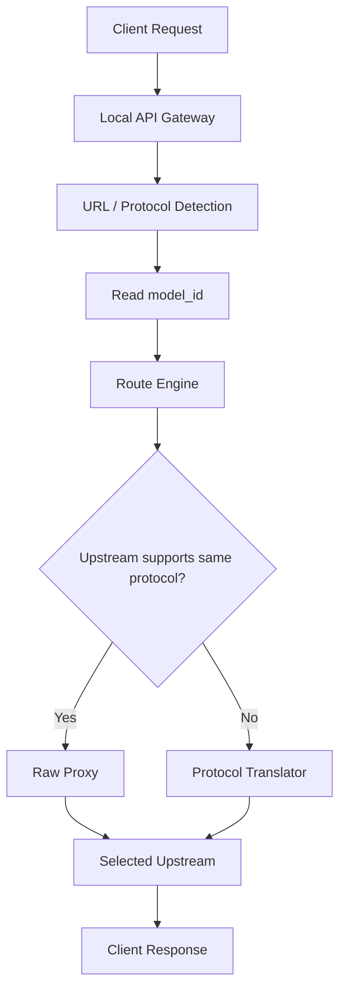

# Protocol Routing

BurnCloud 的协议路由原则不是把所有请求转换成一套新的内部 AI 请求格式，而是尽可能保持客户端请求原样，只提取完成路由所需的最少信息。

> **URL 决定如何识别协议，Model ID 决定用户要调用什么模型，Route Engine 决定请求最终发往哪里。**

BurnCloud 的默认数据面策略是：

> **Raw Proxy First：协议相同，原样透传；协议不同，才进行转换。**

## 核心请求流程



处理顺序应当是：

```text
1. 根据 URL / Path 识别入口协议
2. 从请求中读取完成路由所需的 model_id
3. Route Engine 根据 model_id 和路由策略选择上游
4. 如果入口协议与上游协议一致：直接 Raw Proxy
5. 如果协议不一致：进入 Protocol Translator
6. 将上游响应按原协议直接返回；只有发生协议转换时才转换响应
```

## BurnCloud 不创建第五套 AI 请求协议

BurnCloud 不应该要求所有请求先变成 `BurnCloud Unified Request`、`BurnRequest` 或其它完整的统一 AI Body。

例如客户端发送：

```http
POST /v1/chat/completions
```

```json
{
  "model": "deepseek-v3",
  "messages": [
    {"role": "user", "content": "Hello"}
  ],
  "reasoning_effort": "high",
  "future_vendor_field": {
    "enabled": true
  }
}
```

BurnCloud 路由层只需要提取：

```text
protocol = openai-chat
model_id = deepseek-v3
```

其余请求内容默认保持原样。

这样即使上游新增 BurnCloud 尚未认识的字段：

```text
reasoning_content
enable_thinking
thinking
reasoning_effort
future_vendor_field
```

BurnCloud 也不需要升级自己的统一 Schema 才能继续转发。

## Raw Proxy First

当入口和上游使用同一种协议时：

```text
Client
  │
  │ OpenAI Chat Request
  ▼
BurnCloud
  │
  │ Route only
  ▼
OpenAI-compatible Upstream
```

请求 Body 不做结构化重建，不把 `messages`、`tools`、`reasoning`、多模态字段拆出来再重新组装。

默认保持：

```text
HTTP method
request body
query parameters
protocol-specific fields
streaming semantics
unknown vendor extensions
```

连接到不同上游时，BurnCloud 只允许修改完成代理所必需的传输或连接信息，例如：

```text
upstream base URL
Host
upstream Authorization / API Key
hop-by-hop headers
必要的 provider connection headers
```

如果某条 Route 明确需要把逻辑 `model_id` 映射成上游自己的模型名称，也应该只做最小字段改写，而不是重新构造整个请求。

## URL 负责识别协议

典型入口可以是：

| URL / Path | Protocol |
|---|---|
| `/v1/chat/completions` | `openai-chat` |
| `/v1/responses` | `openai-responses` |
| `/v1/messages` | `anthropic-messages` |
| `/v1beta/models/{model}:generateContent` | `google-gemini` |
| `/api/chat` | `ollama-chat` |
| `/api/generate` | `ollama-generate` |

URL 只负责告诉 BurnCloud：

```text
这个请求是什么协议
```

它不应该直接决定：

```text
这个请求必须去哪个厂商
这个请求必须调用哪个具体上游
```

例如 `/v1/chat/completions` 可以被路由到 DeepSeek、Qwen、GLM、Kimi、Claude-compatible、本地 Runtime 或 BurnCloud Network 节点。

## Model ID 负责选择模型

例如：

```json
{
  "model": "deepseek-v3"
}
```

BurnCloud 读取：

```text
model_id = deepseek-v3
```

然后由 Model Registry / Route Engine 查找这个模型可以从哪里获得：

```text
deepseek-v3
├─ local-runtime
├─ burncloud-network-node-01
├─ deepseek-official
├─ provider-a
└─ provider-b
```

因此：

> **Model ID 是路由键，不等于 Provider。**

`deepseek-v3` 不应该天然等价于“必须请求 DeepSeek 官方 API”。

## BurnCloud 只统一路由上下文

BurnCloud 可以维护一个很薄的 Route Context，但它不是新的 AI 请求格式。

```rust
struct RouteContext {
    protocol: Protocol,
    model_id: String,
    route_id: Option<String>,
    provider_id: Option<String>,
}
```

它只服务于 Control Plane / Route Engine。

真正的数据面请求仍然保留为原始 HTTP 请求：

```text
RawRequest
├─ Method
├─ Path
├─ Query
├─ Headers
├─ Body
└─ Stream
```

Route Context 和 Raw Request 必须分开。

```text
Control Plane
    URL / protocol
    model_id
    provider
    health
    price
    priority
    capability

Data Plane
    raw request
    raw stream
    raw response
```

## Route Engine

真正决定请求走向的是 Route Engine。

```text
URL
 ↓
Protocol Detection
 ↓
model_id
 ↓
Route Engine
 ↓
┌───────────────────────┐
│ Local Runtime         │
│ BurnCloud Network     │
│ External Provider     │
└───────────────────────┘
```

Route Engine 可以根据以下条件选择目标：

```text
model_id
protocol compatibility
availability
health
local preference
network preference
cost
latency
context length
tool support
reasoning support
vision support
runtime compatibility
```

## 相同协议：直接透传

例如客户端请求：

```text
POST /v1/chat/completions
model = deepseek-v3
protocol = openai-chat
```

Route Engine 选择了一个同样支持 `openai-chat` 的上游：

```text
Client
  ↓
/v1/chat/completions
  ↓
Read model_id = deepseek-v3
  ↓
Route Engine
  ↓
Provider A / openai-chat
  ↓
Raw Proxy
```

BurnCloud 不需要理解所有 OpenAI-compatible 字段，也不需要重建 JSON。

## 不同协议：才进入 Translator

只有当入口协议和目标上游协议不同，才进行协议转换。

例如：

```text
Client
  ↓
/v1/messages
  ↓
anthropic-messages
  ↓
model_id = deepseek-v3
  ↓
Route Engine
  ↓
Target only supports openai-chat
  ↓
Anthropic → OpenAI Translator
  ↓
Upstream
```

这里的 Translator 是一个必要时才启用的兼容层，不是每个请求的必经层。

## 与本地 Runtime 的关系

本地模型也是 Route Target。

例如：

```text
POST /v1/chat/completions
model = qwen3-8b
      ↓
Route Engine
      ↓
Local Runtime
```

如果本地 Runtime 本身支持 `openai-chat`：

```text
Raw Proxy
```

如果本地 Runtime 只支持自己的 Native API：

```text
Protocol Translator
      ↓
Runtime Native API
```

因此 llama.cpp、vLLM、SGLang、Ollama 是 Runtime / Route Target，不应该和客户端入口协议混成同一个概念。

## 与其它 Node 组件的边界

```text
Local API Gateway
    HTTP / auth / streaming / transport

Protocol Detection
    根据 URL / Path 判断入口协议

Model Registry
    读取并解析 model_id

Route Engine
    决定 Local / Network / Provider

Raw Proxy
    相同协议时原样转发请求和响应

Protocol Translator
    只有协议不一致时才做格式转换

Hardware Detection
    判断本机硬件能力

Model Resolver
    本地执行时选择模型 Variant / Artifact

Runtime Manager
    管理具体推理 Runtime 生命周期
```

## Node v0.1 原则

第一阶段应优先保证：

```text
Ingress
├─ openai-chat
├─ openai-responses
├─ anthropic-messages
├─ google-gemini
└─ ollama

Routing key
└─ model_id

Route Targets
├─ local
├─ burncloud-network
└─ provider

Data Plane
├─ same protocol -> Raw Proxy
└─ different protocol -> Protocol Translator
```

核心目标不是让 BurnCloud 理解所有 AI 厂商字段，而是让 BurnCloud 在厂商协议持续变化时仍然保持兼容。

## 当前目标

- **✅ Current**：BurnCloud 已存在 `/v1/chat/completions`、`/v1/messages`、Gemini `generateContent` 等多种数据面入口和 Router 执行链。
- **🎯 Node v0.1**：明确实现 URL → Protocol、Model ID → Route、Same Protocol → Raw Proxy、Different Protocol → Translator 的边界。

现有真实 HTTP 执行链继续参考 Technical Reference → HTTP / API → AI API / Data Plane。
