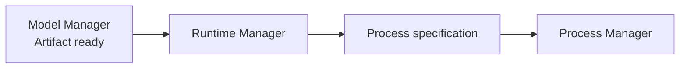

# Runtime Manager

Runtime Manager 管理“如何运行模型”的推理引擎，而不是管理模型文件本身。

Node v0.1 建议优先跑通 **GGUF + llama.cpp**，再扩展其它 Runtime。

## Runtime 抽象

```text
prepare()
start()
stop()
health()
```

未来可以统一扩展：

```text
Runtime
├── LlamaCppRuntime   ← Node v0.1 priority
├── VllmRuntime       ← future
└── SglangRuntime     ← future
```

## prepare()

负责确认当前 OS / architecture 支持、Runtime binary 存在、版本满足要求、GPU backend 兼容、所需动态库可用。用户不应手工准备完整开发环境。

## start()

输入已经准备好的 Artifact、HardwareProfile 和 Runtime options，输出 Process Manager 可以执行的进程规格。



## Runtime 与模型解耦

同一个模型名未来可以有多个 Runtime 实现，因此 Model Resolver 输出 Runtime 要求，而不是把 llama.cpp 写死在 API Gateway 中。

Runtime 自身也需要版本、platform、architecture、backend、checksum 和 install path 等元数据。

## 失败情况

应区分 `RUNTIME_NOT_AVAILABLE`、`RUNTIME_UNSUPPORTED_PLATFORM`、`GPU_BACKEND_UNAVAILABLE`、`RUNTIME_VERSION_MISMATCH`、`START_CONFIGURATION_INVALID`。

## 当前源码 / 目标

- **🎯 Node v0.1**：建立统一 Runtime Manager，并优先完成 llama.cpp 生命周期。
- 第一版不同时支持过多 Runtime，避免 Node MVP 测试矩阵失控。
