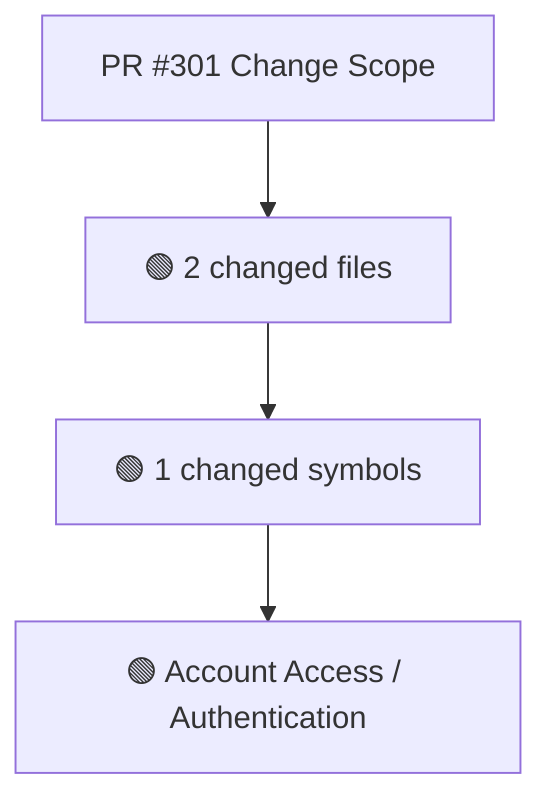
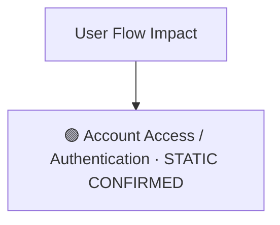
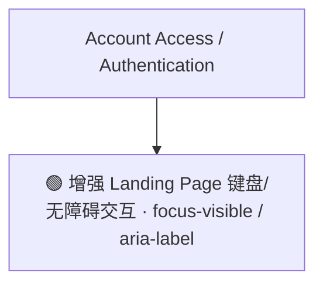
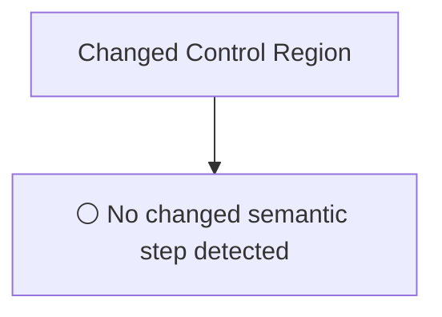
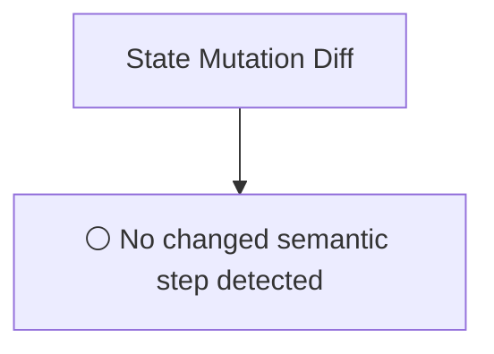
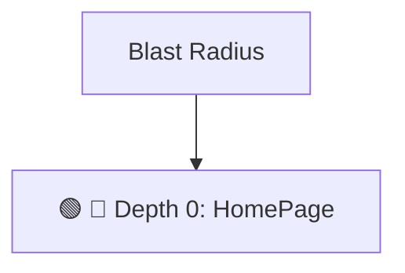

# Commit Change Atlas

## Executive Summary

| Field | Value |
|---|---|
| Commit | `6629637daad1be345164d79375c170a4b6bda447` |
| Base | `374a1588ca7ae1336bdcb289f7ca4da12e3acd68` |
| Merged PR | [#301](https://github.com/burncloud/burncloud/pull/301) |
| Merged At | `2026-06-04T12:15:02Z` |
| Intent | fix(ui): add focus-visible, active states and aria-labels to landing page buttons |
| Intent Truth | **AUTHOR-STATED** (PR title/body) |
| Risk | **MEDIUM (8)** |
| Changed Files | 2 |
| Changed Symbols | 1 |
| Changed Functions | 1 |
| Changed Routes | 0 |
| Changed Test Files | 0 |
| Affected User Flows | 1 |
| API Contract | No Change |
| Database | No Change |
| External | No Change |
| Tests | ❌ Missing |

**Source Diff:** [BASE `374a1588ca7a` → TARGET `6629637daad1`](https://github.com/burncloud/burncloud/compare/374a1588ca7ae1336bdcb289f7ca4da12e3acd68...6629637daad1be345164d79375c170a4b6bda447)

## Intent

**Intent:** fix(ui): add focus-visible, active states and aria-labels to landing page buttons

**Truth:** **AUTHOR-STATED INTENT** — PR title/body; code facts below come from BASE→TARGET diff.

[Open merged PR #301](https://github.com/burncloud/burncloud/pull/301)

## 10-Dimension Dashboard

| Dimension | Status | Risk |
|---|---|---|
| 1. Change Scope | ● Changed | MEDIUM |
| 2. User Flow | ● Changed | MEDIUM |
| 3. Runtime | ● Changed | MEDIUM |
| 4. Control Flow | ○ No Change | LOW |
| 5. State | ○ No Change | LOW |
| 6. API Contract | ○ No Change | LOW |
| 7. Database | ○ No Change | LOW |
| 8. External | ○ No Change | LOW |
| 9. Blast Radius | ● Changed | MEDIUM |
| 10. Tests | ● Changed | MEDIUM |

---

## 1. Change Scope

### What changed?

Files **2** · Symbols **1** · Functions **1** · Routes **0** · Test files **0**

### Change Scope Map

### Changed Files

- 🟡 MODIFIED `crates/client/crates/client-shared/src/styles.rs`
- 🟡 MODIFIED `crates/client/src/pages/home.rs`

### Changed Symbols

- 🟡 `function` `HomePage` — `crates/client/src/pages/home.rs:L22`

### Evidence

- **AFTER:** [`crates/client/crates/client-shared/src/styles.rs:L1511-L1516`](https://github.com/burncloud/burncloud/blob/6629637daad1be345164d79375c170a4b6bda447/crates/client/crates/client-shared/src/styles.rs#L1511-L1516)
- **BASE:** [`crates/client/crates/client-shared/src/styles.rs:L1511-L1511`](https://github.com/burncloud/burncloud/blob/374a1588ca7ae1336bdcb289f7ca4da12e3acd68/crates/client/crates/client-shared/src/styles.rs#L1511-L1511)
- **AFTER:** [`crates/client/src/pages/home.rs:L45-L46`](https://github.com/burncloud/burncloud/blob/6629637daad1be345164d79375c170a4b6bda447/crates/client/src/pages/home.rs#L45-L46)
- **BASE:** [`crates/client/src/pages/home.rs:L45-L46`](https://github.com/burncloud/burncloud/blob/374a1588ca7ae1336bdcb289f7ca4da12e3acd68/crates/client/src/pages/home.rs#L45-L46)
- **AFTER:** [`crates/client/src/pages/home.rs:L68-L69`](https://github.com/burncloud/burncloud/blob/6629637daad1be345164d79375c170a4b6bda447/crates/client/src/pages/home.rs#L68-L69)
- **BASE:** [`crates/client/src/pages/home.rs:L68-L69`](https://github.com/burncloud/burncloud/blob/374a1588ca7ae1336bdcb289f7ca4da12e3acd68/crates/client/src/pages/home.rs#L68-L69)
- **AFTER:** [`crates/client/src/pages/home.rs:L482-L483`](https://github.com/burncloud/burncloud/blob/6629637daad1be345164d79375c170a4b6bda447/crates/client/src/pages/home.rs#L482-L483)
- **BASE:** [`crates/client/src/pages/home.rs:L482-L483`](https://github.com/burncloud/burncloud/blob/374a1588ca7ae1336bdcb289f7ca4da12e3acd68/crates/client/src/pages/home.rs#L482-L483)

---

## 2. User Flow Impact

### Which user behaviors changed?

- **Account Access / Authentication** — STATIC CONFIRMED

### User Flow Impact Map

Only explicit runtime/UI entry evidence is STATIC CONFIRMED; path/module mappings remain `⚠ INFERRED` where applicable.

### Evidence

- **AFTER:** [`crates/client/crates/client-shared/src/styles.rs:L1511-L1516`](https://github.com/burncloud/burncloud/blob/6629637daad1be345164d79375c170a4b6bda447/crates/client/crates/client-shared/src/styles.rs#L1511-L1516)
- **BASE:** [`crates/client/crates/client-shared/src/styles.rs:L1511-L1511`](https://github.com/burncloud/burncloud/blob/374a1588ca7ae1336bdcb289f7ca4da12e3acd68/crates/client/crates/client-shared/src/styles.rs#L1511-L1511)
- **AFTER:** [`crates/client/src/pages/home.rs:L45-L46`](https://github.com/burncloud/burncloud/blob/6629637daad1be345164d79375c170a4b6bda447/crates/client/src/pages/home.rs#L45-L46)
- **BASE:** [`crates/client/src/pages/home.rs:L45-L46`](https://github.com/burncloud/burncloud/blob/374a1588ca7ae1336bdcb289f7ca4da12e3acd68/crates/client/src/pages/home.rs#L45-L46)
- **AFTER:** [`crates/client/src/pages/home.rs:L68-L69`](https://github.com/burncloud/burncloud/blob/6629637daad1be345164d79375c170a4b6bda447/crates/client/src/pages/home.rs#L68-L69)
- **BASE:** [`crates/client/src/pages/home.rs:L68-L69`](https://github.com/burncloud/burncloud/blob/374a1588ca7ae1336bdcb289f7ca4da12e3acd68/crates/client/src/pages/home.rs#L68-L69)
- **AFTER:** [`crates/client/src/pages/home.rs:L482-L483`](https://github.com/burncloud/burncloud/blob/6629637daad1be345164d79375c170a4b6bda447/crates/client/src/pages/home.rs#L482-L483)
- **BASE:** [`crates/client/src/pages/home.rs:L482-L483`](https://github.com/burncloud/burncloud/blob/374a1588ca7ae1336bdcb289f7ca4da12e3acd68/crates/client/src/pages/home.rs#L482-L483)

---

## 3. End-to-End Runtime Diff

### What changed at runtime?

Changed production runtime signals were detected.

### E2E Diff

### Decisions

⚪ No changed control statement detected. Unproven edges are not invented.

### Evidence

- **AFTER:** [`crates/client/crates/client-shared/src/styles.rs:L1511-L1516`](https://github.com/burncloud/burncloud/blob/6629637daad1be345164d79375c170a4b6bda447/crates/client/crates/client-shared/src/styles.rs#L1511-L1516)
- **BASE:** [`crates/client/crates/client-shared/src/styles.rs:L1511-L1511`](https://github.com/burncloud/burncloud/blob/374a1588ca7ae1336bdcb289f7ca4da12e3acd68/crates/client/crates/client-shared/src/styles.rs#L1511-L1511)
- **AFTER:** [`crates/client/src/pages/home.rs:L45-L46`](https://github.com/burncloud/burncloud/blob/6629637daad1be345164d79375c170a4b6bda447/crates/client/src/pages/home.rs#L45-L46)
- **BASE:** [`crates/client/src/pages/home.rs:L45-L46`](https://github.com/burncloud/burncloud/blob/374a1588ca7ae1336bdcb289f7ca4da12e3acd68/crates/client/src/pages/home.rs#L45-L46)
- **AFTER:** [`crates/client/src/pages/home.rs:L68-L69`](https://github.com/burncloud/burncloud/blob/6629637daad1be345164d79375c170a4b6bda447/crates/client/src/pages/home.rs#L68-L69)
- **BASE:** [`crates/client/src/pages/home.rs:L68-L69`](https://github.com/burncloud/burncloud/blob/374a1588ca7ae1336bdcb289f7ca4da12e3acd68/crates/client/src/pages/home.rs#L68-L69)
- **AFTER:** [`crates/client/src/pages/home.rs:L482-L483`](https://github.com/burncloud/burncloud/blob/6629637daad1be345164d79375c170a4b6bda447/crates/client/src/pages/home.rs#L482-L483)
- **BASE:** [`crates/client/src/pages/home.rs:L482-L483`](https://github.com/burncloud/burncloud/blob/374a1588ca7ae1336bdcb289f7ca4da12e3acd68/crates/client/src/pages/home.rs#L482-L483)

---

## 4. ICFG Diff

### Which control-flow semantics changed?

**⚪ NO CONTROL-FLOW CHANGE DETECTED.**

### Evidence

- **COMPLETE DIFF SCAN:** No if/match/loop/break/continue/return/spawn statement changed.
- [Open complete BASE → TARGET diff](https://github.com/burncloud/burncloud/compare/374a1588ca7ae1336bdcb289f7ca4da12e3acd68...6629637daad1be345164d79375c170a4b6bda447)

---

## 5. State Mutation Diff

### What state behavior changed?

**⚪ NO STATE MUTATION CHANGE DETECTED**

### State Diff

### Evidence

- **COMPLETE DIFF SCAN:** No changed DB/cache/counter/update state signal detected.
- [Open complete BASE → TARGET diff](https://github.com/burncloud/burncloud/compare/374a1588ca7ae1336bdcb289f7ca4da12e3acd68...6629637daad1be345164d79375c170a4b6bda447)

---

## 6. API Contract Diff

### API changes

**⚪ NO API CONTRACT CHANGE DETECTED**

**API Contract: ⚪ NO CHANGE DETECTED** by complete diff scan.

### Evidence

- **COMPLETE DIFF SCAN:** No route/status/header/content-type API-contract marker changed.
- [Open complete BASE → TARGET diff](https://github.com/burncloud/burncloud/compare/374a1588ca7ae1336bdcb289f7ca4da12e3acd68...6629637daad1be345164d79375c170a4b6bda447)

---

## 7. Database / Persistence Diff

### Persistence changes

**⚪ NO DATABASE / PERSISTENCE CHANGE DETECTED**

**⚪ NO DATABASE / PERSISTENCE CHANGE DETECTED** by complete diff scan.

### Evidence

- **COMPLETE DIFF SCAN:** No migration/database/SQL persistence hunk changed.
- [Open complete BASE → TARGET diff](https://github.com/burncloud/burncloud/compare/374a1588ca7ae1336bdcb289f7ca4da12e3acd68...6629637daad1be345164d79375c170a4b6bda447)

---

## 8. External Dependency Diff

### External behavior changes

**⚪ NO EXTERNAL DEPENDENCY CHANGE DETECTED**

**⚪ NO EXTERNAL DEPENDENCY CHANGE DETECTED** by complete diff scan.

### Evidence

- **COMPLETE DIFF SCAN:** No outbound HTTP/provider/Redis/webhook/process marker changed.
- [Open complete BASE → TARGET diff](https://github.com/burncloud/burncloud/compare/374a1588ca7ae1336bdcb289f7ca4da12e3acd68...6629637daad1be345164d79375c170a4b6bda447)

---

## 9. Blast Radius

### What else may be affected?

| Depth | Impact | Evidence location |
|---|---|---|
| 🔴 Depth 0 | HomePage | `crates/client/src/pages/home.rs:L22` |

### Blast Radius Map

🔴 Depth 0 is direct. 🟡 lexical references are **impact candidates**, not compiler-proven call edges. Dynamic dispatch is never promoted to a confirmed edge.

### Evidence

- **AFTER:** [`crates/client/crates/client-shared/src/styles.rs:L1511-L1516`](https://github.com/burncloud/burncloud/blob/6629637daad1be345164d79375c170a4b6bda447/crates/client/crates/client-shared/src/styles.rs#L1511-L1516)
- **BASE:** [`crates/client/crates/client-shared/src/styles.rs:L1511-L1511`](https://github.com/burncloud/burncloud/blob/374a1588ca7ae1336bdcb289f7ca4da12e3acd68/crates/client/crates/client-shared/src/styles.rs#L1511-L1511)
- **AFTER:** [`crates/client/src/pages/home.rs:L45-L46`](https://github.com/burncloud/burncloud/blob/6629637daad1be345164d79375c170a4b6bda447/crates/client/src/pages/home.rs#L45-L46)
- **BASE:** [`crates/client/src/pages/home.rs:L45-L46`](https://github.com/burncloud/burncloud/blob/374a1588ca7ae1336bdcb289f7ca4da12e3acd68/crates/client/src/pages/home.rs#L45-L46)
- **AFTER:** [`crates/client/src/pages/home.rs:L68-L69`](https://github.com/burncloud/burncloud/blob/6629637daad1be345164d79375c170a4b6bda447/crates/client/src/pages/home.rs#L68-L69)
- **BASE:** [`crates/client/src/pages/home.rs:L68-L69`](https://github.com/burncloud/burncloud/blob/374a1588ca7ae1336bdcb289f7ca4da12e3acd68/crates/client/src/pages/home.rs#L68-L69)
- **AFTER:** [`crates/client/src/pages/home.rs:L482-L483`](https://github.com/burncloud/burncloud/blob/6629637daad1be345164d79375c170a4b6bda447/crates/client/src/pages/home.rs#L482-L483)

---

## 10. Test Coverage & Evidence

### Coverage Matrix

**Overall:** ❌ Missing

- Changed test files: **0**
- Lexical references from changed symbols into tests: **0**

### Missing Coverage

- ❌ Direct changed-test coverage was not detected for changed production symbols.

### Source Evidence

- **COMPLETE DIFF SCAN:** No changed test hunk; coverage status uses changed tests plus lexical test references.
- [Open complete BASE → TARGET diff](https://github.com/burncloud/burncloud/compare/374a1588ca7ae1336bdcb289f7ca4da12e3acd68...6629637daad1be345164d79375c170a4b6bda447)

---

## Risk Assessment

**Score: 8 → MEDIUM**

### Risk Drivers

- `Authorization change` **+5**
- `Missing direct changed tests` **+3**

The score is rule-based, not an LLM impression.

## Reviewer Checklist

- [ ] Intent 与代码变化一致
- [ ] User Flow impact 已确认
- [ ] Runtime Diff 已确认
- [ ] Control-flow changes 已确认
- [ ] State mutation 已确认
- [ ] API contract 已确认
- [ ] Database behavior 已确认
- [ ] External Provider behavior 已确认
- [ ] Blast Radius 可接受
- [ ] Tests 覆盖 changed runtime paths
- [ ] Dynamic / Inferred relationships 已正确标记
- [ ] Source Evidence 可追溯

## Source Diff Entry Points

- [Complete BASE → TARGET diff](https://github.com/burncloud/burncloud/compare/374a1588ca7ae1336bdcb289f7ca4da12e3acd68...6629637daad1be345164d79375c170a4b6bda447)
- [Merged PR #301](https://github.com/burncloud/burncloud/pull/301)
