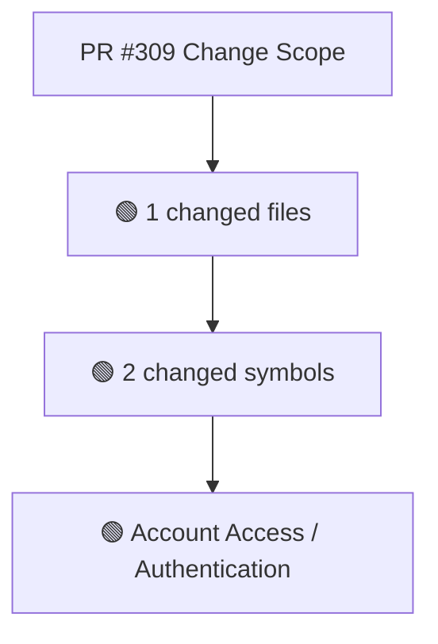
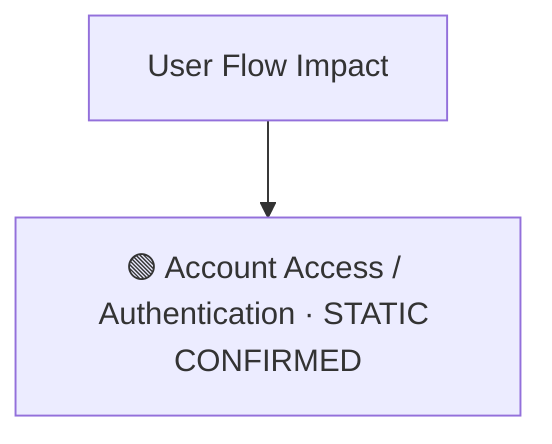
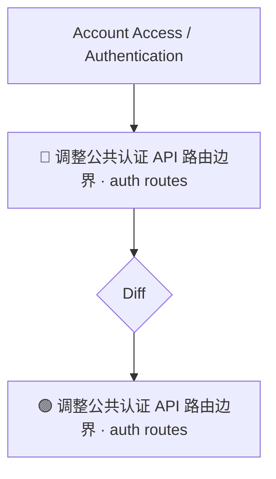
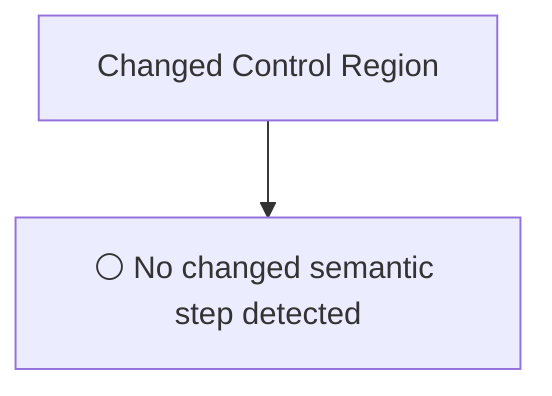
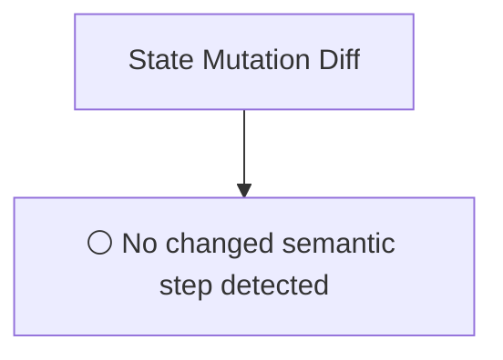
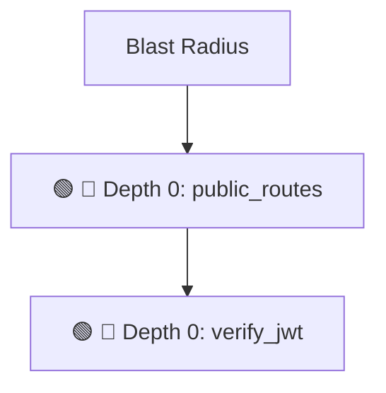

# Commit Change Atlas

## Executive Summary

| Field | Value |
|---|---|
| Commit | `64514d957e728a3662a685bb583216ac1483c410` |
| Base | `c3ff8f1573c1d0bcdaef71af2dcd4b0a9d38d360` |
| Merged PR | [#309](https://github.com/burncloud/burncloud/pull/309) |
| Merged At | `2026-06-04T12:17:47Z` |
| Intent | fix(security): migrate public auth APIs from /console/api/auth to /api/auth (Issue #303) |
| Intent Truth | **AUTHOR-STATED** (PR title/body) |
| Risk | **HIGH (13)** |
| Changed Files | 1 |
| Changed Symbols | 2 |
| Changed Functions | 2 |
| Changed Routes | 8 |
| Changed Test Files | 0 |
| Affected User Flows | 1 |
| API Contract | Changed |
| Database | No Change |
| External | No Change |
| Tests | ❌ Missing |

**Source Diff:** [BASE `c3ff8f1573c1` → TARGET `64514d957e72`](https://github.com/burncloud/burncloud/compare/c3ff8f1573c1d0bcdaef71af2dcd4b0a9d38d360...64514d957e728a3662a685bb583216ac1483c410)

## Intent

**Intent:** fix(security): migrate public auth APIs from /console/api/auth to /api/auth (Issue #303)

**Truth:** **AUTHOR-STATED INTENT** — PR title/body; code facts below come from BASE→TARGET diff.

[Open merged PR #309](https://github.com/burncloud/burncloud/pull/309)

## 10-Dimension Dashboard

| Dimension | Status | Risk |
|---|---|---|
| 1. Change Scope | ● Changed | MEDIUM |
| 2. User Flow | ● Changed | MEDIUM |
| 3. Runtime | ● Changed | HIGH |
| 4. Control Flow | ○ No Change | LOW |
| 5. State | ○ No Change | LOW |
| 6. API Contract | ● Changed | HIGH |
| 7. Database | ○ No Change | LOW |
| 8. External | ○ No Change | LOW |
| 9. Blast Radius | ● Changed | MEDIUM |
| 10. Tests | ● Changed | HIGH |

---

## 1. Change Scope

### What changed?

Files **1** · Symbols **2** · Functions **2** · Routes **8** · Test files **0**

### Change Scope Map

### Changed Files

- 🟡 MODIFIED `crates/server/src/api/auth.rs`

### Changed Symbols

- 🟡 `function` `public_routes` — `crates/server/src/api/auth.rs:L79`
- 🟡 `function` `verify_jwt` — `crates/server/src/api/auth.rs:L62`

### Evidence

- **AFTER:** [`crates/server/src/api/auth.rs:L75-L78`](https://github.com/burncloud/burncloud/blob/64514d957e728a3662a685bb583216ac1483c410/crates/server/src/api/auth.rs#L75-L78)
- **BASE:** [`crates/server/src/api/auth.rs:L75-L78`](https://github.com/burncloud/burncloud/blob/c3ff8f1573c1d0bcdaef71af2dcd4b0a9d38d360/crates/server/src/api/auth.rs#L75-L78)
- **AFTER:** [`crates/server/src/api/auth.rs:L83-L86`](https://github.com/burncloud/burncloud/blob/64514d957e728a3662a685bb583216ac1483c410/crates/server/src/api/auth.rs#L83-L86)
- **BASE:** [`crates/server/src/api/auth.rs:L83-L86`](https://github.com/burncloud/burncloud/blob/c3ff8f1573c1d0bcdaef71af2dcd4b0a9d38d360/crates/server/src/api/auth.rs#L83-L86)

---

## 2. User Flow Impact

### Which user behaviors changed?

- **Account Access / Authentication** — STATIC CONFIRMED

### User Flow Impact Map

Only explicit runtime/UI entry evidence is STATIC CONFIRMED; path/module mappings remain `⚠ INFERRED` where applicable.

### Evidence

- **AFTER:** [`crates/server/src/api/auth.rs:L75-L78`](https://github.com/burncloud/burncloud/blob/64514d957e728a3662a685bb583216ac1483c410/crates/server/src/api/auth.rs#L75-L78)
- **BASE:** [`crates/server/src/api/auth.rs:L75-L78`](https://github.com/burncloud/burncloud/blob/c3ff8f1573c1d0bcdaef71af2dcd4b0a9d38d360/crates/server/src/api/auth.rs#L75-L78)
- **AFTER:** [`crates/server/src/api/auth.rs:L83-L86`](https://github.com/burncloud/burncloud/blob/64514d957e728a3662a685bb583216ac1483c410/crates/server/src/api/auth.rs#L83-L86)
- **BASE:** [`crates/server/src/api/auth.rs:L83-L86`](https://github.com/burncloud/burncloud/blob/c3ff8f1573c1d0bcdaef71af2dcd4b0a9d38d360/crates/server/src/api/auth.rs#L83-L86)

---

## 3. End-to-End Runtime Diff

### What changed at runtime?

Changed production runtime signals were detected.

### E2E Diff

### Decisions

⚪ No changed control statement detected. Unproven edges are not invented.

### Evidence

- **AFTER:** [`crates/server/src/api/auth.rs:L75-L78`](https://github.com/burncloud/burncloud/blob/64514d957e728a3662a685bb583216ac1483c410/crates/server/src/api/auth.rs#L75-L78)
- **BASE:** [`crates/server/src/api/auth.rs:L75-L78`](https://github.com/burncloud/burncloud/blob/c3ff8f1573c1d0bcdaef71af2dcd4b0a9d38d360/crates/server/src/api/auth.rs#L75-L78)
- **AFTER:** [`crates/server/src/api/auth.rs:L83-L86`](https://github.com/burncloud/burncloud/blob/64514d957e728a3662a685bb583216ac1483c410/crates/server/src/api/auth.rs#L83-L86)
- **BASE:** [`crates/server/src/api/auth.rs:L83-L86`](https://github.com/burncloud/burncloud/blob/c3ff8f1573c1d0bcdaef71af2dcd4b0a9d38d360/crates/server/src/api/auth.rs#L83-L86)

---

## 4. ICFG Diff

### Which control-flow semantics changed?

**⚪ NO CONTROL-FLOW CHANGE DETECTED.**

### Evidence

- **COMPLETE DIFF SCAN:** No if/match/loop/break/continue/return/spawn statement changed.
- [Open complete BASE → TARGET diff](https://github.com/burncloud/burncloud/compare/c3ff8f1573c1d0bcdaef71af2dcd4b0a9d38d360...64514d957e728a3662a685bb583216ac1483c410)

---

## 5. State Mutation Diff

### What state behavior changed?

**⚪ NO STATE MUTATION CHANGE DETECTED**

### State Diff

### Evidence

- **COMPLETE DIFF SCAN:** No changed DB/cache/counter/update state signal detected.
- [Open complete BASE → TARGET diff](https://github.com/burncloud/burncloud/compare/c3ff8f1573c1d0bcdaef71af2dcd4b0a9d38d360...64514d957e728a3662a685bb583216ac1483c410)

---

## 6. API Contract Diff

### API changes

| Before | After |
|---|---|
| 🔴 .route（'/console/api/auth/forgot-password', post（forgot_password）） | 🟢 .route（'/api/auth/forgot-password', post（forgot_password）） |
| 🔴 .route（'/console/api/auth/reset-password', post（reset_password）） | 🟢 .route（'/api/auth/reset-password', post（reset_password）） |
| 🔴 .route（'/console/api/auth/google', get（oauth_google）） | 🟢 .route（'/api/auth/google', get（oauth_google）） |
| 🔴 .route（'/console/api/auth/github', get（oauth_github）） | 🟢 .route（'/api/auth/github', get（oauth_github）） |
| 🔴 /console/api/auth/forgot-password | 🟢 /api/auth/forgot-password |
| 🔴 /console/api/auth/reset-password | 🟢 /api/auth/reset-password |
| 🔴 /console/api/auth/google | 🟢 /api/auth/google |
| 🔴 /console/api/auth/github | 🟢 /api/auth/github |

API Contract changes are never rated below MEDIUM.

### Evidence

- **AFTER:** [`crates/server/src/api/auth.rs:L83-L86`](https://github.com/burncloud/burncloud/blob/64514d957e728a3662a685bb583216ac1483c410/crates/server/src/api/auth.rs#L83-L86)
- **BASE:** [`crates/server/src/api/auth.rs:L83-L86`](https://github.com/burncloud/burncloud/blob/c3ff8f1573c1d0bcdaef71af2dcd4b0a9d38d360/crates/server/src/api/auth.rs#L83-L86)

---

## 7. Database / Persistence Diff

### Persistence changes

**⚪ NO DATABASE / PERSISTENCE CHANGE DETECTED**

**⚪ NO DATABASE / PERSISTENCE CHANGE DETECTED** by complete diff scan.

### Evidence

- **COMPLETE DIFF SCAN:** No migration/database/SQL persistence hunk changed.
- [Open complete BASE → TARGET diff](https://github.com/burncloud/burncloud/compare/c3ff8f1573c1d0bcdaef71af2dcd4b0a9d38d360...64514d957e728a3662a685bb583216ac1483c410)

---

## 8. External Dependency Diff

### External behavior changes

**⚪ NO EXTERNAL DEPENDENCY CHANGE DETECTED**

**⚪ NO EXTERNAL DEPENDENCY CHANGE DETECTED** by complete diff scan.

### Evidence

- **COMPLETE DIFF SCAN:** No outbound HTTP/provider/Redis/webhook/process marker changed.
- [Open complete BASE → TARGET diff](https://github.com/burncloud/burncloud/compare/c3ff8f1573c1d0bcdaef71af2dcd4b0a9d38d360...64514d957e728a3662a685bb583216ac1483c410)

---

## 9. Blast Radius

### What else may be affected?

| Depth | Impact | Evidence location |
|---|---|---|
| 🔴 Depth 0 | public_routes | `crates/server/src/api/auth.rs:L79` |
| 🔴 Depth 0 | verify_jwt | `crates/server/src/api/auth.rs:L62` |

### Blast Radius Map

🔴 Depth 0 is direct. 🟡 lexical references are **impact candidates**, not compiler-proven call edges. Dynamic dispatch is never promoted to a confirmed edge.

### Evidence

- **AFTER:** [`crates/server/src/api/auth.rs:L75-L78`](https://github.com/burncloud/burncloud/blob/64514d957e728a3662a685bb583216ac1483c410/crates/server/src/api/auth.rs#L75-L78)
- **BASE:** [`crates/server/src/api/auth.rs:L75-L78`](https://github.com/burncloud/burncloud/blob/c3ff8f1573c1d0bcdaef71af2dcd4b0a9d38d360/crates/server/src/api/auth.rs#L75-L78)
- **AFTER:** [`crates/server/src/api/auth.rs:L83-L86`](https://github.com/burncloud/burncloud/blob/64514d957e728a3662a685bb583216ac1483c410/crates/server/src/api/auth.rs#L83-L86)
- **BASE:** [`crates/server/src/api/auth.rs:L83-L86`](https://github.com/burncloud/burncloud/blob/c3ff8f1573c1d0bcdaef71af2dcd4b0a9d38d360/crates/server/src/api/auth.rs#L83-L86)

---

## 10. Test Coverage & Evidence

### Coverage Matrix

**Overall:** ❌ Missing

- Changed test files: **0**
- Lexical references from changed symbols into tests: **0**

### Missing Coverage

- ❌ Direct changed-test coverage was not detected for changed production symbols.

### Source Evidence

- **COMPLETE DIFF SCAN:** No changed test hunk; coverage status uses changed tests plus lexical test references.
- [Open complete BASE → TARGET diff](https://github.com/burncloud/burncloud/compare/c3ff8f1573c1d0bcdaef71af2dcd4b0a9d38d360...64514d957e728a3662a685bb583216ac1483c410)

---

## Risk Assessment

**Score: 13 → HIGH**

### Risk Drivers

- `Authentication change` **+5**
- `Public API contract` **+5**
- `Missing direct changed tests` **+3**

The score is rule-based, not an LLM impression.

## Reviewer Checklist

- [ ] Intent 与代码变化一致
- [ ] User Flow impact 已确认
- [ ] Runtime Diff 已确认
- [ ] Control-flow changes 已确认
- [ ] State mutation 已确认
- [ ] API contract 已确认
- [ ] Database behavior 已确认
- [ ] External Provider behavior 已确认
- [ ] Blast Radius 可接受
- [ ] Tests 覆盖 changed runtime paths
- [ ] Dynamic / Inferred relationships 已正确标记
- [ ] Source Evidence 可追溯

## Source Diff Entry Points

- [Complete BASE → TARGET diff](https://github.com/burncloud/burncloud/compare/c3ff8f1573c1d0bcdaef71af2dcd4b0a9d38d360...64514d957e728a3662a685bb583216ac1483c410)
- [Merged PR #309](https://github.com/burncloud/burncloud/pull/309)
