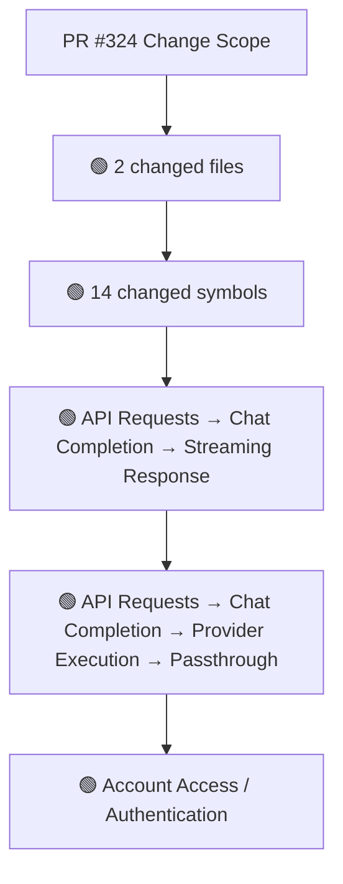
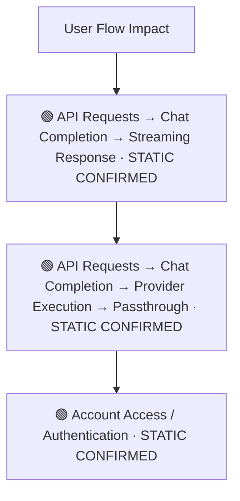
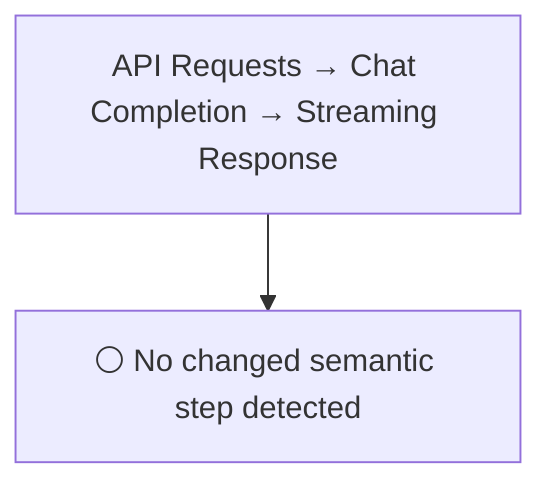
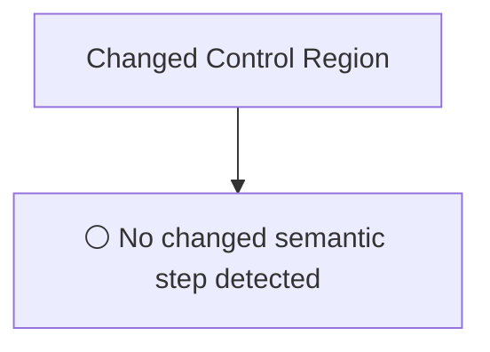
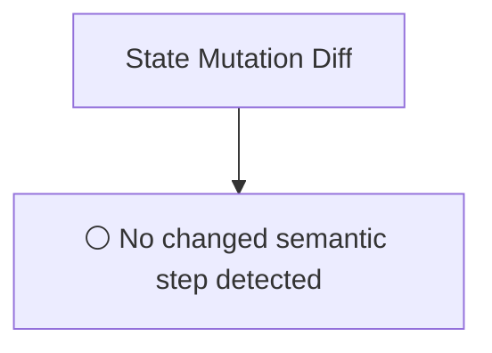
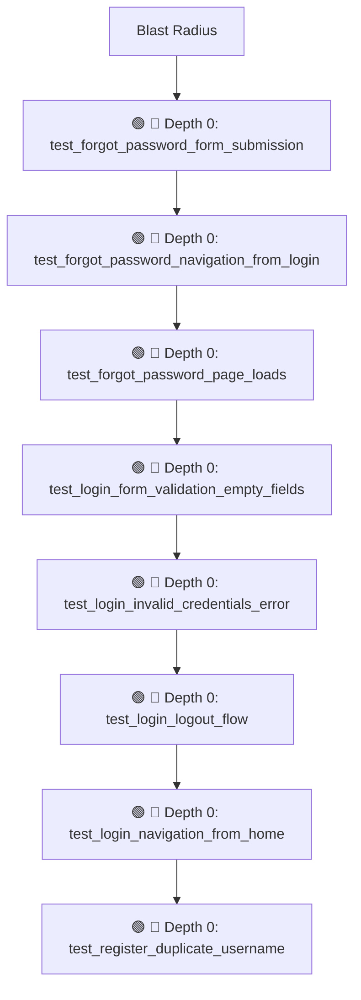

# Commit Change Atlas

## Executive Summary

| Field | Value |
|---|---|
| Commit | `374a1588ca7ae1336bdcb289f7ca4da12e3acd68` |
| Base | `f06a156afd7f4c49ccbe08fe6e8b4a00f4168787` |
| Merged PR | [#324](https://github.com/burncloud/burncloud/pull/324) |
| Merged At | `2026-06-04T11:58:22Z` |
| Intent | test(e2e): add comprehensive user authentication flow tests (Issue #310) |
| Intent Truth | **AUTHOR-STATED** (PR title/body) |
| Risk | **HIGH (13)** |
| Changed Files | 2 |
| Changed Symbols | 14 |
| Changed Functions | 13 |
| Changed Routes | 1 |
| Changed Test Files | 2 |
| Affected User Flows | 3 |
| API Contract | Changed |
| Database | No Change |
| External | No Change |
| Tests | 🟢 New Coverage |

**Source Diff:** [BASE `f06a156afd7f` → TARGET `374a1588ca7a`](https://github.com/burncloud/burncloud/compare/f06a156afd7f4c49ccbe08fe6e8b4a00f4168787...374a1588ca7ae1336bdcb289f7ca4da12e3acd68)

## Intent

**Intent:** test(e2e): add comprehensive user authentication flow tests (Issue #310)

**Truth:** **AUTHOR-STATED INTENT** — PR title/body; code facts below come from BASE→TARGET diff.

[Open merged PR #324](https://github.com/burncloud/burncloud/pull/324)

## 10-Dimension Dashboard

| Dimension | Status | Risk |
|---|---|---|
| 1. Change Scope | ● Changed | MEDIUM |
| 2. User Flow | ● Changed | MEDIUM |
| 3. Runtime | ○ No Change | LOW |
| 4. Control Flow | ○ No Change | LOW |
| 5. State | ○ No Change | LOW |
| 6. API Contract | ● Changed | HIGH |
| 7. Database | ○ No Change | LOW |
| 8. External | ○ No Change | LOW |
| 9. Blast Radius | ● Changed | MEDIUM |
| 10. Tests | ● Changed | HIGH |

---

## 1. Change Scope

### What changed?

Files **2** · Symbols **14** · Functions **13** · Routes **1** · Test files **2**

### Change Scope Map

### Changed Files

- 🟢 ADDED `crates/tests/tests/e2e/auth_flow.rs`
- 🟡 MODIFIED `crates/tests/tests/e2e/mod.rs`

### Changed Symbols

- 🟡 `function` `test_forgot_password_form_submission` — `crates/tests/tests/e2e/auth_flow.rs:L383`
- 🟡 `function` `test_forgot_password_navigation_from_login` — `crates/tests/tests/e2e/auth_flow.rs:L424`
- 🟡 `function` `test_forgot_password_page_loads` — `crates/tests/tests/e2e/auth_flow.rs:L21`
- 🟡 `function` `test_login_form_validation_empty_fields` — `crates/tests/tests/e2e/auth_flow.rs:L306`
- 🟡 `function` `test_login_invalid_credentials_error` — `crates/tests/tests/e2e/auth_flow.rs:L176`
- 🟡 `function` `test_login_logout_flow` — `crates/tests/tests/e2e/auth_flow.rs:L146`
- 🟡 `function` `test_login_navigation_from_home` — `crates/tests/tests/e2e/auth_flow.rs:L251`
- 🟡 `function` `test_register_duplicate_username` — `crates/tests/tests/e2e/auth_flow.rs:L97`
- 🟡 `function` `test_register_form_validation_password_mismatch` — `crates/tests/tests/e2e/auth_flow.rs:L334`
- 🟡 `function` `test_register_navigation_from_login` — `crates/tests/tests/e2e/auth_flow.rs:L276`
- 🟡 `function` `test_register_success_flow` — `crates/tests/tests/e2e/auth_flow.rs:L51`
- 🟡 `function` `test_reset_password_page_loads` — `crates/tests/tests/e2e/auth_flow.rs:L29`
- 🟡 `function` `test_unauthenticated_access_redirects_to_login` — `crates/tests/tests/e2e/auth_flow.rs:L225`
- 🟡 `mod` `auth_flow` — `crates/tests/tests/e2e/mod.rs:L14`

### Evidence

- **AFTER:** [`crates/tests/tests/e2e/auth_flow.rs:L1-L445`](https://github.com/burncloud/burncloud/blob/374a1588ca7ae1336bdcb289f7ca4da12e3acd68/crates/tests/tests/e2e/auth_flow.rs#L1-L445)
- **AFTER:** [`crates/tests/tests/e2e/mod.rs:L14-L14`](https://github.com/burncloud/burncloud/blob/374a1588ca7ae1336bdcb289f7ca4da12e3acd68/crates/tests/tests/e2e/mod.rs#L14-L14)

---

## 2. User Flow Impact

### Which user behaviors changed?

- **API Requests → Chat Completion → Streaming Response** — STATIC CONFIRMED
- **API Requests → Chat Completion → Provider Execution → Passthrough** — STATIC CONFIRMED
- **Account Access / Authentication** — STATIC CONFIRMED

### User Flow Impact Map

Only explicit runtime/UI entry evidence is STATIC CONFIRMED; path/module mappings remain `⚠ INFERRED` where applicable.

### Evidence

- **AFTER:** [`crates/tests/tests/e2e/auth_flow.rs:L1-L445`](https://github.com/burncloud/burncloud/blob/374a1588ca7ae1336bdcb289f7ca4da12e3acd68/crates/tests/tests/e2e/auth_flow.rs#L1-L445)
- **AFTER:** [`crates/tests/tests/e2e/mod.rs:L14-L14`](https://github.com/burncloud/burncloud/blob/374a1588ca7ae1336bdcb289f7ca4da12e3acd68/crates/tests/tests/e2e/mod.rs#L14-L14)

---

## 3. End-to-End Runtime Diff

### What changed at runtime?

**⚪ NO PRODUCTION RUNTIME EXECUTION CHANGE DETECTED.**

### E2E Diff

### Decisions

⚪ No changed control statement detected. Unproven edges are not invented.

### Evidence

- **COMPLETE DIFF SCAN:** No conservative runtime-semantic hunk matched.
- [Open complete BASE → TARGET diff](https://github.com/burncloud/burncloud/compare/f06a156afd7f4c49ccbe08fe6e8b4a00f4168787...374a1588ca7ae1336bdcb289f7ca4da12e3acd68)

---

## 4. ICFG Diff

### Which control-flow semantics changed?

**⚪ NO CONTROL-FLOW CHANGE DETECTED.**

### Evidence

- **AFTER:** [`crates/tests/tests/e2e/auth_flow.rs:L1-L445`](https://github.com/burncloud/burncloud/blob/374a1588ca7ae1336bdcb289f7ca4da12e3acd68/crates/tests/tests/e2e/auth_flow.rs#L1-L445)

---

## 5. State Mutation Diff

### What state behavior changed?

**⚪ NO STATE MUTATION CHANGE DETECTED**

### State Diff

### Evidence

- **COMPLETE DIFF SCAN:** No changed DB/cache/counter/update state signal detected.
- [Open complete BASE → TARGET diff](https://github.com/burncloud/burncloud/compare/f06a156afd7f4c49ccbe08fe6e8b4a00f4168787...374a1588ca7ae1336bdcb289f7ca4da12e3acd68)

---

## 6. API Contract Diff

### API changes

| Before | After |
|---|---|
| — | 🟢 /console/models |

API Contract changes are never rated below MEDIUM.

### Evidence

- **AFTER:** [`crates/tests/tests/e2e/auth_flow.rs:L1-L445`](https://github.com/burncloud/burncloud/blob/374a1588ca7ae1336bdcb289f7ca4da12e3acd68/crates/tests/tests/e2e/auth_flow.rs#L1-L445)

---

## 7. Database / Persistence Diff

### Persistence changes

**⚪ NO DATABASE / PERSISTENCE CHANGE DETECTED**

**⚪ NO DATABASE / PERSISTENCE CHANGE DETECTED** by complete diff scan.

### Evidence

- **COMPLETE DIFF SCAN:** No migration/database/SQL persistence hunk changed.
- [Open complete BASE → TARGET diff](https://github.com/burncloud/burncloud/compare/f06a156afd7f4c49ccbe08fe6e8b4a00f4168787...374a1588ca7ae1336bdcb289f7ca4da12e3acd68)

---

## 8. External Dependency Diff

### External behavior changes

**⚪ NO EXTERNAL DEPENDENCY CHANGE DETECTED**

**⚪ NO EXTERNAL DEPENDENCY CHANGE DETECTED** by complete diff scan.

### Evidence

- **AFTER:** [`crates/tests/tests/e2e/auth_flow.rs:L1-L445`](https://github.com/burncloud/burncloud/blob/374a1588ca7ae1336bdcb289f7ca4da12e3acd68/crates/tests/tests/e2e/auth_flow.rs#L1-L445)

---

## 9. Blast Radius

### What else may be affected?

| Depth | Impact | Evidence location |
|---|---|---|
| 🔴 Depth 0 | test_forgot_password_form_submission | `crates/tests/tests/e2e/auth_flow.rs:L383` |
| 🔴 Depth 0 | test_forgot_password_navigation_from_login | `crates/tests/tests/e2e/auth_flow.rs:L424` |
| 🔴 Depth 0 | test_forgot_password_page_loads | `crates/tests/tests/e2e/auth_flow.rs:L21` |
| 🔴 Depth 0 | test_login_form_validation_empty_fields | `crates/tests/tests/e2e/auth_flow.rs:L306` |
| 🔴 Depth 0 | test_login_invalid_credentials_error | `crates/tests/tests/e2e/auth_flow.rs:L176` |
| 🔴 Depth 0 | test_login_logout_flow | `crates/tests/tests/e2e/auth_flow.rs:L146` |
| 🔴 Depth 0 | test_login_navigation_from_home | `crates/tests/tests/e2e/auth_flow.rs:L251` |
| 🔴 Depth 0 | test_register_duplicate_username | `crates/tests/tests/e2e/auth_flow.rs:L97` |

### Blast Radius Map

🔴 Depth 0 is direct. 🟡 lexical references are **impact candidates**, not compiler-proven call edges. Dynamic dispatch is never promoted to a confirmed edge.

### Evidence

- **AFTER:** [`crates/tests/tests/e2e/auth_flow.rs:L1-L445`](https://github.com/burncloud/burncloud/blob/374a1588ca7ae1336bdcb289f7ca4da12e3acd68/crates/tests/tests/e2e/auth_flow.rs#L1-L445)
- **AFTER:** [`crates/tests/tests/e2e/mod.rs:L14-L14`](https://github.com/burncloud/burncloud/blob/374a1588ca7ae1336bdcb289f7ca4da12e3acd68/crates/tests/tests/e2e/mod.rs#L14-L14)

---

## 10. Test Coverage & Evidence

### Coverage Matrix

**Overall:** 🟢 New Coverage

- Changed test files: **2**
- Lexical references from changed symbols into tests: **10**

### Missing Coverage

- No additional missing direct-coverage claim beyond evidence above.

### Source Evidence

- **AFTER:** [`crates/tests/tests/e2e/auth_flow.rs:L1-L445`](https://github.com/burncloud/burncloud/blob/374a1588ca7ae1336bdcb289f7ca4da12e3acd68/crates/tests/tests/e2e/auth_flow.rs#L1-L445)
- **AFTER:** [`crates/tests/tests/e2e/mod.rs:L14-L14`](https://github.com/burncloud/burncloud/blob/374a1588ca7ae1336bdcb289f7ca4da12e3acd68/crates/tests/tests/e2e/mod.rs#L14-L14)

---

## Risk Assessment

**Score: 13 → HIGH**

### Risk Drivers

- `Authentication change` **+5**
- `Provider request` **+4**
- `Streaming` **+4**

The score is rule-based, not an LLM impression.

## Reviewer Checklist

- [ ] Intent 与代码变化一致
- [ ] User Flow impact 已确认
- [ ] Runtime Diff 已确认
- [ ] Control-flow changes 已确认
- [ ] State mutation 已确认
- [ ] API contract 已确认
- [ ] Database behavior 已确认
- [ ] External Provider behavior 已确认
- [ ] Blast Radius 可接受
- [ ] Tests 覆盖 changed runtime paths
- [ ] Dynamic / Inferred relationships 已正确标记
- [ ] Source Evidence 可追溯

## Source Diff Entry Points

- [Complete BASE → TARGET diff](https://github.com/burncloud/burncloud/compare/f06a156afd7f4c49ccbe08fe6e8b4a00f4168787...374a1588ca7ae1336bdcb289f7ca4da12e3acd68)
- [Merged PR #324](https://github.com/burncloud/burncloud/pull/324)
