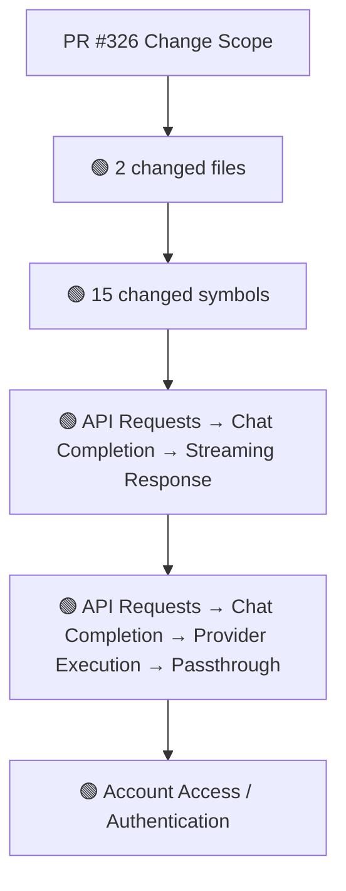
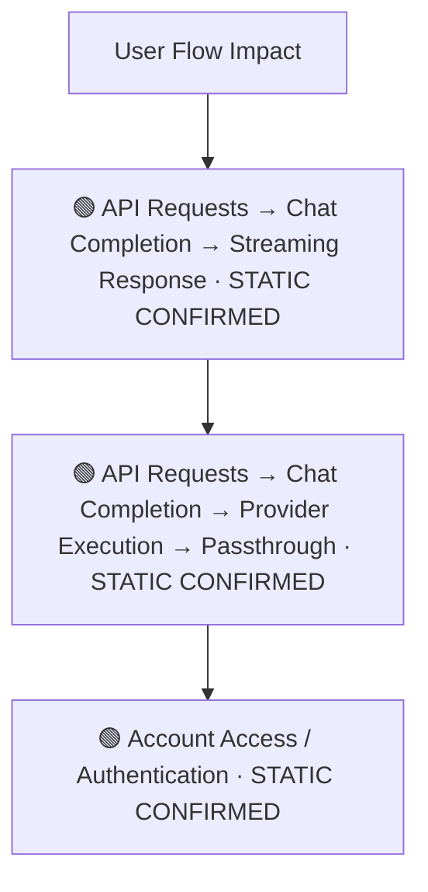
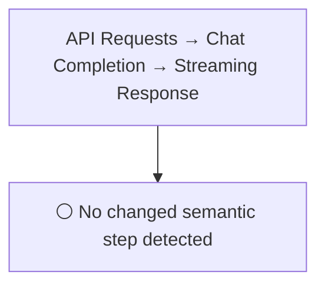
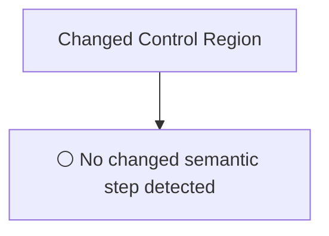
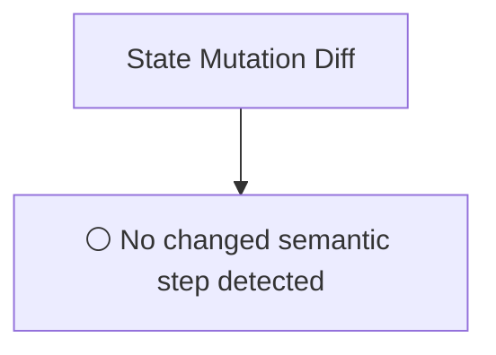
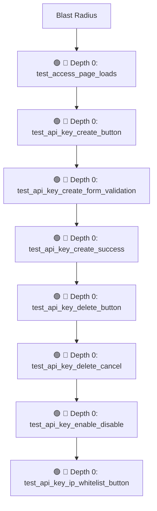

# Commit Change Atlas

## Executive Summary

| Field | Value |
|---|---|
| Commit | `47c2869df0f822681a2d92f8ce8421a6af043853` |
| Base | `f83d508e133db4460b3231145b1bf01027cac762` |
| Merged PR | [#326](https://github.com/burncloud/burncloud/pull/326) |
| Merged At | `2026-06-04T12:17:13Z` |
| Intent | test(e2e): add API Key management flow tests (Issue #312) |
| Intent Truth | **AUTHOR-STATED** (PR title/body) |
| Risk | **HIGH (13)** |
| Changed Files | 2 |
| Changed Symbols | 15 |
| Changed Functions | 14 |
| Changed Routes | 1 |
| Changed Test Files | 2 |
| Affected User Flows | 3 |
| API Contract | Changed |
| Database | No Change |
| External | No Change |
| Tests | 🟢 New Coverage |

**Source Diff:** [BASE `f83d508e133d` → TARGET `47c2869df0f8`](https://github.com/burncloud/burncloud/compare/f83d508e133db4460b3231145b1bf01027cac762...47c2869df0f822681a2d92f8ce8421a6af043853)

## Intent

**Intent:** test(e2e): add API Key management flow tests (Issue #312)

**Truth:** **AUTHOR-STATED INTENT** — PR title/body; code facts below come from BASE→TARGET diff.

[Open merged PR #326](https://github.com/burncloud/burncloud/pull/326)

## 10-Dimension Dashboard

| Dimension | Status | Risk |
|---|---|---|
| 1. Change Scope | ● Changed | MEDIUM |
| 2. User Flow | ● Changed | MEDIUM |
| 3. Runtime | ○ No Change | LOW |
| 4. Control Flow | ○ No Change | LOW |
| 5. State | ○ No Change | LOW |
| 6. API Contract | ● Changed | HIGH |
| 7. Database | ○ No Change | LOW |
| 8. External | ○ No Change | LOW |
| 9. Blast Radius | ● Changed | MEDIUM |
| 10. Tests | ● Changed | HIGH |

---

## 1. Change Scope

### What changed?

Files **2** · Symbols **15** · Functions **14** · Routes **1** · Test files **2**

### Change Scope Map

### Changed Files

- 🟢 ADDED `crates/tests/tests/e2e/api_key_flow.rs`
- 🟡 MODIFIED `crates/tests/tests/e2e/mod.rs`

### Changed Symbols

- 🟡 `function` `test_access_page_loads` — `crates/tests/tests/e2e/api_key_flow.rs:L19`
- 🟡 `function` `test_api_key_create_button` — `crates/tests/tests/e2e/api_key_flow.rs:L51`
- 🟡 `function` `test_api_key_create_form_validation` — `crates/tests/tests/e2e/api_key_flow.rs:L71`
- 🟡 `function` `test_api_key_create_success` — `crates/tests/tests/e2e/api_key_flow.rs:L96`
- 🟡 `function` `test_api_key_delete_button` — `crates/tests/tests/e2e/api_key_flow.rs:L193`
- 🟡 `function` `test_api_key_delete_cancel` — `crates/tests/tests/e2e/api_key_flow.rs:L207`
- 🟡 `function` `test_api_key_enable_disable` — `crates/tests/tests/e2e/api_key_flow.rs:L140`
- 🟡 `function` `test_api_key_ip_whitelist_button` — `crates/tests/tests/e2e/api_key_flow.rs:L228`
- 🟡 `function` `test_api_key_list_rendering` — `crates/tests/tests/e2e/api_key_flow.rs:L31`
- 🟡 `function` `test_api_key_rotate_button` — `crates/tests/tests/e2e/api_key_flow.rs:L157`
- 🟡 `function` `test_api_key_rotate_confirmation` — `crates/tests/tests/e2e/api_key_flow.rs:L172`
- 🟡 `function` `test_api_key_status_display` — `crates/tests/tests/e2e/api_key_flow.rs:L125`
- 🟡 `function` `login_browser` — `crates/tests/tests/e2e/mod.rs:L87`
- 🟡 `function` `login_browser` — `crates/tests/tests/e2e/mod.rs:L88`
- 🟡 `mod` `api_key_flow` — `crates/tests/tests/e2e/mod.rs:L14`

### Evidence

- **AFTER:** [`crates/tests/tests/e2e/api_key_flow.rs:L1-L239`](https://github.com/burncloud/burncloud/blob/47c2869df0f822681a2d92f8ce8421a6af043853/crates/tests/tests/e2e/api_key_flow.rs#L1-L239)
- **AFTER:** [`crates/tests/tests/e2e/mod.rs:L14-L14`](https://github.com/burncloud/burncloud/blob/47c2869df0f822681a2d92f8ce8421a6af043853/crates/tests/tests/e2e/mod.rs#L14-L14)
- **AFTER:** [`crates/tests/tests/e2e/mod.rs:L95-L100`](https://github.com/burncloud/burncloud/blob/47c2869df0f822681a2d92f8ce8421a6af043853/crates/tests/tests/e2e/mod.rs#L95-L100)
- **BASE:** [`crates/tests/tests/e2e/mod.rs:L94-L95`](https://github.com/burncloud/burncloud/blob/f83d508e133db4460b3231145b1bf01027cac762/crates/tests/tests/e2e/mod.rs#L94-L95)

---

## 2. User Flow Impact

### Which user behaviors changed?

- **API Requests → Chat Completion → Streaming Response** — STATIC CONFIRMED
- **API Requests → Chat Completion → Provider Execution → Passthrough** — STATIC CONFIRMED
- **Account Access / Authentication** — STATIC CONFIRMED

### User Flow Impact Map

Only explicit runtime/UI entry evidence is STATIC CONFIRMED; path/module mappings remain `⚠ INFERRED` where applicable.

### Evidence

- **AFTER:** [`crates/tests/tests/e2e/api_key_flow.rs:L1-L239`](https://github.com/burncloud/burncloud/blob/47c2869df0f822681a2d92f8ce8421a6af043853/crates/tests/tests/e2e/api_key_flow.rs#L1-L239)
- **AFTER:** [`crates/tests/tests/e2e/mod.rs:L14-L14`](https://github.com/burncloud/burncloud/blob/47c2869df0f822681a2d92f8ce8421a6af043853/crates/tests/tests/e2e/mod.rs#L14-L14)
- **AFTER:** [`crates/tests/tests/e2e/mod.rs:L95-L100`](https://github.com/burncloud/burncloud/blob/47c2869df0f822681a2d92f8ce8421a6af043853/crates/tests/tests/e2e/mod.rs#L95-L100)
- **BASE:** [`crates/tests/tests/e2e/mod.rs:L94-L95`](https://github.com/burncloud/burncloud/blob/f83d508e133db4460b3231145b1bf01027cac762/crates/tests/tests/e2e/mod.rs#L94-L95)

---

## 3. End-to-End Runtime Diff

### What changed at runtime?

**⚪ NO PRODUCTION RUNTIME EXECUTION CHANGE DETECTED.**

### E2E Diff

### Decisions

⚪ No changed control statement detected. Unproven edges are not invented.

### Evidence

- **COMPLETE DIFF SCAN:** No conservative runtime-semantic hunk matched.
- [Open complete BASE → TARGET diff](https://github.com/burncloud/burncloud/compare/f83d508e133db4460b3231145b1bf01027cac762...47c2869df0f822681a2d92f8ce8421a6af043853)

---

## 4. ICFG Diff

### Which control-flow semantics changed?

**⚪ NO CONTROL-FLOW CHANGE DETECTED.**

### Evidence

- **AFTER:** [`crates/tests/tests/e2e/api_key_flow.rs:L1-L239`](https://github.com/burncloud/burncloud/blob/47c2869df0f822681a2d92f8ce8421a6af043853/crates/tests/tests/e2e/api_key_flow.rs#L1-L239)

---

## 5. State Mutation Diff

### What state behavior changed?

**⚪ NO STATE MUTATION CHANGE DETECTED**

### State Diff

### Evidence

- **COMPLETE DIFF SCAN:** No changed DB/cache/counter/update state signal detected.
- [Open complete BASE → TARGET diff](https://github.com/burncloud/burncloud/compare/f83d508e133db4460b3231145b1bf01027cac762...47c2869df0f822681a2d92f8ce8421a6af043853)

---

## 6. API Contract Diff

### API changes

| Before | After |
|---|---|
| — | 🟢 /console/access |

API Contract changes are never rated below MEDIUM.

### Evidence

- **AFTER:** [`crates/tests/tests/e2e/api_key_flow.rs:L1-L239`](https://github.com/burncloud/burncloud/blob/47c2869df0f822681a2d92f8ce8421a6af043853/crates/tests/tests/e2e/api_key_flow.rs#L1-L239)

---

## 7. Database / Persistence Diff

### Persistence changes

**⚪ NO DATABASE / PERSISTENCE CHANGE DETECTED**

**⚪ NO DATABASE / PERSISTENCE CHANGE DETECTED** by complete diff scan.

### Evidence

- **COMPLETE DIFF SCAN:** No migration/database/SQL persistence hunk changed.
- [Open complete BASE → TARGET diff](https://github.com/burncloud/burncloud/compare/f83d508e133db4460b3231145b1bf01027cac762...47c2869df0f822681a2d92f8ce8421a6af043853)

---

## 8. External Dependency Diff

### External behavior changes

**⚪ NO EXTERNAL DEPENDENCY CHANGE DETECTED**

**⚪ NO EXTERNAL DEPENDENCY CHANGE DETECTED** by complete diff scan.

### Evidence

- **AFTER:** [`crates/tests/tests/e2e/api_key_flow.rs:L1-L239`](https://github.com/burncloud/burncloud/blob/47c2869df0f822681a2d92f8ce8421a6af043853/crates/tests/tests/e2e/api_key_flow.rs#L1-L239)

---

## 9. Blast Radius

### What else may be affected?

| Depth | Impact | Evidence location |
|---|---|---|
| 🔴 Depth 0 | test_access_page_loads | `crates/tests/tests/e2e/api_key_flow.rs:L19` |
| 🔴 Depth 0 | test_api_key_create_button | `crates/tests/tests/e2e/api_key_flow.rs:L51` |
| 🔴 Depth 0 | test_api_key_create_form_validation | `crates/tests/tests/e2e/api_key_flow.rs:L71` |
| 🔴 Depth 0 | test_api_key_create_success | `crates/tests/tests/e2e/api_key_flow.rs:L96` |
| 🔴 Depth 0 | test_api_key_delete_button | `crates/tests/tests/e2e/api_key_flow.rs:L193` |
| 🔴 Depth 0 | test_api_key_delete_cancel | `crates/tests/tests/e2e/api_key_flow.rs:L207` |
| 🔴 Depth 0 | test_api_key_enable_disable | `crates/tests/tests/e2e/api_key_flow.rs:L140` |
| 🔴 Depth 0 | test_api_key_ip_whitelist_button | `crates/tests/tests/e2e/api_key_flow.rs:L228` |

### Blast Radius Map

🔴 Depth 0 is direct. 🟡 lexical references are **impact candidates**, not compiler-proven call edges. Dynamic dispatch is never promoted to a confirmed edge.

### Evidence

- **AFTER:** [`crates/tests/tests/e2e/api_key_flow.rs:L1-L239`](https://github.com/burncloud/burncloud/blob/47c2869df0f822681a2d92f8ce8421a6af043853/crates/tests/tests/e2e/api_key_flow.rs#L1-L239)
- **AFTER:** [`crates/tests/tests/e2e/mod.rs:L14-L14`](https://github.com/burncloud/burncloud/blob/47c2869df0f822681a2d92f8ce8421a6af043853/crates/tests/tests/e2e/mod.rs#L14-L14)
- **AFTER:** [`crates/tests/tests/e2e/mod.rs:L95-L100`](https://github.com/burncloud/burncloud/blob/47c2869df0f822681a2d92f8ce8421a6af043853/crates/tests/tests/e2e/mod.rs#L95-L100)
- **BASE:** [`crates/tests/tests/e2e/mod.rs:L94-L95`](https://github.com/burncloud/burncloud/blob/f83d508e133db4460b3231145b1bf01027cac762/crates/tests/tests/e2e/mod.rs#L94-L95)

---

## 10. Test Coverage & Evidence

### Coverage Matrix

**Overall:** 🟢 New Coverage

- Changed test files: **2**
- Lexical references from changed symbols into tests: **10**

### Missing Coverage

- No additional missing direct-coverage claim beyond evidence above.

### Source Evidence

- **AFTER:** [`crates/tests/tests/e2e/api_key_flow.rs:L1-L239`](https://github.com/burncloud/burncloud/blob/47c2869df0f822681a2d92f8ce8421a6af043853/crates/tests/tests/e2e/api_key_flow.rs#L1-L239)
- **AFTER:** [`crates/tests/tests/e2e/mod.rs:L14-L14`](https://github.com/burncloud/burncloud/blob/47c2869df0f822681a2d92f8ce8421a6af043853/crates/tests/tests/e2e/mod.rs#L14-L14)
- **AFTER:** [`crates/tests/tests/e2e/mod.rs:L95-L100`](https://github.com/burncloud/burncloud/blob/47c2869df0f822681a2d92f8ce8421a6af043853/crates/tests/tests/e2e/mod.rs#L95-L100)
- **BASE:** [`crates/tests/tests/e2e/mod.rs:L94-L95`](https://github.com/burncloud/burncloud/blob/f83d508e133db4460b3231145b1bf01027cac762/crates/tests/tests/e2e/mod.rs#L94-L95)

---

## Risk Assessment

**Score: 13 → HIGH**

### Risk Drivers

- `Authentication change` **+5**
- `Provider request` **+4**
- `Streaming` **+4**

The score is rule-based, not an LLM impression.

## Reviewer Checklist

- [ ] Intent 与代码变化一致
- [ ] User Flow impact 已确认
- [ ] Runtime Diff 已确认
- [ ] Control-flow changes 已确认
- [ ] State mutation 已确认
- [ ] API contract 已确认
- [ ] Database behavior 已确认
- [ ] External Provider behavior 已确认
- [ ] Blast Radius 可接受
- [ ] Tests 覆盖 changed runtime paths
- [ ] Dynamic / Inferred relationships 已正确标记
- [ ] Source Evidence 可追溯

## Source Diff Entry Points

- [Complete BASE → TARGET diff](https://github.com/burncloud/burncloud/compare/f83d508e133db4460b3231145b1bf01027cac762...47c2869df0f822681a2d92f8ce8421a6af043853)
- [Merged PR #326](https://github.com/burncloud/burncloud/pull/326)
