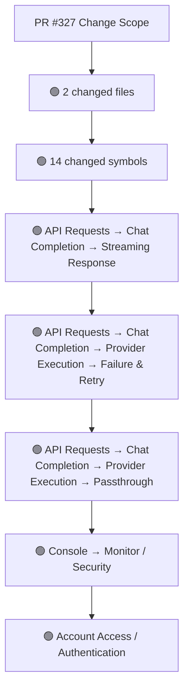
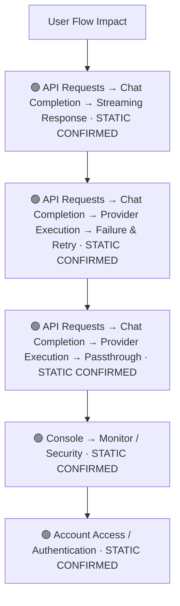
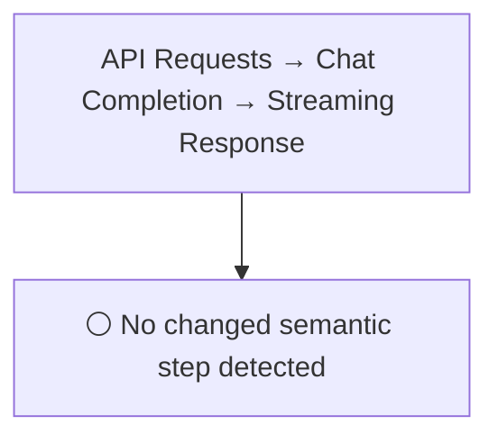
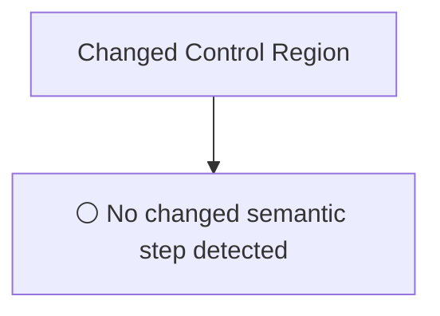
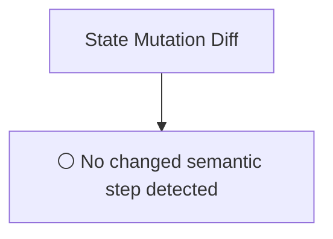
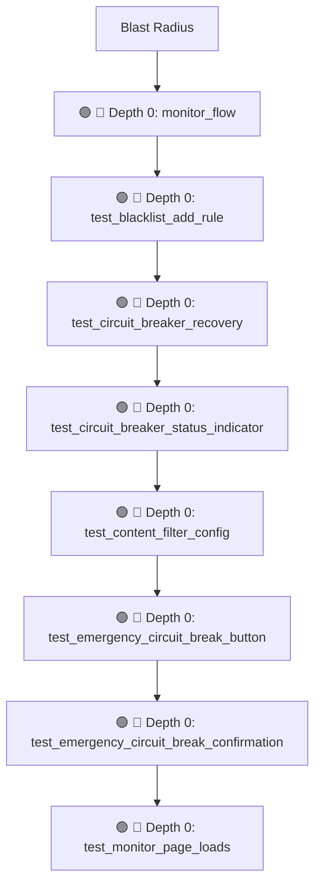

# Commit Change Atlas

## Executive Summary

| Field | Value |
|---|---|
| Commit | `4315cf7411f39e0c0d37b693055e79060900e100` |
| Base | `47c2869df0f822681a2d92f8ce8421a6af043853` |
| Merged PR | [#327](https://github.com/burncloud/burncloud/pull/327) |
| Merged At | `2026-06-04T12:17:28Z` |
| Intent | test(e2e): add security monitor/风控雷达 flow tests (Issue #313) |
| Intent Truth | **AUTHOR-STATED** (PR title/body) |
| Risk | **HIGH (13)** |
| Changed Files | 2 |
| Changed Symbols | 14 |
| Changed Functions | 13 |
| Changed Routes | 1 |
| Changed Test Files | 2 |
| Affected User Flows | 5 |
| API Contract | Changed |
| Database | No Change |
| External | No Change |
| Tests | 🟢 New Coverage |

**Source Diff:** [BASE `47c2869df0f8` → TARGET `4315cf7411f3`](https://github.com/burncloud/burncloud/compare/47c2869df0f822681a2d92f8ce8421a6af043853...4315cf7411f39e0c0d37b693055e79060900e100)

## Intent

**Intent:** test(e2e): add security monitor/风控雷达 flow tests (Issue #313)

**Truth:** **AUTHOR-STATED INTENT** — PR title/body; code facts below come from BASE→TARGET diff.

[Open merged PR #327](https://github.com/burncloud/burncloud/pull/327)

## 10-Dimension Dashboard

| Dimension | Status | Risk |
|---|---|---|
| 1. Change Scope | ● Changed | MEDIUM |
| 2. User Flow | ● Changed | MEDIUM |
| 3. Runtime | ○ No Change | LOW |
| 4. Control Flow | ○ No Change | LOW |
| 5. State | ○ No Change | LOW |
| 6. API Contract | ● Changed | HIGH |
| 7. Database | ○ No Change | LOW |
| 8. External | ○ No Change | LOW |
| 9. Blast Radius | ● Changed | MEDIUM |
| 10. Tests | ● Changed | HIGH |

---

## 1. Change Scope

### What changed?

Files **2** · Symbols **14** · Functions **13** · Routes **1** · Test files **2**

### Change Scope Map

### Changed Files

- 🟡 MODIFIED `crates/tests/tests/e2e/mod.rs`
- 🟢 ADDED `crates/tests/tests/e2e/monitor_flow.rs`

### Changed Symbols

- 🟡 `mod` `monitor_flow` — `crates/tests/tests/e2e/mod.rs:L21`
- 🟡 `function` `test_blacklist_add_rule` — `crates/tests/tests/e2e/monitor_flow.rs:L147`
- 🟡 `function` `test_circuit_breaker_recovery` — `crates/tests/tests/e2e/monitor_flow.rs:L211`
- 🟡 `function` `test_circuit_breaker_status_indicator` — `crates/tests/tests/e2e/monitor_flow.rs:L194`
- 🟡 `function` `test_content_filter_config` — `crates/tests/tests/e2e/monitor_flow.rs:L132`
- 🟡 `function` `test_emergency_circuit_break_button` — `crates/tests/tests/e2e/monitor_flow.rs:L164`
- 🟡 `function` `test_emergency_circuit_break_confirmation` — `crates/tests/tests/e2e/monitor_flow.rs:L179`
- 🟡 `function` `test_monitor_page_loads` — `crates/tests/tests/e2e/monitor_flow.rs:L19`
- 🟡 `function` `test_risk_events_filter` — `crates/tests/tests/e2e/monitor_flow.rs:L115`
- 🟡 `function` `test_risk_events_list` — `crates/tests/tests/e2e/monitor_flow.rs:L100`
- 🟡 `function` `test_security_score_color_indicator` — `crates/tests/tests/e2e/monitor_flow.rs:L81`
- 🟡 `function` `test_security_score_component` — `crates/tests/tests/e2e/monitor_flow.rs:L31`
- 🟡 `function` `test_security_score_value_display` — `crates/tests/tests/e2e/monitor_flow.rs:L66`
- 🟡 `function` `test_trend_chart_rendering` — `crates/tests/tests/e2e/monitor_flow.rs:L49`

### Evidence

- **AFTER:** [`crates/tests/tests/e2e/mod.rs:L21-L21`](https://github.com/burncloud/burncloud/blob/4315cf7411f39e0c0d37b693055e79060900e100/crates/tests/tests/e2e/mod.rs#L21-L21)
- **AFTER:** [`crates/tests/tests/e2e/monitor_flow.rs:L1-L222`](https://github.com/burncloud/burncloud/blob/4315cf7411f39e0c0d37b693055e79060900e100/crates/tests/tests/e2e/monitor_flow.rs#L1-L222)

---

## 2. User Flow Impact

### Which user behaviors changed?

- **API Requests → Chat Completion → Streaming Response** — STATIC CONFIRMED
- **API Requests → Chat Completion → Provider Execution → Failure & Retry** — STATIC CONFIRMED
- **API Requests → Chat Completion → Provider Execution → Passthrough** — STATIC CONFIRMED
- **Console → Monitor / Security** — STATIC CONFIRMED
- **Account Access / Authentication** — STATIC CONFIRMED

### User Flow Impact Map

Only explicit runtime/UI entry evidence is STATIC CONFIRMED; path/module mappings remain `⚠ INFERRED` where applicable.

### Evidence

- **AFTER:** [`crates/tests/tests/e2e/mod.rs:L21-L21`](https://github.com/burncloud/burncloud/blob/4315cf7411f39e0c0d37b693055e79060900e100/crates/tests/tests/e2e/mod.rs#L21-L21)
- **AFTER:** [`crates/tests/tests/e2e/monitor_flow.rs:L1-L222`](https://github.com/burncloud/burncloud/blob/4315cf7411f39e0c0d37b693055e79060900e100/crates/tests/tests/e2e/monitor_flow.rs#L1-L222)

---

## 3. End-to-End Runtime Diff

### What changed at runtime?

**⚪ NO PRODUCTION RUNTIME EXECUTION CHANGE DETECTED.**

### E2E Diff

### Decisions

⚪ No changed control statement detected. Unproven edges are not invented.

### Evidence

- **COMPLETE DIFF SCAN:** No conservative runtime-semantic hunk matched.
- [Open complete BASE → TARGET diff](https://github.com/burncloud/burncloud/compare/47c2869df0f822681a2d92f8ce8421a6af043853...4315cf7411f39e0c0d37b693055e79060900e100)

---

## 4. ICFG Diff

### Which control-flow semantics changed?

**⚪ NO CONTROL-FLOW CHANGE DETECTED.**

### Evidence

- **AFTER:** [`crates/tests/tests/e2e/monitor_flow.rs:L1-L222`](https://github.com/burncloud/burncloud/blob/4315cf7411f39e0c0d37b693055e79060900e100/crates/tests/tests/e2e/monitor_flow.rs#L1-L222)

---

## 5. State Mutation Diff

### What state behavior changed?

**⚪ NO STATE MUTATION CHANGE DETECTED**

### State Diff

### Evidence

- **COMPLETE DIFF SCAN:** No changed DB/cache/counter/update state signal detected.
- [Open complete BASE → TARGET diff](https://github.com/burncloud/burncloud/compare/47c2869df0f822681a2d92f8ce8421a6af043853...4315cf7411f39e0c0d37b693055e79060900e100)

---

## 6. API Contract Diff

### API changes

| Before | After |
|---|---|
| — | 🟢 /console/monitor |

API Contract changes are never rated below MEDIUM.

### Evidence

- **AFTER:** [`crates/tests/tests/e2e/monitor_flow.rs:L1-L222`](https://github.com/burncloud/burncloud/blob/4315cf7411f39e0c0d37b693055e79060900e100/crates/tests/tests/e2e/monitor_flow.rs#L1-L222)

---

## 7. Database / Persistence Diff

### Persistence changes

**⚪ NO DATABASE / PERSISTENCE CHANGE DETECTED**

**⚪ NO DATABASE / PERSISTENCE CHANGE DETECTED** by complete diff scan.

### Evidence

- **COMPLETE DIFF SCAN:** No migration/database/SQL persistence hunk changed.
- [Open complete BASE → TARGET diff](https://github.com/burncloud/burncloud/compare/47c2869df0f822681a2d92f8ce8421a6af043853...4315cf7411f39e0c0d37b693055e79060900e100)

---

## 8. External Dependency Diff

### External behavior changes

**⚪ NO EXTERNAL DEPENDENCY CHANGE DETECTED**

**⚪ NO EXTERNAL DEPENDENCY CHANGE DETECTED** by complete diff scan.

### Evidence

- **AFTER:** [`crates/tests/tests/e2e/monitor_flow.rs:L1-L222`](https://github.com/burncloud/burncloud/blob/4315cf7411f39e0c0d37b693055e79060900e100/crates/tests/tests/e2e/monitor_flow.rs#L1-L222)

---

## 9. Blast Radius

### What else may be affected?

| Depth | Impact | Evidence location |
|---|---|---|
| 🔴 Depth 0 | monitor_flow | `crates/tests/tests/e2e/mod.rs:L21` |
| 🔴 Depth 0 | test_blacklist_add_rule | `crates/tests/tests/e2e/monitor_flow.rs:L147` |
| 🔴 Depth 0 | test_circuit_breaker_recovery | `crates/tests/tests/e2e/monitor_flow.rs:L211` |
| 🔴 Depth 0 | test_circuit_breaker_status_indicator | `crates/tests/tests/e2e/monitor_flow.rs:L194` |
| 🔴 Depth 0 | test_content_filter_config | `crates/tests/tests/e2e/monitor_flow.rs:L132` |
| 🔴 Depth 0 | test_emergency_circuit_break_button | `crates/tests/tests/e2e/monitor_flow.rs:L164` |
| 🔴 Depth 0 | test_emergency_circuit_break_confirmation | `crates/tests/tests/e2e/monitor_flow.rs:L179` |
| 🔴 Depth 0 | test_monitor_page_loads | `crates/tests/tests/e2e/monitor_flow.rs:L19` |

### Blast Radius Map

🔴 Depth 0 is direct. 🟡 lexical references are **impact candidates**, not compiler-proven call edges. Dynamic dispatch is never promoted to a confirmed edge.

### Evidence

- **AFTER:** [`crates/tests/tests/e2e/mod.rs:L21-L21`](https://github.com/burncloud/burncloud/blob/4315cf7411f39e0c0d37b693055e79060900e100/crates/tests/tests/e2e/mod.rs#L21-L21)
- **AFTER:** [`crates/tests/tests/e2e/monitor_flow.rs:L1-L222`](https://github.com/burncloud/burncloud/blob/4315cf7411f39e0c0d37b693055e79060900e100/crates/tests/tests/e2e/monitor_flow.rs#L1-L222)

---

## 10. Test Coverage & Evidence

### Coverage Matrix

**Overall:** 🟢 New Coverage

- Changed test files: **2**
- Lexical references from changed symbols into tests: **10**

### Missing Coverage

- No additional missing direct-coverage claim beyond evidence above.

### Source Evidence

- **AFTER:** [`crates/tests/tests/e2e/mod.rs:L21-L21`](https://github.com/burncloud/burncloud/blob/4315cf7411f39e0c0d37b693055e79060900e100/crates/tests/tests/e2e/mod.rs#L21-L21)
- **AFTER:** [`crates/tests/tests/e2e/monitor_flow.rs:L1-L222`](https://github.com/burncloud/burncloud/blob/4315cf7411f39e0c0d37b693055e79060900e100/crates/tests/tests/e2e/monitor_flow.rs#L1-L222)

---

## Risk Assessment

**Score: 13 → HIGH**

### Risk Drivers

- `Authentication change` **+5**
- `Provider request` **+4**
- `Streaming` **+4**

The score is rule-based, not an LLM impression.

## Reviewer Checklist

- [ ] Intent 与代码变化一致
- [ ] User Flow impact 已确认
- [ ] Runtime Diff 已确认
- [ ] Control-flow changes 已确认
- [ ] State mutation 已确认
- [ ] API contract 已确认
- [ ] Database behavior 已确认
- [ ] External Provider behavior 已确认
- [ ] Blast Radius 可接受
- [ ] Tests 覆盖 changed runtime paths
- [ ] Dynamic / Inferred relationships 已正确标记
- [ ] Source Evidence 可追溯

## Source Diff Entry Points

- [Complete BASE → TARGET diff](https://github.com/burncloud/burncloud/compare/47c2869df0f822681a2d92f8ce8421a6af043853...4315cf7411f39e0c0d37b693055e79060900e100)
- [Merged PR #327](https://github.com/burncloud/burncloud/pull/327)
