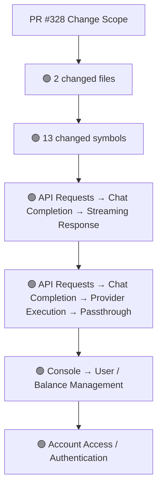
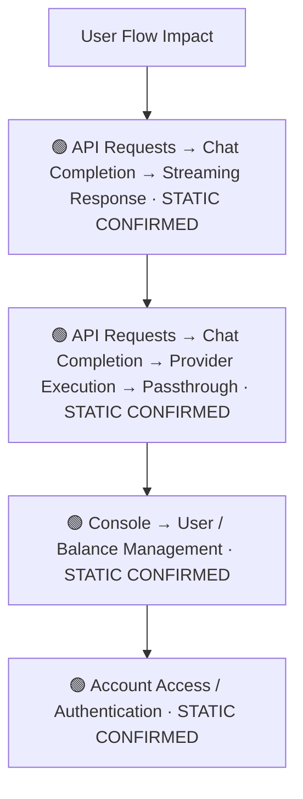
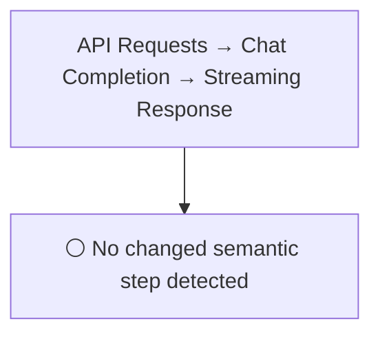
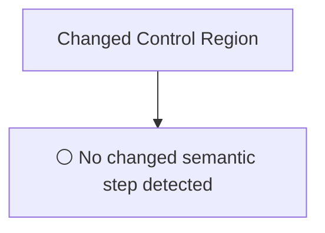
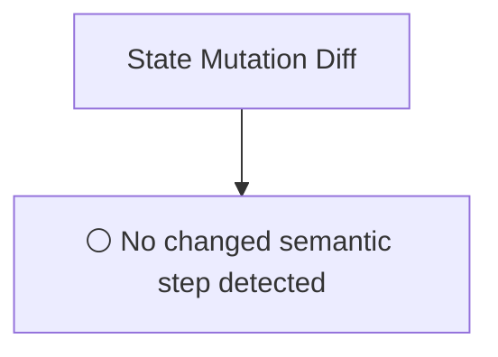
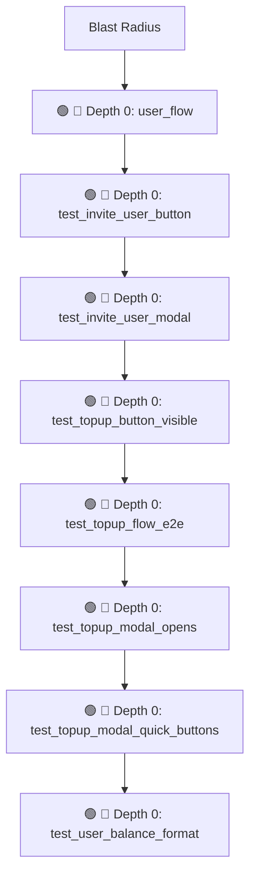

# Commit Change Atlas

## Executive Summary

| Field | Value |
|---|---|
| Commit | `c3ff8f1573c1d0bcdaef71af2dcd4b0a9d38d360` |
| Base | `4315cf7411f39e0c0d37b693055e79060900e100` |
| Merged PR | [#328](https://github.com/burncloud/burncloud/pull/328) |
| Merged At | `2026-06-04T12:17:37Z` |
| Intent | E2E 测试：用户管理和充值流程 |
| Intent Truth | **AUTHOR-STATED** (PR title/body) |
| Risk | **HIGH (18)** |
| Changed Files | 2 |
| Changed Symbols | 13 |
| Changed Functions | 12 |
| Changed Routes | 1 |
| Changed Test Files | 2 |
| Affected User Flows | 4 |
| API Contract | Changed |
| Database | Changed |
| External | No Change |
| Tests | 🟢 New Coverage |

**Source Diff:** [BASE `4315cf7411f3` → TARGET `c3ff8f1573c1`](https://github.com/burncloud/burncloud/compare/4315cf7411f39e0c0d37b693055e79060900e100...c3ff8f1573c1d0bcdaef71af2dcd4b0a9d38d360)

## Intent

**Intent:** E2E 测试：用户管理和充值流程

**Truth:** **AUTHOR-STATED INTENT** — PR title/body; code facts below come from BASE→TARGET diff.

[Open merged PR #328](https://github.com/burncloud/burncloud/pull/328)

## 10-Dimension Dashboard

| Dimension | Status | Risk |
|---|---|---|
| 1. Change Scope | ● Changed | MEDIUM |
| 2. User Flow | ● Changed | MEDIUM |
| 3. Runtime | ○ No Change | LOW |
| 4. Control Flow | ○ No Change | LOW |
| 5. State | ○ No Change | LOW |
| 6. API Contract | ● Changed | HIGH |
| 7. Database | ● Changed | HIGH |
| 8. External | ○ No Change | LOW |
| 9. Blast Radius | ● Changed | MEDIUM |
| 10. Tests | ● Changed | HIGH |

---

## 1. Change Scope

### What changed?

Files **2** · Symbols **13** · Functions **12** · Routes **1** · Test files **2**

### Change Scope Map

### Changed Files

- 🟡 MODIFIED `crates/tests/tests/e2e/mod.rs`
- 🟢 ADDED `crates/tests/tests/e2e/user_flow.rs`

### Changed Symbols

- 🟡 `mod` `user_flow` — `crates/tests/tests/e2e/mod.rs:L24`
- 🟡 `function` `test_invite_user_button` — `crates/tests/tests/e2e/user_flow.rs:L272`
- 🟡 `function` `test_invite_user_modal` — `crates/tests/tests/e2e/user_flow.rs:L307`
- 🟡 `function` `test_topup_button_visible` — `crates/tests/tests/e2e/user_flow.rs:L100`
- 🟡 `function` `test_topup_flow_e2e` — `crates/tests/tests/e2e/user_flow.rs:L419`
- 🟡 `function` `test_topup_modal_opens` — `crates/tests/tests/e2e/user_flow.rs:L131`
- 🟡 `function` `test_topup_modal_quick_buttons` — `crates/tests/tests/e2e/user_flow.rs:L170`
- 🟡 `function` `test_user_balance_format` — `crates/tests/tests/e2e/user_flow.rs:L241`
- 🟡 `function` `test_user_list_page_loads` — `crates/tests/tests/e2e/user_flow.rs:L32`
- 🟡 `function` `test_user_list_table_structure` — `crates/tests/tests/e2e/user_flow.rs:L65`
- 🟡 `function` `test_user_list_tabs` — `crates/tests/tests/e2e/user_flow.rs:L385`
- 🟡 `function` `test_user_page_kpi_stats` — `crates/tests/tests/e2e/user_flow.rs:L351`
- 🟡 `function` `test_user_status_display` — `crates/tests/tests/e2e/user_flow.rs:L207`

### Evidence

- **AFTER:** [`crates/tests/tests/e2e/mod.rs:L24-L24`](https://github.com/burncloud/burncloud/blob/c3ff8f1573c1d0bcdaef71af2dcd4b0a9d38d360/crates/tests/tests/e2e/mod.rs#L24-L24)
- **AFTER:** [`crates/tests/tests/e2e/user_flow.rs:L1-L475`](https://github.com/burncloud/burncloud/blob/c3ff8f1573c1d0bcdaef71af2dcd4b0a9d38d360/crates/tests/tests/e2e/user_flow.rs#L1-L475)

---

## 2. User Flow Impact

### Which user behaviors changed?

- **API Requests → Chat Completion → Streaming Response** — STATIC CONFIRMED
- **API Requests → Chat Completion → Provider Execution → Passthrough** — STATIC CONFIRMED
- **Console → User / Balance Management** — STATIC CONFIRMED
- **Account Access / Authentication** — STATIC CONFIRMED

### User Flow Impact Map

Only explicit runtime/UI entry evidence is STATIC CONFIRMED; path/module mappings remain `⚠ INFERRED` where applicable.

### Evidence

- **AFTER:** [`crates/tests/tests/e2e/mod.rs:L24-L24`](https://github.com/burncloud/burncloud/blob/c3ff8f1573c1d0bcdaef71af2dcd4b0a9d38d360/crates/tests/tests/e2e/mod.rs#L24-L24)
- **AFTER:** [`crates/tests/tests/e2e/user_flow.rs:L1-L475`](https://github.com/burncloud/burncloud/blob/c3ff8f1573c1d0bcdaef71af2dcd4b0a9d38d360/crates/tests/tests/e2e/user_flow.rs#L1-L475)

---

## 3. End-to-End Runtime Diff

### What changed at runtime?

**⚪ NO PRODUCTION RUNTIME EXECUTION CHANGE DETECTED.**

### E2E Diff

### Decisions

⚪ No changed control statement detected. Unproven edges are not invented.

### Evidence

- **COMPLETE DIFF SCAN:** No conservative runtime-semantic hunk matched.
- [Open complete BASE → TARGET diff](https://github.com/burncloud/burncloud/compare/4315cf7411f39e0c0d37b693055e79060900e100...c3ff8f1573c1d0bcdaef71af2dcd4b0a9d38d360)

---

## 4. ICFG Diff

### Which control-flow semantics changed?

**⚪ NO CONTROL-FLOW CHANGE DETECTED.**

### Evidence

- **AFTER:** [`crates/tests/tests/e2e/user_flow.rs:L1-L475`](https://github.com/burncloud/burncloud/blob/c3ff8f1573c1d0bcdaef71af2dcd4b0a9d38d360/crates/tests/tests/e2e/user_flow.rs#L1-L475)

---

## 5. State Mutation Diff

### What state behavior changed?

**⚪ NO STATE MUTATION CHANGE DETECTED**

### State Diff

### Evidence

- **AFTER:** [`crates/tests/tests/e2e/user_flow.rs:L1-L475`](https://github.com/burncloud/burncloud/blob/c3ff8f1573c1d0bcdaef71af2dcd4b0a9d38d360/crates/tests/tests/e2e/user_flow.rs#L1-L475)

---

## 6. API Contract Diff

### API changes

| Before | After |
|---|---|
| — | 🟢 /console/users |

API Contract changes are never rated below MEDIUM.

### Evidence

- **AFTER:** [`crates/tests/tests/e2e/user_flow.rs:L1-L475`](https://github.com/burncloud/burncloud/blob/c3ff8f1573c1d0bcdaef71af2dcd4b0a9d38d360/crates/tests/tests/e2e/user_flow.rs#L1-L475)

---

## 7. Database / Persistence Diff

### Persistence changes

| Before | After |
|---|---|
| — | 🟢 // Wait for success - either toast message or balance update |

Database/migration/SQL persistence surface changed.

### Evidence

- **AFTER:** [`crates/tests/tests/e2e/user_flow.rs:L1-L475`](https://github.com/burncloud/burncloud/blob/c3ff8f1573c1d0bcdaef71af2dcd4b0a9d38d360/crates/tests/tests/e2e/user_flow.rs#L1-L475)

---

## 8. External Dependency Diff

### External behavior changes

**⚪ NO EXTERNAL DEPENDENCY CHANGE DETECTED**

**⚪ NO EXTERNAL DEPENDENCY CHANGE DETECTED** by complete diff scan.

### Evidence

- **AFTER:** [`crates/tests/tests/e2e/user_flow.rs:L1-L475`](https://github.com/burncloud/burncloud/blob/c3ff8f1573c1d0bcdaef71af2dcd4b0a9d38d360/crates/tests/tests/e2e/user_flow.rs#L1-L475)

---

## 9. Blast Radius

### What else may be affected?

| Depth | Impact | Evidence location |
|---|---|---|
| 🔴 Depth 0 | user_flow | `crates/tests/tests/e2e/mod.rs:L24` |
| 🔴 Depth 0 | test_invite_user_button | `crates/tests/tests/e2e/user_flow.rs:L272` |
| 🔴 Depth 0 | test_invite_user_modal | `crates/tests/tests/e2e/user_flow.rs:L307` |
| 🔴 Depth 0 | test_topup_button_visible | `crates/tests/tests/e2e/user_flow.rs:L100` |
| 🔴 Depth 0 | test_topup_flow_e2e | `crates/tests/tests/e2e/user_flow.rs:L419` |
| 🔴 Depth 0 | test_topup_modal_opens | `crates/tests/tests/e2e/user_flow.rs:L131` |
| 🔴 Depth 0 | test_topup_modal_quick_buttons | `crates/tests/tests/e2e/user_flow.rs:L170` |
| 🔴 Depth 0 | test_user_balance_format | `crates/tests/tests/e2e/user_flow.rs:L241` |

### Blast Radius Map

🔴 Depth 0 is direct. 🟡 lexical references are **impact candidates**, not compiler-proven call edges. Dynamic dispatch is never promoted to a confirmed edge.

### Evidence

- **AFTER:** [`crates/tests/tests/e2e/mod.rs:L24-L24`](https://github.com/burncloud/burncloud/blob/c3ff8f1573c1d0bcdaef71af2dcd4b0a9d38d360/crates/tests/tests/e2e/mod.rs#L24-L24)
- **AFTER:** [`crates/tests/tests/e2e/user_flow.rs:L1-L475`](https://github.com/burncloud/burncloud/blob/c3ff8f1573c1d0bcdaef71af2dcd4b0a9d38d360/crates/tests/tests/e2e/user_flow.rs#L1-L475)

---

## 10. Test Coverage & Evidence

### Coverage Matrix

**Overall:** 🟢 New Coverage

- Changed test files: **2**
- Lexical references from changed symbols into tests: **10**

### Missing Coverage

- No additional missing direct-coverage claim beyond evidence above.

### Source Evidence

- **AFTER:** [`crates/tests/tests/e2e/mod.rs:L24-L24`](https://github.com/burncloud/burncloud/blob/c3ff8f1573c1d0bcdaef71af2dcd4b0a9d38d360/crates/tests/tests/e2e/mod.rs#L24-L24)
- **AFTER:** [`crates/tests/tests/e2e/user_flow.rs:L1-L475`](https://github.com/burncloud/burncloud/blob/c3ff8f1573c1d0bcdaef71af2dcd4b0a9d38d360/crates/tests/tests/e2e/user_flow.rs#L1-L475)

---

## Risk Assessment

**Score: 18 → HIGH**

### Risk Drivers

- `Authentication change` **+5**
- `Authorization change` **+5**
- `Provider request` **+4**
- `Streaming` **+4**

The score is rule-based, not an LLM impression.

## Reviewer Checklist

- [ ] Intent 与代码变化一致
- [ ] User Flow impact 已确认
- [ ] Runtime Diff 已确认
- [ ] Control-flow changes 已确认
- [ ] State mutation 已确认
- [ ] API contract 已确认
- [ ] Database behavior 已确认
- [ ] External Provider behavior 已确认
- [ ] Blast Radius 可接受
- [ ] Tests 覆盖 changed runtime paths
- [ ] Dynamic / Inferred relationships 已正确标记
- [ ] Source Evidence 可追溯

## Source Diff Entry Points

- [Complete BASE → TARGET diff](https://github.com/burncloud/burncloud/compare/4315cf7411f39e0c0d37b693055e79060900e100...c3ff8f1573c1d0bcdaef71af2dcd4b0a9d38d360)
- [Merged PR #328](https://github.com/burncloud/burncloud/pull/328)
