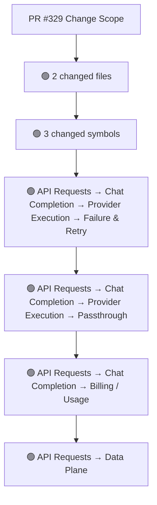
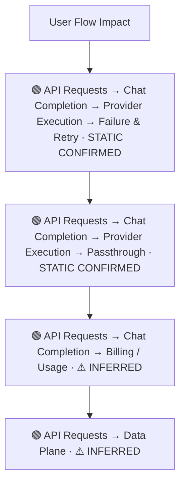
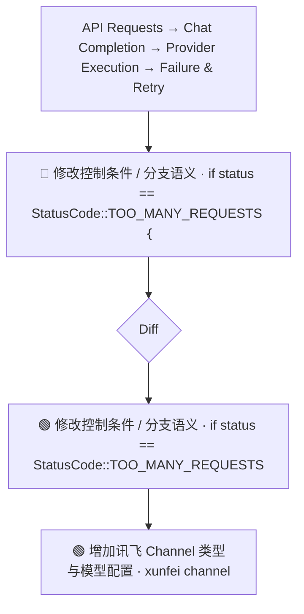
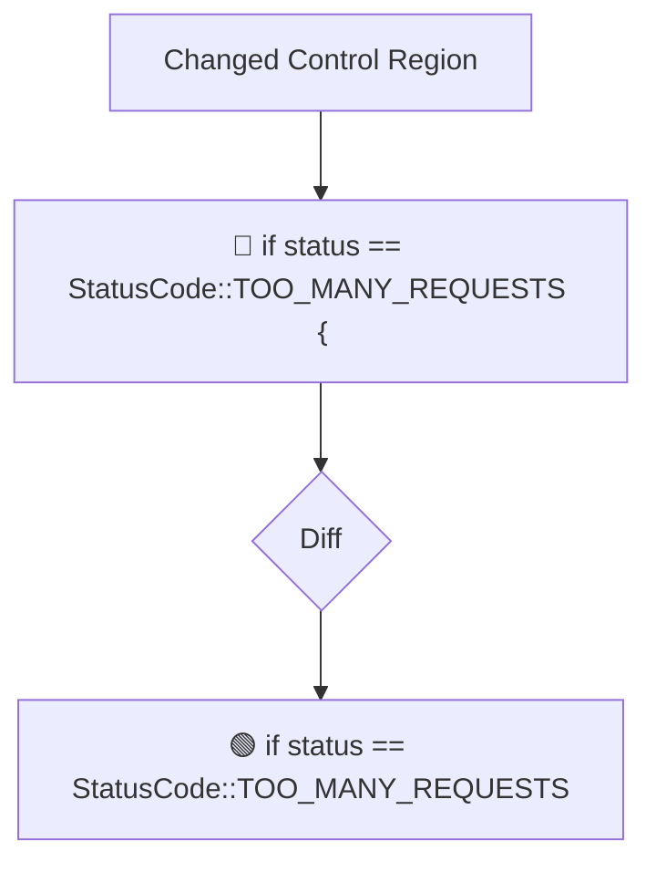
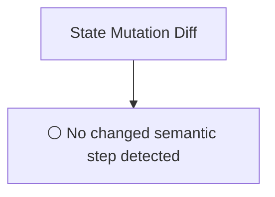
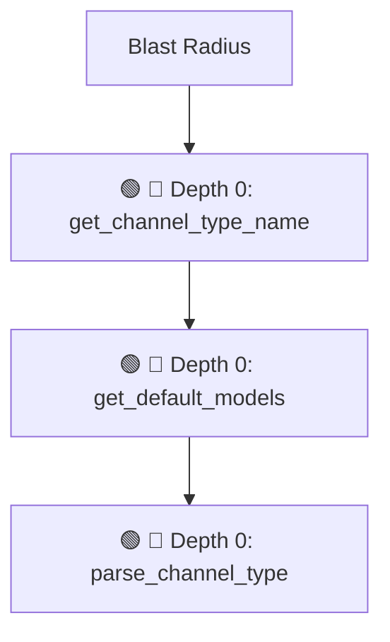

# Commit Change Atlas

## Executive Summary

| Field | Value |
|---|---|
| Commit | `f06a156afd7f4c49ccbe08fe6e8b4a00f4168787` |
| Base | `018855c3c571e7eb42520db46e70bc8fc5ba726e` |
| Merged PR | [#329](https://github.com/burncloud/burncloud/pull/329) |
| Merged At | `2026-06-04T10:14:27Z` |
| Intent | fix(router): failover on auth errors (401/402) and add xunfei channel type |
| Intent Truth | **AUTHOR-STATED** (PR title/body) |
| Risk | **HIGH (32)** |
| Changed Files | 2 |
| Changed Symbols | 3 |
| Changed Functions | 3 |
| Changed Routes | 0 |
| Changed Test Files | 0 |
| Affected User Flows | 4 |
| API Contract | Changed |
| Database | No Change |
| External | No Change |
| Tests | ❌ Missing |

**Source Diff:** [BASE `018855c3c571` → TARGET `f06a156afd7f`](https://github.com/burncloud/burncloud/compare/018855c3c571e7eb42520db46e70bc8fc5ba726e...f06a156afd7f4c49ccbe08fe6e8b4a00f4168787)

## Intent

**Intent:** fix(router): failover on auth errors (401/402) and add xunfei channel type

**Truth:** **AUTHOR-STATED INTENT** — PR title/body; code facts below come from BASE→TARGET diff.

[Open merged PR #329](https://github.com/burncloud/burncloud/pull/329)

## 10-Dimension Dashboard

| Dimension | Status | Risk |
|---|---|---|
| 1. Change Scope | ● Changed | MEDIUM |
| 2. User Flow | ● Changed | MEDIUM |
| 3. Runtime | ● Changed | HIGH |
| 4. Control Flow | ● Changed | HIGH |
| 5. State | ○ No Change | LOW |
| 6. API Contract | ● Changed | HIGH |
| 7. Database | ○ No Change | LOW |
| 8. External | ○ No Change | LOW |
| 9. Blast Radius | ● Changed | MEDIUM |
| 10. Tests | ● Changed | HIGH |

---

## 1. Change Scope

### What changed?

Files **2** · Symbols **3** · Functions **3** · Routes **0** · Test files **0**

### Change Scope Map

### Changed Files

- 🟡 MODIFIED `crates/router/src/lib.rs`
- 🟡 MODIFIED `src/cli/channel.rs`

### Changed Symbols

- 🟡 `function` `get_channel_type_name` — `src/cli/channel.rs:L80`
- 🟡 `function` `get_default_models` — `src/cli/channel.rs:L41`
- 🟡 `function` `parse_channel_type` — `src/cli/channel.rs:L20`

### Evidence

- **AFTER:** [`crates/router/src/lib.rs:L2295-L2300`](https://github.com/burncloud/burncloud/blob/f06a156afd7f4c49ccbe08fe6e8b4a00f4168787/crates/router/src/lib.rs#L2295-L2300)
- **BASE:** [`crates/router/src/lib.rs:L2295-L2296`](https://github.com/burncloud/burncloud/blob/018855c3c571e7eb42520db46e70bc8fc5ba726e/crates/router/src/lib.rs#L2295-L2296)
- **AFTER:** [`crates/router/src/lib.rs:L2302-L2304`](https://github.com/burncloud/burncloud/blob/f06a156afd7f4c49ccbe08fe6e8b4a00f4168787/crates/router/src/lib.rs#L2302-L2304)
- **BASE:** [`crates/router/src/lib.rs:L2298-L2299`](https://github.com/burncloud/burncloud/blob/018855c3c571e7eb42520db46e70bc8fc5ba726e/crates/router/src/lib.rs#L2298-L2299)
- **AFTER:** [`crates/router/src/lib.rs:L2306-L2306`](https://github.com/burncloud/burncloud/blob/f06a156afd7f4c49ccbe08fe6e8b4a00f4168787/crates/router/src/lib.rs#L2306-L2306)
- **AFTER:** [`crates/router/src/lib.rs:L2310-L2310`](https://github.com/burncloud/burncloud/blob/f06a156afd7f4c49ccbe08fe6e8b4a00f4168787/crates/router/src/lib.rs#L2310-L2310)
- **BASE:** [`crates/router/src/lib.rs:L2304-L2304`](https://github.com/burncloud/burncloud/blob/018855c3c571e7eb42520db46e70bc8fc5ba726e/crates/router/src/lib.rs#L2304-L2304)
- **AFTER:** [`src/cli/channel.rs:L19-L19`](https://github.com/burncloud/burncloud/blob/f06a156afd7f4c49ccbe08fe6e8b4a00f4168787/src/cli/channel.rs#L19-L19)

---

## 2. User Flow Impact

### Which user behaviors changed?

- **API Requests → Chat Completion → Provider Execution → Failure & Retry** — STATIC CONFIRMED
- **API Requests → Chat Completion → Provider Execution → Passthrough** — STATIC CONFIRMED
- **API Requests → Chat Completion → Billing / Usage** — ⚠ INFERRED
- **API Requests → Data Plane** — ⚠ INFERRED

### User Flow Impact Map

Only explicit runtime/UI entry evidence is STATIC CONFIRMED; path/module mappings remain `⚠ INFERRED` where applicable.

### Evidence

- **AFTER:** [`crates/router/src/lib.rs:L2295-L2300`](https://github.com/burncloud/burncloud/blob/f06a156afd7f4c49ccbe08fe6e8b4a00f4168787/crates/router/src/lib.rs#L2295-L2300)
- **BASE:** [`crates/router/src/lib.rs:L2295-L2296`](https://github.com/burncloud/burncloud/blob/018855c3c571e7eb42520db46e70bc8fc5ba726e/crates/router/src/lib.rs#L2295-L2296)
- **AFTER:** [`crates/router/src/lib.rs:L2302-L2304`](https://github.com/burncloud/burncloud/blob/f06a156afd7f4c49ccbe08fe6e8b4a00f4168787/crates/router/src/lib.rs#L2302-L2304)
- **BASE:** [`crates/router/src/lib.rs:L2298-L2299`](https://github.com/burncloud/burncloud/blob/018855c3c571e7eb42520db46e70bc8fc5ba726e/crates/router/src/lib.rs#L2298-L2299)
- **AFTER:** [`crates/router/src/lib.rs:L2306-L2306`](https://github.com/burncloud/burncloud/blob/f06a156afd7f4c49ccbe08fe6e8b4a00f4168787/crates/router/src/lib.rs#L2306-L2306)
- **AFTER:** [`crates/router/src/lib.rs:L2310-L2310`](https://github.com/burncloud/burncloud/blob/f06a156afd7f4c49ccbe08fe6e8b4a00f4168787/crates/router/src/lib.rs#L2310-L2310)
- **BASE:** [`crates/router/src/lib.rs:L2304-L2304`](https://github.com/burncloud/burncloud/blob/018855c3c571e7eb42520db46e70bc8fc5ba726e/crates/router/src/lib.rs#L2304-L2304)
- **AFTER:** [`src/cli/channel.rs:L19-L19`](https://github.com/burncloud/burncloud/blob/f06a156afd7f4c49ccbe08fe6e8b4a00f4168787/src/cli/channel.rs#L19-L19)

---

## 3. End-to-End Runtime Diff

### What changed at runtime?

Changed production runtime signals were detected.

### E2E Diff

### Decisions

Changed control statements are isolated in Dimension 4. Unproven edges are not invented.

### Evidence

- **AFTER:** [`crates/router/src/lib.rs:L2295-L2300`](https://github.com/burncloud/burncloud/blob/f06a156afd7f4c49ccbe08fe6e8b4a00f4168787/crates/router/src/lib.rs#L2295-L2300)
- **BASE:** [`crates/router/src/lib.rs:L2295-L2296`](https://github.com/burncloud/burncloud/blob/018855c3c571e7eb42520db46e70bc8fc5ba726e/crates/router/src/lib.rs#L2295-L2296)
- **AFTER:** [`crates/router/src/lib.rs:L2302-L2304`](https://github.com/burncloud/burncloud/blob/f06a156afd7f4c49ccbe08fe6e8b4a00f4168787/crates/router/src/lib.rs#L2302-L2304)
- **BASE:** [`crates/router/src/lib.rs:L2298-L2299`](https://github.com/burncloud/burncloud/blob/018855c3c571e7eb42520db46e70bc8fc5ba726e/crates/router/src/lib.rs#L2298-L2299)
- **AFTER:** [`crates/router/src/lib.rs:L2306-L2306`](https://github.com/burncloud/burncloud/blob/f06a156afd7f4c49ccbe08fe6e8b4a00f4168787/crates/router/src/lib.rs#L2306-L2306)
- **AFTER:** [`crates/router/src/lib.rs:L2310-L2310`](https://github.com/burncloud/burncloud/blob/f06a156afd7f4c49ccbe08fe6e8b4a00f4168787/crates/router/src/lib.rs#L2310-L2310)
- **BASE:** [`crates/router/src/lib.rs:L2304-L2304`](https://github.com/burncloud/burncloud/blob/018855c3c571e7eb42520db46e70bc8fc5ba726e/crates/router/src/lib.rs#L2304-L2304)
- **AFTER:** [`src/cli/channel.rs:L19-L19`](https://github.com/burncloud/burncloud/blob/f06a156afd7f4c49ccbe08fe6e8b4a00f4168787/src/cli/channel.rs#L19-L19)

---

## 4. ICFG Diff

### Which control-flow semantics changed?

⚠ Diagram contains changed control statements only; unproven interprocedural edges are not invented.

### Evidence

- **AFTER:** [`crates/router/src/lib.rs:L2295-L2300`](https://github.com/burncloud/burncloud/blob/f06a156afd7f4c49ccbe08fe6e8b4a00f4168787/crates/router/src/lib.rs#L2295-L2300)
- **BASE:** [`crates/router/src/lib.rs:L2295-L2296`](https://github.com/burncloud/burncloud/blob/018855c3c571e7eb42520db46e70bc8fc5ba726e/crates/router/src/lib.rs#L2295-L2296)

---

## 5. State Mutation Diff

### What state behavior changed?

**⚪ NO STATE MUTATION CHANGE DETECTED**

### State Diff

### Evidence

- **COMPLETE DIFF SCAN:** No changed DB/cache/counter/update state signal detected.
- [Open complete BASE → TARGET diff](https://github.com/burncloud/burncloud/compare/018855c3c571e7eb42520db46e70bc8fc5ba726e...f06a156afd7f4c49ccbe08fe6e8b4a00f4168787)

---

## 6. API Contract Diff

### API changes

| Before | After |
|---|---|
| 🔴 if status == StatusCode::TOO_MANY_REQUESTS ｛ | 🟢 if status == StatusCode::TOO_MANY_REQUESTS |
| — | 🟢 ¦¦ status == StatusCode::UNAUTHORIZED |
| — | 🟢 ¦¦ status == StatusCode::PAYMENT_REQUIRED |

API Contract changes are never rated below MEDIUM.

### Evidence

- **AFTER:** [`crates/router/src/lib.rs:L2295-L2300`](https://github.com/burncloud/burncloud/blob/f06a156afd7f4c49ccbe08fe6e8b4a00f4168787/crates/router/src/lib.rs#L2295-L2300)
- **BASE:** [`crates/router/src/lib.rs:L2295-L2296`](https://github.com/burncloud/burncloud/blob/018855c3c571e7eb42520db46e70bc8fc5ba726e/crates/router/src/lib.rs#L2295-L2296)

---

## 7. Database / Persistence Diff

### Persistence changes

**⚪ NO DATABASE / PERSISTENCE CHANGE DETECTED**

**⚪ NO DATABASE / PERSISTENCE CHANGE DETECTED** by complete diff scan.

### Evidence

- **COMPLETE DIFF SCAN:** No migration/database/SQL persistence hunk changed.
- [Open complete BASE → TARGET diff](https://github.com/burncloud/burncloud/compare/018855c3c571e7eb42520db46e70bc8fc5ba726e...f06a156afd7f4c49ccbe08fe6e8b4a00f4168787)

---

## 8. External Dependency Diff

### External behavior changes

**⚪ NO EXTERNAL DEPENDENCY CHANGE DETECTED**

**🟣 DYNAMIC:** concrete Provider/Adaptor target remains runtime-dependent.
**⚪ NO EXTERNAL DEPENDENCY CHANGE DETECTED** by complete diff scan.

### Evidence

- **COMPLETE DIFF SCAN:** No outbound HTTP/provider/Redis/webhook/process marker changed.
- [Open complete BASE → TARGET diff](https://github.com/burncloud/burncloud/compare/018855c3c571e7eb42520db46e70bc8fc5ba726e...f06a156afd7f4c49ccbe08fe6e8b4a00f4168787)

---

## 9. Blast Radius

### What else may be affected?

| Depth | Impact | Evidence location |
|---|---|---|
| 🔴 Depth 0 | get_channel_type_name | `src/cli/channel.rs:L80` |
| 🔴 Depth 0 | get_default_models | `src/cli/channel.rs:L41` |
| 🔴 Depth 0 | parse_channel_type | `src/cli/channel.rs:L20` |

### Blast Radius Map

🔴 Depth 0 is direct. 🟡 lexical references are **impact candidates**, not compiler-proven call edges. Dynamic dispatch is never promoted to a confirmed edge.

### Evidence

- **AFTER:** [`crates/router/src/lib.rs:L2295-L2300`](https://github.com/burncloud/burncloud/blob/f06a156afd7f4c49ccbe08fe6e8b4a00f4168787/crates/router/src/lib.rs#L2295-L2300)
- **BASE:** [`crates/router/src/lib.rs:L2295-L2296`](https://github.com/burncloud/burncloud/blob/018855c3c571e7eb42520db46e70bc8fc5ba726e/crates/router/src/lib.rs#L2295-L2296)
- **AFTER:** [`crates/router/src/lib.rs:L2302-L2304`](https://github.com/burncloud/burncloud/blob/f06a156afd7f4c49ccbe08fe6e8b4a00f4168787/crates/router/src/lib.rs#L2302-L2304)
- **BASE:** [`crates/router/src/lib.rs:L2298-L2299`](https://github.com/burncloud/burncloud/blob/018855c3c571e7eb42520db46e70bc8fc5ba726e/crates/router/src/lib.rs#L2298-L2299)
- **AFTER:** [`crates/router/src/lib.rs:L2306-L2306`](https://github.com/burncloud/burncloud/blob/f06a156afd7f4c49ccbe08fe6e8b4a00f4168787/crates/router/src/lib.rs#L2306-L2306)
- **AFTER:** [`crates/router/src/lib.rs:L2310-L2310`](https://github.com/burncloud/burncloud/blob/f06a156afd7f4c49ccbe08fe6e8b4a00f4168787/crates/router/src/lib.rs#L2310-L2310)
- **BASE:** [`crates/router/src/lib.rs:L2304-L2304`](https://github.com/burncloud/burncloud/blob/018855c3c571e7eb42520db46e70bc8fc5ba726e/crates/router/src/lib.rs#L2304-L2304)

---

## 10. Test Coverage & Evidence

### Coverage Matrix

**Overall:** ❌ Missing

- Changed test files: **0**
- Lexical references from changed symbols into tests: **0**

### Missing Coverage

- ❌ Direct changed-test coverage was not detected for changed production symbols.

### Source Evidence

- **COMPLETE DIFF SCAN:** No changed test hunk; coverage status uses changed tests plus lexical test references.
- [Open complete BASE → TARGET diff](https://github.com/burncloud/burncloud/compare/018855c3c571e7eb42520db46e70bc8fc5ba726e...f06a156afd7f4c49ccbe08fe6e8b4a00f4168787)

---

## Risk Assessment

**Score: 32 → HIGH**

### Risk Drivers

- `Authentication change` **+5**
- `Public API contract` **+5**
- `Routing decision` **+4**
- `Provider request` **+4**
- `Streaming` **+4**
- `Retry/failover` **+4**
- `Dynamic dispatch boundary` **+3**
- `Missing direct changed tests` **+3**

The score is rule-based, not an LLM impression.

## Reviewer Checklist

- [ ] Intent 与代码变化一致
- [ ] User Flow impact 已确认
- [ ] Runtime Diff 已确认
- [ ] Control-flow changes 已确认
- [ ] State mutation 已确认
- [ ] API contract 已确认
- [ ] Database behavior 已确认
- [ ] External Provider behavior 已确认
- [ ] Blast Radius 可接受
- [ ] Tests 覆盖 changed runtime paths
- [ ] Dynamic / Inferred relationships 已正确标记
- [ ] Source Evidence 可追溯

## Source Diff Entry Points

- [Complete BASE → TARGET diff](https://github.com/burncloud/burncloud/compare/018855c3c571e7eb42520db46e70bc8fc5ba726e...f06a156afd7f4c49ccbe08fe6e8b4a00f4168787)
- [Merged PR #329](https://github.com/burncloud/burncloud/pull/329)
