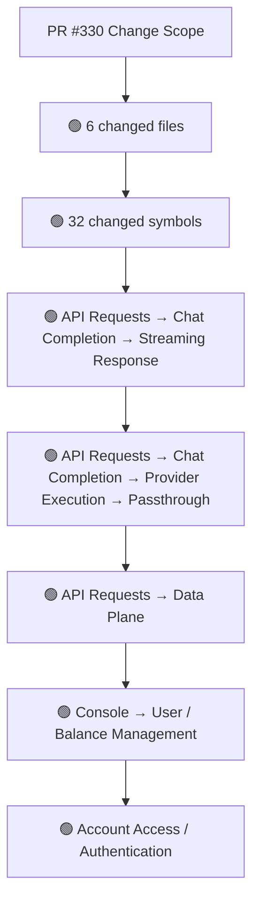
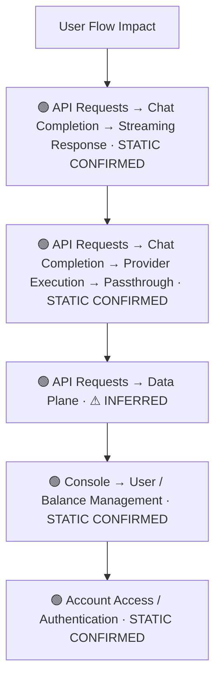
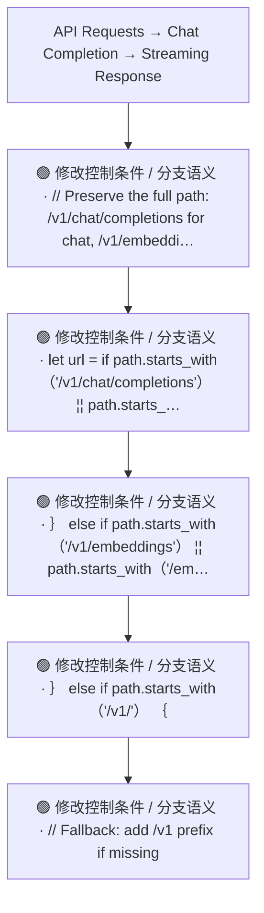
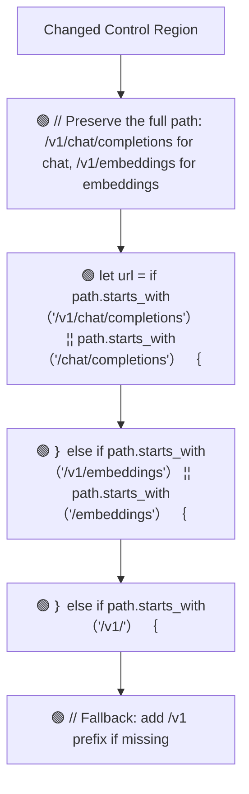
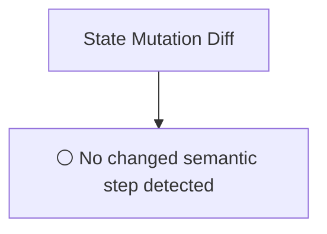
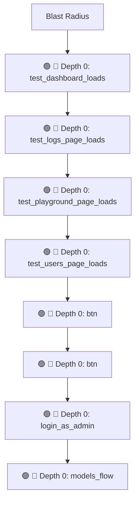

# Commit Change Atlas

## Executive Summary

| Field | Value |
|---|---|
| Commit | `84b6037202d3f30517831e02141830317552bd56` |
| Base | `dacbfc245b36772a57b3571bb31d778ecbf75230` |
| Merged PR | [#330](https://github.com/burncloud/burncloud/pull/330) |
| Merged At | `2026-06-06T12:12:19Z` |
| Intent | fix: OpenAI passthrough URL missing /v1 prefix |
| Intent Truth | **AUTHOR-STATED** (PR title/body) |
| Risk | **HIGH (23)** |
| Changed Files | 6 |
| Changed Symbols | 32 |
| Changed Functions | 29 |
| Changed Routes | 4 |
| Changed Test Files | 5 |
| Affected User Flows | 5 |
| API Contract | Changed |
| Database | Changed |
| External | Changed |
| Tests | 🟢 New Coverage |

**Source Diff:** [BASE `dacbfc245b36` → TARGET `84b6037202d3`](https://github.com/burncloud/burncloud/compare/dacbfc245b36772a57b3571bb31d778ecbf75230...84b6037202d3f30517831e02141830317552bd56)

## Intent

**Intent:** fix: OpenAI passthrough URL missing /v1 prefix

**Truth:** **AUTHOR-STATED INTENT** — PR title/body; code facts below come from BASE→TARGET diff.

[Open merged PR #330](https://github.com/burncloud/burncloud/pull/330)

## 10-Dimension Dashboard

| Dimension | Status | Risk |
|---|---|---|
| 1. Change Scope | ● Changed | MEDIUM |
| 2. User Flow | ● Changed | MEDIUM |
| 3. Runtime | ● Changed | HIGH |
| 4. Control Flow | ● Changed | HIGH |
| 5. State | ○ No Change | LOW |
| 6. API Contract | ● Changed | HIGH |
| 7. Database | ● Changed | HIGH |
| 8. External | ● Changed | MEDIUM |
| 9. Blast Radius | ● Changed | MEDIUM |
| 10. Tests | ● Changed | HIGH |

---

## 1. Change Scope

### What changed?

Files **6** · Symbols **32** · Functions **29** · Routes **4** · Test files **5**

### Change Scope Map

### Changed Files

- 🟡 MODIFIED `crates/router/src/lib.rs`
- 🟡 MODIFIED `crates/tests/tests/e2e/console_pages.rs`
- 🟡 MODIFIED `crates/tests/tests/e2e/mod.rs`
- 🟢 ADDED `crates/tests/tests/e2e/models_flow.rs`
- 🟡 MODIFIED `crates/tests/tests/e2e/user_flow.rs`
- 🟡 MODIFIED `crates/tests/tests/e2e_smoke.rs`

### Changed Symbols

- 🟡 `function` `test_dashboard_loads` — `crates/tests/tests/e2e/console_pages.rs:L17`
- 🟡 `function` `test_logs_page_loads` — `crates/tests/tests/e2e/console_pages.rs:L90`
- 🟡 `function` `test_playground_page_loads` — `crates/tests/tests/e2e/console_pages.rs:L163`
- 🟡 `function` `test_users_page_loads` — `crates/tests/tests/e2e/console_pages.rs:L103`
- 🟡 `const` `btn` — `crates/tests/tests/e2e/mod.rs:L196`
- 🟡 `const` `btn` — `crates/tests/tests/e2e/mod.rs:L303`
- 🟡 `function` `login_as_admin` — `crates/tests/tests/e2e/mod.rs:L265`
- 🟡 `mod` `models_flow` — `crates/tests/tests/e2e/mod.rs:L21`
- 🟡 `function` `test_models_close_create_modal` — `crates/tests/tests/e2e/models_flow.rs:L186`
- 🟡 `function` `test_models_filter_all` — `crates/tests/tests/e2e/models_flow.rs:L31`
- 🟡 `function` `test_models_filter_down` — `crates/tests/tests/e2e/models_flow.rs:L88`
- 🟡 `function` `test_models_filter_maintenance` — `crates/tests/tests/e2e/models_flow.rs:L107`
- 🟡 `function` `test_models_filter_ok` — `crates/tests/tests/e2e/models_flow.rs:L50`
- 🟡 `function` `test_models_filter_throttle` — `crates/tests/tests/e2e/models_flow.rs:L69`
- 🟡 `function` `test_models_open_create_modal` — `crates/tests/tests/e2e/models_flow.rs:L126`
- 🟡 `function` `test_models_page_loads` — `crates/tests/tests/e2e/models_flow.rs:L18`
- 🟡 `function` `test_models_restart_channels` — `crates/tests/tests/e2e/models_flow.rs:L219`
- 🟡 `function` `test_models_select_provider_openai` — `crates/tests/tests/e2e/models_flow.rs:L154`
- 🟡 `function` `test_models_table_rendering` — `crates/tests/tests/e2e/models_flow.rs:L239`
- 🟡 `function` `test_invite_user_button` — `crates/tests/tests/e2e/user_flow.rs:L272`
- 🟡 `function` `test_invite_user_modal` — `crates/tests/tests/e2e/user_flow.rs:L307`
- 🟡 `function` `test_topup_button_visible` — `crates/tests/tests/e2e/user_flow.rs:L100`
- 🟡 `function` `test_topup_flow_e2e` — `crates/tests/tests/e2e/user_flow.rs:L419`
- 🟡 `function` `test_topup_modal_opens` — `crates/tests/tests/e2e/user_flow.rs:L131`
- 🟡 `function` `test_topup_modal_quick_buttons` — `crates/tests/tests/e2e/user_flow.rs:L170`

### Evidence

- **AFTER:** [`crates/router/src/lib.rs:L1974-L1974`](https://github.com/burncloud/burncloud/blob/84b6037202d3f30517831e02141830317552bd56/crates/router/src/lib.rs#L1974-L1974)
- **BASE:** [`crates/router/src/lib.rs:L1974-L1974`](https://github.com/burncloud/burncloud/blob/dacbfc245b36772a57b3571bb31d778ecbf75230/crates/router/src/lib.rs#L1974-L1974)
- **AFTER:** [`crates/router/src/lib.rs:L1976-L1989`](https://github.com/burncloud/burncloud/blob/84b6037202d3f30517831e02141830317552bd56/crates/router/src/lib.rs#L1976-L1989)
- **BASE:** [`crates/router/src/lib.rs:L1976-L1976`](https://github.com/burncloud/burncloud/blob/dacbfc245b36772a57b3571bb31d778ecbf75230/crates/router/src/lib.rs#L1976-L1976)
- **AFTER:** [`crates/tests/tests/e2e/console_pages.rs:L20-L20`](https://github.com/burncloud/burncloud/blob/84b6037202d3f30517831e02141830317552bd56/crates/tests/tests/e2e/console_pages.rs#L20-L20)
- **BASE:** [`crates/tests/tests/e2e/console_pages.rs:L20-L20`](https://github.com/burncloud/burncloud/blob/dacbfc245b36772a57b3571bb31d778ecbf75230/crates/tests/tests/e2e/console_pages.rs#L20-L20)
- **AFTER:** [`crates/tests/tests/e2e/console_pages.rs:L93-L93`](https://github.com/burncloud/burncloud/blob/84b6037202d3f30517831e02141830317552bd56/crates/tests/tests/e2e/console_pages.rs#L93-L93)
- **BASE:** [`crates/tests/tests/e2e/console_pages.rs:L93-L93`](https://github.com/burncloud/burncloud/blob/dacbfc245b36772a57b3571bb31d778ecbf75230/crates/tests/tests/e2e/console_pages.rs#L93-L93)

---

## 2. User Flow Impact

### Which user behaviors changed?

- **API Requests → Chat Completion → Streaming Response** — STATIC CONFIRMED
- **API Requests → Chat Completion → Provider Execution → Passthrough** — STATIC CONFIRMED
- **API Requests → Data Plane** — ⚠ INFERRED
- **Console → User / Balance Management** — STATIC CONFIRMED
- **Account Access / Authentication** — STATIC CONFIRMED

### User Flow Impact Map

Only explicit runtime/UI entry evidence is STATIC CONFIRMED; path/module mappings remain `⚠ INFERRED` where applicable.

### Evidence

- **AFTER:** [`crates/router/src/lib.rs:L1974-L1974`](https://github.com/burncloud/burncloud/blob/84b6037202d3f30517831e02141830317552bd56/crates/router/src/lib.rs#L1974-L1974)
- **BASE:** [`crates/router/src/lib.rs:L1974-L1974`](https://github.com/burncloud/burncloud/blob/dacbfc245b36772a57b3571bb31d778ecbf75230/crates/router/src/lib.rs#L1974-L1974)
- **AFTER:** [`crates/router/src/lib.rs:L1976-L1989`](https://github.com/burncloud/burncloud/blob/84b6037202d3f30517831e02141830317552bd56/crates/router/src/lib.rs#L1976-L1989)
- **BASE:** [`crates/router/src/lib.rs:L1976-L1976`](https://github.com/burncloud/burncloud/blob/dacbfc245b36772a57b3571bb31d778ecbf75230/crates/router/src/lib.rs#L1976-L1976)

---

## 3. End-to-End Runtime Diff

### What changed at runtime?

Changed production runtime signals were detected.

### E2E Diff

### Decisions

Changed control statements are isolated in Dimension 4. Unproven edges are not invented.

### Evidence

- **AFTER:** [`crates/router/src/lib.rs:L1974-L1974`](https://github.com/burncloud/burncloud/blob/84b6037202d3f30517831e02141830317552bd56/crates/router/src/lib.rs#L1974-L1974)
- **BASE:** [`crates/router/src/lib.rs:L1974-L1974`](https://github.com/burncloud/burncloud/blob/dacbfc245b36772a57b3571bb31d778ecbf75230/crates/router/src/lib.rs#L1974-L1974)
- **AFTER:** [`crates/router/src/lib.rs:L1976-L1989`](https://github.com/burncloud/burncloud/blob/84b6037202d3f30517831e02141830317552bd56/crates/router/src/lib.rs#L1976-L1989)
- **BASE:** [`crates/router/src/lib.rs:L1976-L1976`](https://github.com/burncloud/burncloud/blob/dacbfc245b36772a57b3571bb31d778ecbf75230/crates/router/src/lib.rs#L1976-L1976)

---

## 4. ICFG Diff

### Which control-flow semantics changed?

⚠ Diagram contains changed control statements only; unproven interprocedural edges are not invented.

### Evidence

- **AFTER:** [`crates/router/src/lib.rs:L1976-L1989`](https://github.com/burncloud/burncloud/blob/84b6037202d3f30517831e02141830317552bd56/crates/router/src/lib.rs#L1976-L1989)
- **BASE:** [`crates/router/src/lib.rs:L1976-L1976`](https://github.com/burncloud/burncloud/blob/dacbfc245b36772a57b3571bb31d778ecbf75230/crates/router/src/lib.rs#L1976-L1976)
- **AFTER:** [`crates/tests/tests/e2e/mod.rs:L261-L346`](https://github.com/burncloud/burncloud/blob/84b6037202d3f30517831e02141830317552bd56/crates/tests/tests/e2e/mod.rs#L261-L346)
- **AFTER:** [`crates/tests/tests/e2e/models_flow.rs:L1-L261`](https://github.com/burncloud/burncloud/blob/84b6037202d3f30517831e02141830317552bd56/crates/tests/tests/e2e/models_flow.rs#L1-L261)
- **AFTER:** [`crates/tests/tests/e2e_smoke.rs:L144-L170`](https://github.com/burncloud/burncloud/blob/84b6037202d3f30517831e02141830317552bd56/crates/tests/tests/e2e_smoke.rs#L144-L170)
- **BASE:** [`crates/tests/tests/e2e_smoke.rs:L144-L144`](https://github.com/burncloud/burncloud/blob/dacbfc245b36772a57b3571bb31d778ecbf75230/crates/tests/tests/e2e_smoke.rs#L144-L144)
- **AFTER:** [`crates/tests/tests/e2e_smoke.rs:L175-L176`](https://github.com/burncloud/burncloud/blob/84b6037202d3f30517831e02141830317552bd56/crates/tests/tests/e2e_smoke.rs#L175-L176)

---

## 5. State Mutation Diff

### What state behavior changed?

**⚪ NO STATE MUTATION CHANGE DETECTED**

### State Diff

### Evidence

- **COMPLETE DIFF SCAN:** No changed DB/cache/counter/update state signal detected.
- [Open complete BASE → TARGET diff](https://github.com/burncloud/burncloud/compare/dacbfc245b36772a57b3571bb31d778ecbf75230...84b6037202d3f30517831e02141830317552bd56)

---

## 6. API Contract Diff

### API changes

| Before | After |
|---|---|
| — | 🟢 /v1/chat/completions |
| — | 🟢 /v1/embeddings |
| — | 🟢 /v1/ |
| — | 🟢 /console/models |

API Contract changes are never rated below MEDIUM.

### Evidence

- **AFTER:** [`crates/router/src/lib.rs:L1976-L1989`](https://github.com/burncloud/burncloud/blob/84b6037202d3f30517831e02141830317552bd56/crates/router/src/lib.rs#L1976-L1989)
- **BASE:** [`crates/router/src/lib.rs:L1976-L1976`](https://github.com/burncloud/burncloud/blob/dacbfc245b36772a57b3571bb31d778ecbf75230/crates/router/src/lib.rs#L1976-L1976)
- **AFTER:** [`crates/tests/tests/e2e/models_flow.rs:L1-L261`](https://github.com/burncloud/burncloud/blob/84b6037202d3f30517831e02141830317552bd56/crates/tests/tests/e2e/models_flow.rs#L1-L261)

---

## 7. Database / Persistence Diff

### Persistence changes

| Before | After |
|---|---|
| — | 🟢 /// Test: Select provider in create modal （OpenAI） |
| — | 🟢 // Select OpenAI provider |

Database/migration/SQL persistence surface changed.

### Evidence

- **AFTER:** [`crates/tests/tests/e2e/models_flow.rs:L1-L261`](https://github.com/burncloud/burncloud/blob/84b6037202d3f30517831e02141830317552bd56/crates/tests/tests/e2e/models_flow.rs#L1-L261)

---

## 8. External Dependency Diff

### External behavior changes

| Before | After |
|---|---|
| 🔴 // OpenAI passthrough: forward to base_url + /chat/completions | 🟢 // OpenAI passthrough: forward to base_url + /v1/chat/completions |

### Evidence

- **AFTER:** [`crates/router/src/lib.rs:L1974-L1974`](https://github.com/burncloud/burncloud/blob/84b6037202d3f30517831e02141830317552bd56/crates/router/src/lib.rs#L1974-L1974)
- **BASE:** [`crates/router/src/lib.rs:L1974-L1974`](https://github.com/burncloud/burncloud/blob/dacbfc245b36772a57b3571bb31d778ecbf75230/crates/router/src/lib.rs#L1974-L1974)
- **AFTER:** [`crates/tests/tests/e2e/console_pages.rs:L20-L20`](https://github.com/burncloud/burncloud/blob/84b6037202d3f30517831e02141830317552bd56/crates/tests/tests/e2e/console_pages.rs#L20-L20)
- **BASE:** [`crates/tests/tests/e2e/console_pages.rs:L20-L20`](https://github.com/burncloud/burncloud/blob/dacbfc245b36772a57b3571bb31d778ecbf75230/crates/tests/tests/e2e/console_pages.rs#L20-L20)
- **AFTER:** [`crates/tests/tests/e2e/console_pages.rs:L93-L93`](https://github.com/burncloud/burncloud/blob/84b6037202d3f30517831e02141830317552bd56/crates/tests/tests/e2e/console_pages.rs#L93-L93)
- **BASE:** [`crates/tests/tests/e2e/console_pages.rs:L93-L93`](https://github.com/burncloud/burncloud/blob/dacbfc245b36772a57b3571bb31d778ecbf75230/crates/tests/tests/e2e/console_pages.rs#L93-L93)
- **AFTER:** [`crates/tests/tests/e2e/console_pages.rs:L106-L106`](https://github.com/burncloud/burncloud/blob/84b6037202d3f30517831e02141830317552bd56/crates/tests/tests/e2e/console_pages.rs#L106-L106)
- **BASE:** [`crates/tests/tests/e2e/console_pages.rs:L106-L106`](https://github.com/burncloud/burncloud/blob/dacbfc245b36772a57b3571bb31d778ecbf75230/crates/tests/tests/e2e/console_pages.rs#L106-L106)

---

## 9. Blast Radius

### What else may be affected?

| Depth | Impact | Evidence location |
|---|---|---|
| 🔴 Depth 0 | test_dashboard_loads | `crates/tests/tests/e2e/console_pages.rs:L17` |
| 🔴 Depth 0 | test_logs_page_loads | `crates/tests/tests/e2e/console_pages.rs:L90` |
| 🔴 Depth 0 | test_playground_page_loads | `crates/tests/tests/e2e/console_pages.rs:L163` |
| 🔴 Depth 0 | test_users_page_loads | `crates/tests/tests/e2e/console_pages.rs:L103` |
| 🔴 Depth 0 | btn | `crates/tests/tests/e2e/mod.rs:L196` |
| 🔴 Depth 0 | btn | `crates/tests/tests/e2e/mod.rs:L303` |
| 🔴 Depth 0 | login_as_admin | `crates/tests/tests/e2e/mod.rs:L265` |
| 🔴 Depth 0 | models_flow | `crates/tests/tests/e2e/mod.rs:L21` |

### Blast Radius Map

🔴 Depth 0 is direct. 🟡 lexical references are **impact candidates**, not compiler-proven call edges. Dynamic dispatch is never promoted to a confirmed edge.

### Evidence

- **AFTER:** [`crates/router/src/lib.rs:L1974-L1974`](https://github.com/burncloud/burncloud/blob/84b6037202d3f30517831e02141830317552bd56/crates/router/src/lib.rs#L1974-L1974)
- **BASE:** [`crates/router/src/lib.rs:L1974-L1974`](https://github.com/burncloud/burncloud/blob/dacbfc245b36772a57b3571bb31d778ecbf75230/crates/router/src/lib.rs#L1974-L1974)
- **AFTER:** [`crates/router/src/lib.rs:L1976-L1989`](https://github.com/burncloud/burncloud/blob/84b6037202d3f30517831e02141830317552bd56/crates/router/src/lib.rs#L1976-L1989)
- **BASE:** [`crates/router/src/lib.rs:L1976-L1976`](https://github.com/burncloud/burncloud/blob/dacbfc245b36772a57b3571bb31d778ecbf75230/crates/router/src/lib.rs#L1976-L1976)
- **AFTER:** [`crates/tests/tests/e2e/console_pages.rs:L20-L20`](https://github.com/burncloud/burncloud/blob/84b6037202d3f30517831e02141830317552bd56/crates/tests/tests/e2e/console_pages.rs#L20-L20)
- **BASE:** [`crates/tests/tests/e2e/console_pages.rs:L20-L20`](https://github.com/burncloud/burncloud/blob/dacbfc245b36772a57b3571bb31d778ecbf75230/crates/tests/tests/e2e/console_pages.rs#L20-L20)
- **AFTER:** [`crates/tests/tests/e2e/console_pages.rs:L93-L93`](https://github.com/burncloud/burncloud/blob/84b6037202d3f30517831e02141830317552bd56/crates/tests/tests/e2e/console_pages.rs#L93-L93)

---

## 10. Test Coverage & Evidence

### Coverage Matrix

**Overall:** 🟢 New Coverage

- Changed test files: **5**
- Lexical references from changed symbols into tests: **10**

### Missing Coverage

- No additional missing direct-coverage claim beyond evidence above.

### Source Evidence

- **AFTER:** [`crates/tests/tests/e2e/console_pages.rs:L20-L20`](https://github.com/burncloud/burncloud/blob/84b6037202d3f30517831e02141830317552bd56/crates/tests/tests/e2e/console_pages.rs#L20-L20)
- **BASE:** [`crates/tests/tests/e2e/console_pages.rs:L20-L20`](https://github.com/burncloud/burncloud/blob/dacbfc245b36772a57b3571bb31d778ecbf75230/crates/tests/tests/e2e/console_pages.rs#L20-L20)
- **AFTER:** [`crates/tests/tests/e2e/console_pages.rs:L93-L93`](https://github.com/burncloud/burncloud/blob/84b6037202d3f30517831e02141830317552bd56/crates/tests/tests/e2e/console_pages.rs#L93-L93)
- **BASE:** [`crates/tests/tests/e2e/console_pages.rs:L93-L93`](https://github.com/burncloud/burncloud/blob/dacbfc245b36772a57b3571bb31d778ecbf75230/crates/tests/tests/e2e/console_pages.rs#L93-L93)
- **AFTER:** [`crates/tests/tests/e2e/console_pages.rs:L106-L106`](https://github.com/burncloud/burncloud/blob/84b6037202d3f30517831e02141830317552bd56/crates/tests/tests/e2e/console_pages.rs#L106-L106)
- **BASE:** [`crates/tests/tests/e2e/console_pages.rs:L106-L106`](https://github.com/burncloud/burncloud/blob/dacbfc245b36772a57b3571bb31d778ecbf75230/crates/tests/tests/e2e/console_pages.rs#L106-L106)
- **AFTER:** [`crates/tests/tests/e2e/console_pages.rs:L166-L166`](https://github.com/burncloud/burncloud/blob/84b6037202d3f30517831e02141830317552bd56/crates/tests/tests/e2e/console_pages.rs#L166-L166)
- **BASE:** [`crates/tests/tests/e2e/console_pages.rs:L166-L166`](https://github.com/burncloud/burncloud/blob/dacbfc245b36772a57b3571bb31d778ecbf75230/crates/tests/tests/e2e/console_pages.rs#L166-L166)

---

## Risk Assessment

**Score: 23 → HIGH**

### Risk Drivers

- `Authentication change` **+5**
- `Authorization change` **+5**
- `Public API contract` **+5**
- `Provider request` **+4**
- `Streaming` **+4**

The score is rule-based, not an LLM impression.

## Reviewer Checklist

- [ ] Intent 与代码变化一致
- [ ] User Flow impact 已确认
- [ ] Runtime Diff 已确认
- [ ] Control-flow changes 已确认
- [ ] State mutation 已确认
- [ ] API contract 已确认
- [ ] Database behavior 已确认
- [ ] External Provider behavior 已确认
- [ ] Blast Radius 可接受
- [ ] Tests 覆盖 changed runtime paths
- [ ] Dynamic / Inferred relationships 已正确标记
- [ ] Source Evidence 可追溯

## Source Diff Entry Points

- [Complete BASE → TARGET diff](https://github.com/burncloud/burncloud/compare/dacbfc245b36772a57b3571bb31d778ecbf75230...84b6037202d3f30517831e02141830317552bd56)
- [Merged PR #330](https://github.com/burncloud/burncloud/pull/330)
