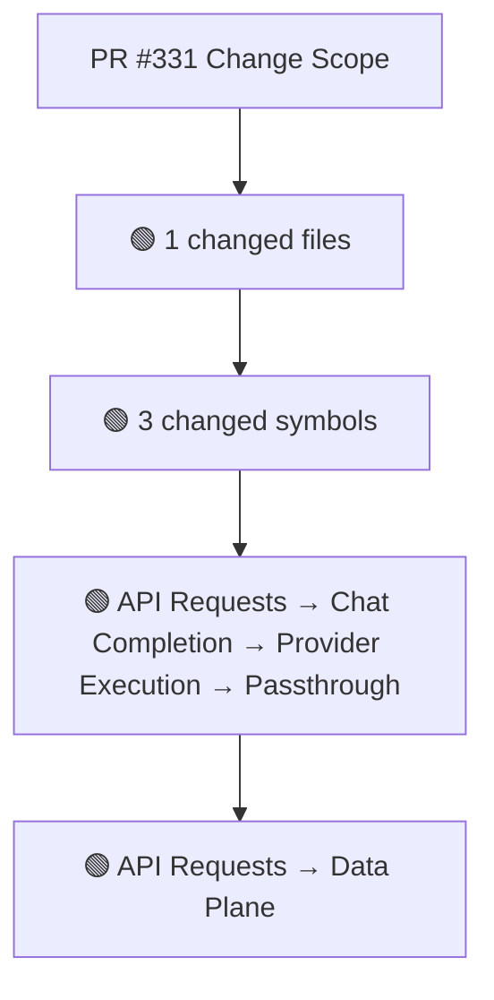
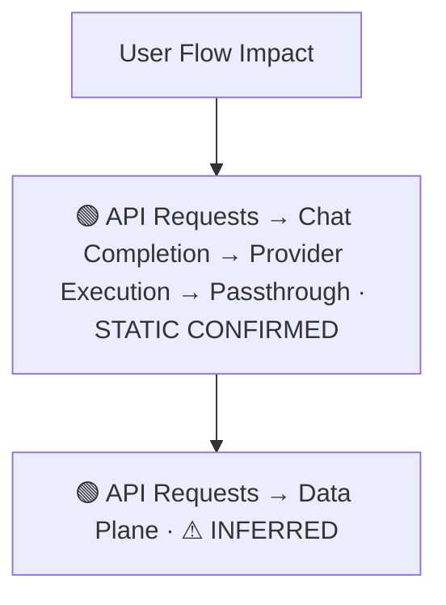
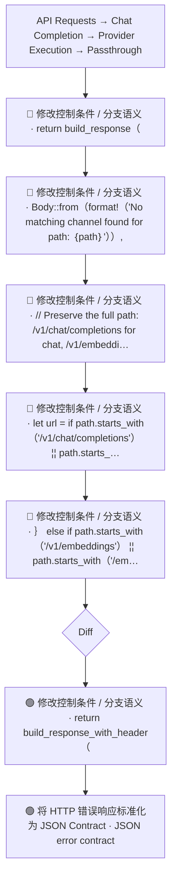
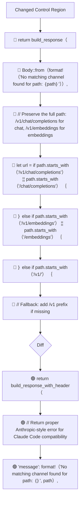
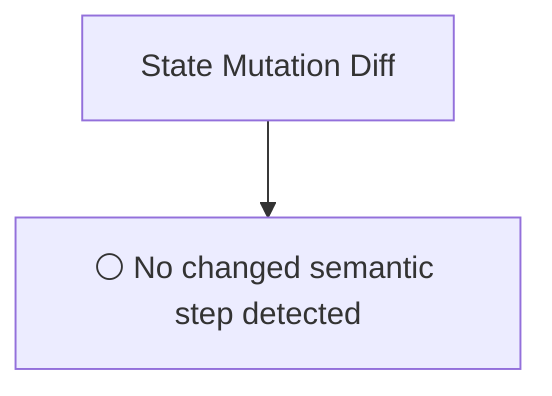
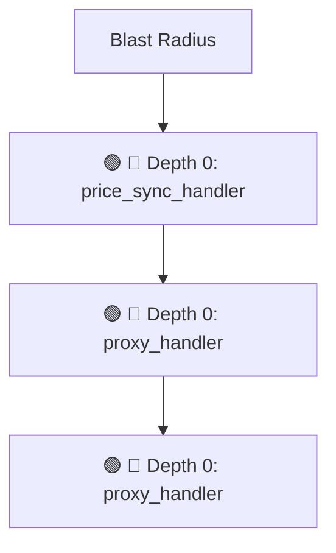

# Commit Change Atlas

## Executive Summary

| Field | Value |
|---|---|
| Commit | `a45c27e5a80c779b9127ade8b28592691cd3367e` |
| Base | `7bf4a74fe0aa6aa68f2f487776c26074093de7b3` |
| Merged PR | [#331](https://github.com/burncloud/burncloud/pull/331) |
| Merged At | `2026-06-06T18:47:33Z` |
| Intent | fix(router): return JSON-formatted errors for API compatibility |
| Intent Truth | **AUTHOR-STATED** (PR title/body) |
| Risk | **HIGH (30)** |
| Changed Files | 1 |
| Changed Symbols | 3 |
| Changed Functions | 3 |
| Changed Routes | 3 |
| Changed Test Files | 0 |
| Affected User Flows | 2 |
| API Contract | Changed |
| Database | No Change |
| External | Changed |
| Tests | ✅ Covered |

**Source Diff:** [BASE `7bf4a74fe0aa` → TARGET `a45c27e5a80c`](https://github.com/burncloud/burncloud/compare/7bf4a74fe0aa6aa68f2f487776c26074093de7b3...a45c27e5a80c779b9127ade8b28592691cd3367e)

## Intent

**Intent:** fix(router): return JSON-formatted errors for API compatibility

**Truth:** **AUTHOR-STATED INTENT** — PR title/body; code facts below come from BASE→TARGET diff.

[Open merged PR #331](https://github.com/burncloud/burncloud/pull/331)

## 10-Dimension Dashboard

| Dimension | Status | Risk |
|---|---|---|
| 1. Change Scope | ● Changed | MEDIUM |
| 2. User Flow | ● Changed | MEDIUM |
| 3. Runtime | ● Changed | HIGH |
| 4. Control Flow | ● Changed | HIGH |
| 5. State | ○ No Change | LOW |
| 6. API Contract | ● Changed | HIGH |
| 7. Database | ○ No Change | LOW |
| 8. External | ● Changed | MEDIUM |
| 9. Blast Radius | ● Changed | MEDIUM |
| 10. Tests | ○ No Change | LOW |

---

## 1. Change Scope

### What changed?

Files **1** · Symbols **3** · Functions **3** · Routes **3** · Test files **0**

### Change Scope Map

### Changed Files

- 🟡 MODIFIED `crates/router/src/lib.rs`

### Changed Symbols

- 🟡 `function` `price_sync_handler` — `crates/router/src/lib.rs:L569`
- 🟡 `function` `proxy_handler` — `crates/router/src/lib.rs:L939`
- 🟡 `function` `proxy_handler` — `crates/router/src/lib.rs:L945`

### Evidence

- **AFTER:** [`crates/router/src/lib.rs:L572-L572`](https://github.com/burncloud/burncloud/blob/a45c27e5a80c779b9127ade8b28592691cd3367e/crates/router/src/lib.rs#L572-L572)
- **BASE:** [`crates/router/src/lib.rs:L572-L572`](https://github.com/burncloud/burncloud/blob/7bf4a74fe0aa6aa68f2f487776c26074093de7b3/crates/router/src/lib.rs#L572-L572)
- **AFTER:** [`crates/router/src/lib.rs:L574-L576`](https://github.com/burncloud/burncloud/blob/a45c27e5a80c779b9127ade8b28592691cd3367e/crates/router/src/lib.rs#L574-L576)
- **BASE:** [`crates/router/src/lib.rs:L574-L574`](https://github.com/burncloud/burncloud/blob/7bf4a74fe0aa6aa68f2f487776c26074093de7b3/crates/router/src/lib.rs#L574-L574)
- **AFTER:** [`crates/router/src/lib.rs:L601-L601`](https://github.com/burncloud/burncloud/blob/a45c27e5a80c779b9127ade8b28592691cd3367e/crates/router/src/lib.rs#L601-L601)
- **BASE:** [`crates/router/src/lib.rs:L599-L599`](https://github.com/burncloud/burncloud/blob/7bf4a74fe0aa6aa68f2f487776c26074093de7b3/crates/router/src/lib.rs#L599-L599)
- **AFTER:** [`crates/router/src/lib.rs:L603-L605`](https://github.com/burncloud/burncloud/blob/a45c27e5a80c779b9127ade8b28592691cd3367e/crates/router/src/lib.rs#L603-L605)
- **BASE:** [`crates/router/src/lib.rs:L601-L601`](https://github.com/burncloud/burncloud/blob/7bf4a74fe0aa6aa68f2f487776c26074093de7b3/crates/router/src/lib.rs#L601-L601)

---

## 2. User Flow Impact

### Which user behaviors changed?

- **API Requests → Chat Completion → Provider Execution → Passthrough** — STATIC CONFIRMED
- **API Requests → Data Plane** — ⚠ INFERRED

### User Flow Impact Map

Only explicit runtime/UI entry evidence is STATIC CONFIRMED; path/module mappings remain `⚠ INFERRED` where applicable.

### Evidence

- **AFTER:** [`crates/router/src/lib.rs:L572-L572`](https://github.com/burncloud/burncloud/blob/a45c27e5a80c779b9127ade8b28592691cd3367e/crates/router/src/lib.rs#L572-L572)
- **BASE:** [`crates/router/src/lib.rs:L572-L572`](https://github.com/burncloud/burncloud/blob/7bf4a74fe0aa6aa68f2f487776c26074093de7b3/crates/router/src/lib.rs#L572-L572)
- **AFTER:** [`crates/router/src/lib.rs:L574-L576`](https://github.com/burncloud/burncloud/blob/a45c27e5a80c779b9127ade8b28592691cd3367e/crates/router/src/lib.rs#L574-L576)
- **BASE:** [`crates/router/src/lib.rs:L574-L574`](https://github.com/burncloud/burncloud/blob/7bf4a74fe0aa6aa68f2f487776c26074093de7b3/crates/router/src/lib.rs#L574-L574)
- **AFTER:** [`crates/router/src/lib.rs:L601-L601`](https://github.com/burncloud/burncloud/blob/a45c27e5a80c779b9127ade8b28592691cd3367e/crates/router/src/lib.rs#L601-L601)
- **BASE:** [`crates/router/src/lib.rs:L599-L599`](https://github.com/burncloud/burncloud/blob/7bf4a74fe0aa6aa68f2f487776c26074093de7b3/crates/router/src/lib.rs#L599-L599)
- **AFTER:** [`crates/router/src/lib.rs:L603-L605`](https://github.com/burncloud/burncloud/blob/a45c27e5a80c779b9127ade8b28592691cd3367e/crates/router/src/lib.rs#L603-L605)
- **BASE:** [`crates/router/src/lib.rs:L601-L601`](https://github.com/burncloud/burncloud/blob/7bf4a74fe0aa6aa68f2f487776c26074093de7b3/crates/router/src/lib.rs#L601-L601)

---

## 3. End-to-End Runtime Diff

### What changed at runtime?

Changed production runtime signals were detected.

### E2E Diff

### Decisions

Changed control statements are isolated in Dimension 4. Unproven edges are not invented.

### Evidence

- **AFTER:** [`crates/router/src/lib.rs:L572-L572`](https://github.com/burncloud/burncloud/blob/a45c27e5a80c779b9127ade8b28592691cd3367e/crates/router/src/lib.rs#L572-L572)
- **BASE:** [`crates/router/src/lib.rs:L572-L572`](https://github.com/burncloud/burncloud/blob/7bf4a74fe0aa6aa68f2f487776c26074093de7b3/crates/router/src/lib.rs#L572-L572)
- **AFTER:** [`crates/router/src/lib.rs:L574-L576`](https://github.com/burncloud/burncloud/blob/a45c27e5a80c779b9127ade8b28592691cd3367e/crates/router/src/lib.rs#L574-L576)
- **BASE:** [`crates/router/src/lib.rs:L574-L574`](https://github.com/burncloud/burncloud/blob/7bf4a74fe0aa6aa68f2f487776c26074093de7b3/crates/router/src/lib.rs#L574-L574)
- **AFTER:** [`crates/router/src/lib.rs:L601-L601`](https://github.com/burncloud/burncloud/blob/a45c27e5a80c779b9127ade8b28592691cd3367e/crates/router/src/lib.rs#L601-L601)
- **BASE:** [`crates/router/src/lib.rs:L599-L599`](https://github.com/burncloud/burncloud/blob/7bf4a74fe0aa6aa68f2f487776c26074093de7b3/crates/router/src/lib.rs#L599-L599)
- **AFTER:** [`crates/router/src/lib.rs:L603-L605`](https://github.com/burncloud/burncloud/blob/a45c27e5a80c779b9127ade8b28592691cd3367e/crates/router/src/lib.rs#L603-L605)
- **BASE:** [`crates/router/src/lib.rs:L601-L601`](https://github.com/burncloud/burncloud/blob/7bf4a74fe0aa6aa68f2f487776c26074093de7b3/crates/router/src/lib.rs#L601-L601)

---

## 4. ICFG Diff

### Which control-flow semantics changed?

⚠ Diagram contains changed control statements only; unproven interprocedural edges are not invented.

### Evidence

- **AFTER:** [`crates/router/src/lib.rs:L572-L572`](https://github.com/burncloud/burncloud/blob/a45c27e5a80c779b9127ade8b28592691cd3367e/crates/router/src/lib.rs#L572-L572)
- **BASE:** [`crates/router/src/lib.rs:L572-L572`](https://github.com/burncloud/burncloud/blob/7bf4a74fe0aa6aa68f2f487776c26074093de7b3/crates/router/src/lib.rs#L572-L572)
- **AFTER:** [`crates/router/src/lib.rs:L972-L972`](https://github.com/burncloud/burncloud/blob/a45c27e5a80c779b9127ade8b28592691cd3367e/crates/router/src/lib.rs#L972-L972)
- **BASE:** [`crates/router/src/lib.rs:L966-L966`](https://github.com/burncloud/burncloud/blob/7bf4a74fe0aa6aa68f2f487776c26074093de7b3/crates/router/src/lib.rs#L966-L966)
- **AFTER:** [`crates/router/src/lib.rs:L1099-L1099`](https://github.com/burncloud/burncloud/blob/a45c27e5a80c779b9127ade8b28592691cd3367e/crates/router/src/lib.rs#L1099-L1099)
- **BASE:** [`crates/router/src/lib.rs:L1091-L1091`](https://github.com/burncloud/burncloud/blob/7bf4a74fe0aa6aa68f2f487776c26074093de7b3/crates/router/src/lib.rs#L1091-L1091)
- **AFTER:** [`crates/router/src/lib.rs:L1111-L1111`](https://github.com/burncloud/burncloud/blob/a45c27e5a80c779b9127ade8b28592691cd3367e/crates/router/src/lib.rs#L1111-L1111)
- **BASE:** [`crates/router/src/lib.rs:L1101-L1101`](https://github.com/burncloud/burncloud/blob/7bf4a74fe0aa6aa68f2f487776c26074093de7b3/crates/router/src/lib.rs#L1101-L1101)

---

## 5. State Mutation Diff

### What state behavior changed?

**⚪ NO STATE MUTATION CHANGE DETECTED**

### State Diff

### Evidence

- **COMPLETE DIFF SCAN:** No changed DB/cache/counter/update state signal detected.
- [Open complete BASE → TARGET diff](https://github.com/burncloud/burncloud/compare/7bf4a74fe0aa6aa68f2f487776c26074093de7b3...a45c27e5a80c779b9127ade8b28592691cd3367e)

---

## 6. API Contract Diff

### API changes

| Before | After |
|---|---|
| 🔴 Body::from（'Unauthorized: Missing Bearer Token'）, | 🟢 'application/json', |
| 🔴 /v1/chat/completions | 🟢 Body::from（r#'｛'error':｛'message':'Unauthorized: Missing Bearer Token','type':'authentication_error','code':'missing_to… |
| 🔴 /v1/embeddings | — |
| 🔴 /v1/ | — |

API Contract changes are never rated below MEDIUM.

### Evidence

- **AFTER:** [`crates/router/src/lib.rs:L574-L576`](https://github.com/burncloud/burncloud/blob/a45c27e5a80c779b9127ade8b28592691cd3367e/crates/router/src/lib.rs#L574-L576)
- **BASE:** [`crates/router/src/lib.rs:L574-L574`](https://github.com/burncloud/burncloud/blob/7bf4a74fe0aa6aa68f2f487776c26074093de7b3/crates/router/src/lib.rs#L574-L574)
- **AFTER:** [`crates/router/src/lib.rs:L603-L605`](https://github.com/burncloud/burncloud/blob/a45c27e5a80c779b9127ade8b28592691cd3367e/crates/router/src/lib.rs#L603-L605)
- **BASE:** [`crates/router/src/lib.rs:L601-L601`](https://github.com/burncloud/burncloud/blob/7bf4a74fe0aa6aa68f2f487776c26074093de7b3/crates/router/src/lib.rs#L601-L601)
- **AFTER:** [`crates/router/src/lib.rs:L609-L611`](https://github.com/burncloud/burncloud/blob/a45c27e5a80c779b9127ade8b28592691cd3367e/crates/router/src/lib.rs#L609-L611)
- **BASE:** [`crates/router/src/lib.rs:L605-L605`](https://github.com/burncloud/burncloud/blob/7bf4a74fe0aa6aa68f2f487776c26074093de7b3/crates/router/src/lib.rs#L605-L605)
- **AFTER:** [`crates/router/src/lib.rs:L974-L976`](https://github.com/burncloud/burncloud/blob/a45c27e5a80c779b9127ade8b28592691cd3367e/crates/router/src/lib.rs#L974-L976)
- **BASE:** [`crates/router/src/lib.rs:L968-L968`](https://github.com/burncloud/burncloud/blob/7bf4a74fe0aa6aa68f2f487776c26074093de7b3/crates/router/src/lib.rs#L968-L968)

---

## 7. Database / Persistence Diff

### Persistence changes

**⚪ NO DATABASE / PERSISTENCE CHANGE DETECTED**

**⚪ NO DATABASE / PERSISTENCE CHANGE DETECTED** by complete diff scan.

### Evidence

- **COMPLETE DIFF SCAN:** No migration/database/SQL persistence hunk changed.
- [Open complete BASE → TARGET diff](https://github.com/burncloud/burncloud/compare/7bf4a74fe0aa6aa68f2f487776c26074093de7b3...a45c27e5a80c779b9127ade8b28592691cd3367e)

---

## 8. External Dependency Diff

### External behavior changes

| Before | After |
|---|---|
| 🔴 Body::from（'Unauthorized: Missing Bearer Token'）, | 🟢 Body::from（r#'｛'error':｛'message':'Unauthorized: Missing Bearer Token','type':'authentication_error','code':'missing_to… |
| 🔴 // OpenAI passthrough: forward to base_url + /v1/chat/completions | 🟢 // OpenAI passthrough: forward to base_url + /chat/completions |

### Evidence

- **AFTER:** [`crates/router/src/lib.rs:L974-L976`](https://github.com/burncloud/burncloud/blob/a45c27e5a80c779b9127ade8b28592691cd3367e/crates/router/src/lib.rs#L974-L976)
- **BASE:** [`crates/router/src/lib.rs:L968-L968`](https://github.com/burncloud/burncloud/blob/7bf4a74fe0aa6aa68f2f487776c26074093de7b3/crates/router/src/lib.rs#L968-L968)
- **AFTER:** [`crates/router/src/lib.rs:L1999-L1999`](https://github.com/burncloud/burncloud/blob/a45c27e5a80c779b9127ade8b28592691cd3367e/crates/router/src/lib.rs#L1999-L1999)
- **BASE:** [`crates/router/src/lib.rs:L1974-L1974`](https://github.com/burncloud/burncloud/blob/7bf4a74fe0aa6aa68f2f487776c26074093de7b3/crates/router/src/lib.rs#L1974-L1974)

---

## 9. Blast Radius

### What else may be affected?

| Depth | Impact | Evidence location |
|---|---|---|
| 🔴 Depth 0 | price_sync_handler | `crates/router/src/lib.rs:L569` |
| 🔴 Depth 0 | proxy_handler | `crates/router/src/lib.rs:L939` |
| 🔴 Depth 0 | proxy_handler | `crates/router/src/lib.rs:L945` |

### Blast Radius Map

🔴 Depth 0 is direct. 🟡 lexical references are **impact candidates**, not compiler-proven call edges. Dynamic dispatch is never promoted to a confirmed edge.

### Evidence

- **AFTER:** [`crates/router/src/lib.rs:L572-L572`](https://github.com/burncloud/burncloud/blob/a45c27e5a80c779b9127ade8b28592691cd3367e/crates/router/src/lib.rs#L572-L572)
- **BASE:** [`crates/router/src/lib.rs:L572-L572`](https://github.com/burncloud/burncloud/blob/7bf4a74fe0aa6aa68f2f487776c26074093de7b3/crates/router/src/lib.rs#L572-L572)
- **AFTER:** [`crates/router/src/lib.rs:L574-L576`](https://github.com/burncloud/burncloud/blob/a45c27e5a80c779b9127ade8b28592691cd3367e/crates/router/src/lib.rs#L574-L576)
- **BASE:** [`crates/router/src/lib.rs:L574-L574`](https://github.com/burncloud/burncloud/blob/7bf4a74fe0aa6aa68f2f487776c26074093de7b3/crates/router/src/lib.rs#L574-L574)
- **AFTER:** [`crates/router/src/lib.rs:L601-L601`](https://github.com/burncloud/burncloud/blob/a45c27e5a80c779b9127ade8b28592691cd3367e/crates/router/src/lib.rs#L601-L601)
- **BASE:** [`crates/router/src/lib.rs:L599-L599`](https://github.com/burncloud/burncloud/blob/7bf4a74fe0aa6aa68f2f487776c26074093de7b3/crates/router/src/lib.rs#L599-L599)
- **AFTER:** [`crates/router/src/lib.rs:L603-L605`](https://github.com/burncloud/burncloud/blob/a45c27e5a80c779b9127ade8b28592691cd3367e/crates/router/src/lib.rs#L603-L605)

---

## 10. Test Coverage & Evidence

### Coverage Matrix

**Overall:** ✅ Covered

- Changed test files: **0**
- Lexical references from changed symbols into tests: **2**

### Missing Coverage

- No additional missing direct-coverage claim beyond evidence above.

### Source Evidence

- **COMPLETE DIFF SCAN:** No changed test hunk; coverage status uses changed tests plus lexical test references.
- [Open complete BASE → TARGET diff](https://github.com/burncloud/burncloud/compare/7bf4a74fe0aa6aa68f2f487776c26074093de7b3...a45c27e5a80c779b9127ade8b28592691cd3367e)

---

## Risk Assessment

**Score: 30 → HIGH**

### Risk Drivers

- `Authentication change` **+5**
- `Billing change` **+5**
- `Public API contract` **+5**
- `Provider request` **+4**
- `Streaming` **+4**
- `Retry/failover` **+4**
- `Missing direct changed tests` **+3**

The score is rule-based, not an LLM impression.

## Reviewer Checklist

- [ ] Intent 与代码变化一致
- [ ] User Flow impact 已确认
- [ ] Runtime Diff 已确认
- [ ] Control-flow changes 已确认
- [ ] State mutation 已确认
- [ ] API contract 已确认
- [ ] Database behavior 已确认
- [ ] External Provider behavior 已确认
- [ ] Blast Radius 可接受
- [ ] Tests 覆盖 changed runtime paths
- [ ] Dynamic / Inferred relationships 已正确标记
- [ ] Source Evidence 可追溯

## Source Diff Entry Points

- [Complete BASE → TARGET diff](https://github.com/burncloud/burncloud/compare/7bf4a74fe0aa6aa68f2f487776c26074093de7b3...a45c27e5a80c779b9127ade8b28592691cd3367e)
- [Merged PR #331](https://github.com/burncloud/burncloud/pull/331)
