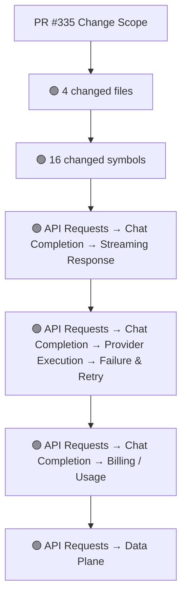
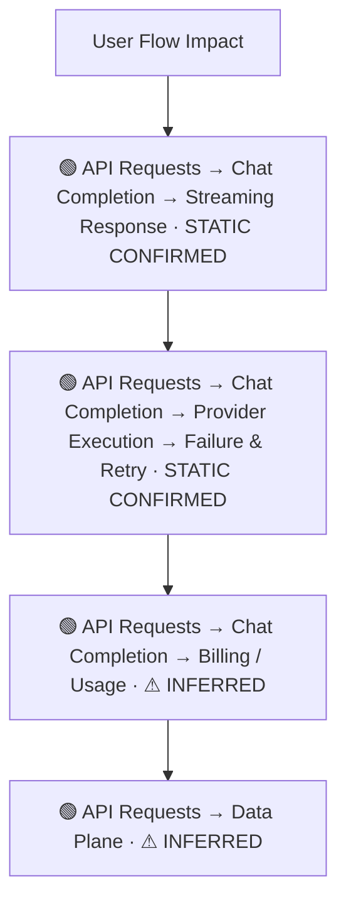
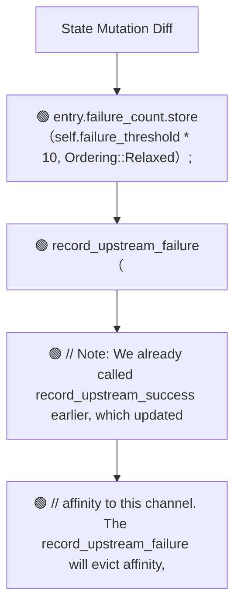
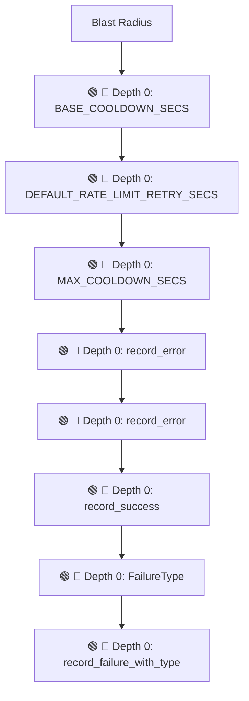

# Commit Change Atlas

## Executive Summary

| Field | Value |
|---|---|
| Commit | `d2733ccac33fca5895c2a8da3a007642e82d1fae` |
| Base | `a45c27e5a80c779b9127ade8b28592691cd3367e` |
| Merged PR | [#335](https://github.com/burncloud/burncloud/pull/335) |
| Merged At | `2026-06-07T08:16:00Z` |
| Intent | feat(router): 改进 Circuit Breaker 和失败检测机制 (Issue #333) |
| Intent Truth | **AUTHOR-STATED** (PR title/body) |
| Risk | **HIGH (35)** |
| Changed Files | 4 |
| Changed Symbols | 16 |
| Changed Functions | 12 |
| Changed Routes | 0 |
| Changed Test Files | 0 |
| Affected User Flows | 4 |
| API Contract | No Change |
| Database | No Change |
| External | No Change |
| Tests | ❌ Missing |

**Source Diff:** [BASE `a45c27e5a80c` → TARGET `d2733ccac33f`](https://github.com/burncloud/burncloud/compare/a45c27e5a80c779b9127ade8b28592691cd3367e...d2733ccac33fca5895c2a8da3a007642e82d1fae)

## Intent

**Intent:** feat(router): 改进 Circuit Breaker 和失败检测机制 (Issue #333)

**Truth:** **AUTHOR-STATED INTENT** — PR title/body; code facts below come from BASE→TARGET diff.

[Open merged PR #335](https://github.com/burncloud/burncloud/pull/335)

## 10-Dimension Dashboard

| Dimension | Status | Risk |
|---|---|---|
| 1. Change Scope | ● Changed | MEDIUM |
| 2. User Flow | ● Changed | MEDIUM |
| 3. Runtime | ● Changed | HIGH |
| 4. Control Flow | ● Changed | HIGH |
| 5. State | ● Changed | MEDIUM |
| 6. API Contract | ○ No Change | LOW |
| 7. Database | ○ No Change | LOW |
| 8. External | ○ No Change | LOW |
| 9. Blast Radius | ● Changed | MEDIUM |
| 10. Tests | ● Changed | HIGH |

---

## 1. Change Scope

### What changed?

Files **4** · Symbols **16** · Functions **12** · Routes **0** · Test files **0**

### Change Scope Map

### Changed Files

- 🟡 MODIFIED `crates/router/src/channel_state.rs`
- 🟡 MODIFIED `crates/router/src/circuit_breaker.rs`
- 🟡 MODIFIED `crates/router/src/lib.rs`
- 🟡 MODIFIED `crates/service/crates/billing/src/usage/providers/openai.rs`

### Changed Symbols

- 🟡 `const` `BASE_COOLDOWN_SECS` — `crates/router/src/channel_state.rs:L28`
- 🟡 `const` `DEFAULT_RATE_LIMIT_RETRY_SECS` — `crates/router/src/channel_state.rs:L26`
- 🟡 `const` `MAX_COOLDOWN_SECS` — `crates/router/src/channel_state.rs:L30`
- 🟡 `function` `record_error` — `crates/router/src/channel_state.rs:L326`
- 🟡 `function` `record_error` — `crates/router/src/channel_state.rs:L330`
- 🟡 `function` `record_success` — `crates/router/src/channel_state.rs:L457`
- 🟡 `enum` `FailureType` — `crates/router/src/circuit_breaker.rs:L25`
- 🟡 `function` `record_failure_with_type` — `crates/router/src/circuit_breaker.rs:L135`
- 🟡 `function` `record_failure_with_type` — `crates/router/src/circuit_breaker.rs:L137`
- 🟡 `function` `check_empty_response` — `crates/router/src/lib.rs:L210`
- 🟡 `function` `record_upstream_failure` — `crates/router/src/lib.rs:L149`
- 🟡 `function` `record_upstream_success` — `crates/router/src/lib.rs:L193`
- 🟡 `function` `parse_streaming_chunk` — `crates/service/crates/billing/src/usage/providers/openai.rs:L65`
- 🟡 `function` `test_parse_streaming_chunk_empty_usage` — `crates/service/crates/billing/src/usage/providers/openai.rs:L196`
- 🟡 `function` `test_parse_streaming_chunk_multiline` — `crates/service/crates/billing/src/usage/providers/openai.rs:L204`
- 🟡 `function` `test_parse_streaming_chunk_multiline_with_malformed` — `crates/service/crates/billing/src/usage/providers/openai.rs:L215`

### Evidence

- **AFTER:** [`crates/router/src/channel_state.rs:L27-L30`](https://github.com/burncloud/burncloud/blob/d2733ccac33fca5895c2a8da3a007642e82d1fae/crates/router/src/channel_state.rs#L27-L30)
- **AFTER:** [`crates/router/src/channel_state.rs:L401-L424`](https://github.com/burncloud/burncloud/blob/d2733ccac33fca5895c2a8da3a007642e82d1fae/crates/router/src/channel_state.rs#L401-L424)
- **AFTER:** [`crates/router/src/channel_state.rs:L429-L435`](https://github.com/burncloud/burncloud/blob/d2733ccac33fca5895c2a8da3a007642e82d1fae/crates/router/src/channel_state.rs#L429-L435)
- **AFTER:** [`crates/router/src/channel_state.rs:L437-L437`](https://github.com/burncloud/burncloud/blob/d2733ccac33fca5895c2a8da3a007642e82d1fae/crates/router/src/channel_state.rs#L437-L437)
- **BASE:** [`crates/router/src/channel_state.rs:L402-L404`](https://github.com/burncloud/burncloud/blob/a45c27e5a80c779b9127ade8b28592691cd3367e/crates/router/src/channel_state.rs#L402-L404)
- **AFTER:** [`crates/router/src/channel_state.rs:L440-L447`](https://github.com/burncloud/burncloud/blob/d2733ccac33fca5895c2a8da3a007642e82d1fae/crates/router/src/channel_state.rs#L440-L447)
- **BASE:** [`crates/router/src/channel_state.rs:L407-L407`](https://github.com/burncloud/burncloud/blob/a45c27e5a80c779b9127ade8b28592691cd3367e/crates/router/src/channel_state.rs#L407-L407)
- **AFTER:** [`crates/router/src/channel_state.rs:L485-L485`](https://github.com/burncloud/burncloud/blob/d2733ccac33fca5895c2a8da3a007642e82d1fae/crates/router/src/channel_state.rs#L485-L485)

---

## 2. User Flow Impact

### Which user behaviors changed?

- **API Requests → Chat Completion → Streaming Response** — STATIC CONFIRMED
- **API Requests → Chat Completion → Provider Execution → Failure & Retry** — STATIC CONFIRMED
- **API Requests → Chat Completion → Billing / Usage** — ⚠ INFERRED
- **API Requests → Data Plane** — ⚠ INFERRED

### User Flow Impact Map

Only explicit runtime/UI entry evidence is STATIC CONFIRMED; path/module mappings remain `⚠ INFERRED` where applicable.

### Evidence

- **AFTER:** [`crates/router/src/channel_state.rs:L27-L30`](https://github.com/burncloud/burncloud/blob/d2733ccac33fca5895c2a8da3a007642e82d1fae/crates/router/src/channel_state.rs#L27-L30)
- **AFTER:** [`crates/router/src/channel_state.rs:L401-L424`](https://github.com/burncloud/burncloud/blob/d2733ccac33fca5895c2a8da3a007642e82d1fae/crates/router/src/channel_state.rs#L401-L424)
- **AFTER:** [`crates/router/src/channel_state.rs:L429-L435`](https://github.com/burncloud/burncloud/blob/d2733ccac33fca5895c2a8da3a007642e82d1fae/crates/router/src/channel_state.rs#L429-L435)
- **AFTER:** [`crates/router/src/channel_state.rs:L437-L437`](https://github.com/burncloud/burncloud/blob/d2733ccac33fca5895c2a8da3a007642e82d1fae/crates/router/src/channel_state.rs#L437-L437)
- **BASE:** [`crates/router/src/channel_state.rs:L402-L404`](https://github.com/burncloud/burncloud/blob/a45c27e5a80c779b9127ade8b28592691cd3367e/crates/router/src/channel_state.rs#L402-L404)
- **AFTER:** [`crates/router/src/channel_state.rs:L440-L447`](https://github.com/burncloud/burncloud/blob/d2733ccac33fca5895c2a8da3a007642e82d1fae/crates/router/src/channel_state.rs#L440-L447)
- **BASE:** [`crates/router/src/channel_state.rs:L407-L407`](https://github.com/burncloud/burncloud/blob/a45c27e5a80c779b9127ade8b28592691cd3367e/crates/router/src/channel_state.rs#L407-L407)
- **AFTER:** [`crates/router/src/channel_state.rs:L485-L485`](https://github.com/burncloud/burncloud/blob/d2733ccac33fca5895c2a8da3a007642e82d1fae/crates/router/src/channel_state.rs#L485-L485)

---

## 3. End-to-End Runtime Diff

### What changed at runtime?

Changed production runtime signals were detected.

### E2E Diff

```mermaid
flowchart TD
  S["API Requests → Chat Completion → Streaming Response"]
  R1["🔴 修改控制条件 / 分支语义 · if !line.starts_with（'data: '） ｛"]
  S --> R1
  R2["🔴 修改控制条件 / 分支语义 · return Ok（None）;"]
  R1 --> R2
  R3["🔴 修改控制条件 / 分支语义 · if data.trim（） == '［DONE］' ｛"]
  R2 --> R3
  R4["🔴 修改控制条件 / 分支语义 · if input == 0 &amp;&amp; output == 0 ｛"]
  R3 --> R4
  R5["🔴 修改控制条件 / 分支语义 · if let Some（details） = usage.get（'prompt_tokens_details'） ｛"]
  R4 --> R5
  R5 --> D{"Diff"}
  A6["🟢 修改控制条件 / 分支语义 · /// Base cooldown for transient errors （seconds）."]
  D --> A6
  A7["🟢 修改控制条件 / 分支语义 · if let Some（model_name） = model ｛"]
  A6 --> A7
  A8["🟢 修改控制条件 / 分支语义 · // Exponential backoff for empty responses"]
  A7 --> A8
  A9["🟢 修改控制条件 / 分支语义 · 'Circuit Breaker: Upstream ｛｝ auth/payment failure （｛:?｝） — circuit t…"]
  A8 --> A9
  A10["🟢 修改控制条件 / 分支语义 · /// Check for empty response （zero tokens） and handle as failure if d…"]
  A9 --> A10
  A11["🟢 修改控制条件 / 分支语义 · /// Returns ′true′ if empty response was detected （caller should cont…"]
  A10 --> A11
  A12["🟢 修改控制条件 / 分支语义 · /// ′false′ if response has valid tokens （caller should proceed norma…"]
  A11 --> A12
  A13["🟢 修改控制条件 / 分支语义 · if usage.is_empty（） ｛"]
  A12 --> A13
```

### Decisions

Changed control statements are isolated in Dimension 4. Unproven edges are not invented.

### Evidence

- **AFTER:** [`crates/router/src/channel_state.rs:L27-L30`](https://github.com/burncloud/burncloud/blob/d2733ccac33fca5895c2a8da3a007642e82d1fae/crates/router/src/channel_state.rs#L27-L30)
- **AFTER:** [`crates/router/src/channel_state.rs:L401-L424`](https://github.com/burncloud/burncloud/blob/d2733ccac33fca5895c2a8da3a007642e82d1fae/crates/router/src/channel_state.rs#L401-L424)
- **AFTER:** [`crates/router/src/channel_state.rs:L429-L435`](https://github.com/burncloud/burncloud/blob/d2733ccac33fca5895c2a8da3a007642e82d1fae/crates/router/src/channel_state.rs#L429-L435)
- **AFTER:** [`crates/router/src/channel_state.rs:L437-L437`](https://github.com/burncloud/burncloud/blob/d2733ccac33fca5895c2a8da3a007642e82d1fae/crates/router/src/channel_state.rs#L437-L437)
- **BASE:** [`crates/router/src/channel_state.rs:L402-L404`](https://github.com/burncloud/burncloud/blob/a45c27e5a80c779b9127ade8b28592691cd3367e/crates/router/src/channel_state.rs#L402-L404)
- **AFTER:** [`crates/router/src/channel_state.rs:L440-L447`](https://github.com/burncloud/burncloud/blob/d2733ccac33fca5895c2a8da3a007642e82d1fae/crates/router/src/channel_state.rs#L440-L447)
- **BASE:** [`crates/router/src/channel_state.rs:L407-L407`](https://github.com/burncloud/burncloud/blob/a45c27e5a80c779b9127ade8b28592691cd3367e/crates/router/src/channel_state.rs#L407-L407)
- **AFTER:** [`crates/router/src/channel_state.rs:L485-L485`](https://github.com/burncloud/burncloud/blob/d2733ccac33fca5895c2a8da3a007642e82d1fae/crates/router/src/channel_state.rs#L485-L485)

---

## 4. ICFG Diff

### Which control-flow semantics changed?

```mermaid
flowchart TD
  S["Changed Control Region"]
  R1["🔴 if !line.starts_with（'data: '） ｛"]
  S --> R1
  R2["🔴 return Ok（None）;"]
  R1 --> R2
  R3["🔴 if data.trim（） == '［DONE］' ｛"]
  R2 --> R3
  R4["🔴 if input == 0 &amp;&amp; output == 0 ｛"]
  R3 --> R4
  R5["🔴 if let Some（details） = usage.get（'prompt_tokens_details'） ｛"]
  R4 --> R5
  R6["🔴 if let Some（details） = usage.get（'completion_tokens_details'） ｛"]
  R5 --> R6
  R6 --> D{"Diff"}
  A7["🟢 /// Base cooldown for transient errors （seconds）."]
  D --> A7
  A8["🟢 if let Some（model_name） = model ｛"]
  A7 --> A8
  A9["🟢 // Exponential backoff for empty responses"]
  A8 --> A9
  A10["🟢 'Circuit Breaker: Upstream ｛｝ auth/payment failure （｛:?｝） — circuit tripped for 30 min',"]
  A9 --> A10
  A11["🟢 /// Check for empty response （zero tokens） and handle as failure if detected."]
  A10 --> A11
  A12["🟢 /// Returns ′true′ if empty response was detected （caller should continue to next candidate）,"]
  A11 --> A12
  A13["🟢 /// ′false′ if response has valid tokens （caller should proceed normally）."]
  A12 --> A13
  A14["🟢 if usage.is_empty（） ｛"]
  A13 --> A14
  A15["🟢 // Check for empty response （zero tokens） - only for non-streaming"]
  A14 --> A15
  A16["🟢 if check_empty_response（state, upstream, model_name, &amp;session_id, &amp;token_counter） ｛"]
  A15 --> A16
  A17["🟢 continue; // Try next candidate"]
  A16 --> A17
  A18["🟢 for line in chunk.lines（） ｛"]
  A17 --> A18
```

⚠ Diagram contains changed control statements only; unproven interprocedural edges are not invented.

### Evidence

- **AFTER:** [`crates/router/src/channel_state.rs:L27-L30`](https://github.com/burncloud/burncloud/blob/d2733ccac33fca5895c2a8da3a007642e82d1fae/crates/router/src/channel_state.rs#L27-L30)
- **AFTER:** [`crates/router/src/channel_state.rs:L401-L424`](https://github.com/burncloud/burncloud/blob/d2733ccac33fca5895c2a8da3a007642e82d1fae/crates/router/src/channel_state.rs#L401-L424)
- **AFTER:** [`crates/router/src/circuit_breaker.rs:L152-L152`](https://github.com/burncloud/burncloud/blob/d2733ccac33fca5895c2a8da3a007642e82d1fae/crates/router/src/circuit_breaker.rs#L152-L152)
- **BASE:** [`crates/router/src/circuit_breaker.rs:L149-L149`](https://github.com/burncloud/burncloud/blob/a45c27e5a80c779b9127ade8b28592691cd3367e/crates/router/src/circuit_breaker.rs#L149-L149)
- **AFTER:** [`crates/router/src/lib.rs:L206-L243`](https://github.com/burncloud/burncloud/blob/d2733ccac33fca5895c2a8da3a007642e82d1fae/crates/router/src/lib.rs#L206-L243)
- **AFTER:** [`crates/router/src/lib.rs:L2797-L2803`](https://github.com/burncloud/burncloud/blob/d2733ccac33fca5895c2a8da3a007642e82d1fae/crates/router/src/lib.rs#L2797-L2803)
- **AFTER:** [`crates/service/crates/billing/src/usage/providers/openai.rs:L66-L75`](https://github.com/burncloud/burncloud/blob/d2733ccac33fca5895c2a8da3a007642e82d1fae/crates/service/crates/billing/src/usage/providers/openai.rs#L66-L75)
- **BASE:** [`crates/service/crates/billing/src/usage/providers/openai.rs:L66-L78`](https://github.com/burncloud/burncloud/blob/a45c27e5a80c779b9127ade8b28592691cd3367e/crates/service/crates/billing/src/usage/providers/openai.rs#L66-L78)

---

## 5. State Mutation Diff

### What state behavior changed?

| Before | After |
|---|---|
| — | 🟢 entry.failure_count.store（self.failure_threshold * 10, Ordering::Relaxed）; |
| — | 🟢 record_upstream_failure（ |
| — | 🟢 // Note: We already called record_upstream_success earlier, which updated |
| — | 🟢 // affinity to this channel. The record_upstream_failure will evict affinity, |

### State Diff

### Evidence

- **AFTER:** [`crates/router/src/circuit_breaker.rs:L146-L150`](https://github.com/burncloud/burncloud/blob/d2733ccac33fca5895c2a8da3a007642e82d1fae/crates/router/src/circuit_breaker.rs#L146-L150)
- **BASE:** [`crates/router/src/circuit_breaker.rs:L144-L147`](https://github.com/burncloud/burncloud/blob/a45c27e5a80c779b9127ade8b28592691cd3367e/crates/router/src/circuit_breaker.rs#L144-L147)
- **AFTER:** [`crates/router/src/lib.rs:L206-L243`](https://github.com/burncloud/burncloud/blob/d2733ccac33fca5895c2a8da3a007642e82d1fae/crates/router/src/lib.rs#L206-L243)

---

## 6. API Contract Diff

### API changes

**⚪ NO API CONTRACT CHANGE DETECTED**

**API Contract: ⚪ NO CHANGE DETECTED** by complete diff scan.

### Evidence

- **COMPLETE DIFF SCAN:** No route/status/header/content-type API-contract marker changed.
- [Open complete BASE → TARGET diff](https://github.com/burncloud/burncloud/compare/a45c27e5a80c779b9127ade8b28592691cd3367e...d2733ccac33fca5895c2a8da3a007642e82d1fae)

---

## 7. Database / Persistence Diff

### Persistence changes

**⚪ NO DATABASE / PERSISTENCE CHANGE DETECTED**

**⚪ NO DATABASE / PERSISTENCE CHANGE DETECTED** by complete diff scan.

### Evidence

- **COMPLETE DIFF SCAN:** No migration/database/SQL persistence hunk changed.
- [Open complete BASE → TARGET diff](https://github.com/burncloud/burncloud/compare/a45c27e5a80c779b9127ade8b28592691cd3367e...d2733ccac33fca5895c2a8da3a007642e82d1fae)

---

## 8. External Dependency Diff

### External behavior changes

**⚪ NO EXTERNAL DEPENDENCY CHANGE DETECTED**

**⚪ NO EXTERNAL DEPENDENCY CHANGE DETECTED** by complete diff scan.

### Evidence

- **COMPLETE DIFF SCAN:** No outbound HTTP/provider/Redis/webhook/process marker changed.
- [Open complete BASE → TARGET diff](https://github.com/burncloud/burncloud/compare/a45c27e5a80c779b9127ade8b28592691cd3367e...d2733ccac33fca5895c2a8da3a007642e82d1fae)

---

## 9. Blast Radius

### What else may be affected?

| Depth | Impact | Evidence location |
|---|---|---|
| 🔴 Depth 0 | BASE_COOLDOWN_SECS | `crates/router/src/channel_state.rs:L28` |
| 🔴 Depth 0 | DEFAULT_RATE_LIMIT_RETRY_SECS | `crates/router/src/channel_state.rs:L26` |
| 🔴 Depth 0 | MAX_COOLDOWN_SECS | `crates/router/src/channel_state.rs:L30` |
| 🔴 Depth 0 | record_error | `crates/router/src/channel_state.rs:L326` |
| 🔴 Depth 0 | record_error | `crates/router/src/channel_state.rs:L330` |
| 🔴 Depth 0 | record_success | `crates/router/src/channel_state.rs:L457` |
| 🔴 Depth 0 | FailureType | `crates/router/src/circuit_breaker.rs:L25` |
| 🔴 Depth 0 | record_failure_with_type | `crates/router/src/circuit_breaker.rs:L135` |

### Blast Radius Map

🔴 Depth 0 is direct. 🟡 lexical references are **impact candidates**, not compiler-proven call edges. Dynamic dispatch is never promoted to a confirmed edge.

### Evidence

- **AFTER:** [`crates/router/src/channel_state.rs:L27-L30`](https://github.com/burncloud/burncloud/blob/d2733ccac33fca5895c2a8da3a007642e82d1fae/crates/router/src/channel_state.rs#L27-L30)
- **AFTER:** [`crates/router/src/channel_state.rs:L401-L424`](https://github.com/burncloud/burncloud/blob/d2733ccac33fca5895c2a8da3a007642e82d1fae/crates/router/src/channel_state.rs#L401-L424)
- **AFTER:** [`crates/router/src/channel_state.rs:L429-L435`](https://github.com/burncloud/burncloud/blob/d2733ccac33fca5895c2a8da3a007642e82d1fae/crates/router/src/channel_state.rs#L429-L435)
- **AFTER:** [`crates/router/src/channel_state.rs:L437-L437`](https://github.com/burncloud/burncloud/blob/d2733ccac33fca5895c2a8da3a007642e82d1fae/crates/router/src/channel_state.rs#L437-L437)
- **BASE:** [`crates/router/src/channel_state.rs:L402-L404`](https://github.com/burncloud/burncloud/blob/a45c27e5a80c779b9127ade8b28592691cd3367e/crates/router/src/channel_state.rs#L402-L404)
- **AFTER:** [`crates/router/src/channel_state.rs:L440-L447`](https://github.com/burncloud/burncloud/blob/d2733ccac33fca5895c2a8da3a007642e82d1fae/crates/router/src/channel_state.rs#L440-L447)
- **BASE:** [`crates/router/src/channel_state.rs:L407-L407`](https://github.com/burncloud/burncloud/blob/a45c27e5a80c779b9127ade8b28592691cd3367e/crates/router/src/channel_state.rs#L407-L407)

---

## 10. Test Coverage & Evidence

### Coverage Matrix

**Overall:** ❌ Missing

- Changed test files: **0**
- Lexical references from changed symbols into tests: **0**

### Missing Coverage

- ❌ Direct changed-test coverage was not detected for changed production symbols.

### Source Evidence

- **COMPLETE DIFF SCAN:** No changed test hunk; coverage status uses changed tests plus lexical test references.
- [Open complete BASE → TARGET diff](https://github.com/burncloud/burncloud/compare/a45c27e5a80c779b9127ade8b28592691cd3367e...d2733ccac33fca5895c2a8da3a007642e82d1fae)

---

## Risk Assessment

**Score: 35 → HIGH**

### Risk Drivers

- `Authentication change` **+5**
- `Quota change` **+5**
- `Routing decision` **+4**
- `Provider request` **+4**
- `Streaming` **+4**
- `Retry/failover` **+4**
- `State mutation` **+3**
- `Cache behavior` **+3**
- `Missing direct changed tests` **+3**

The score is rule-based, not an LLM impression.

## Reviewer Checklist

- [ ] Intent 与代码变化一致
- [ ] User Flow impact 已确认
- [ ] Runtime Diff 已确认
- [ ] Control-flow changes 已确认
- [ ] State mutation 已确认
- [ ] API contract 已确认
- [ ] Database behavior 已确认
- [ ] External Provider behavior 已确认
- [ ] Blast Radius 可接受
- [ ] Tests 覆盖 changed runtime paths
- [ ] Dynamic / Inferred relationships 已正确标记
- [ ] Source Evidence 可追溯

## Source Diff Entry Points

- [Complete BASE → TARGET diff](https://github.com/burncloud/burncloud/compare/a45c27e5a80c779b9127ade8b28592691cd3367e...d2733ccac33fca5895c2a8da3a007642e82d1fae)
- [Merged PR #335](https://github.com/burncloud/burncloud/pull/335)
