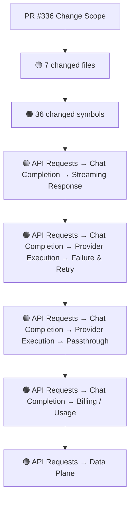
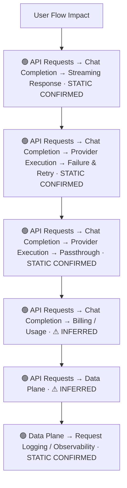
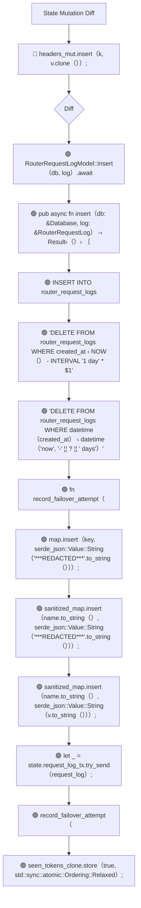
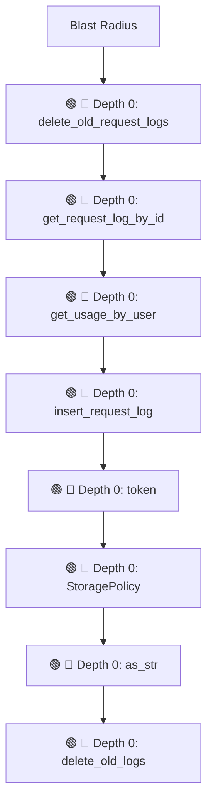

# Commit Change Atlas

## Executive Summary

| Field | Value |
|---|---|
| Commit | `cdb848f6b0c9199bdd2df8879b4a5e0dd0734357` |
| Base | `d2733ccac33fca5895c2a8da3a007642e82d1fae` |
| Merged PR | [#336](https://github.com/burncloud/burncloud/pull/336) |
| Merged At | `2026-06-07T10:11:15Z` |
| Intent | fix(router): 为流式响应添加 empty response 检测 |
| Intent Truth | **AUTHOR-STATED** (PR title/body) |
| Risk | **HIGH (55)** |
| Changed Files | 7 |
| Changed Symbols | 36 |
| Changed Functions | 21 |
| Changed Routes | 0 |
| Changed Test Files | 1 |
| Affected User Flows | 6 |
| API Contract | Changed |
| Database | Changed |
| External | Changed |
| Tests | 🟢 New Coverage |

**Source Diff:** [BASE `d2733ccac33f` → TARGET `cdb848f6b0c9`](https://github.com/burncloud/burncloud/compare/d2733ccac33fca5895c2a8da3a007642e82d1fae...cdb848f6b0c9199bdd2df8879b4a5e0dd0734357)

## Intent

**Intent:** fix(router): 为流式响应添加 empty response 检测

**Truth:** **AUTHOR-STATED INTENT** — PR title/body; code facts below come from BASE→TARGET diff.

[Open merged PR #336](https://github.com/burncloud/burncloud/pull/336)

## 10-Dimension Dashboard

| Dimension | Status | Risk |
|---|---|---|
| 1. Change Scope | ● Changed | MEDIUM |
| 2. User Flow | ● Changed | MEDIUM |
| 3. Runtime | ● Changed | HIGH |
| 4. Control Flow | ● Changed | HIGH |
| 5. State | ● Changed | MEDIUM |
| 6. API Contract | ● Changed | HIGH |
| 7. Database | ● Changed | HIGH |
| 8. External | ● Changed | MEDIUM |
| 9. Blast Radius | ● Changed | MEDIUM |
| 10. Tests | ● Changed | HIGH |

---

## 1. Change Scope

### What changed?

Files **7** · Symbols **36** · Functions **21** · Routes **0** · Test files **1**

### Change Scope Map

### Changed Files

- 🟡 MODIFIED `crates/database/crates/router/src/lib.rs`
- 🟡 MODIFIED `crates/database/crates/router/src/log.rs`
- 🟢 ADDED `crates/database/migrations/postgres/0017_router_request_logs.sql`
- 🟢 ADDED `crates/database/migrations/sqlite/0017_router_request_logs.sql`
- 🟡 MODIFIED `crates/router/src/lib.rs`
- 🟡 MODIFIED `crates/router/src/state.rs`
- 🟡 MODIFIED `crates/router/tests/common.rs`

### Changed Symbols

- 🟡 `function` `delete_old_request_logs` — `crates/database/crates/router/src/lib.rs:L267`
- 🟡 `function` `get_request_log_by_id` — `crates/database/crates/router/src/lib.rs:L260`
- 🟡 `function` `get_usage_by_user` — `crates/database/crates/router/src/lib.rs:L250`
- 🟡 `function` `insert_request_log` — `crates/database/crates/router/src/lib.rs:L256`
- 🟡 `mod` `token` — `crates/database/crates/router/src/lib.rs:L15`
- 🟡 `enum` `StoragePolicy` — `crates/database/crates/router/src/log.rs:L729`
- 🟡 `function` `as_str` — `crates/database/crates/router/src/log.rs:L740`
- 🟡 `function` `delete_old_logs` — `crates/database/crates/router/src/log.rs:L890`
- 🟡 `function` `from_str` — `crates/database/crates/router/src/log.rs:L748`
- 🟡 `function` `get_by_request_id` — `crates/database/crates/router/src/log.rs:L872`
- 🟡 `function` `insert` — `crates/database/crates/router/src/log.rs:L831`
- 🟡 `struct` `CandidateInfo` — `crates/database/crates/router/src/log.rs:L820`
- 🟡 `struct` `FailoverAttempt` — `crates/database/crates/router/src/log.rs:L810`
- 🟡 `struct` `RouterRequestLog` — `crates/database/crates/router/src/log.rs:L761`
- 🟡 `struct` `RouterRequestLogModel` — `crates/database/crates/router/src/log.rs:L827`
- 🟡 `const` `HTTP_TCP_KEEPALIVE_SECS` — `crates/router/src/lib.rs:L99`
- 🟡 `const` `MAX_LOG_BODY_SIZE` — `crates/router/src/lib.rs:L328`
- 🟡 `const` `SENSITIVE_FIELDS` — `crates/router/src/lib.rs:L341`
- 🟡 `const` `SENSITIVE_HEADERS` — `crates/router/src/lib.rs:L331`
- 🟡 `function` `classify_upstream_error` — `crates/router/src/lib.rs:L299`
- 🟡 `function` `create_router_app` — `crates/router/src/lib.rs:L610`
- 🟡 `function` `handle_response_with_token_parsing` — `crates/router/src/lib.rs:L3043`
- 🟡 `function` `proxy_logic` — `crates/router/src/lib.rs:L1865`
- 🟡 `function` `record_failover_attempt` — `crates/router/src/lib.rs:L134`
- 🟡 `function` `redact_sensitive_fields` — `crates/router/src/lib.rs:L393`

### Evidence

- **AFTER:** [`crates/database/crates/router/src/lib.rs:L20-L22`](https://github.com/burncloud/burncloud/blob/cdb848f6b0c9199bdd2df8879b4a5e0dd0734357/crates/database/crates/router/src/lib.rs#L20-L22)
- **BASE:** [`crates/database/crates/router/src/lib.rs:L20-L21`](https://github.com/burncloud/burncloud/blob/d2733ccac33fca5895c2a8da3a007642e82d1fae/crates/database/crates/router/src/lib.rs#L20-L21)
- **AFTER:** [`crates/database/crates/router/src/lib.rs:L254-L270`](https://github.com/burncloud/burncloud/blob/cdb848f6b0c9199bdd2df8879b4a5e0dd0734357/crates/database/crates/router/src/lib.rs#L254-L270)
- **AFTER:** [`crates/database/crates/router/src/log.rs:L727-L908`](https://github.com/burncloud/burncloud/blob/cdb848f6b0c9199bdd2df8879b4a5e0dd0734357/crates/database/crates/router/src/log.rs#L727-L908)
- **AFTER:** [`crates/database/migrations/postgres/0017_router_request_logs.sql:L1-L51`](https://github.com/burncloud/burncloud/blob/cdb848f6b0c9199bdd2df8879b4a5e0dd0734357/crates/database/migrations/postgres/0017_router_request_logs.sql#L1-L51)
- **AFTER:** [`crates/database/migrations/sqlite/0017_router_request_logs.sql:L1-L45`](https://github.com/burncloud/burncloud/blob/cdb848f6b0c9199bdd2df8879b4a5e0dd0734357/crates/database/migrations/sqlite/0017_router_request_logs.sql#L1-L45)
- **AFTER:** [`crates/router/src/lib.rs:L39-L40`](https://github.com/burncloud/burncloud/blob/cdb848f6b0c9199bdd2df8879b4a5e0dd0734357/crates/router/src/lib.rs#L39-L40)
- **BASE:** [`crates/router/src/lib.rs:L39-L39`](https://github.com/burncloud/burncloud/blob/d2733ccac33fca5895c2a8da3a007642e82d1fae/crates/router/src/lib.rs#L39-L39)

---

## 2. User Flow Impact

### Which user behaviors changed?

- **API Requests → Chat Completion → Streaming Response** — STATIC CONFIRMED
- **API Requests → Chat Completion → Provider Execution → Failure & Retry** — STATIC CONFIRMED
- **API Requests → Chat Completion → Provider Execution → Passthrough** — STATIC CONFIRMED
- **API Requests → Chat Completion → Billing / Usage** — ⚠ INFERRED
- **API Requests → Data Plane** — ⚠ INFERRED
- **Data Plane → Request Logging / Observability** — STATIC CONFIRMED

### User Flow Impact Map

Only explicit runtime/UI entry evidence is STATIC CONFIRMED; path/module mappings remain `⚠ INFERRED` where applicable.

### Evidence

- **AFTER:** [`crates/database/crates/router/src/lib.rs:L20-L22`](https://github.com/burncloud/burncloud/blob/cdb848f6b0c9199bdd2df8879b4a5e0dd0734357/crates/database/crates/router/src/lib.rs#L20-L22)
- **BASE:** [`crates/database/crates/router/src/lib.rs:L20-L21`](https://github.com/burncloud/burncloud/blob/d2733ccac33fca5895c2a8da3a007642e82d1fae/crates/database/crates/router/src/lib.rs#L20-L21)
- **AFTER:** [`crates/database/crates/router/src/lib.rs:L254-L270`](https://github.com/burncloud/burncloud/blob/cdb848f6b0c9199bdd2df8879b4a5e0dd0734357/crates/database/crates/router/src/lib.rs#L254-L270)
- **AFTER:** [`crates/database/crates/router/src/log.rs:L727-L908`](https://github.com/burncloud/burncloud/blob/cdb848f6b0c9199bdd2df8879b4a5e0dd0734357/crates/database/crates/router/src/log.rs#L727-L908)
- **AFTER:** [`crates/router/src/lib.rs:L39-L40`](https://github.com/burncloud/burncloud/blob/cdb848f6b0c9199bdd2df8879b4a5e0dd0734357/crates/router/src/lib.rs#L39-L40)
- **BASE:** [`crates/router/src/lib.rs:L39-L39`](https://github.com/burncloud/burncloud/blob/d2733ccac33fca5895c2a8da3a007642e82d1fae/crates/router/src/lib.rs#L39-L39)
- **AFTER:** [`crates/router/src/lib.rs:L104-L151`](https://github.com/burncloud/burncloud/blob/cdb848f6b0c9199bdd2df8879b4a5e0dd0734357/crates/router/src/lib.rs#L104-L151)
- **AFTER:** [`crates/router/src/lib.rs:L175-L177`](https://github.com/burncloud/burncloud/blob/cdb848f6b0c9199bdd2df8879b4a5e0dd0734357/crates/router/src/lib.rs#L175-L177)

---

## 3. End-to-End Runtime Diff

### What changed at runtime?

Changed production runtime signals were detected.

### E2E Diff

```mermaid
flowchart TD
  S["API Requests → Chat Completion → Streaming Response"]
  R1["🔴 修改控制条件 / 分支语义 · let stream = body_stream.map（move ¦chunk_result¦ match chunk_result ｛"]
  S --> R1
  R2["🔴 修改控制条件 / 分支语义 · if let Some（u） = parse_chunk_or_default（"]
  R1 --> R2
  R3["🔴 修改控制条件 / 分支语义 · if let Some（u） ="]
  R2 --> R3
  R4["🔴 修改控制条件 / 分支语义 · match parser.provider_name（） ｛"]
  R3 --> R4
  R5["🔴 修改控制条件 / 分支语义 · if let Some（converted） ="]
  R4 --> R5
  R6["🔴 修改控制条件 / 分支语义 · /// Handle streaming response with token parsing for OpenAI protocol"]
  R5 --> R6
  R7["🔴 修改控制条件 / 分支语义 · if let Some（headers_mut） = response_builder.headers_mut（） ｛"]
  R6 --> R7
  R7 --> D{"Diff"}
  A8["🟢 修改控制条件 / 分支语义 · /// Storage policy for request logs （controls verbosity）."]
  D --> A8
  A9["🟢 修改控制条件 / 分支语义 · match self ｛"]
  A8 --> A9
  A10["🟢 修改控制条件 / 分支语义 · match s ｛"]
  A9 --> A10
  A11["🟢 修改控制条件 / 分支语义 · _ =› Self::Summary, // Default to summary for unknown values"]
  A10 --> A11
  A12["🟢 修改控制条件 / 分支语义 · /// Detailed request/response log for debugging."]
  A11 --> A12
  A13["🟢 修改控制条件 / 分支语义 · /// Failover attempt record for debugging."]
  A12 --> A13
  A14["🟢 修改控制条件 / 分支语义 · /// Candidate channel information for logging."]
  A13 --> A14
  A15["🟢 启用详细 Router Request Log 持久化 · router_request_logs"]
  A14 --> A15
```

### Decisions

Changed control statements are isolated in Dimension 4. Unproven edges are not invented.

### Evidence

- **AFTER:** [`crates/database/crates/router/src/lib.rs:L20-L22`](https://github.com/burncloud/burncloud/blob/cdb848f6b0c9199bdd2df8879b4a5e0dd0734357/crates/database/crates/router/src/lib.rs#L20-L22)
- **BASE:** [`crates/database/crates/router/src/lib.rs:L20-L21`](https://github.com/burncloud/burncloud/blob/d2733ccac33fca5895c2a8da3a007642e82d1fae/crates/database/crates/router/src/lib.rs#L20-L21)
- **AFTER:** [`crates/database/crates/router/src/lib.rs:L254-L270`](https://github.com/burncloud/burncloud/blob/cdb848f6b0c9199bdd2df8879b4a5e0dd0734357/crates/database/crates/router/src/lib.rs#L254-L270)
- **AFTER:** [`crates/database/crates/router/src/log.rs:L727-L908`](https://github.com/burncloud/burncloud/blob/cdb848f6b0c9199bdd2df8879b4a5e0dd0734357/crates/database/crates/router/src/log.rs#L727-L908)
- **AFTER:** [`crates/router/src/lib.rs:L39-L40`](https://github.com/burncloud/burncloud/blob/cdb848f6b0c9199bdd2df8879b4a5e0dd0734357/crates/router/src/lib.rs#L39-L40)
- **BASE:** [`crates/router/src/lib.rs:L39-L39`](https://github.com/burncloud/burncloud/blob/d2733ccac33fca5895c2a8da3a007642e82d1fae/crates/router/src/lib.rs#L39-L39)
- **AFTER:** [`crates/router/src/lib.rs:L104-L151`](https://github.com/burncloud/burncloud/blob/cdb848f6b0c9199bdd2df8879b4a5e0dd0734357/crates/router/src/lib.rs#L104-L151)
- **AFTER:** [`crates/router/src/lib.rs:L175-L177`](https://github.com/burncloud/burncloud/blob/cdb848f6b0c9199bdd2df8879b4a5e0dd0734357/crates/router/src/lib.rs#L175-L177)

---

## 4. ICFG Diff

### Which control-flow semantics changed?

```mermaid
flowchart TD
  S["Changed Control Region"]
  R1["🔴 let stream = body_stream.map（move ¦chunk_result¦ match chunk_result ｛"]
  S --> R1
  R2["🔴 if let Some（u） = parse_chunk_or_default（"]
  R1 --> R2
  R3["🔴 if let Some（u） ="]
  R2 --> R3
  R4["🔴 match parser.provider_name（） ｛"]
  R3 --> R4
  R5["🔴 if let Some（converted） ="]
  R4 --> R5
  R6["🔴 /// Handle streaming response with token parsing for OpenAI protocol"]
  R5 --> R6
  R7["🔴 if let Some（headers_mut） = response_builder.headers_mut（） ｛"]
  R6 --> R7
  R8["🔴 for （k, v） in resp.headers（） ｛"]
  R7 --> R8
  R8 --> D{"Diff"}
  A9["🟢 /// Storage policy for request logs （controls verbosity）."]
  D --> A9
  A10["🟢 match self ｛"]
  A9 --> A10
  A11["🟢 match s ｛"]
  A10 --> A11
  A12["🟢 _ =› Self::Summary, // Default to summary for unknown values"]
  A11 --> A12
  A13["🟢 /// Detailed request/response log for debugging."]
  A12 --> A13
  A14["🟢 /// Failover attempt record for debugging."]
  A13 --> A14
  A15["🟢 /// Candidate channel information for logging."]
  A14 --> A15
  A16["🟢 /// Delete request logs older than a threshold （for cleanup）"]
  A15 --> A16
  A17["🟢 let sql = if is_postgres ｛"]
  A16 --> A17
  A18["🟢 /// Data collected during request processing for router_request_logs table."]
  A17 --> A18
  A19["🟢 /// Number of candidates （for quick queries）"]
  A18 --> A19
  A20["🟢 /// Channel ID from affinity cache hit （if any）"]
  A19 --> A20
```

⚠ Diagram contains changed control statements only; unproven interprocedural edges are not invented.

### Evidence

- **AFTER:** [`crates/database/crates/router/src/log.rs:L727-L908`](https://github.com/burncloud/burncloud/blob/cdb848f6b0c9199bdd2df8879b4a5e0dd0734357/crates/database/crates/router/src/log.rs#L727-L908)
- **AFTER:** [`crates/database/migrations/postgres/0017_router_request_logs.sql:L1-L51`](https://github.com/burncloud/burncloud/blob/cdb848f6b0c9199bdd2df8879b4a5e0dd0734357/crates/database/migrations/postgres/0017_router_request_logs.sql#L1-L51)
- **AFTER:** [`crates/database/migrations/sqlite/0017_router_request_logs.sql:L1-L45`](https://github.com/burncloud/burncloud/blob/cdb848f6b0c9199bdd2df8879b4a5e0dd0734357/crates/database/migrations/sqlite/0017_router_request_logs.sql#L1-L45)
- **AFTER:** [`crates/router/src/lib.rs:L104-L151`](https://github.com/burncloud/burncloud/blob/cdb848f6b0c9199bdd2df8879b4a5e0dd0734357/crates/router/src/lib.rs#L104-L151)
- **AFTER:** [`crates/router/src/lib.rs:L175-L177`](https://github.com/burncloud/burncloud/blob/cdb848f6b0c9199bdd2df8879b4a5e0dd0734357/crates/router/src/lib.rs#L175-L177)
- **AFTER:** [`crates/router/src/lib.rs:L324-L466`](https://github.com/burncloud/burncloud/blob/cdb848f6b0c9199bdd2df8879b4a5e0dd0734357/crates/router/src/lib.rs#L324-L466)
- **AFTER:** [`crates/router/src/lib.rs:L683-L698`](https://github.com/burncloud/burncloud/blob/cdb848f6b0c9199bdd2df8879b4a5e0dd0734357/crates/router/src/lib.rs#L683-L698)
- **AFTER:** [`crates/router/src/lib.rs:L761-L774`](https://github.com/burncloud/burncloud/blob/cdb848f6b0c9199bdd2df8879b4a5e0dd0734357/crates/router/src/lib.rs#L761-L774)

---

## 5. State Mutation Diff

### What state behavior changed?

| Before | After |
|---|---|
| 🔴 headers_mut.insert（k, v.clone（））; | 🟢 RouterRequestLogModel::insert（db, log）.await |
| — | 🟢 pub async fn insert（db: &Database, log: &RouterRequestLog） -› Result‹（）› ｛ |
| — | 🟢 INSERT INTO router_request_logs |
| — | 🟢 'DELETE FROM router_request_logs WHERE created_at ‹ NOW（） - INTERVAL '1 day' * $1' |
| — | 🟢 'DELETE FROM router_request_logs WHERE datetime（created_at） ‹ datetime（'now', '-' ¦¦ ? ¦¦ ' days'）' |
| — | 🟢 fn record_failover_attempt（ |
| — | 🟢 map.insert（key, serde_json::Value::String（'***REDACTED***'.to_string（）））; |
| — | 🟢 sanitized_map.insert（name.to_string（）, serde_json::Value::String（'***REDACTED***'.to_string（）））; |
| — | 🟢 sanitized_map.insert（name.to_string（）, serde_json::Value::String（v.to_string（）））; |
| — | 🟢 let _ = state.request_log_tx.try_send（request_log）; |
| — | 🟢 record_failover_attempt（ |
| — | 🟢 seen_tokens_clone.store（true, std::sync::atomic::Ordering::Relaxed）; |

### State Diff

### Evidence

- **AFTER:** [`crates/database/crates/router/src/lib.rs:L254-L270`](https://github.com/burncloud/burncloud/blob/cdb848f6b0c9199bdd2df8879b4a5e0dd0734357/crates/database/crates/router/src/lib.rs#L254-L270)
- **AFTER:** [`crates/database/crates/router/src/log.rs:L727-L908`](https://github.com/burncloud/burncloud/blob/cdb848f6b0c9199bdd2df8879b4a5e0dd0734357/crates/database/crates/router/src/log.rs#L727-L908)
- **AFTER:** [`crates/router/src/lib.rs:L104-L151`](https://github.com/burncloud/burncloud/blob/cdb848f6b0c9199bdd2df8879b4a5e0dd0734357/crates/router/src/lib.rs#L104-L151)
- **AFTER:** [`crates/router/src/lib.rs:L324-L466`](https://github.com/burncloud/burncloud/blob/cdb848f6b0c9199bdd2df8879b4a5e0dd0734357/crates/router/src/lib.rs#L324-L466)
- **AFTER:** [`crates/router/src/lib.rs:L1766-L1801`](https://github.com/burncloud/burncloud/blob/cdb848f6b0c9199bdd2df8879b4a5e0dd0734357/crates/router/src/lib.rs#L1766-L1801)
- **AFTER:** [`crates/router/src/lib.rs:L2262-L2269`](https://github.com/burncloud/burncloud/blob/cdb848f6b0c9199bdd2df8879b4a5e0dd0734357/crates/router/src/lib.rs#L2262-L2269)
- **AFTER:** [`crates/router/src/lib.rs:L2286-L2293`](https://github.com/burncloud/burncloud/blob/cdb848f6b0c9199bdd2df8879b4a5e0dd0734357/crates/router/src/lib.rs#L2286-L2293)
- **AFTER:** [`crates/router/src/lib.rs:L2472-L2497`](https://github.com/burncloud/burncloud/blob/cdb848f6b0c9199bdd2df8879b4a5e0dd0734357/crates/router/src/lib.rs#L2472-L2497)

---

## 6. API Contract Diff

### API changes

| Before | After |
|---|---|
| — | 🟢 'x-api-key', |
| — | 🟢 StatusCode::INTERNAL_SERVER_ERROR, |

API Contract changes are never rated below MEDIUM.

### Evidence

- **AFTER:** [`crates/router/src/lib.rs:L324-L466`](https://github.com/burncloud/burncloud/blob/cdb848f6b0c9199bdd2df8879b4a5e0dd0734357/crates/router/src/lib.rs#L324-L466)
- **AFTER:** [`crates/router/src/lib.rs:L3109-L3120`](https://github.com/burncloud/burncloud/blob/cdb848f6b0c9199bdd2df8879b4a5e0dd0734357/crates/router/src/lib.rs#L3109-L3120)
- **BASE:** [`crates/router/src/lib.rs:L2656-L2660`](https://github.com/burncloud/burncloud/blob/d2733ccac33fca5895c2a8da3a007642e82d1fae/crates/router/src/lib.rs#L2656-L2660)

---

## 7. Database / Persistence Diff

### Persistence changes

| Before | After |
|---|---|
| — | 🟢 INSERT INTO router_request_logs |
| — | 🟢 'SELECT * FROM router_request_logs WHERE request_id = ｛｝', |
| — | 🟢 'DELETE FROM router_request_logs WHERE created_at ‹ NOW（） - INTERVAL '1 day' * $1' |
| — | 🟢 'DELETE FROM router_request_logs WHERE datetime（created_at） ‹ datetime（'now', '-' ¦¦ ? ¦¦ ' days'）' |
| — | 🟢 CREATE TABLE IF NOT EXISTS router_request_logs （ |
| — | 🟢 CREATE INDEX IF NOT EXISTS idx_router_request_logs_created_at ON router_request_logs（created_at）; |
| — | 🟢 CREATE INDEX IF NOT EXISTS idx_router_request_logs_request_id ON router_request_logs（request_id）; |
| — | 🟢 CREATE INDEX IF NOT EXISTS idx_router_request_logs_storage_policy ON router_request_logs（storage_policy）; |
| — | 🟢 CREATE TABLE IF NOT EXISTS channel_providers （ |
| — | 🟢 CREATE TABLE IF NOT EXISTS channel_abilities （ |

Database/migration/SQL persistence surface changed.

### Evidence

- **AFTER:** [`crates/database/crates/router/src/log.rs:L727-L908`](https://github.com/burncloud/burncloud/blob/cdb848f6b0c9199bdd2df8879b4a5e0dd0734357/crates/database/crates/router/src/log.rs#L727-L908)
- **AFTER:** [`crates/database/migrations/postgres/0017_router_request_logs.sql:L1-L51`](https://github.com/burncloud/burncloud/blob/cdb848f6b0c9199bdd2df8879b4a5e0dd0734357/crates/database/migrations/postgres/0017_router_request_logs.sql#L1-L51)
- **AFTER:** [`crates/database/migrations/sqlite/0017_router_request_logs.sql:L1-L45`](https://github.com/burncloud/burncloud/blob/cdb848f6b0c9199bdd2df8879b4a5e0dd0734357/crates/database/migrations/sqlite/0017_router_request_logs.sql#L1-L45)
- **AFTER:** [`crates/router/tests/common.rs:L219-L312`](https://github.com/burncloud/burncloud/blob/cdb848f6b0c9199bdd2df8879b4a5e0dd0734357/crates/router/tests/common.rs#L219-L312)

---

## 8. External Dependency Diff

### External behavior changes

| Before | After |
|---|---|
| 🔴 resp: reqwest::Response, | 🟢 'authorization', |
| — | 🟢 // Sanitize request headers: remove authorization, api-key, etc. |

**🟣 DYNAMIC:** concrete Provider/Adaptor target remains runtime-dependent.

### Evidence

- **AFTER:** [`crates/router/src/lib.rs:L324-L466`](https://github.com/burncloud/burncloud/blob/cdb848f6b0c9199bdd2df8879b4a5e0dd0734357/crates/router/src/lib.rs#L324-L466)
- **AFTER:** [`crates/router/src/lib.rs:L1880-L1897`](https://github.com/burncloud/burncloud/blob/cdb848f6b0c9199bdd2df8879b4a5e0dd0734357/crates/router/src/lib.rs#L1880-L1897)
- **BASE:** [`crates/router/src/lib.rs:L3042-L3081`](https://github.com/burncloud/burncloud/blob/d2733ccac33fca5895c2a8da3a007642e82d1fae/crates/router/src/lib.rs#L3042-L3081)
- **AFTER:** [`crates/router/tests/common.rs:L219-L312`](https://github.com/burncloud/burncloud/blob/cdb848f6b0c9199bdd2df8879b4a5e0dd0734357/crates/router/tests/common.rs#L219-L312)

---

## 9. Blast Radius

### What else may be affected?

| Depth | Impact | Evidence location |
|---|---|---|
| 🔴 Depth 0 | delete_old_request_logs | `crates/database/crates/router/src/lib.rs:L267` |
| 🔴 Depth 0 | get_request_log_by_id | `crates/database/crates/router/src/lib.rs:L260` |
| 🔴 Depth 0 | get_usage_by_user | `crates/database/crates/router/src/lib.rs:L250` |
| 🔴 Depth 0 | insert_request_log | `crates/database/crates/router/src/lib.rs:L256` |
| 🔴 Depth 0 | token | `crates/database/crates/router/src/lib.rs:L15` |
| 🔴 Depth 0 | StoragePolicy | `crates/database/crates/router/src/log.rs:L729` |
| 🔴 Depth 0 | as_str | `crates/database/crates/router/src/log.rs:L740` |
| 🔴 Depth 0 | delete_old_logs | `crates/database/crates/router/src/log.rs:L890` |

### Blast Radius Map

🔴 Depth 0 is direct. 🟡 lexical references are **impact candidates**, not compiler-proven call edges. Dynamic dispatch is never promoted to a confirmed edge.

### Evidence

- **AFTER:** [`crates/database/crates/router/src/lib.rs:L20-L22`](https://github.com/burncloud/burncloud/blob/cdb848f6b0c9199bdd2df8879b4a5e0dd0734357/crates/database/crates/router/src/lib.rs#L20-L22)
- **BASE:** [`crates/database/crates/router/src/lib.rs:L20-L21`](https://github.com/burncloud/burncloud/blob/d2733ccac33fca5895c2a8da3a007642e82d1fae/crates/database/crates/router/src/lib.rs#L20-L21)
- **AFTER:** [`crates/database/crates/router/src/lib.rs:L254-L270`](https://github.com/burncloud/burncloud/blob/cdb848f6b0c9199bdd2df8879b4a5e0dd0734357/crates/database/crates/router/src/lib.rs#L254-L270)
- **AFTER:** [`crates/database/crates/router/src/log.rs:L727-L908`](https://github.com/burncloud/burncloud/blob/cdb848f6b0c9199bdd2df8879b4a5e0dd0734357/crates/database/crates/router/src/log.rs#L727-L908)
- **AFTER:** [`crates/database/migrations/postgres/0017_router_request_logs.sql:L1-L51`](https://github.com/burncloud/burncloud/blob/cdb848f6b0c9199bdd2df8879b4a5e0dd0734357/crates/database/migrations/postgres/0017_router_request_logs.sql#L1-L51)
- **AFTER:** [`crates/database/migrations/sqlite/0017_router_request_logs.sql:L1-L45`](https://github.com/burncloud/burncloud/blob/cdb848f6b0c9199bdd2df8879b4a5e0dd0734357/crates/database/migrations/sqlite/0017_router_request_logs.sql#L1-L45)
- **AFTER:** [`crates/router/src/lib.rs:L39-L40`](https://github.com/burncloud/burncloud/blob/cdb848f6b0c9199bdd2df8879b4a5e0dd0734357/crates/router/src/lib.rs#L39-L40)

---

## 10. Test Coverage & Evidence

### Coverage Matrix

**Overall:** 🟢 New Coverage

- Changed test files: **1**
- Lexical references from changed symbols into tests: **3**

### Missing Coverage

- No additional missing direct-coverage claim beyond evidence above.

### Source Evidence

- **AFTER:** [`crates/router/tests/common.rs:L219-L312`](https://github.com/burncloud/burncloud/blob/cdb848f6b0c9199bdd2df8879b4a5e0dd0734357/crates/router/tests/common.rs#L219-L312)

---

## Risk Assessment

**Score: 55 → HIGH**

### Risk Drivers

- `Authentication change` **+5**
- `Authorization change` **+5**
- `Billing change` **+5**
- `Quota change` **+5**
- `Public API contract` **+5**
- `Database schema` **+5**
- `Routing decision` **+4**
- `Provider request` **+4**
- `Streaming` **+4**
- `Retry/failover` **+4**
- `State mutation` **+3**
- `Dynamic dispatch boundary` **+3**
- `Cache behavior` **+3**

The score is rule-based, not an LLM impression.

## Reviewer Checklist

- [ ] Intent 与代码变化一致
- [ ] User Flow impact 已确认
- [ ] Runtime Diff 已确认
- [ ] Control-flow changes 已确认
- [ ] State mutation 已确认
- [ ] API contract 已确认
- [ ] Database behavior 已确认
- [ ] External Provider behavior 已确认
- [ ] Blast Radius 可接受
- [ ] Tests 覆盖 changed runtime paths
- [ ] Dynamic / Inferred relationships 已正确标记
- [ ] Source Evidence 可追溯

## Source Diff Entry Points

- [Complete BASE → TARGET diff](https://github.com/burncloud/burncloud/compare/d2733ccac33fca5895c2a8da3a007642e82d1fae...cdb848f6b0c9199bdd2df8879b4a5e0dd0734357)
- [Merged PR #336](https://github.com/burncloud/burncloud/pull/336)
