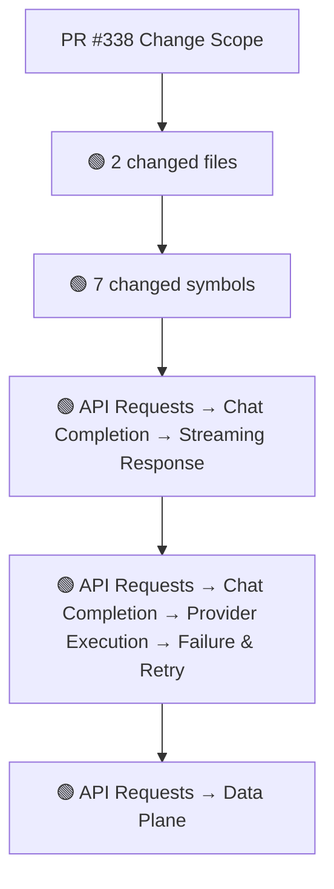
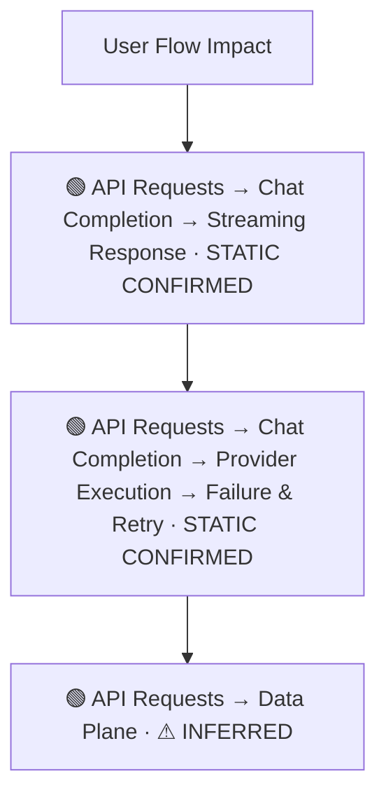
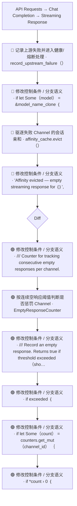
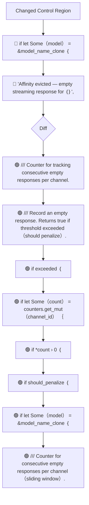
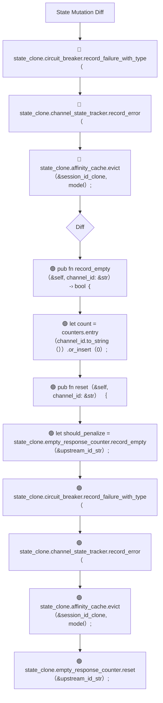
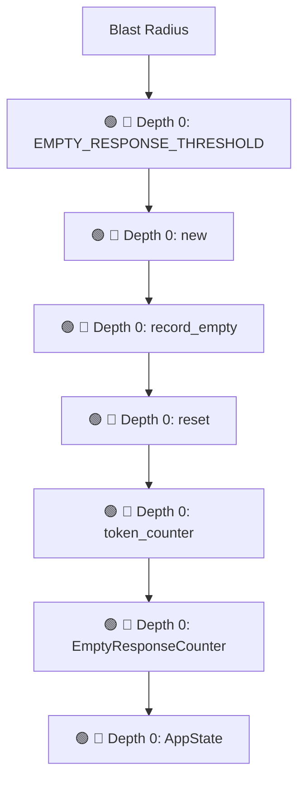

# Commit Change Atlas

## Executive Summary

| Field | Value |
|---|---|
| Commit | `3469d3e5650e7b9ce700ac1aa96a9a1641ad1d3f` |
| Base | `bff564470265cfeffb350f37daf22e2f96269f2f` |
| Merged PR | [#338](https://github.com/burncloud/burncloud/pull/338) |
| Merged At | `2026-06-08T01:54:33Z` |
| Intent | fix(router): use sliding window for empty response detection |
| Intent Truth | **AUTHOR-STATED** (PR title/body) |
| Risk | **HIGH (21)** |
| Changed Files | 2 |
| Changed Symbols | 7 |
| Changed Functions | 3 |
| Changed Routes | 0 |
| Changed Test Files | 0 |
| Affected User Flows | 3 |
| API Contract | No Change |
| Database | No Change |
| External | No Change |
| Tests | ✅ Covered |

**Source Diff:** [BASE `bff564470265` → TARGET `3469d3e5650e`](https://github.com/burncloud/burncloud/compare/bff564470265cfeffb350f37daf22e2f96269f2f...3469d3e5650e7b9ce700ac1aa96a9a1641ad1d3f)

## Intent

**Intent:** fix(router): use sliding window for empty response detection

**Truth:** **AUTHOR-STATED INTENT** — PR title/body; code facts below come from BASE→TARGET diff.

[Open merged PR #338](https://github.com/burncloud/burncloud/pull/338)

## 10-Dimension Dashboard

| Dimension | Status | Risk |
|---|---|---|
| 1. Change Scope | ● Changed | MEDIUM |
| 2. User Flow | ● Changed | MEDIUM |
| 3. Runtime | ● Changed | HIGH |
| 4. Control Flow | ● Changed | HIGH |
| 5. State | ● Changed | MEDIUM |
| 6. API Contract | ○ No Change | LOW |
| 7. Database | ○ No Change | LOW |
| 8. External | ○ No Change | LOW |
| 9. Blast Radius | ● Changed | MEDIUM |
| 10. Tests | ○ No Change | LOW |

---

## 1. Change Scope

### What changed?

Files **2** · Symbols **7** · Functions **3** · Routes **0** · Test files **0**

### Change Scope Map

### Changed Files

- 🟡 MODIFIED `crates/router/src/lib.rs`
- 🟡 MODIFIED `crates/router/src/state.rs`

### Changed Symbols

- 🟡 `const` `EMPTY_RESPONSE_THRESHOLD` — `crates/router/src/lib.rs:L33`
- 🟡 `function` `new` — `crates/router/src/lib.rs:L43`
- 🟡 `function` `record_empty` — `crates/router/src/lib.rs:L51`
- 🟡 `function` `reset` — `crates/router/src/lib.rs:L75`
- 🟡 `mod` `token_counter` — `crates/router/src/lib.rs:L23`
- 🟡 `struct` `EmptyResponseCounter` — `crates/router/src/lib.rs:L37`
- 🟡 `struct` `AppState` — `crates/router/src/state.rs:L33`

### Evidence

- **AFTER:** [`crates/router/src/lib.rs:L25-L89`](https://github.com/burncloud/burncloud/blob/3469d3e5650e7b9ce700ac1aa96a9a1641ad1d3f/crates/router/src/lib.rs#L25-L89)
- **AFTER:** [`crates/router/src/lib.rs:L880-L880`](https://github.com/burncloud/burncloud/blob/3469d3e5650e7b9ce700ac1aa96a9a1641ad1d3f/crates/router/src/lib.rs#L880-L880)
- **AFTER:** [`crates/router/src/lib.rs:L2546-L2546`](https://github.com/burncloud/burncloud/blob/3469d3e5650e7b9ce700ac1aa96a9a1641ad1d3f/crates/router/src/lib.rs#L2546-L2546)
- **BASE:** [`crates/router/src/lib.rs:L2480-L2480`](https://github.com/burncloud/burncloud/blob/bff564470265cfeffb350f37daf22e2f96269f2f/crates/router/src/lib.rs#L2480-L2480)
- **AFTER:** [`crates/router/src/lib.rs:L2584-L2593`](https://github.com/burncloud/burncloud/blob/3469d3e5650e7b9ce700ac1aa96a9a1641ad1d3f/crates/router/src/lib.rs#L2584-L2593)
- **BASE:** [`crates/router/src/lib.rs:L2518-L2541`](https://github.com/burncloud/burncloud/blob/bff564470265cfeffb350f37daf22e2f96269f2f/crates/router/src/lib.rs#L2518-L2541)
- **AFTER:** [`crates/router/src/lib.rs:L2595-L2597`](https://github.com/burncloud/burncloud/blob/3469d3e5650e7b9ce700ac1aa96a9a1641ad1d3f/crates/router/src/lib.rs#L2595-L2597)
- **BASE:** [`crates/router/src/lib.rs:L2543-L2544`](https://github.com/burncloud/burncloud/blob/bff564470265cfeffb350f37daf22e2f96269f2f/crates/router/src/lib.rs#L2543-L2544)

---

## 2. User Flow Impact

### Which user behaviors changed?

- **API Requests → Chat Completion → Streaming Response** — STATIC CONFIRMED
- **API Requests → Chat Completion → Provider Execution → Failure & Retry** — STATIC CONFIRMED
- **API Requests → Data Plane** — ⚠ INFERRED

### User Flow Impact Map

Only explicit runtime/UI entry evidence is STATIC CONFIRMED; path/module mappings remain `⚠ INFERRED` where applicable.

### Evidence

- **AFTER:** [`crates/router/src/lib.rs:L25-L89`](https://github.com/burncloud/burncloud/blob/3469d3e5650e7b9ce700ac1aa96a9a1641ad1d3f/crates/router/src/lib.rs#L25-L89)
- **AFTER:** [`crates/router/src/lib.rs:L880-L880`](https://github.com/burncloud/burncloud/blob/3469d3e5650e7b9ce700ac1aa96a9a1641ad1d3f/crates/router/src/lib.rs#L880-L880)
- **AFTER:** [`crates/router/src/lib.rs:L2546-L2546`](https://github.com/burncloud/burncloud/blob/3469d3e5650e7b9ce700ac1aa96a9a1641ad1d3f/crates/router/src/lib.rs#L2546-L2546)
- **BASE:** [`crates/router/src/lib.rs:L2480-L2480`](https://github.com/burncloud/burncloud/blob/bff564470265cfeffb350f37daf22e2f96269f2f/crates/router/src/lib.rs#L2480-L2480)
- **AFTER:** [`crates/router/src/lib.rs:L2584-L2593`](https://github.com/burncloud/burncloud/blob/3469d3e5650e7b9ce700ac1aa96a9a1641ad1d3f/crates/router/src/lib.rs#L2584-L2593)
- **BASE:** [`crates/router/src/lib.rs:L2518-L2541`](https://github.com/burncloud/burncloud/blob/bff564470265cfeffb350f37daf22e2f96269f2f/crates/router/src/lib.rs#L2518-L2541)
- **AFTER:** [`crates/router/src/lib.rs:L2595-L2597`](https://github.com/burncloud/burncloud/blob/3469d3e5650e7b9ce700ac1aa96a9a1641ad1d3f/crates/router/src/lib.rs#L2595-L2597)
- **BASE:** [`crates/router/src/lib.rs:L2543-L2544`](https://github.com/burncloud/burncloud/blob/bff564470265cfeffb350f37daf22e2f96269f2f/crates/router/src/lib.rs#L2543-L2544)

---

## 3. End-to-End Runtime Diff

### What changed at runtime?

Changed production runtime signals were detected.

### E2E Diff

### Decisions

Changed control statements are isolated in Dimension 4. Unproven edges are not invented.

### Evidence

- **AFTER:** [`crates/router/src/lib.rs:L25-L89`](https://github.com/burncloud/burncloud/blob/3469d3e5650e7b9ce700ac1aa96a9a1641ad1d3f/crates/router/src/lib.rs#L25-L89)
- **AFTER:** [`crates/router/src/lib.rs:L880-L880`](https://github.com/burncloud/burncloud/blob/3469d3e5650e7b9ce700ac1aa96a9a1641ad1d3f/crates/router/src/lib.rs#L880-L880)
- **AFTER:** [`crates/router/src/lib.rs:L2546-L2546`](https://github.com/burncloud/burncloud/blob/3469d3e5650e7b9ce700ac1aa96a9a1641ad1d3f/crates/router/src/lib.rs#L2546-L2546)
- **BASE:** [`crates/router/src/lib.rs:L2480-L2480`](https://github.com/burncloud/burncloud/blob/bff564470265cfeffb350f37daf22e2f96269f2f/crates/router/src/lib.rs#L2480-L2480)
- **AFTER:** [`crates/router/src/lib.rs:L2584-L2593`](https://github.com/burncloud/burncloud/blob/3469d3e5650e7b9ce700ac1aa96a9a1641ad1d3f/crates/router/src/lib.rs#L2584-L2593)
- **BASE:** [`crates/router/src/lib.rs:L2518-L2541`](https://github.com/burncloud/burncloud/blob/bff564470265cfeffb350f37daf22e2f96269f2f/crates/router/src/lib.rs#L2518-L2541)
- **AFTER:** [`crates/router/src/lib.rs:L2595-L2597`](https://github.com/burncloud/burncloud/blob/3469d3e5650e7b9ce700ac1aa96a9a1641ad1d3f/crates/router/src/lib.rs#L2595-L2597)
- **BASE:** [`crates/router/src/lib.rs:L2543-L2544`](https://github.com/burncloud/burncloud/blob/bff564470265cfeffb350f37daf22e2f96269f2f/crates/router/src/lib.rs#L2543-L2544)

---

## 4. ICFG Diff

### Which control-flow semantics changed?

⚠ Diagram contains changed control statements only; unproven interprocedural edges are not invented.

### Evidence

- **AFTER:** [`crates/router/src/lib.rs:L25-L89`](https://github.com/burncloud/burncloud/blob/3469d3e5650e7b9ce700ac1aa96a9a1641ad1d3f/crates/router/src/lib.rs#L25-L89)
- **AFTER:** [`crates/router/src/lib.rs:L2584-L2593`](https://github.com/burncloud/burncloud/blob/3469d3e5650e7b9ce700ac1aa96a9a1641ad1d3f/crates/router/src/lib.rs#L2584-L2593)
- **BASE:** [`crates/router/src/lib.rs:L2518-L2541`](https://github.com/burncloud/burncloud/blob/bff564470265cfeffb350f37daf22e2f96269f2f/crates/router/src/lib.rs#L2518-L2541)
- **AFTER:** [`crates/router/src/lib.rs:L2595-L2597`](https://github.com/burncloud/burncloud/blob/3469d3e5650e7b9ce700ac1aa96a9a1641ad1d3f/crates/router/src/lib.rs#L2595-L2597)
- **BASE:** [`crates/router/src/lib.rs:L2543-L2544`](https://github.com/burncloud/burncloud/blob/bff564470265cfeffb350f37daf22e2f96269f2f/crates/router/src/lib.rs#L2543-L2544)
- **AFTER:** [`crates/router/src/lib.rs:L2599-L2603`](https://github.com/burncloud/burncloud/blob/3469d3e5650e7b9ce700ac1aa96a9a1641ad1d3f/crates/router/src/lib.rs#L2599-L2603)
- **AFTER:** [`crates/router/src/state.rs:L77-L78`](https://github.com/burncloud/burncloud/blob/3469d3e5650e7b9ce700ac1aa96a9a1641ad1d3f/crates/router/src/state.rs#L77-L78)

---

## 5. State Mutation Diff

### What state behavior changed?

| Before | After |
|---|---|
| 🔴 state_clone.circuit_breaker.record_failure_with_type（ | 🟢 pub fn record_empty（&self, channel_id: &str） -› bool ｛ |
| 🔴 state_clone.channel_state_tracker.record_error（ | 🟢 let count = counters.entry（channel_id.to_string（））.or_insert（0）; |
| 🔴 state_clone.affinity_cache.evict（&session_id_clone, model）; | 🟢 pub fn reset（&self, channel_id: &str） ｛ |
| — | 🟢 let should_penalize = state_clone.empty_response_counter.record_empty（&upstream_id_str）; |
| — | 🟢 state_clone.circuit_breaker.record_failure_with_type（ |
| — | 🟢 state_clone.channel_state_tracker.record_error（ |
| — | 🟢 state_clone.affinity_cache.evict（&session_id_clone, model）; |
| — | 🟢 state_clone.empty_response_counter.reset（&upstream_id_str）; |

### State Diff

### Evidence

- **AFTER:** [`crates/router/src/lib.rs:L25-L89`](https://github.com/burncloud/burncloud/blob/3469d3e5650e7b9ce700ac1aa96a9a1641ad1d3f/crates/router/src/lib.rs#L25-L89)
- **AFTER:** [`crates/router/src/lib.rs:L2584-L2593`](https://github.com/burncloud/burncloud/blob/3469d3e5650e7b9ce700ac1aa96a9a1641ad1d3f/crates/router/src/lib.rs#L2584-L2593)
- **BASE:** [`crates/router/src/lib.rs:L2518-L2541`](https://github.com/burncloud/burncloud/blob/bff564470265cfeffb350f37daf22e2f96269f2f/crates/router/src/lib.rs#L2518-L2541)
- **AFTER:** [`crates/router/src/lib.rs:L2599-L2603`](https://github.com/burncloud/burncloud/blob/3469d3e5650e7b9ce700ac1aa96a9a1641ad1d3f/crates/router/src/lib.rs#L2599-L2603)
- **AFTER:** [`crates/router/src/lib.rs:L2605-L2607`](https://github.com/burncloud/burncloud/blob/3469d3e5650e7b9ce700ac1aa96a9a1641ad1d3f/crates/router/src/lib.rs#L2605-L2607)

---

## 6. API Contract Diff

### API changes

**⚪ NO API CONTRACT CHANGE DETECTED**

**API Contract: ⚪ NO CHANGE DETECTED** by complete diff scan.

### Evidence

- **COMPLETE DIFF SCAN:** No route/status/header/content-type API-contract marker changed.
- [Open complete BASE → TARGET diff](https://github.com/burncloud/burncloud/compare/bff564470265cfeffb350f37daf22e2f96269f2f...3469d3e5650e7b9ce700ac1aa96a9a1641ad1d3f)

---

## 7. Database / Persistence Diff

### Persistence changes

**⚪ NO DATABASE / PERSISTENCE CHANGE DETECTED**

**⚪ NO DATABASE / PERSISTENCE CHANGE DETECTED** by complete diff scan.

### Evidence

- **COMPLETE DIFF SCAN:** No migration/database/SQL persistence hunk changed.
- [Open complete BASE → TARGET diff](https://github.com/burncloud/burncloud/compare/bff564470265cfeffb350f37daf22e2f96269f2f...3469d3e5650e7b9ce700ac1aa96a9a1641ad1d3f)

---

## 8. External Dependency Diff

### External behavior changes

**⚪ NO EXTERNAL DEPENDENCY CHANGE DETECTED**

**⚪ NO EXTERNAL DEPENDENCY CHANGE DETECTED** by complete diff scan.

### Evidence

- **COMPLETE DIFF SCAN:** No outbound HTTP/provider/Redis/webhook/process marker changed.
- [Open complete BASE → TARGET diff](https://github.com/burncloud/burncloud/compare/bff564470265cfeffb350f37daf22e2f96269f2f...3469d3e5650e7b9ce700ac1aa96a9a1641ad1d3f)

---

## 9. Blast Radius

### What else may be affected?

| Depth | Impact | Evidence location |
|---|---|---|
| 🔴 Depth 0 | EMPTY_RESPONSE_THRESHOLD | `crates/router/src/lib.rs:L33` |
| 🔴 Depth 0 | new | `crates/router/src/lib.rs:L43` |
| 🔴 Depth 0 | record_empty | `crates/router/src/lib.rs:L51` |
| 🔴 Depth 0 | reset | `crates/router/src/lib.rs:L75` |
| 🔴 Depth 0 | token_counter | `crates/router/src/lib.rs:L23` |
| 🔴 Depth 0 | EmptyResponseCounter | `crates/router/src/lib.rs:L37` |
| 🔴 Depth 0 | AppState | `crates/router/src/state.rs:L33` |

### Blast Radius Map

🔴 Depth 0 is direct. 🟡 lexical references are **impact candidates**, not compiler-proven call edges. Dynamic dispatch is never promoted to a confirmed edge.

### Evidence

- **AFTER:** [`crates/router/src/lib.rs:L25-L89`](https://github.com/burncloud/burncloud/blob/3469d3e5650e7b9ce700ac1aa96a9a1641ad1d3f/crates/router/src/lib.rs#L25-L89)
- **AFTER:** [`crates/router/src/lib.rs:L880-L880`](https://github.com/burncloud/burncloud/blob/3469d3e5650e7b9ce700ac1aa96a9a1641ad1d3f/crates/router/src/lib.rs#L880-L880)
- **AFTER:** [`crates/router/src/lib.rs:L2546-L2546`](https://github.com/burncloud/burncloud/blob/3469d3e5650e7b9ce700ac1aa96a9a1641ad1d3f/crates/router/src/lib.rs#L2546-L2546)
- **BASE:** [`crates/router/src/lib.rs:L2480-L2480`](https://github.com/burncloud/burncloud/blob/bff564470265cfeffb350f37daf22e2f96269f2f/crates/router/src/lib.rs#L2480-L2480)
- **AFTER:** [`crates/router/src/lib.rs:L2584-L2593`](https://github.com/burncloud/burncloud/blob/3469d3e5650e7b9ce700ac1aa96a9a1641ad1d3f/crates/router/src/lib.rs#L2584-L2593)
- **BASE:** [`crates/router/src/lib.rs:L2518-L2541`](https://github.com/burncloud/burncloud/blob/bff564470265cfeffb350f37daf22e2f96269f2f/crates/router/src/lib.rs#L2518-L2541)
- **AFTER:** [`crates/router/src/lib.rs:L2595-L2597`](https://github.com/burncloud/burncloud/blob/3469d3e5650e7b9ce700ac1aa96a9a1641ad1d3f/crates/router/src/lib.rs#L2595-L2597)

---

## 10. Test Coverage & Evidence

### Coverage Matrix

**Overall:** ✅ Covered

- Changed test files: **0**
- Lexical references from changed symbols into tests: **3**

### Missing Coverage

- No additional missing direct-coverage claim beyond evidence above.

### Source Evidence

- **COMPLETE DIFF SCAN:** No changed test hunk; coverage status uses changed tests plus lexical test references.
- [Open complete BASE → TARGET diff](https://github.com/burncloud/burncloud/compare/bff564470265cfeffb350f37daf22e2f96269f2f...3469d3e5650e7b9ce700ac1aa96a9a1641ad1d3f)

---

## Risk Assessment

**Score: 21 → HIGH**

### Risk Drivers

- `Routing decision` **+4**
- `Provider request` **+4**
- `Streaming` **+4**
- `State mutation` **+3**
- `Cache behavior` **+3**
- `Missing direct changed tests` **+3**

The score is rule-based, not an LLM impression.

## Reviewer Checklist

- [ ] Intent 与代码变化一致
- [ ] User Flow impact 已确认
- [ ] Runtime Diff 已确认
- [ ] Control-flow changes 已确认
- [ ] State mutation 已确认
- [ ] API contract 已确认
- [ ] Database behavior 已确认
- [ ] External Provider behavior 已确认
- [ ] Blast Radius 可接受
- [ ] Tests 覆盖 changed runtime paths
- [ ] Dynamic / Inferred relationships 已正确标记
- [ ] Source Evidence 可追溯

## Source Diff Entry Points

- [Complete BASE → TARGET diff](https://github.com/burncloud/burncloud/compare/bff564470265cfeffb350f37daf22e2f96269f2f...3469d3e5650e7b9ce700ac1aa96a9a1641ad1d3f)
- [Merged PR #338](https://github.com/burncloud/burncloud/pull/338)
