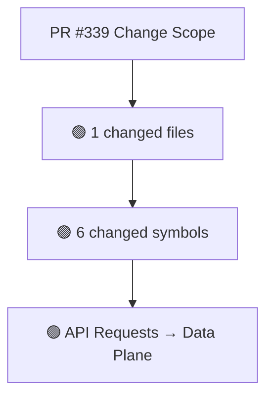
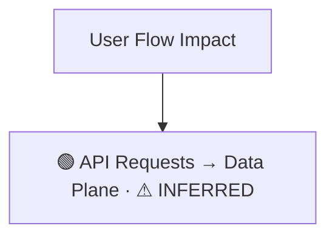
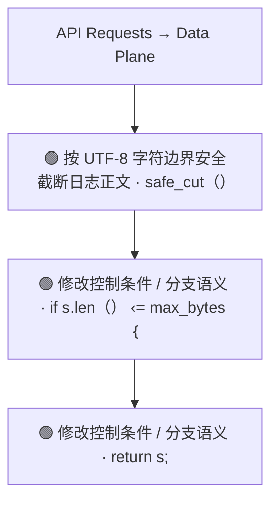
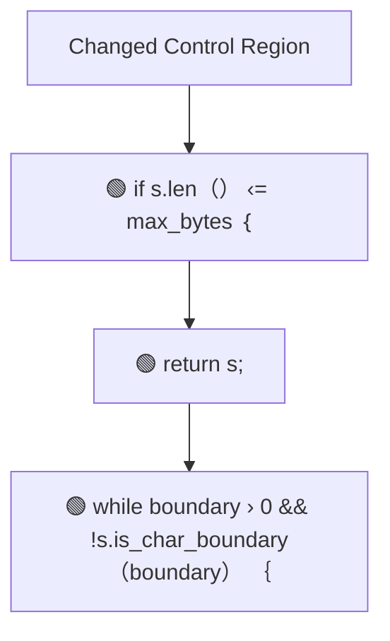
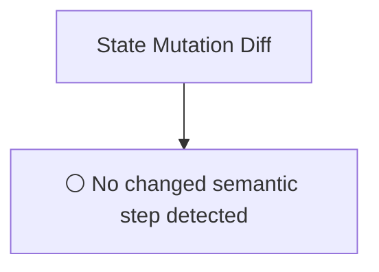
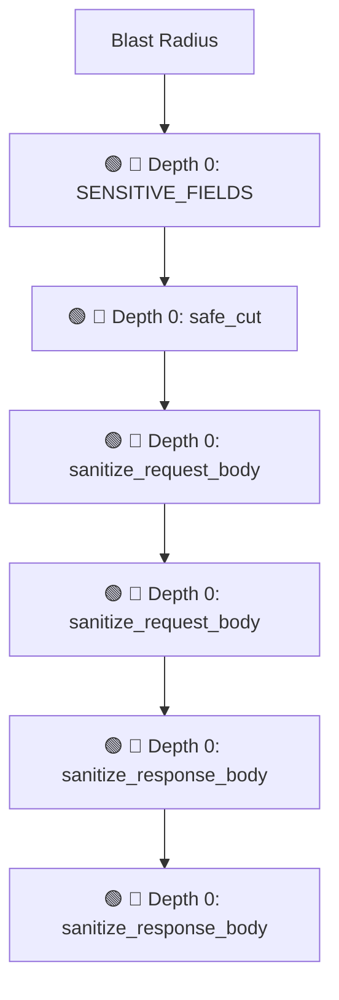

# Commit Change Atlas

## Executive Summary

| Field | Value |
|---|---|
| Commit | `bff564470265cfeffb350f37daf22e2f96269f2f` |
| Base | `cdb848f6b0c9199bdd2df8879b4a5e0dd0734357` |
| Merged PR | [#339](https://github.com/burncloud/burncloud/pull/339) |
| Merged At | `2026-06-08T00:28:54Z` |
| Intent | fix(router): Prevent panic when logging bodies with multi-byte UTF-8 characters |
| Intent Truth | **AUTHOR-STATED** (PR title/body) |
| Risk | **LOW (3)** |
| Changed Files | 1 |
| Changed Symbols | 6 |
| Changed Functions | 5 |
| Changed Routes | 0 |
| Changed Test Files | 0 |
| Affected User Flows | 1 |
| API Contract | No Change |
| Database | No Change |
| External | No Change |
| Tests | ❌ Missing |

**Source Diff:** [BASE `cdb848f6b0c9` → TARGET `bff564470265`](https://github.com/burncloud/burncloud/compare/cdb848f6b0c9199bdd2df8879b4a5e0dd0734357...bff564470265cfeffb350f37daf22e2f96269f2f)

## Intent

**Intent:** fix(router): Prevent panic when logging bodies with multi-byte UTF-8 characters

**Truth:** **AUTHOR-STATED INTENT** — PR title/body; code facts below come from BASE→TARGET diff.

[Open merged PR #339](https://github.com/burncloud/burncloud/pull/339)

## 10-Dimension Dashboard

| Dimension | Status | Risk |
|---|---|---|
| 1. Change Scope | ● Changed | LOW |
| 2. User Flow | ● Changed | LOW |
| 3. Runtime | ● Changed | LOW |
| 4. Control Flow | ● Changed | LOW |
| 5. State | ○ No Change | LOW |
| 6. API Contract | ○ No Change | LOW |
| 7. Database | ○ No Change | LOW |
| 8. External | ○ No Change | LOW |
| 9. Blast Radius | ● Changed | LOW |
| 10. Tests | ● Changed | LOW |

---

## 1. Change Scope

### What changed?

Files **1** · Symbols **6** · Functions **5** · Routes **0** · Test files **0**

### Change Scope Map

### Changed Files

- 🟡 MODIFIED `crates/router/src/lib.rs`

### Changed Symbols

- 🟡 `const` `SENSITIVE_FIELDS` — `crates/router/src/lib.rs:L341`
- 🟡 `function` `safe_cut` — `crates/router/src/lib.rs:L353`
- 🟡 `function` `sanitize_request_body` — `crates/router/src/lib.rs:L354`
- 🟡 `function` `sanitize_request_body` — `crates/router/src/lib.rs:L369`
- 🟡 `function` `sanitize_response_body` — `crates/router/src/lib.rs:L438`
- 🟡 `function` `sanitize_response_body` — `crates/router/src/lib.rs:L453`

### Evidence

- **AFTER:** [`crates/router/src/lib.rs:L351-L365`](https://github.com/burncloud/burncloud/blob/bff564470265cfeffb350f37daf22e2f96269f2f/crates/router/src/lib.rs#L351-L365)
- **AFTER:** [`crates/router/src/lib.rs:L388-L388`](https://github.com/burncloud/burncloud/blob/bff564470265cfeffb350f37daf22e2f96269f2f/crates/router/src/lib.rs#L388-L388)
- **BASE:** [`crates/router/src/lib.rs:L373-L373`](https://github.com/burncloud/burncloud/blob/cdb848f6b0c9199bdd2df8879b4a5e0dd0734357/crates/router/src/lib.rs#L373-L373)
- **AFTER:** [`crates/router/src/lib.rs:L398-L398`](https://github.com/burncloud/burncloud/blob/bff564470265cfeffb350f37daf22e2f96269f2f/crates/router/src/lib.rs#L398-L398)
- **BASE:** [`crates/router/src/lib.rs:L383-L383`](https://github.com/burncloud/burncloud/blob/cdb848f6b0c9199bdd2df8879b4a5e0dd0734357/crates/router/src/lib.rs#L383-L383)
- **AFTER:** [`crates/router/src/lib.rs:L466-L466`](https://github.com/burncloud/burncloud/blob/bff564470265cfeffb350f37daf22e2f96269f2f/crates/router/src/lib.rs#L466-L466)
- **BASE:** [`crates/router/src/lib.rs:L451-L451`](https://github.com/burncloud/burncloud/blob/cdb848f6b0c9199bdd2df8879b4a5e0dd0734357/crates/router/src/lib.rs#L451-L451)
- **AFTER:** [`crates/router/src/lib.rs:L474-L474`](https://github.com/burncloud/burncloud/blob/bff564470265cfeffb350f37daf22e2f96269f2f/crates/router/src/lib.rs#L474-L474)

---

## 2. User Flow Impact

### Which user behaviors changed?

- **API Requests → Data Plane** — ⚠ INFERRED

### User Flow Impact Map

Only explicit runtime/UI entry evidence is STATIC CONFIRMED; path/module mappings remain `⚠ INFERRED` where applicable.

### Evidence

- **AFTER:** [`crates/router/src/lib.rs:L351-L365`](https://github.com/burncloud/burncloud/blob/bff564470265cfeffb350f37daf22e2f96269f2f/crates/router/src/lib.rs#L351-L365)
- **AFTER:** [`crates/router/src/lib.rs:L388-L388`](https://github.com/burncloud/burncloud/blob/bff564470265cfeffb350f37daf22e2f96269f2f/crates/router/src/lib.rs#L388-L388)
- **BASE:** [`crates/router/src/lib.rs:L373-L373`](https://github.com/burncloud/burncloud/blob/cdb848f6b0c9199bdd2df8879b4a5e0dd0734357/crates/router/src/lib.rs#L373-L373)
- **AFTER:** [`crates/router/src/lib.rs:L398-L398`](https://github.com/burncloud/burncloud/blob/bff564470265cfeffb350f37daf22e2f96269f2f/crates/router/src/lib.rs#L398-L398)
- **BASE:** [`crates/router/src/lib.rs:L383-L383`](https://github.com/burncloud/burncloud/blob/cdb848f6b0c9199bdd2df8879b4a5e0dd0734357/crates/router/src/lib.rs#L383-L383)
- **AFTER:** [`crates/router/src/lib.rs:L466-L466`](https://github.com/burncloud/burncloud/blob/bff564470265cfeffb350f37daf22e2f96269f2f/crates/router/src/lib.rs#L466-L466)
- **BASE:** [`crates/router/src/lib.rs:L451-L451`](https://github.com/burncloud/burncloud/blob/cdb848f6b0c9199bdd2df8879b4a5e0dd0734357/crates/router/src/lib.rs#L451-L451)
- **AFTER:** [`crates/router/src/lib.rs:L474-L474`](https://github.com/burncloud/burncloud/blob/bff564470265cfeffb350f37daf22e2f96269f2f/crates/router/src/lib.rs#L474-L474)

---

## 3. End-to-End Runtime Diff

### What changed at runtime?

Changed production runtime signals were detected.

### E2E Diff

### Decisions

Changed control statements are isolated in Dimension 4. Unproven edges are not invented.

### Evidence

- **AFTER:** [`crates/router/src/lib.rs:L351-L365`](https://github.com/burncloud/burncloud/blob/bff564470265cfeffb350f37daf22e2f96269f2f/crates/router/src/lib.rs#L351-L365)
- **AFTER:** [`crates/router/src/lib.rs:L388-L388`](https://github.com/burncloud/burncloud/blob/bff564470265cfeffb350f37daf22e2f96269f2f/crates/router/src/lib.rs#L388-L388)
- **BASE:** [`crates/router/src/lib.rs:L373-L373`](https://github.com/burncloud/burncloud/blob/cdb848f6b0c9199bdd2df8879b4a5e0dd0734357/crates/router/src/lib.rs#L373-L373)
- **AFTER:** [`crates/router/src/lib.rs:L398-L398`](https://github.com/burncloud/burncloud/blob/bff564470265cfeffb350f37daf22e2f96269f2f/crates/router/src/lib.rs#L398-L398)
- **BASE:** [`crates/router/src/lib.rs:L383-L383`](https://github.com/burncloud/burncloud/blob/cdb848f6b0c9199bdd2df8879b4a5e0dd0734357/crates/router/src/lib.rs#L383-L383)
- **AFTER:** [`crates/router/src/lib.rs:L466-L466`](https://github.com/burncloud/burncloud/blob/bff564470265cfeffb350f37daf22e2f96269f2f/crates/router/src/lib.rs#L466-L466)
- **BASE:** [`crates/router/src/lib.rs:L451-L451`](https://github.com/burncloud/burncloud/blob/cdb848f6b0c9199bdd2df8879b4a5e0dd0734357/crates/router/src/lib.rs#L451-L451)
- **AFTER:** [`crates/router/src/lib.rs:L474-L474`](https://github.com/burncloud/burncloud/blob/bff564470265cfeffb350f37daf22e2f96269f2f/crates/router/src/lib.rs#L474-L474)

---

## 4. ICFG Diff

### Which control-flow semantics changed?

⚠ Diagram contains changed control statements only; unproven interprocedural edges are not invented.

### Evidence

- **AFTER:** [`crates/router/src/lib.rs:L351-L365`](https://github.com/burncloud/burncloud/blob/bff564470265cfeffb350f37daf22e2f96269f2f/crates/router/src/lib.rs#L351-L365)

---

## 5. State Mutation Diff

### What state behavior changed?

**⚪ NO STATE MUTATION CHANGE DETECTED**

### State Diff

### Evidence

- **COMPLETE DIFF SCAN:** No changed DB/cache/counter/update state signal detected.
- [Open complete BASE → TARGET diff](https://github.com/burncloud/burncloud/compare/cdb848f6b0c9199bdd2df8879b4a5e0dd0734357...bff564470265cfeffb350f37daf22e2f96269f2f)

---

## 6. API Contract Diff

### API changes

**⚪ NO API CONTRACT CHANGE DETECTED**

**API Contract: ⚪ NO CHANGE DETECTED** by complete diff scan.

### Evidence

- **COMPLETE DIFF SCAN:** No route/status/header/content-type API-contract marker changed.
- [Open complete BASE → TARGET diff](https://github.com/burncloud/burncloud/compare/cdb848f6b0c9199bdd2df8879b4a5e0dd0734357...bff564470265cfeffb350f37daf22e2f96269f2f)

---

## 7. Database / Persistence Diff

### Persistence changes

**⚪ NO DATABASE / PERSISTENCE CHANGE DETECTED**

**⚪ NO DATABASE / PERSISTENCE CHANGE DETECTED** by complete diff scan.

### Evidence

- **COMPLETE DIFF SCAN:** No migration/database/SQL persistence hunk changed.
- [Open complete BASE → TARGET diff](https://github.com/burncloud/burncloud/compare/cdb848f6b0c9199bdd2df8879b4a5e0dd0734357...bff564470265cfeffb350f37daf22e2f96269f2f)

---

## 8. External Dependency Diff

### External behavior changes

**⚪ NO EXTERNAL DEPENDENCY CHANGE DETECTED**

**⚪ NO EXTERNAL DEPENDENCY CHANGE DETECTED** by complete diff scan.

### Evidence

- **COMPLETE DIFF SCAN:** No outbound HTTP/provider/Redis/webhook/process marker changed.
- [Open complete BASE → TARGET diff](https://github.com/burncloud/burncloud/compare/cdb848f6b0c9199bdd2df8879b4a5e0dd0734357...bff564470265cfeffb350f37daf22e2f96269f2f)

---

## 9. Blast Radius

### What else may be affected?

| Depth | Impact | Evidence location |
|---|---|---|
| 🔴 Depth 0 | SENSITIVE_FIELDS | `crates/router/src/lib.rs:L341` |
| 🔴 Depth 0 | safe_cut | `crates/router/src/lib.rs:L353` |
| 🔴 Depth 0 | sanitize_request_body | `crates/router/src/lib.rs:L354` |
| 🔴 Depth 0 | sanitize_request_body | `crates/router/src/lib.rs:L369` |
| 🔴 Depth 0 | sanitize_response_body | `crates/router/src/lib.rs:L438` |
| 🔴 Depth 0 | sanitize_response_body | `crates/router/src/lib.rs:L453` |

### Blast Radius Map

🔴 Depth 0 is direct. 🟡 lexical references are **impact candidates**, not compiler-proven call edges. Dynamic dispatch is never promoted to a confirmed edge.

### Evidence

- **AFTER:** [`crates/router/src/lib.rs:L351-L365`](https://github.com/burncloud/burncloud/blob/bff564470265cfeffb350f37daf22e2f96269f2f/crates/router/src/lib.rs#L351-L365)
- **AFTER:** [`crates/router/src/lib.rs:L388-L388`](https://github.com/burncloud/burncloud/blob/bff564470265cfeffb350f37daf22e2f96269f2f/crates/router/src/lib.rs#L388-L388)
- **BASE:** [`crates/router/src/lib.rs:L373-L373`](https://github.com/burncloud/burncloud/blob/cdb848f6b0c9199bdd2df8879b4a5e0dd0734357/crates/router/src/lib.rs#L373-L373)
- **AFTER:** [`crates/router/src/lib.rs:L398-L398`](https://github.com/burncloud/burncloud/blob/bff564470265cfeffb350f37daf22e2f96269f2f/crates/router/src/lib.rs#L398-L398)
- **BASE:** [`crates/router/src/lib.rs:L383-L383`](https://github.com/burncloud/burncloud/blob/cdb848f6b0c9199bdd2df8879b4a5e0dd0734357/crates/router/src/lib.rs#L383-L383)
- **AFTER:** [`crates/router/src/lib.rs:L466-L466`](https://github.com/burncloud/burncloud/blob/bff564470265cfeffb350f37daf22e2f96269f2f/crates/router/src/lib.rs#L466-L466)
- **BASE:** [`crates/router/src/lib.rs:L451-L451`](https://github.com/burncloud/burncloud/blob/cdb848f6b0c9199bdd2df8879b4a5e0dd0734357/crates/router/src/lib.rs#L451-L451)

---

## 10. Test Coverage & Evidence

### Coverage Matrix

**Overall:** ❌ Missing

- Changed test files: **0**
- Lexical references from changed symbols into tests: **0**

### Missing Coverage

- ❌ Direct changed-test coverage was not detected for changed production symbols.

### Source Evidence

- **COMPLETE DIFF SCAN:** No changed test hunk; coverage status uses changed tests plus lexical test references.
- [Open complete BASE → TARGET diff](https://github.com/burncloud/burncloud/compare/cdb848f6b0c9199bdd2df8879b4a5e0dd0734357...bff564470265cfeffb350f37daf22e2f96269f2f)

---

## Risk Assessment

**Score: 3 → LOW**

### Risk Drivers

- `Missing direct changed tests` **+3**

The score is rule-based, not an LLM impression.

## Reviewer Checklist

- [ ] Intent 与代码变化一致
- [ ] User Flow impact 已确认
- [ ] Runtime Diff 已确认
- [ ] Control-flow changes 已确认
- [ ] State mutation 已确认
- [ ] API contract 已确认
- [ ] Database behavior 已确认
- [ ] External Provider behavior 已确认
- [ ] Blast Radius 可接受
- [ ] Tests 覆盖 changed runtime paths
- [ ] Dynamic / Inferred relationships 已正确标记
- [ ] Source Evidence 可追溯

## Source Diff Entry Points

- [Complete BASE → TARGET diff](https://github.com/burncloud/burncloud/compare/cdb848f6b0c9199bdd2df8879b4a5e0dd0734357...bff564470265cfeffb350f37daf22e2f96269f2f)
- [Merged PR #339](https://github.com/burncloud/burncloud/pull/339)
