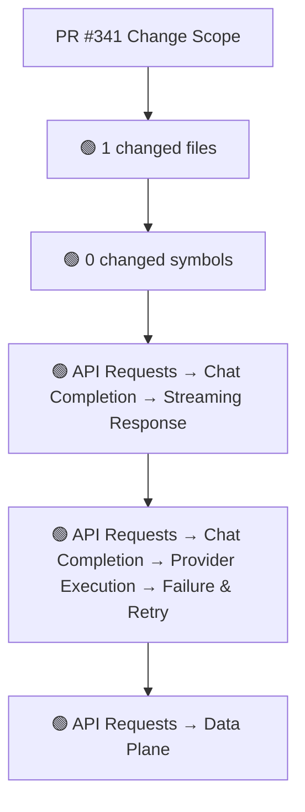
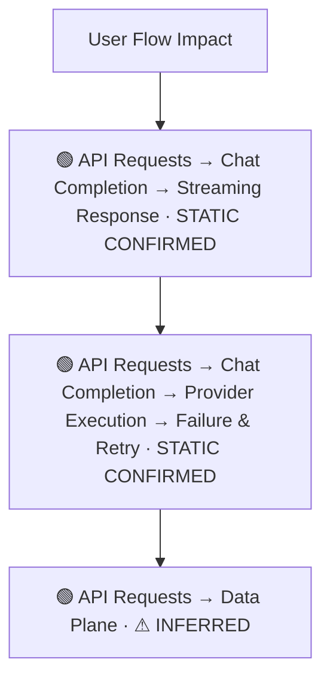
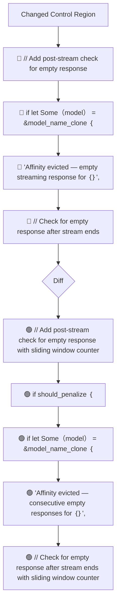
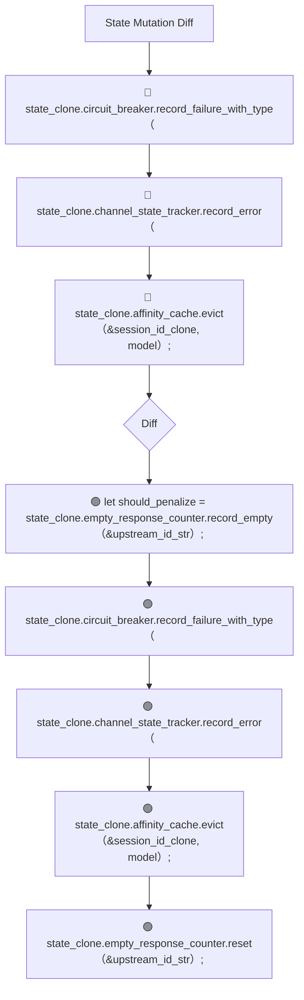
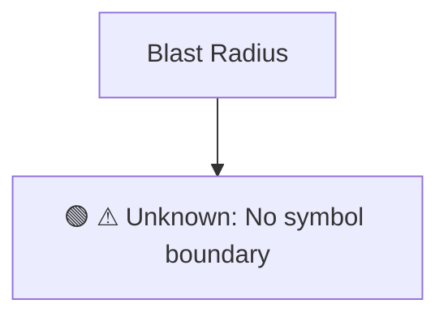

# Commit Change Atlas

## Executive Summary

| Field | Value |
|---|---|
| Commit | `53b3d290e68ec4cf2573753f8a8f2605cf11f87d` |
| Base | `1e23f1493342676226aece129710ca8c0fd30ea5` |
| Merged PR | [#341](https://github.com/burncloud/burncloud/pull/341) |
| Merged At | `2026-06-08T05:48:02Z` |
| Intent | Fix: Consistent Empty Response Penalty with Threshold Check |
| Intent Truth | **AUTHOR-STATED** (PR title/body) |
| Risk | **HIGH (21)** |
| Changed Files | 1 |
| Changed Symbols | 0 |
| Changed Functions | 0 |
| Changed Routes | 0 |
| Changed Test Files | 0 |
| Affected User Flows | 3 |
| API Contract | No Change |
| Database | No Change |
| External | No Change |
| Tests | ❌ Missing |

**Source Diff:** [BASE `1e23f1493342` → TARGET `53b3d290e68e`](https://github.com/burncloud/burncloud/compare/1e23f1493342676226aece129710ca8c0fd30ea5...53b3d290e68ec4cf2573753f8a8f2605cf11f87d)

## Intent

**Intent:** Fix: Consistent Empty Response Penalty with Threshold Check

**Truth:** **AUTHOR-STATED INTENT** — PR title/body; code facts below come from BASE→TARGET diff.

[Open merged PR #341](https://github.com/burncloud/burncloud/pull/341)

## 10-Dimension Dashboard

| Dimension | Status | Risk |
|---|---|---|
| 1. Change Scope | ● Changed | MEDIUM |
| 2. User Flow | ● Changed | MEDIUM |
| 3. Runtime | ● Changed | HIGH |
| 4. Control Flow | ● Changed | HIGH |
| 5. State | ● Changed | MEDIUM |
| 6. API Contract | ○ No Change | LOW |
| 7. Database | ○ No Change | LOW |
| 8. External | ○ No Change | LOW |
| 9. Blast Radius | ● Changed | MEDIUM |
| 10. Tests | ● Changed | HIGH |

---

## 1. Change Scope

### What changed?

Files **1** · Symbols **0** · Functions **0** · Routes **0** · Test files **0**

### Change Scope Map

### Changed Files

- 🟡 MODIFIED `crates/router/src/lib.rs`

### Changed Symbols

- No safe Rust symbol boundary resolved; no symbol is guessed.

### Evidence

- **AFTER:** [`crates/router/src/lib.rs:L3203-L3203`](https://github.com/burncloud/burncloud/blob/53b3d290e68ec4cf2573753f8a8f2605cf11f87d/crates/router/src/lib.rs#L3203-L3203)
- **BASE:** [`crates/router/src/lib.rs:L3203-L3203`](https://github.com/burncloud/burncloud/blob/1e23f1493342676226aece129710ca8c0fd30ea5/crates/router/src/lib.rs#L3203-L3203)
- **AFTER:** [`crates/router/src/lib.rs:L3206-L3226`](https://github.com/burncloud/burncloud/blob/53b3d290e68ec4cf2573753f8a8f2605cf11f87d/crates/router/src/lib.rs#L3206-L3226)
- **BASE:** [`crates/router/src/lib.rs:L3206-L3221`](https://github.com/burncloud/burncloud/blob/1e23f1493342676226aece129710ca8c0fd30ea5/crates/router/src/lib.rs#L3206-L3221)
- **AFTER:** [`crates/router/src/lib.rs:L3228-L3238`](https://github.com/burncloud/burncloud/blob/53b3d290e68ec4cf2573753f8a8f2605cf11f87d/crates/router/src/lib.rs#L3228-L3238)
- **BASE:** [`crates/router/src/lib.rs:L3223-L3224`](https://github.com/burncloud/burncloud/blob/1e23f1493342676226aece129710ca8c0fd30ea5/crates/router/src/lib.rs#L3223-L3224)
- **AFTER:** [`crates/router/src/lib.rs:L3240-L3241`](https://github.com/burncloud/burncloud/blob/53b3d290e68ec4cf2573753f8a8f2605cf11f87d/crates/router/src/lib.rs#L3240-L3241)
- **BASE:** [`crates/router/src/lib.rs:L3226-L3230`](https://github.com/burncloud/burncloud/blob/1e23f1493342676226aece129710ca8c0fd30ea5/crates/router/src/lib.rs#L3226-L3230)

---

## 2. User Flow Impact

### Which user behaviors changed?

- **API Requests → Chat Completion → Streaming Response** — STATIC CONFIRMED
- **API Requests → Chat Completion → Provider Execution → Failure & Retry** — STATIC CONFIRMED
- **API Requests → Data Plane** — ⚠ INFERRED

### User Flow Impact Map

Only explicit runtime/UI entry evidence is STATIC CONFIRMED; path/module mappings remain `⚠ INFERRED` where applicable.

### Evidence

- **AFTER:** [`crates/router/src/lib.rs:L3203-L3203`](https://github.com/burncloud/burncloud/blob/53b3d290e68ec4cf2573753f8a8f2605cf11f87d/crates/router/src/lib.rs#L3203-L3203)
- **BASE:** [`crates/router/src/lib.rs:L3203-L3203`](https://github.com/burncloud/burncloud/blob/1e23f1493342676226aece129710ca8c0fd30ea5/crates/router/src/lib.rs#L3203-L3203)
- **AFTER:** [`crates/router/src/lib.rs:L3206-L3226`](https://github.com/burncloud/burncloud/blob/53b3d290e68ec4cf2573753f8a8f2605cf11f87d/crates/router/src/lib.rs#L3206-L3226)
- **BASE:** [`crates/router/src/lib.rs:L3206-L3221`](https://github.com/burncloud/burncloud/blob/1e23f1493342676226aece129710ca8c0fd30ea5/crates/router/src/lib.rs#L3206-L3221)
- **AFTER:** [`crates/router/src/lib.rs:L3228-L3238`](https://github.com/burncloud/burncloud/blob/53b3d290e68ec4cf2573753f8a8f2605cf11f87d/crates/router/src/lib.rs#L3228-L3238)
- **BASE:** [`crates/router/src/lib.rs:L3223-L3224`](https://github.com/burncloud/burncloud/blob/1e23f1493342676226aece129710ca8c0fd30ea5/crates/router/src/lib.rs#L3223-L3224)
- **AFTER:** [`crates/router/src/lib.rs:L3240-L3241`](https://github.com/burncloud/burncloud/blob/53b3d290e68ec4cf2573753f8a8f2605cf11f87d/crates/router/src/lib.rs#L3240-L3241)
- **BASE:** [`crates/router/src/lib.rs:L3226-L3230`](https://github.com/burncloud/burncloud/blob/1e23f1493342676226aece129710ca8c0fd30ea5/crates/router/src/lib.rs#L3226-L3230)

---

## 3. End-to-End Runtime Diff

### What changed at runtime?

Changed production runtime signals were detected.

### E2E Diff

```mermaid
flowchart TD
  S["API Requests → Chat Completion → Streaming Response"]
  R1["🔴 修改控制条件 / 分支语义 · // Add post-stream check for empty response"]
  S --> R1
  R2["🔴 记录上游失败并进入健康/熔断处理 · record_upstream_failure（）"]
  R1 --> R2
  R3["🔴 修改控制条件 / 分支语义 · if let Some（model） = &amp;model_name_clone ｛"]
  R2 --> R3
  R4["🔴 驱逐失败 Channel 的会话亲和 · affinity_cache.evict（）"]
  R3 --> R4
  R5["🔴 修改控制条件 / 分支语义 · 'Affinity evicted — empty streaming response for ｛｝',"]
  R4 --> R5
  R6["🔴 修改控制条件 / 分支语义 · // Check for empty response after stream ends"]
  R5 --> R6
  R6 --> D{"Diff"}
  A7["🟢 修改控制条件 / 分支语义 · // Add post-stream check for empty response with sliding window count…"]
  D --> A7
  A8["🟢 按连续空响应阈值判断是否惩罚 Channel · EmptyResponseCounter"]
  A7 --> A8
  A9["🟢 修改控制条件 / 分支语义 · if should_penalize ｛"]
  A8 --> A9
  A10["🟢 记录上游失败并进入健康/熔断处理 · record_upstream_failure（）"]
  A9 --> A10
  A11["🟢 修改控制条件 / 分支语义 · if let Some（model） = &amp;model_name_clone ｛"]
  A10 --> A11
  A12["🟢 驱逐失败 Channel 的会话亲和 · affinity_cache.evict（）"]
  A11 --> A12
  A13["🟢 修改控制条件 / 分支语义 · 'Affinity evicted — consecutive empty responses for ｛｝',"]
  A12 --> A13
  A14["🟢 修改控制条件 / 分支语义 · // Check for empty response after stream ends with sliding window cou…"]
  A13 --> A14
```

### Decisions

Changed control statements are isolated in Dimension 4. Unproven edges are not invented.

### Evidence

- **AFTER:** [`crates/router/src/lib.rs:L3203-L3203`](https://github.com/burncloud/burncloud/blob/53b3d290e68ec4cf2573753f8a8f2605cf11f87d/crates/router/src/lib.rs#L3203-L3203)
- **BASE:** [`crates/router/src/lib.rs:L3203-L3203`](https://github.com/burncloud/burncloud/blob/1e23f1493342676226aece129710ca8c0fd30ea5/crates/router/src/lib.rs#L3203-L3203)
- **AFTER:** [`crates/router/src/lib.rs:L3206-L3226`](https://github.com/burncloud/burncloud/blob/53b3d290e68ec4cf2573753f8a8f2605cf11f87d/crates/router/src/lib.rs#L3206-L3226)
- **BASE:** [`crates/router/src/lib.rs:L3206-L3221`](https://github.com/burncloud/burncloud/blob/1e23f1493342676226aece129710ca8c0fd30ea5/crates/router/src/lib.rs#L3206-L3221)
- **AFTER:** [`crates/router/src/lib.rs:L3228-L3238`](https://github.com/burncloud/burncloud/blob/53b3d290e68ec4cf2573753f8a8f2605cf11f87d/crates/router/src/lib.rs#L3228-L3238)
- **BASE:** [`crates/router/src/lib.rs:L3223-L3224`](https://github.com/burncloud/burncloud/blob/1e23f1493342676226aece129710ca8c0fd30ea5/crates/router/src/lib.rs#L3223-L3224)
- **AFTER:** [`crates/router/src/lib.rs:L3240-L3241`](https://github.com/burncloud/burncloud/blob/53b3d290e68ec4cf2573753f8a8f2605cf11f87d/crates/router/src/lib.rs#L3240-L3241)
- **BASE:** [`crates/router/src/lib.rs:L3226-L3230`](https://github.com/burncloud/burncloud/blob/1e23f1493342676226aece129710ca8c0fd30ea5/crates/router/src/lib.rs#L3226-L3230)

---

## 4. ICFG Diff

### Which control-flow semantics changed?

⚠ Diagram contains changed control statements only; unproven interprocedural edges are not invented.

### Evidence

- **AFTER:** [`crates/router/src/lib.rs:L3203-L3203`](https://github.com/burncloud/burncloud/blob/53b3d290e68ec4cf2573753f8a8f2605cf11f87d/crates/router/src/lib.rs#L3203-L3203)
- **BASE:** [`crates/router/src/lib.rs:L3203-L3203`](https://github.com/burncloud/burncloud/blob/1e23f1493342676226aece129710ca8c0fd30ea5/crates/router/src/lib.rs#L3203-L3203)
- **AFTER:** [`crates/router/src/lib.rs:L3206-L3226`](https://github.com/burncloud/burncloud/blob/53b3d290e68ec4cf2573753f8a8f2605cf11f87d/crates/router/src/lib.rs#L3206-L3226)
- **BASE:** [`crates/router/src/lib.rs:L3206-L3221`](https://github.com/burncloud/burncloud/blob/1e23f1493342676226aece129710ca8c0fd30ea5/crates/router/src/lib.rs#L3206-L3221)
- **AFTER:** [`crates/router/src/lib.rs:L3228-L3238`](https://github.com/burncloud/burncloud/blob/53b3d290e68ec4cf2573753f8a8f2605cf11f87d/crates/router/src/lib.rs#L3228-L3238)
- **BASE:** [`crates/router/src/lib.rs:L3223-L3224`](https://github.com/burncloud/burncloud/blob/1e23f1493342676226aece129710ca8c0fd30ea5/crates/router/src/lib.rs#L3223-L3224)
- **AFTER:** [`crates/router/src/lib.rs:L3240-L3241`](https://github.com/burncloud/burncloud/blob/53b3d290e68ec4cf2573753f8a8f2605cf11f87d/crates/router/src/lib.rs#L3240-L3241)
- **BASE:** [`crates/router/src/lib.rs:L3226-L3230`](https://github.com/burncloud/burncloud/blob/1e23f1493342676226aece129710ca8c0fd30ea5/crates/router/src/lib.rs#L3226-L3230)

---

## 5. State Mutation Diff

### What state behavior changed?

| Before | After |
|---|---|
| 🔴 state_clone.circuit_breaker.record_failure_with_type（ | 🟢 let should_penalize = state_clone.empty_response_counter.record_empty（&upstream_id_str）; |
| 🔴 state_clone.channel_state_tracker.record_error（ | 🟢 state_clone.circuit_breaker.record_failure_with_type（ |
| 🔴 state_clone.affinity_cache.evict（&session_id_clone, model）; | 🟢 state_clone.channel_state_tracker.record_error（ |
| — | 🟢 state_clone.affinity_cache.evict（&session_id_clone, model）; |
| — | 🟢 state_clone.empty_response_counter.reset（&upstream_id_str）; |

### State Diff

### Evidence

- **AFTER:** [`crates/router/src/lib.rs:L3206-L3226`](https://github.com/burncloud/burncloud/blob/53b3d290e68ec4cf2573753f8a8f2605cf11f87d/crates/router/src/lib.rs#L3206-L3226)
- **BASE:** [`crates/router/src/lib.rs:L3206-L3221`](https://github.com/burncloud/burncloud/blob/1e23f1493342676226aece129710ca8c0fd30ea5/crates/router/src/lib.rs#L3206-L3221)
- **AFTER:** [`crates/router/src/lib.rs:L3228-L3238`](https://github.com/burncloud/burncloud/blob/53b3d290e68ec4cf2573753f8a8f2605cf11f87d/crates/router/src/lib.rs#L3228-L3238)
- **BASE:** [`crates/router/src/lib.rs:L3223-L3224`](https://github.com/burncloud/burncloud/blob/1e23f1493342676226aece129710ca8c0fd30ea5/crates/router/src/lib.rs#L3223-L3224)
- **AFTER:** [`crates/router/src/lib.rs:L3244-L3246`](https://github.com/burncloud/burncloud/blob/53b3d290e68ec4cf2573753f8a8f2605cf11f87d/crates/router/src/lib.rs#L3244-L3246)
- **AFTER:** [`crates/router/src/lib.rs:L3360-L3380`](https://github.com/burncloud/burncloud/blob/53b3d290e68ec4cf2573753f8a8f2605cf11f87d/crates/router/src/lib.rs#L3360-L3380)
- **BASE:** [`crates/router/src/lib.rs:L3346-L3362`](https://github.com/burncloud/burncloud/blob/1e23f1493342676226aece129710ca8c0fd30ea5/crates/router/src/lib.rs#L3346-L3362)
- **AFTER:** [`crates/router/src/lib.rs:L3382-L3393`](https://github.com/burncloud/burncloud/blob/53b3d290e68ec4cf2573753f8a8f2605cf11f87d/crates/router/src/lib.rs#L3382-L3393)

---

## 6. API Contract Diff

### API changes

**⚪ NO API CONTRACT CHANGE DETECTED**

**API Contract: ⚪ NO CHANGE DETECTED** by complete diff scan.

### Evidence

- **COMPLETE DIFF SCAN:** No route/status/header/content-type API-contract marker changed.
- [Open complete BASE → TARGET diff](https://github.com/burncloud/burncloud/compare/1e23f1493342676226aece129710ca8c0fd30ea5...53b3d290e68ec4cf2573753f8a8f2605cf11f87d)

---

## 7. Database / Persistence Diff

### Persistence changes

**⚪ NO DATABASE / PERSISTENCE CHANGE DETECTED**

**⚪ NO DATABASE / PERSISTENCE CHANGE DETECTED** by complete diff scan.

### Evidence

- **COMPLETE DIFF SCAN:** No migration/database/SQL persistence hunk changed.
- [Open complete BASE → TARGET diff](https://github.com/burncloud/burncloud/compare/1e23f1493342676226aece129710ca8c0fd30ea5...53b3d290e68ec4cf2573753f8a8f2605cf11f87d)

---

## 8. External Dependency Diff

### External behavior changes

**⚪ NO EXTERNAL DEPENDENCY CHANGE DETECTED**

**⚪ NO EXTERNAL DEPENDENCY CHANGE DETECTED** by complete diff scan.

### Evidence

- **COMPLETE DIFF SCAN:** No outbound HTTP/provider/Redis/webhook/process marker changed.
- [Open complete BASE → TARGET diff](https://github.com/burncloud/burncloud/compare/1e23f1493342676226aece129710ca8c0fd30ea5...53b3d290e68ec4cf2573753f8a8f2605cf11f87d)

---

## 9. Blast Radius

### What else may be affected?

| Depth | Impact | Evidence location |
|---|---|---|
| ⚠ Unknown | No symbol boundary | `Unable to compute lexical blast radius` |

### Blast Radius Map

🔴 Depth 0 is direct. 🟡 lexical references are **impact candidates**, not compiler-proven call edges. Dynamic dispatch is never promoted to a confirmed edge.

### Evidence

- **AFTER:** [`crates/router/src/lib.rs:L3203-L3203`](https://github.com/burncloud/burncloud/blob/53b3d290e68ec4cf2573753f8a8f2605cf11f87d/crates/router/src/lib.rs#L3203-L3203)
- **BASE:** [`crates/router/src/lib.rs:L3203-L3203`](https://github.com/burncloud/burncloud/blob/1e23f1493342676226aece129710ca8c0fd30ea5/crates/router/src/lib.rs#L3203-L3203)
- **AFTER:** [`crates/router/src/lib.rs:L3206-L3226`](https://github.com/burncloud/burncloud/blob/53b3d290e68ec4cf2573753f8a8f2605cf11f87d/crates/router/src/lib.rs#L3206-L3226)
- **BASE:** [`crates/router/src/lib.rs:L3206-L3221`](https://github.com/burncloud/burncloud/blob/1e23f1493342676226aece129710ca8c0fd30ea5/crates/router/src/lib.rs#L3206-L3221)
- **AFTER:** [`crates/router/src/lib.rs:L3228-L3238`](https://github.com/burncloud/burncloud/blob/53b3d290e68ec4cf2573753f8a8f2605cf11f87d/crates/router/src/lib.rs#L3228-L3238)
- **BASE:** [`crates/router/src/lib.rs:L3223-L3224`](https://github.com/burncloud/burncloud/blob/1e23f1493342676226aece129710ca8c0fd30ea5/crates/router/src/lib.rs#L3223-L3224)
- **AFTER:** [`crates/router/src/lib.rs:L3240-L3241`](https://github.com/burncloud/burncloud/blob/53b3d290e68ec4cf2573753f8a8f2605cf11f87d/crates/router/src/lib.rs#L3240-L3241)

---

## 10. Test Coverage & Evidence

### Coverage Matrix

**Overall:** ❌ Missing

- Changed test files: **0**
- Lexical references from changed symbols into tests: **0**

### Missing Coverage

- ❌ Direct changed-test coverage was not detected for changed production symbols.

### Source Evidence

- **COMPLETE DIFF SCAN:** No changed test hunk; coverage status uses changed tests plus lexical test references.
- [Open complete BASE → TARGET diff](https://github.com/burncloud/burncloud/compare/1e23f1493342676226aece129710ca8c0fd30ea5...53b3d290e68ec4cf2573753f8a8f2605cf11f87d)

---

## Risk Assessment

**Score: 21 → HIGH**

### Risk Drivers

- `Routing decision` **+4**
- `Provider request` **+4**
- `Streaming` **+4**
- `State mutation` **+3**
- `Cache behavior` **+3**
- `Missing direct changed tests` **+3**

The score is rule-based, not an LLM impression.

## Reviewer Checklist

- [ ] Intent 与代码变化一致
- [ ] User Flow impact 已确认
- [ ] Runtime Diff 已确认
- [ ] Control-flow changes 已确认
- [ ] State mutation 已确认
- [ ] API contract 已确认
- [ ] Database behavior 已确认
- [ ] External Provider behavior 已确认
- [ ] Blast Radius 可接受
- [ ] Tests 覆盖 changed runtime paths
- [ ] Dynamic / Inferred relationships 已正确标记
- [ ] Source Evidence 可追溯

## Source Diff Entry Points

- [Complete BASE → TARGET diff](https://github.com/burncloud/burncloud/compare/1e23f1493342676226aece129710ca8c0fd30ea5...53b3d290e68ec4cf2573753f8a8f2605cf11f87d)
- [Merged PR #341](https://github.com/burncloud/burncloud/pull/341)
