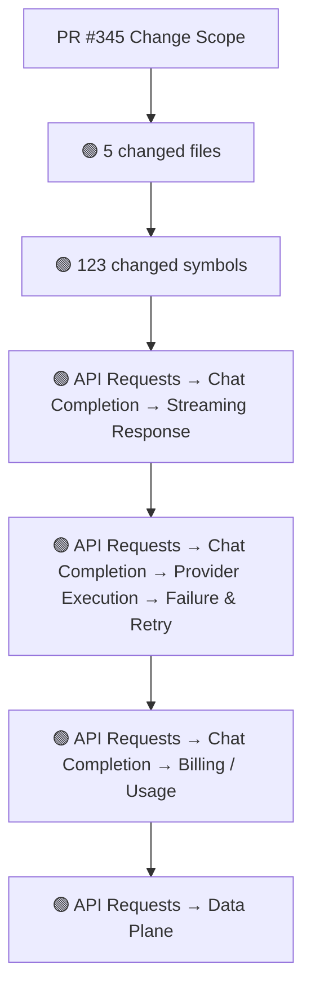
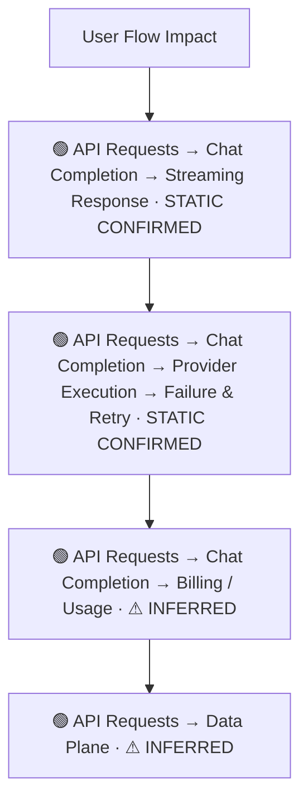
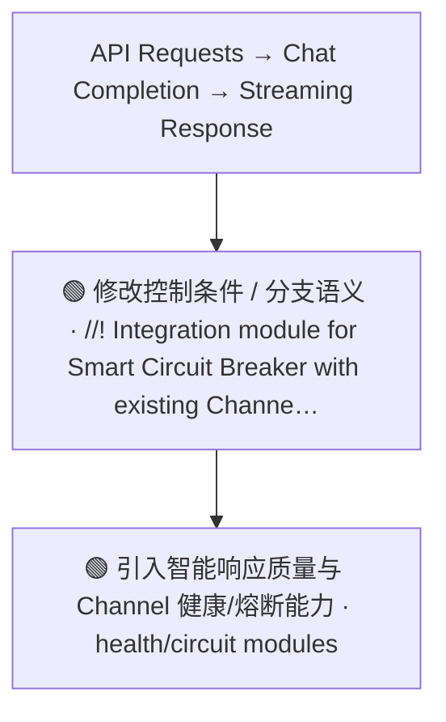
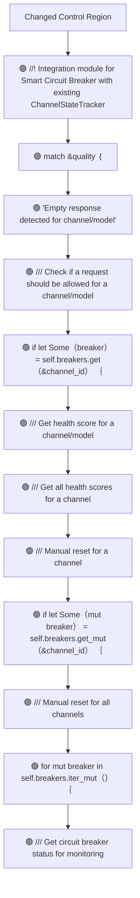
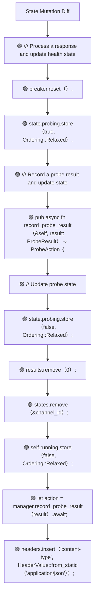
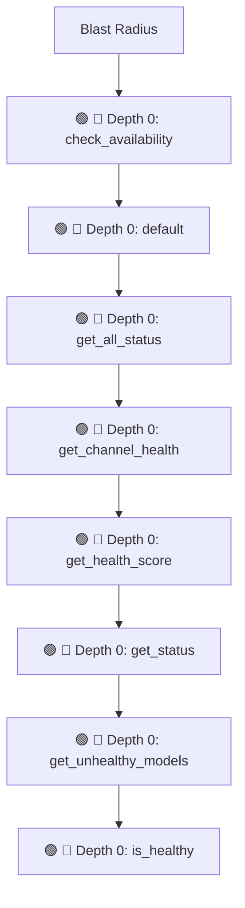

# Commit Change Atlas

## Executive Summary

| Field | Value |
|---|---|
| Commit | `db2430e7d52833632ddd1b152d45bf69c4d33f7c` |
| Base | `3b3766f3c867b39ea35173a7458b9dcaf38612d2` |
| Merged PR | [#345](https://github.com/burncloud/burncloud/pull/345) |
| Merged At | `2026-06-10T11:38:50Z` |
| Intent | feat: 实现智能熔断系统 |
| Intent Truth | **AUTHOR-STATED** (PR title/body) |
| Risk | **HIGH (50)** |
| Changed Files | 5 |
| Changed Symbols | 123 |
| Changed Functions | 88 |
| Changed Routes | 0 |
| Changed Test Files | 0 |
| Affected User Flows | 4 |
| API Contract | Changed |
| Database | Changed |
| External | Changed |
| Tests | ✅ Covered |

**Source Diff:** [BASE `3b3766f3c867` → TARGET `db2430e7d528`](https://github.com/burncloud/burncloud/compare/3b3766f3c867b39ea35173a7458b9dcaf38612d2...db2430e7d52833632ddd1b152d45bf69c4d33f7c)

## Intent

**Intent:** feat: 实现智能熔断系统

**Truth:** **AUTHOR-STATED INTENT** — PR title/body; code facts below come from BASE→TARGET diff.

[Open merged PR #345](https://github.com/burncloud/burncloud/pull/345)

## 10-Dimension Dashboard

| Dimension | Status | Risk |
|---|---|---|
| 1. Change Scope | ● Changed | MEDIUM |
| 2. User Flow | ● Changed | MEDIUM |
| 3. Runtime | ● Changed | HIGH |
| 4. Control Flow | ● Changed | HIGH |
| 5. State | ● Changed | MEDIUM |
| 6. API Contract | ● Changed | HIGH |
| 7. Database | ● Changed | HIGH |
| 8. External | ● Changed | MEDIUM |
| 9. Blast Radius | ● Changed | MEDIUM |
| 10. Tests | ○ No Change | LOW |

---

## 1. Change Scope

### What changed?

Files **5** · Symbols **123** · Functions **88** · Routes **0** · Test files **0**

### Change Scope Map

### Changed Files

- 🟢 ADDED `crates/router/src/channel_health_manager.rs`
- 🟢 ADDED `crates/router/src/health_probe.rs`
- 🟡 MODIFIED `crates/router/src/lib.rs`
- 🟢 ADDED `crates/router/src/response_quality.rs`
- 🟢 ADDED `crates/router/src/smart_circuit_breaker.rs`

### Changed Symbols

- 🟡 `function` `check_availability` — `crates/router/src/channel_health_manager.rs:L108`
- 🟡 `function` `default` — `crates/router/src/channel_health_manager.rs:L179`
- 🟡 `function` `get_all_status` — `crates/router/src/channel_health_manager.rs:L159`
- 🟡 `function` `get_channel_health` — `crates/router/src/channel_health_manager.rs:L126`
- 🟡 `function` `get_health_score` — `crates/router/src/channel_health_manager.rs:L117`
- 🟡 `function` `get_status` — `crates/router/src/channel_health_manager.rs:L145`
- 🟡 `function` `get_unhealthy_models` — `crates/router/src/channel_health_manager.rs:L207`
- 🟡 `function` `is_healthy` — `crates/router/src/channel_health_manager.rs:L194`
- 🟡 `function` `new` — `crates/router/src/channel_health_manager.rs:L31`
- 🟡 `function` `process_response` — `crates/router/src/channel_health_manager.rs:L49`
- 🟡 `function` `reset_all` — `crates/router/src/channel_health_manager.rs:L138`
- 🟡 `function` `reset_channel` — `crates/router/src/channel_health_manager.rs:L131`
- 🟡 `function` `test_channel_health_manager_basic` — `crates/router/src/channel_health_manager.rs:L232`
- 🟡 `function` `test_empty_response_tracking` — `crates/router/src/channel_health_manager.rs:L258`
- 🟡 `function` `test_health_status` — `crates/router/src/channel_health_manager.rs:L324`
- 🟡 `function` `test_model_level_isolation` — `crates/router/src/channel_health_manager.rs:L282`
- 🟡 `function` `trip_level_to_weight` — `crates/router/src/channel_health_manager.rs:L217`
- 🟡 `function` `with_config` — `crates/router/src/channel_health_manager.rs:L40`
- 🟡 `mod` `tests` — `crates/router/src/channel_health_manager.rs:L227`
- 🟡 `struct` `ChannelHealthManager` — `crates/router/src/channel_health_manager.rs:L20`
- 🟡 `struct` `ChannelHealthStatus` — `crates/router/src/channel_health_manager.rs:L186`
- 🟡 `enum` `ProbeAction` — `crates/router/src/health_probe.rs:L239`
- 🟡 `function` `default` — `crates/router/src/health_probe.rs:L39`
- 🟡 `function` `default` — `crates/router/src/health_probe.rs:L89`
- 🟡 `function` `default` — `crates/router/src/health_probe.rs:L232`

### Evidence

- **AFTER:** [`crates/router/src/channel_health_manager.rs:L1-L346`](https://github.com/burncloud/burncloud/blob/db2430e7d52833632ddd1b152d45bf69c4d33f7c/crates/router/src/channel_health_manager.rs#L1-L346)
- **AFTER:** [`crates/router/src/health_probe.rs:L1-L385`](https://github.com/burncloud/burncloud/blob/db2430e7d52833632ddd1b152d45bf69c4d33f7c/crates/router/src/health_probe.rs#L1-L385)
- **AFTER:** [`crates/router/src/lib.rs:L3987-L3990`](https://github.com/burncloud/burncloud/blob/db2430e7d52833632ddd1b152d45bf69c4d33f7c/crates/router/src/lib.rs#L3987-L3990)
- **AFTER:** [`crates/router/src/response_quality.rs:L1-L712`](https://github.com/burncloud/burncloud/blob/db2430e7d52833632ddd1b152d45bf69c4d33f7c/crates/router/src/response_quality.rs#L1-L712)
- **AFTER:** [`crates/router/src/smart_circuit_breaker.rs:L1-L635`](https://github.com/burncloud/burncloud/blob/db2430e7d52833632ddd1b152d45bf69c4d33f7c/crates/router/src/smart_circuit_breaker.rs#L1-L635)

---

## 2. User Flow Impact

### Which user behaviors changed?

- **API Requests → Chat Completion → Streaming Response** — STATIC CONFIRMED
- **API Requests → Chat Completion → Provider Execution → Failure & Retry** — STATIC CONFIRMED
- **API Requests → Chat Completion → Billing / Usage** — ⚠ INFERRED
- **API Requests → Data Plane** — ⚠ INFERRED

### User Flow Impact Map

Only explicit runtime/UI entry evidence is STATIC CONFIRMED; path/module mappings remain `⚠ INFERRED` where applicable.

### Evidence

- **AFTER:** [`crates/router/src/channel_health_manager.rs:L1-L346`](https://github.com/burncloud/burncloud/blob/db2430e7d52833632ddd1b152d45bf69c4d33f7c/crates/router/src/channel_health_manager.rs#L1-L346)
- **AFTER:** [`crates/router/src/health_probe.rs:L1-L385`](https://github.com/burncloud/burncloud/blob/db2430e7d52833632ddd1b152d45bf69c4d33f7c/crates/router/src/health_probe.rs#L1-L385)
- **AFTER:** [`crates/router/src/lib.rs:L3987-L3990`](https://github.com/burncloud/burncloud/blob/db2430e7d52833632ddd1b152d45bf69c4d33f7c/crates/router/src/lib.rs#L3987-L3990)
- **AFTER:** [`crates/router/src/response_quality.rs:L1-L712`](https://github.com/burncloud/burncloud/blob/db2430e7d52833632ddd1b152d45bf69c4d33f7c/crates/router/src/response_quality.rs#L1-L712)
- **AFTER:** [`crates/router/src/smart_circuit_breaker.rs:L1-L635`](https://github.com/burncloud/burncloud/blob/db2430e7d52833632ddd1b152d45bf69c4d33f7c/crates/router/src/smart_circuit_breaker.rs#L1-L635)

---

## 3. End-to-End Runtime Diff

### What changed at runtime?

Changed production runtime signals were detected.

### E2E Diff

### Decisions

Changed control statements are isolated in Dimension 4. Unproven edges are not invented.

### Evidence

- **AFTER:** [`crates/router/src/channel_health_manager.rs:L1-L346`](https://github.com/burncloud/burncloud/blob/db2430e7d52833632ddd1b152d45bf69c4d33f7c/crates/router/src/channel_health_manager.rs#L1-L346)
- **AFTER:** [`crates/router/src/health_probe.rs:L1-L385`](https://github.com/burncloud/burncloud/blob/db2430e7d52833632ddd1b152d45bf69c4d33f7c/crates/router/src/health_probe.rs#L1-L385)
- **AFTER:** [`crates/router/src/lib.rs:L3987-L3990`](https://github.com/burncloud/burncloud/blob/db2430e7d52833632ddd1b152d45bf69c4d33f7c/crates/router/src/lib.rs#L3987-L3990)
- **AFTER:** [`crates/router/src/response_quality.rs:L1-L712`](https://github.com/burncloud/burncloud/blob/db2430e7d52833632ddd1b152d45bf69c4d33f7c/crates/router/src/response_quality.rs#L1-L712)
- **AFTER:** [`crates/router/src/smart_circuit_breaker.rs:L1-L635`](https://github.com/burncloud/burncloud/blob/db2430e7d52833632ddd1b152d45bf69c4d33f7c/crates/router/src/smart_circuit_breaker.rs#L1-L635)

---

## 4. ICFG Diff

### Which control-flow semantics changed?

⚠ Diagram contains changed control statements only; unproven interprocedural edges are not invented.

### Evidence

- **AFTER:** [`crates/router/src/channel_health_manager.rs:L1-L346`](https://github.com/burncloud/burncloud/blob/db2430e7d52833632ddd1b152d45bf69c4d33f7c/crates/router/src/channel_health_manager.rs#L1-L346)
- **AFTER:** [`crates/router/src/health_probe.rs:L1-L385`](https://github.com/burncloud/burncloud/blob/db2430e7d52833632ddd1b152d45bf69c4d33f7c/crates/router/src/health_probe.rs#L1-L385)
- **AFTER:** [`crates/router/src/response_quality.rs:L1-L712`](https://github.com/burncloud/burncloud/blob/db2430e7d52833632ddd1b152d45bf69c4d33f7c/crates/router/src/response_quality.rs#L1-L712)
- **AFTER:** [`crates/router/src/smart_circuit_breaker.rs:L1-L635`](https://github.com/burncloud/burncloud/blob/db2430e7d52833632ddd1b152d45bf69c4d33f7c/crates/router/src/smart_circuit_breaker.rs#L1-L635)

---

## 5. State Mutation Diff

### What state behavior changed?

| Before | After |
|---|---|
| — | 🟢 /// Process a response and update health state |
| — | 🟢 breaker.reset（）; |
| — | 🟢 state.probing.store（true, Ordering::Relaxed）; |
| — | 🟢 /// Record a probe result and update state |
| — | 🟢 pub async fn record_probe_result（&self, result: ProbeResult） -› ProbeAction ｛ |
| — | 🟢 // Update probe state |
| — | 🟢 state.probing.store（false, Ordering::Relaxed）; |
| — | 🟢 results.remove（0）; |
| — | 🟢 states.remove（&channel_id）; |
| — | 🟢 self.running.store（false, Ordering::Relaxed）; |
| — | 🟢 let action = manager.record_probe_result（result）.await; |
| — | 🟢 headers.insert（'content-type', HeaderValue::from_static（'application/json'））; |

### State Diff

### Evidence

- **AFTER:** [`crates/router/src/channel_health_manager.rs:L1-L346`](https://github.com/burncloud/burncloud/blob/db2430e7d52833632ddd1b152d45bf69c4d33f7c/crates/router/src/channel_health_manager.rs#L1-L346)
- **AFTER:** [`crates/router/src/health_probe.rs:L1-L385`](https://github.com/burncloud/burncloud/blob/db2430e7d52833632ddd1b152d45bf69c4d33f7c/crates/router/src/health_probe.rs#L1-L385)
- **AFTER:** [`crates/router/src/response_quality.rs:L1-L712`](https://github.com/burncloud/burncloud/blob/db2430e7d52833632ddd1b152d45bf69c4d33f7c/crates/router/src/response_quality.rs#L1-L712)
- **AFTER:** [`crates/router/src/smart_circuit_breaker.rs:L1-L635`](https://github.com/burncloud/burncloud/blob/db2430e7d52833632ddd1b152d45bf69c4d33f7c/crates/router/src/smart_circuit_breaker.rs#L1-L635)

---

## 6. API Contract Diff

### API changes

| Before | After |
|---|---|
| — | 🟢 headers.insert（'content-type', HeaderValue::from_static（'application/json'））; |

API Contract changes are never rated below MEDIUM.

### Evidence

- **AFTER:** [`crates/router/src/response_quality.rs:L1-L712`](https://github.com/burncloud/burncloud/blob/db2430e7d52833632ddd1b152d45bf69c4d33f7c/crates/router/src/response_quality.rs#L1-L712)

---

## 7. Database / Persistence Diff

### Persistence changes

| Before | After |
|---|---|
| — | 🟢 /// Process a response and update health state |
| — | 🟢 /// Record a probe result and update state |
| — | 🟢 // Update probe state |
| — | 🟢 // Should select first preferred model |
| — | 🟢 /// Authentication failed （401） - permanent, needs key update |
| — | 🟢 /// Record a response and update state |
| — | 🟢 // Update health score （exponential moving average） |

Database/migration/SQL persistence surface changed.

### Evidence

- **AFTER:** [`crates/router/src/channel_health_manager.rs:L1-L346`](https://github.com/burncloud/burncloud/blob/db2430e7d52833632ddd1b152d45bf69c4d33f7c/crates/router/src/channel_health_manager.rs#L1-L346)
- **AFTER:** [`crates/router/src/health_probe.rs:L1-L385`](https://github.com/burncloud/burncloud/blob/db2430e7d52833632ddd1b152d45bf69c4d33f7c/crates/router/src/health_probe.rs#L1-L385)
- **AFTER:** [`crates/router/src/response_quality.rs:L1-L712`](https://github.com/burncloud/burncloud/blob/db2430e7d52833632ddd1b152d45bf69c4d33f7c/crates/router/src/response_quality.rs#L1-L712)
- **AFTER:** [`crates/router/src/smart_circuit_breaker.rs:L1-L635`](https://github.com/burncloud/burncloud/blob/db2430e7d52833632ddd1b152d45bf69c4d33f7c/crates/router/src/smart_circuit_breaker.rs#L1-L635)

---

## 8. External Dependency Diff

### External behavior changes

| Before | After |
|---|---|
| — | 🟢 pub fn get_probe_timeout（&self） -› Duration ｛ |

**🟣 DYNAMIC:** concrete Provider/Adaptor target remains runtime-dependent.

### Evidence

- **AFTER:** [`crates/router/src/health_probe.rs:L1-L385`](https://github.com/burncloud/burncloud/blob/db2430e7d52833632ddd1b152d45bf69c4d33f7c/crates/router/src/health_probe.rs#L1-L385)

---

## 9. Blast Radius

### What else may be affected?

| Depth | Impact | Evidence location |
|---|---|---|
| 🔴 Depth 0 | check_availability | `crates/router/src/channel_health_manager.rs:L108` |
| 🔴 Depth 0 | default | `crates/router/src/channel_health_manager.rs:L179` |
| 🔴 Depth 0 | get_all_status | `crates/router/src/channel_health_manager.rs:L159` |
| 🔴 Depth 0 | get_channel_health | `crates/router/src/channel_health_manager.rs:L126` |
| 🔴 Depth 0 | get_health_score | `crates/router/src/channel_health_manager.rs:L117` |
| 🔴 Depth 0 | get_status | `crates/router/src/channel_health_manager.rs:L145` |
| 🔴 Depth 0 | get_unhealthy_models | `crates/router/src/channel_health_manager.rs:L207` |
| 🔴 Depth 0 | is_healthy | `crates/router/src/channel_health_manager.rs:L194` |

### Blast Radius Map

🔴 Depth 0 is direct. 🟡 lexical references are **impact candidates**, not compiler-proven call edges. Dynamic dispatch is never promoted to a confirmed edge.

### Evidence

- **AFTER:** [`crates/router/src/channel_health_manager.rs:L1-L346`](https://github.com/burncloud/burncloud/blob/db2430e7d52833632ddd1b152d45bf69c4d33f7c/crates/router/src/channel_health_manager.rs#L1-L346)
- **AFTER:** [`crates/router/src/health_probe.rs:L1-L385`](https://github.com/burncloud/burncloud/blob/db2430e7d52833632ddd1b152d45bf69c4d33f7c/crates/router/src/health_probe.rs#L1-L385)
- **AFTER:** [`crates/router/src/lib.rs:L3987-L3990`](https://github.com/burncloud/burncloud/blob/db2430e7d52833632ddd1b152d45bf69c4d33f7c/crates/router/src/lib.rs#L3987-L3990)
- **AFTER:** [`crates/router/src/response_quality.rs:L1-L712`](https://github.com/burncloud/burncloud/blob/db2430e7d52833632ddd1b152d45bf69c4d33f7c/crates/router/src/response_quality.rs#L1-L712)
- **AFTER:** [`crates/router/src/smart_circuit_breaker.rs:L1-L635`](https://github.com/burncloud/burncloud/blob/db2430e7d52833632ddd1b152d45bf69c4d33f7c/crates/router/src/smart_circuit_breaker.rs#L1-L635)

---

## 10. Test Coverage & Evidence

### Coverage Matrix

**Overall:** ✅ Covered

- Changed test files: **0**
- Lexical references from changed symbols into tests: **3**

### Missing Coverage

- No additional missing direct-coverage claim beyond evidence above.

### Source Evidence

- **COMPLETE DIFF SCAN:** No changed test hunk; coverage status uses changed tests plus lexical test references.
- [Open complete BASE → TARGET diff](https://github.com/burncloud/burncloud/compare/3b3766f3c867b39ea35173a7458b9dcaf38612d2...db2430e7d52833632ddd1b152d45bf69c4d33f7c)

---

## Risk Assessment

**Score: 50 → HIGH**

### Risk Drivers

- `Authentication change` **+5**
- `Authorization change` **+5**
- `Billing change` **+5**
- `Quota change` **+5**
- `Public API contract` **+5**
- `Routing decision` **+4**
- `Provider request` **+4**
- `Streaming` **+4**
- `Retry/failover` **+4**
- `State mutation` **+3**
- `Dynamic dispatch boundary` **+3**
- `Missing direct changed tests` **+3**

The score is rule-based, not an LLM impression.

## Reviewer Checklist

- [ ] Intent 与代码变化一致
- [ ] User Flow impact 已确认
- [ ] Runtime Diff 已确认
- [ ] Control-flow changes 已确认
- [ ] State mutation 已确认
- [ ] API contract 已确认
- [ ] Database behavior 已确认
- [ ] External Provider behavior 已确认
- [ ] Blast Radius 可接受
- [ ] Tests 覆盖 changed runtime paths
- [ ] Dynamic / Inferred relationships 已正确标记
- [ ] Source Evidence 可追溯

## Source Diff Entry Points

- [Complete BASE → TARGET diff](https://github.com/burncloud/burncloud/compare/3b3766f3c867b39ea35173a7458b9dcaf38612d2...db2430e7d52833632ddd1b152d45bf69c4d33f7c)
- [Merged PR #345](https://github.com/burncloud/burncloud/pull/345)
