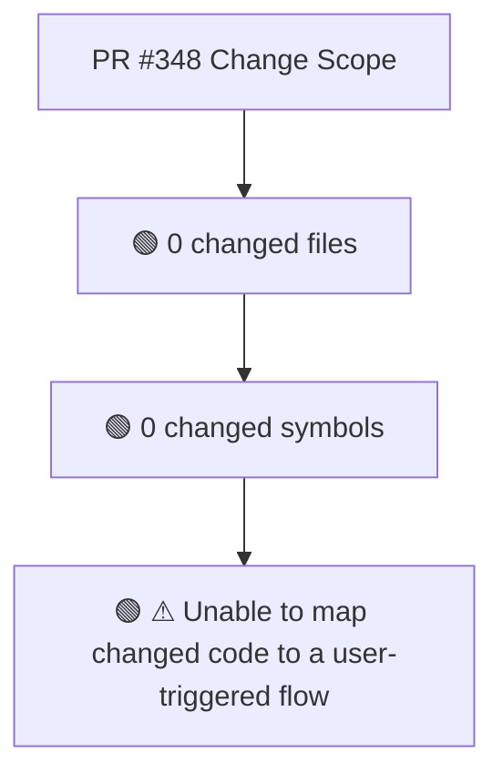
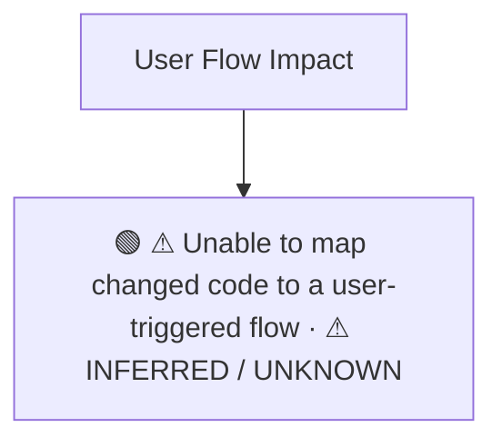
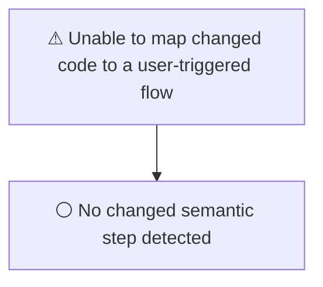
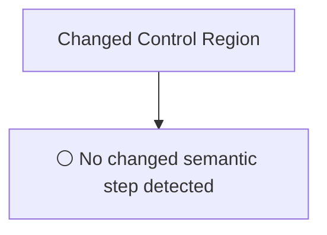
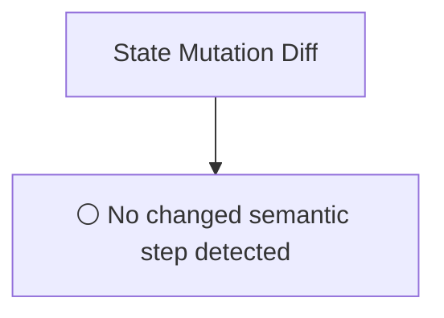
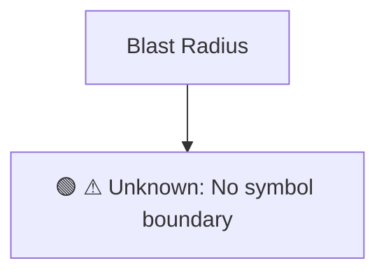

# Commit Change Atlas

## Executive Summary

| Field | Value |
|---|---|
| Commit | `0f51207790b4e5beaf890ea378f19a80f2a0bcbc` |
| Base | `3ff4ca580ab4294372c40ad6b4b6ce11a1bb7ee1` |
| Merged PR | [#348](https://github.com/burncloud/burncloud/pull/348) |
| Merged At | `2026-06-13T16:57:28Z` |
| Intent | fix: HTTP error responses should return JSON format instead of plain text |
| Intent Truth | **AUTHOR-STATED** (PR title/body) |
| Risk | **LOW (0)** |
| Changed Files | 0 |
| Changed Symbols | 0 |
| Changed Functions | 0 |
| Changed Routes | 0 |
| Changed Test Files | 0 |
| Affected User Flows | 1 |
| API Contract | No Change |
| Database | No Change |
| External | No Change |
| Tests | ? Unable to determine |

**Source Diff:** [BASE `3ff4ca580ab4` → TARGET `0f51207790b4`](https://github.com/burncloud/burncloud/compare/3ff4ca580ab4294372c40ad6b4b6ce11a1bb7ee1...0f51207790b4e5beaf890ea378f19a80f2a0bcbc)

## Intent

**Intent:** fix: HTTP error responses should return JSON format instead of plain text

**Truth:** **AUTHOR-STATED INTENT** — PR title/body; code facts below come from BASE→TARGET diff.

[Open merged PR #348](https://github.com/burncloud/burncloud/pull/348)

## 10-Dimension Dashboard

| Dimension | Status | Risk |
|---|---|---|
| 1. Change Scope | ● Changed | LOW |
| 2. User Flow | ● Changed | LOW |
| 3. Runtime | ○ No Change | LOW |
| 4. Control Flow | ○ No Change | LOW |
| 5. State | ○ No Change | LOW |
| 6. API Contract | ○ No Change | LOW |
| 7. Database | ○ No Change | LOW |
| 8. External | ○ No Change | LOW |
| 9. Blast Radius | ● Changed | LOW |
| 10. Tests | ● Changed | LOW |

---

## 1. Change Scope

### What changed?

Files **0** · Symbols **0** · Functions **0** · Routes **0** · Test files **0**

### Change Scope Map

### Changed Files

- No files

### Changed Symbols

- No safe Rust symbol boundary resolved; no symbol is guessed.

### Evidence

- **COMPLETE DIFF SCAN:** No changed hunk found.
- [Open complete BASE → TARGET diff](https://github.com/burncloud/burncloud/compare/3ff4ca580ab4294372c40ad6b4b6ce11a1bb7ee1...0f51207790b4e5beaf890ea378f19a80f2a0bcbc)

---

## 2. User Flow Impact

### Which user behaviors changed?

- **⚠ Unable to map changed code to a user-triggered flow** — ⚠ INFERRED / UNKNOWN

### User Flow Impact Map

Only explicit runtime/UI entry evidence is STATIC CONFIRMED; path/module mappings remain `⚠ INFERRED` where applicable.

### Evidence

- **COMPLETE DIFF SCAN:** No production runtime hunk matched; impact may be test/docs/CI only.
- [Open complete BASE → TARGET diff](https://github.com/burncloud/burncloud/compare/3ff4ca580ab4294372c40ad6b4b6ce11a1bb7ee1...0f51207790b4e5beaf890ea378f19a80f2a0bcbc)

---

## 3. End-to-End Runtime Diff

### What changed at runtime?

**⚪ NO PRODUCTION RUNTIME EXECUTION CHANGE DETECTED.**

### E2E Diff

### Decisions

⚪ No changed control statement detected. Unproven edges are not invented.

### Evidence

- **COMPLETE DIFF SCAN:** No conservative runtime-semantic hunk matched.
- [Open complete BASE → TARGET diff](https://github.com/burncloud/burncloud/compare/3ff4ca580ab4294372c40ad6b4b6ce11a1bb7ee1...0f51207790b4e5beaf890ea378f19a80f2a0bcbc)

---

## 4. ICFG Diff

### Which control-flow semantics changed?

**⚪ NO CONTROL-FLOW CHANGE DETECTED.**

### Evidence

- **COMPLETE DIFF SCAN:** No if/match/loop/break/continue/return/spawn statement changed.
- [Open complete BASE → TARGET diff](https://github.com/burncloud/burncloud/compare/3ff4ca580ab4294372c40ad6b4b6ce11a1bb7ee1...0f51207790b4e5beaf890ea378f19a80f2a0bcbc)

---

## 5. State Mutation Diff

### What state behavior changed?

**⚪ NO STATE MUTATION CHANGE DETECTED**

### State Diff

### Evidence

- **COMPLETE DIFF SCAN:** No changed DB/cache/counter/update state signal detected.
- [Open complete BASE → TARGET diff](https://github.com/burncloud/burncloud/compare/3ff4ca580ab4294372c40ad6b4b6ce11a1bb7ee1...0f51207790b4e5beaf890ea378f19a80f2a0bcbc)

---

## 6. API Contract Diff

### API changes

**⚪ NO API CONTRACT CHANGE DETECTED**

**API Contract: ⚪ NO CHANGE DETECTED** by complete diff scan.

### Evidence

- **COMPLETE DIFF SCAN:** No route/status/header/content-type API-contract marker changed.
- [Open complete BASE → TARGET diff](https://github.com/burncloud/burncloud/compare/3ff4ca580ab4294372c40ad6b4b6ce11a1bb7ee1...0f51207790b4e5beaf890ea378f19a80f2a0bcbc)

---

## 7. Database / Persistence Diff

### Persistence changes

**⚪ NO DATABASE / PERSISTENCE CHANGE DETECTED**

**⚪ NO DATABASE / PERSISTENCE CHANGE DETECTED** by complete diff scan.

### Evidence

- **COMPLETE DIFF SCAN:** No migration/database/SQL persistence hunk changed.
- [Open complete BASE → TARGET diff](https://github.com/burncloud/burncloud/compare/3ff4ca580ab4294372c40ad6b4b6ce11a1bb7ee1...0f51207790b4e5beaf890ea378f19a80f2a0bcbc)

---

## 8. External Dependency Diff

### External behavior changes

**⚪ NO EXTERNAL DEPENDENCY CHANGE DETECTED**

**⚪ NO EXTERNAL DEPENDENCY CHANGE DETECTED** by complete diff scan.

### Evidence

- **COMPLETE DIFF SCAN:** No outbound HTTP/provider/Redis/webhook/process marker changed.
- [Open complete BASE → TARGET diff](https://github.com/burncloud/burncloud/compare/3ff4ca580ab4294372c40ad6b4b6ce11a1bb7ee1...0f51207790b4e5beaf890ea378f19a80f2a0bcbc)

---

## 9. Blast Radius

### What else may be affected?

| Depth | Impact | Evidence location |
|---|---|---|
| ⚠ Unknown | No symbol boundary | `Unable to compute lexical blast radius` |

### Blast Radius Map

🔴 Depth 0 is direct. 🟡 lexical references are **impact candidates**, not compiler-proven call edges. Dynamic dispatch is never promoted to a confirmed edge.

### Evidence

- **COMPLETE DIFF SCAN:** No changed hunk.
- [Open complete BASE → TARGET diff](https://github.com/burncloud/burncloud/compare/3ff4ca580ab4294372c40ad6b4b6ce11a1bb7ee1...0f51207790b4e5beaf890ea378f19a80f2a0bcbc)

---

## 10. Test Coverage & Evidence

### Coverage Matrix

**Overall:** ? Unable to determine

- Changed test files: **0**
- Lexical references from changed symbols into tests: **0**

### Missing Coverage

- No additional missing direct-coverage claim beyond evidence above.

### Source Evidence

- **COMPLETE DIFF SCAN:** No changed test hunk; coverage status uses changed tests plus lexical test references.
- [Open complete BASE → TARGET diff](https://github.com/burncloud/burncloud/compare/3ff4ca580ab4294372c40ad6b4b6ce11a1bb7ee1...0f51207790b4e5beaf890ea378f19a80f2a0bcbc)

---

## Risk Assessment

**Score: 0 → LOW**

### Risk Drivers

- No configured high-risk driver matched.

The score is rule-based, not an LLM impression.

## Reviewer Checklist

- [ ] Intent 与代码变化一致
- [ ] User Flow impact 已确认
- [ ] Runtime Diff 已确认
- [ ] Control-flow changes 已确认
- [ ] State mutation 已确认
- [ ] API contract 已确认
- [ ] Database behavior 已确认
- [ ] External Provider behavior 已确认
- [ ] Blast Radius 可接受
- [ ] Tests 覆盖 changed runtime paths
- [ ] Dynamic / Inferred relationships 已正确标记
- [ ] Source Evidence 可追溯

## Source Diff Entry Points

- [Complete BASE → TARGET diff](https://github.com/burncloud/burncloud/compare/3ff4ca580ab4294372c40ad6b4b6ce11a1bb7ee1...0f51207790b4e5beaf890ea378f19a80f2a0bcbc)
- [Merged PR #348](https://github.com/burncloud/burncloud/pull/348)
