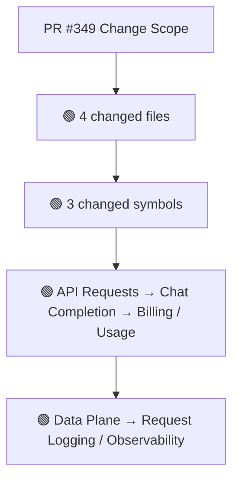
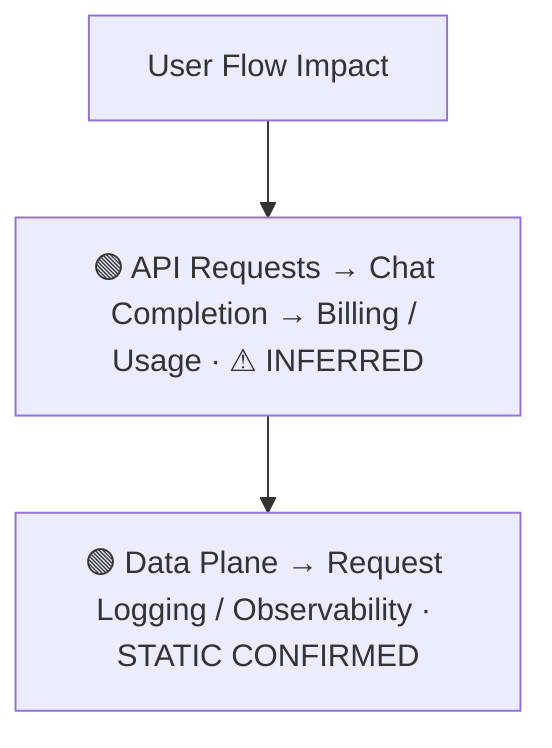
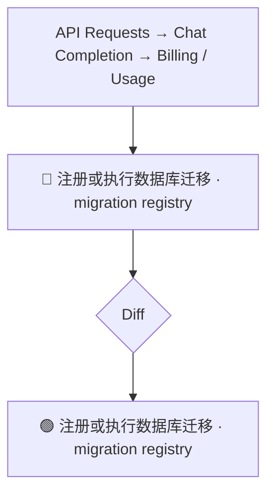
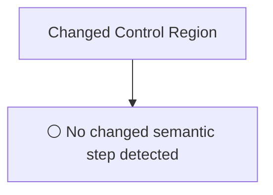
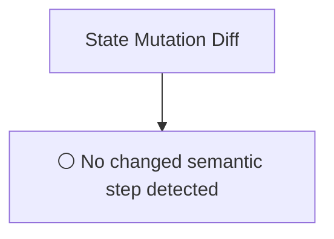
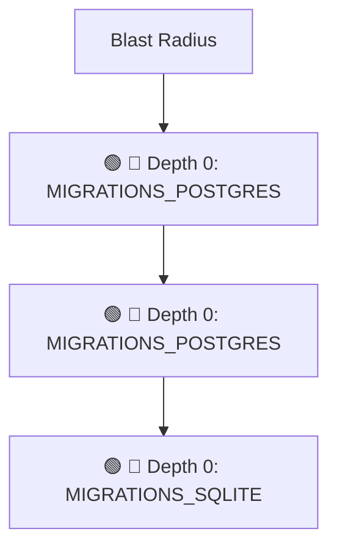

# Commit Change Atlas

## Executive Summary

| Field | Value |
|---|---|
| Commit | `e4d26e7b5b2f1b2977a0b02179dfe7236435da77` |
| Base | `0f51207790b4e5beaf890ea378f19a80f2a0bcbc` |
| Merged PR | [#349](https://github.com/burncloud/burncloud/pull/349) |
| Merged At | `2026-06-13T20:03:36Z` |
| Intent | fix(db): register missing migrations for router_request_logs (Issue #334) |
| Intent Truth | **AUTHOR-STATED** (PR title/body) |
| Risk | **HIGH (13)** |
| Changed Files | 4 |
| Changed Symbols | 3 |
| Changed Functions | 0 |
| Changed Routes | 0 |
| Changed Test Files | 0 |
| Affected User Flows | 2 |
| API Contract | No Change |
| Database | Changed |
| External | No Change |
| Tests | ❌ Missing |

**Source Diff:** [BASE `0f51207790b4` → TARGET `e4d26e7b5b2f`](https://github.com/burncloud/burncloud/compare/0f51207790b4e5beaf890ea378f19a80f2a0bcbc...e4d26e7b5b2f1b2977a0b02179dfe7236435da77)

## Intent

**Intent:** fix(db): register missing migrations for router_request_logs (Issue #334)

**Truth:** **AUTHOR-STATED INTENT** — PR title/body; code facts below come from BASE→TARGET diff.

[Open merged PR #349](https://github.com/burncloud/burncloud/pull/349)

## 10-Dimension Dashboard

| Dimension | Status | Risk |
|---|---|---|
| 1. Change Scope | ● Changed | MEDIUM |
| 2. User Flow | ● Changed | MEDIUM |
| 3. Runtime | ● Changed | HIGH |
| 4. Control Flow | ○ No Change | LOW |
| 5. State | ○ No Change | LOW |
| 6. API Contract | ○ No Change | LOW |
| 7. Database | ● Changed | HIGH |
| 8. External | ○ No Change | LOW |
| 9. Blast Radius | ● Changed | MEDIUM |
| 10. Tests | ● Changed | HIGH |

---

## 1. Change Scope

### What changed?

Files **4** · Symbols **3** · Functions **0** · Routes **0** · Test files **0**

### Change Scope Map

### Changed Files

- 🟢 ADDED `crates/database/migrations/postgres/0017_fix_bool_columns.sql`
- 🟡 MODIFIED `crates/database/migrations/postgres/0018_router_request_logs.sql`
- 🟡 MODIFIED `crates/database/migrations/sqlite/0018_router_request_logs.sql`
- 🟡 MODIFIED `crates/database/src/migration.rs`

### Changed Symbols

- 🟡 `const` `MIGRATIONS_POSTGRES` — `crates/database/src/migration.rs:L94`
- 🟡 `const` `MIGRATIONS_POSTGRES` — `crates/database/src/migration.rs:L110`
- 🟡 `const` `MIGRATIONS_SQLITE` — `crates/database/src/migration.rs:L31`

### Evidence

- **AFTER:** [`crates/database/migrations/postgres/0017_fix_bool_columns.sql:L1-L8`](https://github.com/burncloud/burncloud/blob/e4d26e7b5b2f1b2977a0b02179dfe7236435da77/crates/database/migrations/postgres/0017_fix_bool_columns.sql#L1-L8)
- **AFTER:** [`crates/database/migrations/postgres/0018_router_request_logs.sql:L1-L1`](https://github.com/burncloud/burncloud/blob/e4d26e7b5b2f1b2977a0b02179dfe7236435da77/crates/database/migrations/postgres/0018_router_request_logs.sql#L1-L1)
- **BASE:** [`crates/database/migrations/postgres/0017_router_request_logs.sql:L1-L1`](https://github.com/burncloud/burncloud/blob/0f51207790b4e5beaf890ea378f19a80f2a0bcbc/crates/database/migrations/postgres/0017_router_request_logs.sql#L1-L1)
- **AFTER:** [`crates/database/migrations/sqlite/0018_router_request_logs.sql:L1-L1`](https://github.com/burncloud/burncloud/blob/e4d26e7b5b2f1b2977a0b02179dfe7236435da77/crates/database/migrations/sqlite/0018_router_request_logs.sql#L1-L1)
- **BASE:** [`crates/database/migrations/sqlite/0017_router_request_logs.sql:L1-L1`](https://github.com/burncloud/burncloud/blob/0f51207790b4e5beaf890ea378f19a80f2a0bcbc/crates/database/migrations/sqlite/0017_router_request_logs.sql#L1-L1)
- **AFTER:** [`crates/database/src/migration.rs:L84-L84`](https://github.com/burncloud/burncloud/blob/e4d26e7b5b2f1b2977a0b02179dfe7236435da77/crates/database/src/migration.rs#L84-L84)
- **BASE:** [`crates/database/src/migration.rs:L84-L84`](https://github.com/burncloud/burncloud/blob/0f51207790b4e5beaf890ea378f19a80f2a0bcbc/crates/database/src/migration.rs#L84-L84)
- **AFTER:** [`crates/database/src/migration.rs:L88-L103`](https://github.com/burncloud/burncloud/blob/e4d26e7b5b2f1b2977a0b02179dfe7236435da77/crates/database/src/migration.rs#L88-L103)

---

## 2. User Flow Impact

### Which user behaviors changed?

- **API Requests → Chat Completion → Billing / Usage** — ⚠ INFERRED
- **Data Plane → Request Logging / Observability** — STATIC CONFIRMED

### User Flow Impact Map

Only explicit runtime/UI entry evidence is STATIC CONFIRMED; path/module mappings remain `⚠ INFERRED` where applicable.

### Evidence

- **AFTER:** [`crates/database/src/migration.rs:L84-L84`](https://github.com/burncloud/burncloud/blob/e4d26e7b5b2f1b2977a0b02179dfe7236435da77/crates/database/src/migration.rs#L84-L84)
- **BASE:** [`crates/database/src/migration.rs:L84-L84`](https://github.com/burncloud/burncloud/blob/0f51207790b4e5beaf890ea378f19a80f2a0bcbc/crates/database/src/migration.rs#L84-L84)
- **AFTER:** [`crates/database/src/migration.rs:L88-L103`](https://github.com/burncloud/burncloud/blob/e4d26e7b5b2f1b2977a0b02179dfe7236435da77/crates/database/src/migration.rs#L88-L103)
- **AFTER:** [`crates/database/src/migration.rs:L163-L163`](https://github.com/burncloud/burncloud/blob/e4d26e7b5b2f1b2977a0b02179dfe7236435da77/crates/database/src/migration.rs#L163-L163)
- **BASE:** [`crates/database/src/migration.rs:L147-L147`](https://github.com/burncloud/burncloud/blob/0f51207790b4e5beaf890ea378f19a80f2a0bcbc/crates/database/src/migration.rs#L147-L147)
- **AFTER:** [`crates/database/src/migration.rs:L167-L182`](https://github.com/burncloud/burncloud/blob/e4d26e7b5b2f1b2977a0b02179dfe7236435da77/crates/database/src/migration.rs#L167-L182)

---

## 3. End-to-End Runtime Diff

### What changed at runtime?

Changed production runtime signals were detected.

### E2E Diff

### Decisions

⚪ No changed control statement detected. Unproven edges are not invented.

### Evidence

- **AFTER:** [`crates/database/src/migration.rs:L84-L84`](https://github.com/burncloud/burncloud/blob/e4d26e7b5b2f1b2977a0b02179dfe7236435da77/crates/database/src/migration.rs#L84-L84)
- **BASE:** [`crates/database/src/migration.rs:L84-L84`](https://github.com/burncloud/burncloud/blob/0f51207790b4e5beaf890ea378f19a80f2a0bcbc/crates/database/src/migration.rs#L84-L84)
- **AFTER:** [`crates/database/src/migration.rs:L88-L103`](https://github.com/burncloud/burncloud/blob/e4d26e7b5b2f1b2977a0b02179dfe7236435da77/crates/database/src/migration.rs#L88-L103)
- **AFTER:** [`crates/database/src/migration.rs:L163-L163`](https://github.com/burncloud/burncloud/blob/e4d26e7b5b2f1b2977a0b02179dfe7236435da77/crates/database/src/migration.rs#L163-L163)
- **BASE:** [`crates/database/src/migration.rs:L147-L147`](https://github.com/burncloud/burncloud/blob/0f51207790b4e5beaf890ea378f19a80f2a0bcbc/crates/database/src/migration.rs#L147-L147)
- **AFTER:** [`crates/database/src/migration.rs:L167-L182`](https://github.com/burncloud/burncloud/blob/e4d26e7b5b2f1b2977a0b02179dfe7236435da77/crates/database/src/migration.rs#L167-L182)

---

## 4. ICFG Diff

### Which control-flow semantics changed?

**⚪ NO CONTROL-FLOW CHANGE DETECTED.**

### Evidence

- **AFTER:** [`crates/database/migrations/postgres/0017_fix_bool_columns.sql:L1-L8`](https://github.com/burncloud/burncloud/blob/e4d26e7b5b2f1b2977a0b02179dfe7236435da77/crates/database/migrations/postgres/0017_fix_bool_columns.sql#L1-L8)

---

## 5. State Mutation Diff

### What state behavior changed?

**⚪ NO STATE MUTATION CHANGE DETECTED**

### State Diff

### Evidence

- **COMPLETE DIFF SCAN:** No changed DB/cache/counter/update state signal detected.
- [Open complete BASE → TARGET diff](https://github.com/burncloud/burncloud/compare/0f51207790b4e5beaf890ea378f19a80f2a0bcbc...e4d26e7b5b2f1b2977a0b02179dfe7236435da77)

---

## 6. API Contract Diff

### API changes

**⚪ NO API CONTRACT CHANGE DETECTED**

**API Contract: ⚪ NO CHANGE DETECTED** by complete diff scan.

### Evidence

- **COMPLETE DIFF SCAN:** No route/status/header/content-type API-contract marker changed.
- [Open complete BASE → TARGET diff](https://github.com/burncloud/burncloud/compare/0f51207790b4e5beaf890ea378f19a80f2a0bcbc...e4d26e7b5b2f1b2977a0b02179dfe7236435da77)

---

## 7. Database / Persistence Diff

### Persistence changes

| Before | After |
|---|---|
| — | 🟢 SELECT 1; |

Database/migration/SQL persistence surface changed.

### Evidence

- **AFTER:** [`crates/database/migrations/postgres/0017_fix_bool_columns.sql:L1-L8`](https://github.com/burncloud/burncloud/blob/e4d26e7b5b2f1b2977a0b02179dfe7236435da77/crates/database/migrations/postgres/0017_fix_bool_columns.sql#L1-L8)
- **AFTER:** [`crates/database/migrations/postgres/0018_router_request_logs.sql:L1-L1`](https://github.com/burncloud/burncloud/blob/e4d26e7b5b2f1b2977a0b02179dfe7236435da77/crates/database/migrations/postgres/0018_router_request_logs.sql#L1-L1)
- **BASE:** [`crates/database/migrations/postgres/0017_router_request_logs.sql:L1-L1`](https://github.com/burncloud/burncloud/blob/0f51207790b4e5beaf890ea378f19a80f2a0bcbc/crates/database/migrations/postgres/0017_router_request_logs.sql#L1-L1)
- **AFTER:** [`crates/database/migrations/sqlite/0018_router_request_logs.sql:L1-L1`](https://github.com/burncloud/burncloud/blob/e4d26e7b5b2f1b2977a0b02179dfe7236435da77/crates/database/migrations/sqlite/0018_router_request_logs.sql#L1-L1)
- **BASE:** [`crates/database/migrations/sqlite/0017_router_request_logs.sql:L1-L1`](https://github.com/burncloud/burncloud/blob/0f51207790b4e5beaf890ea378f19a80f2a0bcbc/crates/database/migrations/sqlite/0017_router_request_logs.sql#L1-L1)
- **AFTER:** [`crates/database/src/migration.rs:L84-L84`](https://github.com/burncloud/burncloud/blob/e4d26e7b5b2f1b2977a0b02179dfe7236435da77/crates/database/src/migration.rs#L84-L84)
- **BASE:** [`crates/database/src/migration.rs:L84-L84`](https://github.com/burncloud/burncloud/blob/0f51207790b4e5beaf890ea378f19a80f2a0bcbc/crates/database/src/migration.rs#L84-L84)
- **AFTER:** [`crates/database/src/migration.rs:L88-L103`](https://github.com/burncloud/burncloud/blob/e4d26e7b5b2f1b2977a0b02179dfe7236435da77/crates/database/src/migration.rs#L88-L103)

---

## 8. External Dependency Diff

### External behavior changes

**⚪ NO EXTERNAL DEPENDENCY CHANGE DETECTED**

**⚪ NO EXTERNAL DEPENDENCY CHANGE DETECTED** by complete diff scan.

### Evidence

- **COMPLETE DIFF SCAN:** No outbound HTTP/provider/Redis/webhook/process marker changed.
- [Open complete BASE → TARGET diff](https://github.com/burncloud/burncloud/compare/0f51207790b4e5beaf890ea378f19a80f2a0bcbc...e4d26e7b5b2f1b2977a0b02179dfe7236435da77)

---

## 9. Blast Radius

### What else may be affected?

| Depth | Impact | Evidence location |
|---|---|---|
| 🔴 Depth 0 | MIGRATIONS_POSTGRES | `crates/database/src/migration.rs:L94` |
| 🔴 Depth 0 | MIGRATIONS_POSTGRES | `crates/database/src/migration.rs:L110` |
| 🔴 Depth 0 | MIGRATIONS_SQLITE | `crates/database/src/migration.rs:L31` |

### Blast Radius Map

🔴 Depth 0 is direct. 🟡 lexical references are **impact candidates**, not compiler-proven call edges. Dynamic dispatch is never promoted to a confirmed edge.

### Evidence

- **AFTER:** [`crates/database/migrations/postgres/0017_fix_bool_columns.sql:L1-L8`](https://github.com/burncloud/burncloud/blob/e4d26e7b5b2f1b2977a0b02179dfe7236435da77/crates/database/migrations/postgres/0017_fix_bool_columns.sql#L1-L8)
- **AFTER:** [`crates/database/migrations/postgres/0018_router_request_logs.sql:L1-L1`](https://github.com/burncloud/burncloud/blob/e4d26e7b5b2f1b2977a0b02179dfe7236435da77/crates/database/migrations/postgres/0018_router_request_logs.sql#L1-L1)
- **BASE:** [`crates/database/migrations/postgres/0017_router_request_logs.sql:L1-L1`](https://github.com/burncloud/burncloud/blob/0f51207790b4e5beaf890ea378f19a80f2a0bcbc/crates/database/migrations/postgres/0017_router_request_logs.sql#L1-L1)
- **AFTER:** [`crates/database/migrations/sqlite/0018_router_request_logs.sql:L1-L1`](https://github.com/burncloud/burncloud/blob/e4d26e7b5b2f1b2977a0b02179dfe7236435da77/crates/database/migrations/sqlite/0018_router_request_logs.sql#L1-L1)
- **BASE:** [`crates/database/migrations/sqlite/0017_router_request_logs.sql:L1-L1`](https://github.com/burncloud/burncloud/blob/0f51207790b4e5beaf890ea378f19a80f2a0bcbc/crates/database/migrations/sqlite/0017_router_request_logs.sql#L1-L1)
- **AFTER:** [`crates/database/src/migration.rs:L84-L84`](https://github.com/burncloud/burncloud/blob/e4d26e7b5b2f1b2977a0b02179dfe7236435da77/crates/database/src/migration.rs#L84-L84)
- **BASE:** [`crates/database/src/migration.rs:L84-L84`](https://github.com/burncloud/burncloud/blob/0f51207790b4e5beaf890ea378f19a80f2a0bcbc/crates/database/src/migration.rs#L84-L84)

---

## 10. Test Coverage & Evidence

### Coverage Matrix

**Overall:** ❌ Missing

- Changed test files: **0**
- Lexical references from changed symbols into tests: **0**

### Missing Coverage

- ❌ Direct changed-test coverage was not detected for changed production symbols.

### Source Evidence

- **COMPLETE DIFF SCAN:** No changed test hunk; coverage status uses changed tests plus lexical test references.
- [Open complete BASE → TARGET diff](https://github.com/burncloud/burncloud/compare/0f51207790b4e5beaf890ea378f19a80f2a0bcbc...e4d26e7b5b2f1b2977a0b02179dfe7236435da77)

---

## Risk Assessment

**Score: 13 → HIGH**

### Risk Drivers

- `Quota change` **+5**
- `Database schema` **+5**
- `Missing direct changed tests` **+3**

The score is rule-based, not an LLM impression.

## Reviewer Checklist

- [ ] Intent 与代码变化一致
- [ ] User Flow impact 已确认
- [ ] Runtime Diff 已确认
- [ ] Control-flow changes 已确认
- [ ] State mutation 已确认
- [ ] API contract 已确认
- [ ] Database behavior 已确认
- [ ] External Provider behavior 已确认
- [ ] Blast Radius 可接受
- [ ] Tests 覆盖 changed runtime paths
- [ ] Dynamic / Inferred relationships 已正确标记
- [ ] Source Evidence 可追溯

## Source Diff Entry Points

- [Complete BASE → TARGET diff](https://github.com/burncloud/burncloud/compare/0f51207790b4e5beaf890ea378f19a80f2a0bcbc...e4d26e7b5b2f1b2977a0b02179dfe7236435da77)
- [Merged PR #349](https://github.com/burncloud/burncloud/pull/349)
