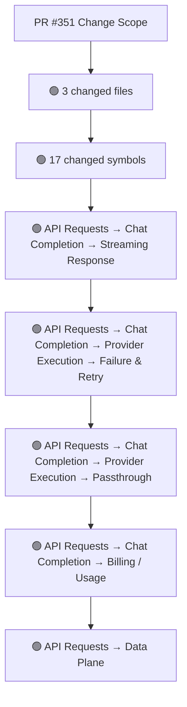
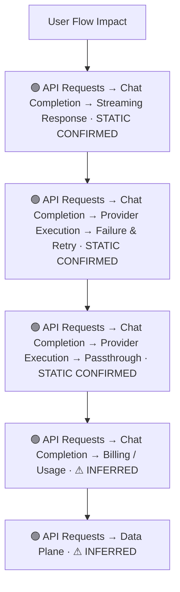
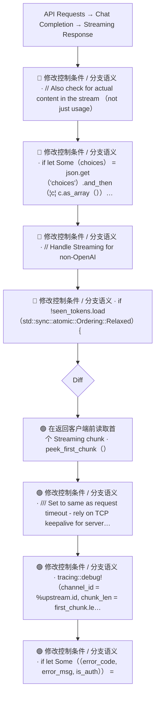
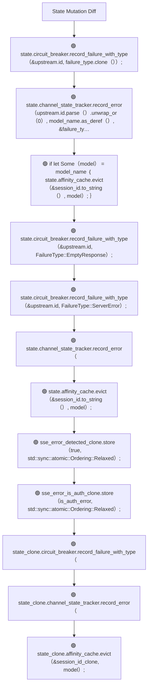
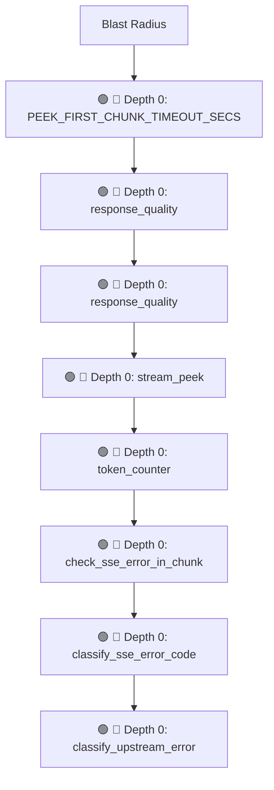

# Commit Change Atlas

## Executive Summary

| Field | Value |
|---|---|
| Commit | `4a1e718264db5a12482998be9c31bbcff381328c` |
| Base | `e4d26e7b5b2f1b2977a0b02179dfe7236435da77` |
| Merged PR | [#351](https://github.com/burncloud/burncloud/pull/351) |
| Merged At | `2026-06-19T10:45:48Z` |
| Intent | feat: Peek first chunk in streaming responses to enable retry on SSE errors |
| Intent Truth | **AUTHOR-STATED** (PR title/body) |
| Risk | **HIGH (43)** |
| Changed Files | 3 |
| Changed Symbols | 17 |
| Changed Functions | 9 |
| Changed Routes | 0 |
| Changed Test Files | 0 |
| Affected User Flows | 5 |
| API Contract | No Change |
| Database | No Change |
| External | Changed |
| Tests | ✅ Covered |

**Source Diff:** [BASE `e4d26e7b5b2f` → TARGET `4a1e718264db`](https://github.com/burncloud/burncloud/compare/e4d26e7b5b2f1b2977a0b02179dfe7236435da77...4a1e718264db5a12482998be9c31bbcff381328c)

## Intent

**Intent:** feat: Peek first chunk in streaming responses to enable retry on SSE errors

**Truth:** **AUTHOR-STATED INTENT** — PR title/body; code facts below come from BASE→TARGET diff.

[Open merged PR #351](https://github.com/burncloud/burncloud/pull/351)

## 10-Dimension Dashboard

| Dimension | Status | Risk |
|---|---|---|
| 1. Change Scope | ● Changed | MEDIUM |
| 2. User Flow | ● Changed | MEDIUM |
| 3. Runtime | ● Changed | HIGH |
| 4. Control Flow | ● Changed | HIGH |
| 5. State | ● Changed | MEDIUM |
| 6. API Contract | ○ No Change | LOW |
| 7. Database | ○ No Change | LOW |
| 8. External | ● Changed | MEDIUM |
| 9. Blast Radius | ● Changed | MEDIUM |
| 10. Tests | ○ No Change | LOW |

---

## 1. Change Scope

### What changed?

Files **3** · Symbols **17** · Functions **9** · Routes **0** · Test files **0**

### Change Scope Map

### Changed Files

- 🟡 MODIFIED `crates/router/src/lib.rs`
- 🟡 MODIFIED `crates/router/src/response_quality.rs`
- 🟢 ADDED `crates/router/src/stream_peek.rs`

### Changed Symbols

- 🟡 `const` `PEEK_FIRST_CHUNK_TIMEOUT_SECS` — `crates/router/src/lib.rs:L29`
- 🟡 `mod` `response_quality` — `crates/router/src/lib.rs:L20`
- 🟡 `mod` `response_quality` — `crates/router/src/lib.rs:L4036`
- 🟡 `mod` `stream_peek` — `crates/router/src/lib.rs:L22`
- 🟡 `mod` `token_counter` — `crates/router/src/lib.rs:L25`
- 🟡 `function` `check_sse_error_in_chunk` — `crates/router/src/response_quality.rs:L766`
- 🟡 `function` `classify_sse_error_code` — `crates/router/src/response_quality.rs:L324`
- 🟡 `function` `classify_upstream_error` — `crates/router/src/response_quality.rs:L287`
- 🟡 `function` `detect` — `crates/router/src/response_quality.rs:L168`
- 🟡 `function` `test_health_score_calculation` — `crates/router/src/response_quality.rs:L730`
- 🟡 `enum` `PeekResult` — `crates/router/src/stream_peek.rs:L15`
- 🟡 `function` `check_sse_error_in_chunk` — `crates/router/src/stream_peek.rs:L51`
- 🟡 `function` `peek_first_chunk` — `crates/router/src/stream_peek.rs:L32`
- 🟡 `function` `test_check_sse_error_auth` — `crates/router/src/stream_peek.rs:L97`
- 🟡 `function` `test_check_sse_error_normal` — `crates/router/src/stream_peek.rs:L108`
- 🟡 `mod` `tests` — `crates/router/src/stream_peek.rs:L93`
- 🟡 `type` `BoxedErrorStream` — `crates/router/src/stream_peek.rs:L12`

### Evidence

- **AFTER:** [`crates/router/src/lib.rs:L20-L20`](https://github.com/burncloud/burncloud/blob/4a1e718264db5a12482998be9c31bbcff381328c/crates/router/src/lib.rs#L20-L20)
- **AFTER:** [`crates/router/src/lib.rs:L22-L22`](https://github.com/burncloud/burncloud/blob/4a1e718264db5a12482998be9c31bbcff381328c/crates/router/src/lib.rs#L22-L22)
- **AFTER:** [`crates/router/src/lib.rs:L27-L29`](https://github.com/burncloud/burncloud/blob/4a1e718264db5a12482998be9c31bbcff381328c/crates/router/src/lib.rs#L27-L29)
- **AFTER:** [`crates/router/src/lib.rs:L2608-L2610`](https://github.com/burncloud/burncloud/blob/4a1e718264db5a12482998be9c31bbcff381328c/crates/router/src/lib.rs#L2608-L2610)
- **BASE:** [`crates/router/src/lib.rs:L2603-L2603`](https://github.com/burncloud/burncloud/blob/e4d26e7b5b2f1b2977a0b02179dfe7236435da77/crates/router/src/lib.rs#L2603-L2603)
- **AFTER:** [`crates/router/src/lib.rs:L2612-L2656`](https://github.com/burncloud/burncloud/blob/4a1e718264db5a12482998be9c31bbcff381328c/crates/router/src/lib.rs#L2612-L2656)
- **AFTER:** [`crates/router/src/lib.rs:L3293-L3296`](https://github.com/burncloud/burncloud/blob/4a1e718264db5a12482998be9c31bbcff381328c/crates/router/src/lib.rs#L3293-L3296)
- **BASE:** [`crates/router/src/lib.rs:L3241-L3241`](https://github.com/burncloud/burncloud/blob/e4d26e7b5b2f1b2977a0b02179dfe7236435da77/crates/router/src/lib.rs#L3241-L3241)

---

## 2. User Flow Impact

### Which user behaviors changed?

- **API Requests → Chat Completion → Streaming Response** — STATIC CONFIRMED
- **API Requests → Chat Completion → Provider Execution → Failure & Retry** — STATIC CONFIRMED
- **API Requests → Chat Completion → Provider Execution → Passthrough** — STATIC CONFIRMED
- **API Requests → Chat Completion → Billing / Usage** — ⚠ INFERRED
- **API Requests → Data Plane** — ⚠ INFERRED

### User Flow Impact Map

Only explicit runtime/UI entry evidence is STATIC CONFIRMED; path/module mappings remain `⚠ INFERRED` where applicable.

### Evidence

- **AFTER:** [`crates/router/src/lib.rs:L20-L20`](https://github.com/burncloud/burncloud/blob/4a1e718264db5a12482998be9c31bbcff381328c/crates/router/src/lib.rs#L20-L20)
- **AFTER:** [`crates/router/src/lib.rs:L22-L22`](https://github.com/burncloud/burncloud/blob/4a1e718264db5a12482998be9c31bbcff381328c/crates/router/src/lib.rs#L22-L22)
- **AFTER:** [`crates/router/src/lib.rs:L27-L29`](https://github.com/burncloud/burncloud/blob/4a1e718264db5a12482998be9c31bbcff381328c/crates/router/src/lib.rs#L27-L29)
- **AFTER:** [`crates/router/src/lib.rs:L2608-L2610`](https://github.com/burncloud/burncloud/blob/4a1e718264db5a12482998be9c31bbcff381328c/crates/router/src/lib.rs#L2608-L2610)
- **BASE:** [`crates/router/src/lib.rs:L2603-L2603`](https://github.com/burncloud/burncloud/blob/e4d26e7b5b2f1b2977a0b02179dfe7236435da77/crates/router/src/lib.rs#L2603-L2603)
- **AFTER:** [`crates/router/src/lib.rs:L2612-L2656`](https://github.com/burncloud/burncloud/blob/4a1e718264db5a12482998be9c31bbcff381328c/crates/router/src/lib.rs#L2612-L2656)
- **AFTER:** [`crates/router/src/lib.rs:L3293-L3296`](https://github.com/burncloud/burncloud/blob/4a1e718264db5a12482998be9c31bbcff381328c/crates/router/src/lib.rs#L3293-L3296)
- **BASE:** [`crates/router/src/lib.rs:L3241-L3241`](https://github.com/burncloud/burncloud/blob/e4d26e7b5b2f1b2977a0b02179dfe7236435da77/crates/router/src/lib.rs#L3241-L3241)

---

## 3. End-to-End Runtime Diff

### What changed at runtime?

Changed production runtime signals were detected.

### E2E Diff

### Decisions

Changed control statements are isolated in Dimension 4. Unproven edges are not invented.

### Evidence

- **AFTER:** [`crates/router/src/lib.rs:L20-L20`](https://github.com/burncloud/burncloud/blob/4a1e718264db5a12482998be9c31bbcff381328c/crates/router/src/lib.rs#L20-L20)
- **AFTER:** [`crates/router/src/lib.rs:L22-L22`](https://github.com/burncloud/burncloud/blob/4a1e718264db5a12482998be9c31bbcff381328c/crates/router/src/lib.rs#L22-L22)
- **AFTER:** [`crates/router/src/lib.rs:L27-L29`](https://github.com/burncloud/burncloud/blob/4a1e718264db5a12482998be9c31bbcff381328c/crates/router/src/lib.rs#L27-L29)
- **AFTER:** [`crates/router/src/lib.rs:L2608-L2610`](https://github.com/burncloud/burncloud/blob/4a1e718264db5a12482998be9c31bbcff381328c/crates/router/src/lib.rs#L2608-L2610)
- **BASE:** [`crates/router/src/lib.rs:L2603-L2603`](https://github.com/burncloud/burncloud/blob/e4d26e7b5b2f1b2977a0b02179dfe7236435da77/crates/router/src/lib.rs#L2603-L2603)
- **AFTER:** [`crates/router/src/lib.rs:L2612-L2656`](https://github.com/burncloud/burncloud/blob/4a1e718264db5a12482998be9c31bbcff381328c/crates/router/src/lib.rs#L2612-L2656)
- **AFTER:** [`crates/router/src/lib.rs:L3293-L3296`](https://github.com/burncloud/burncloud/blob/4a1e718264db5a12482998be9c31bbcff381328c/crates/router/src/lib.rs#L3293-L3296)
- **BASE:** [`crates/router/src/lib.rs:L3241-L3241`](https://github.com/burncloud/burncloud/blob/e4d26e7b5b2f1b2977a0b02179dfe7236435da77/crates/router/src/lib.rs#L3241-L3241)

---

## 4. ICFG Diff

### Which control-flow semantics changed?

```mermaid
flowchart TD
  S["Changed Control Region"]
  R1["🔴 // Also check for actual content in the stream （not just usage）"]
  S --> R1
  R2["🔴 if let Some（choices） = json.get（'choices'）.and_then（¦c¦ c.as_array（）） ｛"]
  R1 --> R2
  R3["🔴 // Handle Streaming for non-OpenAI"]
  R2 --> R3
  R4["🔴 if !seen_tokens.load（std::sync::atomic::Ordering::Relaxed） ｛"]
  R3 --> R4
  R4 --> D{"Diff"}
  A5["🟢 /// Set to same as request timeout - rely on TCP keepalive for server crash detection."]
  D --> A5
  A6["🟢 match crate::stream_peek::peek_first_chunk（body_stream_for_peek, peek_timeout）.await ｛"]
  A5 --> A6
  A7["🟢 tracing::debug!（channel_id = %upstream.id, chunk_len = first_chunk.len（）, 'Peek: got first chunk, checking fo…"]
  A6 --> A7
  A8["🟢 if let Some（（error_code, error_msg, is_auth）） ="]
  A7 --> A8
  A9["🟢 let failure_type = if is_auth ｛ FailureType::AuthFailed ｝ else ｛ FailureType::ServerError ｝;"]
  A8 --> A9
  A10["🟢 if let Some（model） = model_name ｛ state.affinity_cache.evict（&amp;session_id.to_string（）, model）; ｝"]
  A9 --> A10
  A11["🟢 if peek_error_handled ｛ continue; ｝"]
  A10 --> A11
  A12["🟢 // Peek and check for errors"]
  A11 --> A12
  A13["🟢 // Error detected - record and mark for retry"]
  A12 --> A13
  A14["🟢 if let Some（model） = model_name ｛"]
  A13 --> A14
  A15["🟢 // Return empty stream since we will continue anyway"]
  A14 --> A15
  A16["🟢 if peek_error_handled ｛"]
  A15 --> A16
```

⚠ Diagram contains changed control statements only; unproven interprocedural edges are not invented.

### Evidence

- **AFTER:** [`crates/router/src/lib.rs:L27-L29`](https://github.com/burncloud/burncloud/blob/4a1e718264db5a12482998be9c31bbcff381328c/crates/router/src/lib.rs#L27-L29)
- **AFTER:** [`crates/router/src/lib.rs:L2612-L2656`](https://github.com/burncloud/burncloud/blob/4a1e718264db5a12482998be9c31bbcff381328c/crates/router/src/lib.rs#L2612-L2656)
- **AFTER:** [`crates/router/src/lib.rs:L3298-L3361`](https://github.com/burncloud/burncloud/blob/4a1e718264db5a12482998be9c31bbcff381328c/crates/router/src/lib.rs#L3298-L3361)
- **AFTER:** [`crates/router/src/lib.rs:L3376-L3384`](https://github.com/burncloud/burncloud/blob/4a1e718264db5a12482998be9c31bbcff381328c/crates/router/src/lib.rs#L3376-L3384)
- **AFTER:** [`crates/router/src/lib.rs:L3400-L3400`](https://github.com/burncloud/burncloud/blob/4a1e718264db5a12482998be9c31bbcff381328c/crates/router/src/lib.rs#L3400-L3400)
- **BASE:** [`crates/router/src/lib.rs:L3272-L3272`](https://github.com/burncloud/burncloud/blob/e4d26e7b5b2f1b2977a0b02179dfe7236435da77/crates/router/src/lib.rs#L3272-L3272)
- **AFTER:** [`crates/router/src/lib.rs:L3412-L3442`](https://github.com/burncloud/burncloud/blob/4a1e718264db5a12482998be9c31bbcff381328c/crates/router/src/lib.rs#L3412-L3442)
- **BASE:** [`crates/router/src/lib.rs:L3284-L3284`](https://github.com/burncloud/burncloud/blob/e4d26e7b5b2f1b2977a0b02179dfe7236435da77/crates/router/src/lib.rs#L3284-L3284)

---

## 5. State Mutation Diff

### What state behavior changed?

| Before | After |
|---|---|
| — | 🟢 state.circuit_breaker.record_failure_with_type（&upstream.id, failure_type.clone（））; |
| — | 🟢 state.channel_state_tracker.record_error（upstream.id.parse（）.unwrap_or（0）, model_name.as_deref（）, &failure_type, &forma… |
| — | 🟢 if let Some（model） = model_name ｛ state.affinity_cache.evict（&session_id.to_string（）, model）; ｝ |
| — | 🟢 state.circuit_breaker.record_failure_with_type（&upstream.id, FailureType::EmptyResponse）; |
| — | 🟢 state.circuit_breaker.record_failure_with_type（&upstream.id, FailureType::ServerError）; |
| — | 🟢 state.channel_state_tracker.record_error（ |
| — | 🟢 state.affinity_cache.evict（&session_id.to_string（）, model）; |
| — | 🟢 sse_error_detected_clone.store（true, std::sync::atomic::Ordering::Relaxed）; |
| — | 🟢 sse_error_is_auth_clone.store（is_auth_error, std::sync::atomic::Ordering::Relaxed）; |
| — | 🟢 state_clone.circuit_breaker.record_failure_with_type（ |
| — | 🟢 state_clone.channel_state_tracker.record_error（ |
| — | 🟢 state_clone.affinity_cache.evict（&session_id_clone, model）; |

### State Diff

### Evidence

- **AFTER:** [`crates/router/src/lib.rs:L2612-L2656`](https://github.com/burncloud/burncloud/blob/4a1e718264db5a12482998be9c31bbcff381328c/crates/router/src/lib.rs#L2612-L2656)
- **AFTER:** [`crates/router/src/lib.rs:L3298-L3361`](https://github.com/burncloud/burncloud/blob/4a1e718264db5a12482998be9c31bbcff381328c/crates/router/src/lib.rs#L3298-L3361)
- **AFTER:** [`crates/router/src/lib.rs:L3412-L3442`](https://github.com/burncloud/burncloud/blob/4a1e718264db5a12482998be9c31bbcff381328c/crates/router/src/lib.rs#L3412-L3442)
- **BASE:** [`crates/router/src/lib.rs:L3284-L3284`](https://github.com/burncloud/burncloud/blob/e4d26e7b5b2f1b2977a0b02179dfe7236435da77/crates/router/src/lib.rs#L3284-L3284)
- **AFTER:** [`crates/router/src/lib.rs:L3550-L3608`](https://github.com/burncloud/burncloud/blob/4a1e718264db5a12482998be9c31bbcff381328c/crates/router/src/lib.rs#L3550-L3608)
- **AFTER:** [`crates/router/src/lib.rs:L3665-L3695`](https://github.com/burncloud/burncloud/blob/4a1e718264db5a12482998be9c31bbcff381328c/crates/router/src/lib.rs#L3665-L3695)
- **BASE:** [`crates/router/src/lib.rs:L3436-L3436`](https://github.com/burncloud/burncloud/blob/e4d26e7b5b2f1b2977a0b02179dfe7236435da77/crates/router/src/lib.rs#L3436-L3436)
- **AFTER:** [`crates/router/src/lib.rs:L3722-L3755`](https://github.com/burncloud/burncloud/blob/4a1e718264db5a12482998be9c31bbcff381328c/crates/router/src/lib.rs#L3722-L3755)

---

## 6. API Contract Diff

### API changes

**⚪ NO API CONTRACT CHANGE DETECTED**

**API Contract: ⚪ NO CHANGE DETECTED** by complete diff scan.

### Evidence

- **COMPLETE DIFF SCAN:** No route/status/header/content-type API-contract marker changed.
- [Open complete BASE → TARGET diff](https://github.com/burncloud/burncloud/compare/e4d26e7b5b2f1b2977a0b02179dfe7236435da77...4a1e718264db5a12482998be9c31bbcff381328c)

---

## 7. Database / Persistence Diff

### Persistence changes

**⚪ NO DATABASE / PERSISTENCE CHANGE DETECTED**

**⚪ NO DATABASE / PERSISTENCE CHANGE DETECTED** by complete diff scan.

### Evidence

- **COMPLETE DIFF SCAN:** No migration/database/SQL persistence hunk changed.
- [Open complete BASE → TARGET diff](https://github.com/burncloud/burncloud/compare/e4d26e7b5b2f1b2977a0b02179dfe7236435da77...4a1e718264db5a12482998be9c31bbcff381328c)

---

## 8. External Dependency Diff

### External behavior changes

| Before | After |
|---|---|
| — | 🟢 futures::stream::empty::‹Result‹axum::body::Bytes, reqwest::Error››（）.boxed（） |
| — | 🟢 pub type BoxedErrorStream = Pin‹Box‹dyn Stream‹Item = Result‹Bytes, reqwest::Error›› + Send››; |
| — | 🟢 Error（reqwest::Error）, |
| — | 🟢 S: Stream‹Item = Result‹Bytes, reqwest::Error›› + Send + 'static, |
| — | 🟢 match tokio::time::timeout（timeout, stream.next（））.await ｛ |

**🟣 DYNAMIC:** concrete Provider/Adaptor target remains runtime-dependent.

### Evidence

- **AFTER:** [`crates/router/src/lib.rs:L2612-L2656`](https://github.com/burncloud/burncloud/blob/4a1e718264db5a12482998be9c31bbcff381328c/crates/router/src/lib.rs#L2612-L2656)
- **AFTER:** [`crates/router/src/lib.rs:L3298-L3361`](https://github.com/burncloud/burncloud/blob/4a1e718264db5a12482998be9c31bbcff381328c/crates/router/src/lib.rs#L3298-L3361)
- **AFTER:** [`crates/router/src/lib.rs:L3550-L3608`](https://github.com/burncloud/burncloud/blob/4a1e718264db5a12482998be9c31bbcff381328c/crates/router/src/lib.rs#L3550-L3608)
- **AFTER:** [`crates/router/src/stream_peek.rs:L1-L113`](https://github.com/burncloud/burncloud/blob/4a1e718264db5a12482998be9c31bbcff381328c/crates/router/src/stream_peek.rs#L1-L113)

---

## 9. Blast Radius

### What else may be affected?

| Depth | Impact | Evidence location |
|---|---|---|
| 🔴 Depth 0 | PEEK_FIRST_CHUNK_TIMEOUT_SECS | `crates/router/src/lib.rs:L29` |
| 🔴 Depth 0 | response_quality | `crates/router/src/lib.rs:L20` |
| 🔴 Depth 0 | response_quality | `crates/router/src/lib.rs:L4036` |
| 🔴 Depth 0 | stream_peek | `crates/router/src/lib.rs:L22` |
| 🔴 Depth 0 | token_counter | `crates/router/src/lib.rs:L25` |
| 🔴 Depth 0 | check_sse_error_in_chunk | `crates/router/src/response_quality.rs:L766` |
| 🔴 Depth 0 | classify_sse_error_code | `crates/router/src/response_quality.rs:L324` |
| 🔴 Depth 0 | classify_upstream_error | `crates/router/src/response_quality.rs:L287` |

### Blast Radius Map

🔴 Depth 0 is direct. 🟡 lexical references are **impact candidates**, not compiler-proven call edges. Dynamic dispatch is never promoted to a confirmed edge.

### Evidence

- **AFTER:** [`crates/router/src/lib.rs:L20-L20`](https://github.com/burncloud/burncloud/blob/4a1e718264db5a12482998be9c31bbcff381328c/crates/router/src/lib.rs#L20-L20)
- **AFTER:** [`crates/router/src/lib.rs:L22-L22`](https://github.com/burncloud/burncloud/blob/4a1e718264db5a12482998be9c31bbcff381328c/crates/router/src/lib.rs#L22-L22)
- **AFTER:** [`crates/router/src/lib.rs:L27-L29`](https://github.com/burncloud/burncloud/blob/4a1e718264db5a12482998be9c31bbcff381328c/crates/router/src/lib.rs#L27-L29)
- **AFTER:** [`crates/router/src/lib.rs:L2608-L2610`](https://github.com/burncloud/burncloud/blob/4a1e718264db5a12482998be9c31bbcff381328c/crates/router/src/lib.rs#L2608-L2610)
- **BASE:** [`crates/router/src/lib.rs:L2603-L2603`](https://github.com/burncloud/burncloud/blob/e4d26e7b5b2f1b2977a0b02179dfe7236435da77/crates/router/src/lib.rs#L2603-L2603)
- **AFTER:** [`crates/router/src/lib.rs:L2612-L2656`](https://github.com/burncloud/burncloud/blob/4a1e718264db5a12482998be9c31bbcff381328c/crates/router/src/lib.rs#L2612-L2656)
- **AFTER:** [`crates/router/src/lib.rs:L3293-L3296`](https://github.com/burncloud/burncloud/blob/4a1e718264db5a12482998be9c31bbcff381328c/crates/router/src/lib.rs#L3293-L3296)

---

## 10. Test Coverage & Evidence

### Coverage Matrix

**Overall:** ✅ Covered

- Changed test files: **0**
- Lexical references from changed symbols into tests: **2**

### Missing Coverage

- No additional missing direct-coverage claim beyond evidence above.

### Source Evidence

- **COMPLETE DIFF SCAN:** No changed test hunk; coverage status uses changed tests plus lexical test references.
- [Open complete BASE → TARGET diff](https://github.com/burncloud/burncloud/compare/e4d26e7b5b2f1b2977a0b02179dfe7236435da77...4a1e718264db5a12482998be9c31bbcff381328c)

---

## Risk Assessment

**Score: 43 → HIGH**

### Risk Drivers

- `Authentication change` **+5**
- `Billing change` **+5**
- `Quota change` **+5**
- `Routing decision` **+4**
- `Provider request` **+4**
- `Streaming` **+4**
- `Retry/failover` **+4**
- `State mutation` **+3**
- `Dynamic dispatch boundary` **+3**
- `Cache behavior` **+3**
- `Missing direct changed tests` **+3**

The score is rule-based, not an LLM impression.

## Reviewer Checklist

- [ ] Intent 与代码变化一致
- [ ] User Flow impact 已确认
- [ ] Runtime Diff 已确认
- [ ] Control-flow changes 已确认
- [ ] State mutation 已确认
- [ ] API contract 已确认
- [ ] Database behavior 已确认
- [ ] External Provider behavior 已确认
- [ ] Blast Radius 可接受
- [ ] Tests 覆盖 changed runtime paths
- [ ] Dynamic / Inferred relationships 已正确标记
- [ ] Source Evidence 可追溯

## Source Diff Entry Points

- [Complete BASE → TARGET diff](https://github.com/burncloud/burncloud/compare/e4d26e7b5b2f1b2977a0b02179dfe7236435da77...4a1e718264db5a12482998be9c31bbcff381328c)
- [Merged PR #351](https://github.com/burncloud/burncloud/pull/351)
