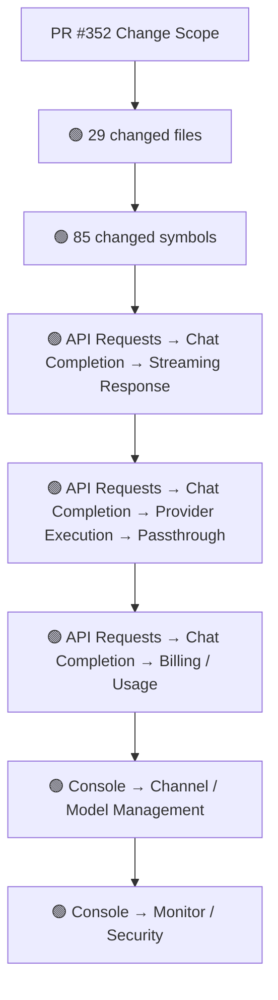
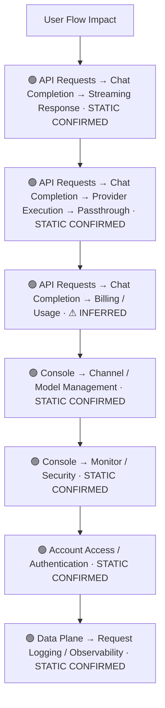
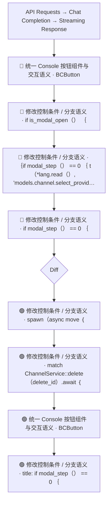
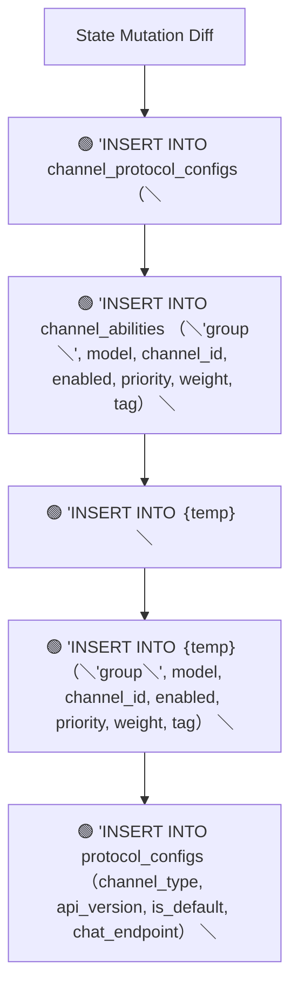
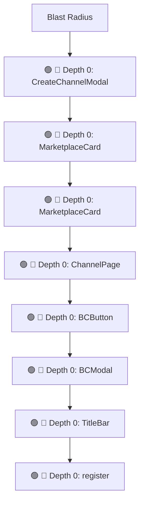

# Commit Change Atlas

## Executive Summary

| Field | Value |
|---|---|
| Commit | `5c0772cea399af31d96d09d040299ddf2dc37a5d` |
| Base | `4a1e718264db5a12482998be9c31bbcff381328c` |
| Merged PR | [#352](https://github.com/burncloud/burncloud/pull/352) |
| Merged At | `2026-07-05T15:32:47Z` |
| Intent | fix(client,auth,db): unify JWT secret, fix modals, and polish desktop UI |
| Intent Truth | **AUTHOR-STATED** (PR title/body) |
| Risk | **HIGH (48)** |
| Changed Files | 29 |
| Changed Symbols | 85 |
| Changed Functions | 70 |
| Changed Routes | 1 |
| Changed Test Files | 2 |
| Affected User Flows | 7 |
| API Contract | Changed |
| Database | Changed |
| External | Changed |
| Tests | 🟢 New Coverage |

**Source Diff:** [BASE `4a1e718264db` → TARGET `5c0772cea399`](https://github.com/burncloud/burncloud/compare/4a1e718264db5a12482998be9c31bbcff381328c...5c0772cea399af31d96d09d040299ddf2dc37a5d)

## Intent

**Intent:** fix(client,auth,db): unify JWT secret, fix modals, and polish desktop UI

**Truth:** **AUTHOR-STATED INTENT** — PR title/body; code facts below come from BASE→TARGET diff.

[Open merged PR #352](https://github.com/burncloud/burncloud/pull/352)

## 10-Dimension Dashboard

| Dimension | Status | Risk |
|---|---|---|
| 1. Change Scope | ● Changed | MEDIUM |
| 2. User Flow | ● Changed | MEDIUM |
| 3. Runtime | ● Changed | HIGH |
| 4. Control Flow | ● Changed | HIGH |
| 5. State | ● Changed | MEDIUM |
| 6. API Contract | ● Changed | HIGH |
| 7. Database | ● Changed | HIGH |
| 8. External | ● Changed | MEDIUM |
| 9. Blast Radius | ● Changed | MEDIUM |
| 10. Tests | ● Changed | HIGH |

---

## 1. Change Scope

### What changed?

Files **29** · Symbols **85** · Functions **70** · Routes **1** · Test files **2**

### Change Scope Map

### Changed Files

- 🟡 MODIFIED `crates/client/crates/client-api/src/api.rs`
- 🟡 MODIFIED `crates/client/crates/client-connect/src/lib.rs`
- 🟡 MODIFIED `crates/client/crates/client-models/src/models.rs`
- 🟡 MODIFIED `crates/client/crates/client-monitor/src/monitor.rs`
- 🟡 MODIFIED `crates/client/crates/client-shared/src/components/bc_button.rs`
- 🟡 MODIFIED `crates/client/crates/client-shared/src/components/bc_modal.rs`
- 🟡 MODIFIED `crates/client/crates/client-shared/src/components/title_bar.rs`
- 🟡 MODIFIED `crates/client/crates/client-shared/src/services/auth_service.rs`
- 🟡 MODIFIED `crates/client/crates/client-shared/src/services/channel_service.rs`
- 🟡 MODIFIED `crates/client/crates/client-shared/src/services/deploy_service.rs`
- 🟡 MODIFIED `crates/client/crates/client-shared/src/services/log_service.rs`
- 🟡 MODIFIED `crates/client/crates/client-shared/src/services/monitor_service.rs`
- 🟡 MODIFIED `crates/client/crates/client-shared/src/services/user_service.rs`
- 🟡 MODIFIED `crates/client/crates/client-shared/src/styles.rs`
- 🟢 ADDED `crates/client/crates/client-shared/src/utils/auth_http.rs`
- 🟡 MODIFIED `crates/client/crates/client-shared/src/utils/mod.rs`
- 🟡 MODIFIED `crates/client/src/components/guest_layout.rs`
- 🟡 MODIFIED `crates/client/src/components/layout.rs`
- 🟡 MODIFIED `crates/client/src/components/mod.rs`
- 🟢 ADDED `crates/client/src/components/sidebar.rs`
- 🟡 MODIFIED `crates/common/src/constants.rs`
- 🟡 MODIFIED `crates/database/migrations/sqlite/0017_fix_bool_columns.sql`
- 🟡 MODIFIED `crates/database/src/migration/mod.rs`
- 🟢 ADDED `crates/database/src/migration/sqlite_0017.rs`
- 🟡 MODIFIED `crates/server/Cargo.toml`

### Changed Symbols

- 🟡 `function` `CreateChannelModal` — `crates/client/crates/client-api/src/api.rs:L160`
- 🟡 `function` `MarketplaceCard` — `crates/client/crates/client-connect/src/lib.rs:L374`
- 🟡 `function` `MarketplaceCard` — `crates/client/crates/client-connect/src/lib.rs:L400`
- 🟡 `function` `ChannelPage` — `crates/client/crates/client-models/src/models.rs:L269`
- 🟡 `function` `BCButton` — `crates/client/crates/client-shared/src/components/bc_button.rs:L24`
- 🟡 `function` `BCModal` — `crates/client/crates/client-shared/src/components/bc_modal.rs:L4`
- 🟡 `function` `TitleBar` — `crates/client/crates/client-shared/src/components/title_bar.rs:L8`
- 🟡 `function` `register` — `crates/client/crates/client-shared/src/services/auth_service.rs:L23`
- 🟡 `function` `register` — `crates/client/crates/client-shared/src/services/auth_service.rs:L24`
- 🟡 `function` `create` — `crates/client/crates/client-shared/src/services/channel_service.rs:L56`
- 🟡 `function` `create` — `crates/client/crates/client-shared/src/services/channel_service.rs:L60`
- 🟡 `function` `delete` — `crates/client/crates/client-shared/src/services/channel_service.rs:L89`
- 🟡 `function` `list` — `crates/client/crates/client-shared/src/services/channel_service.rs:L38`
- 🟡 `function` `list` — `crates/client/crates/client-shared/src/services/channel_service.rs:L39`
- 🟡 `function` `update` — `crates/client/crates/client-shared/src/services/channel_service.rs:L73`
- 🟡 `function` `update` — `crates/client/crates/client-shared/src/services/channel_service.rs:L75`
- 🟡 `function` `deploy` — `crates/client/crates/client-shared/src/services/deploy_service.rs:L36`
- 🟡 `function` `deploy` — `crates/client/crates/client-shared/src/services/deploy_service.rs:L37`
- 🟡 `function` `list` — `crates/client/crates/client-shared/src/services/log_service.rs:L23`
- 🟡 `function` `list` — `crates/client/crates/client-shared/src/services/log_service.rs:L24`
- 🟡 `function` `emergency_circuit_break` — `crates/client/crates/client-shared/src/services/monitor_service.rs:L213`
- 🟡 `function` `emergency_circuit_break` — `crates/client/crates/client-shared/src/services/monitor_service.rs:L223`
- 🟡 `function` `get_circuit_breaker_status` — `crates/client/crates/client-shared/src/services/monitor_service.rs:L236`
- 🟡 `function` `get_circuit_breaker_status` — `crates/client/crates/client-shared/src/services/monitor_service.rs:L248`
- 🟡 `function` `get_filter_config` — `crates/client/crates/client-shared/src/services/monitor_service.rs:L172`

### Evidence

- **AFTER:** [`crates/client/crates/client-api/src/api.rs:L196-L196`](https://github.com/burncloud/burncloud/blob/5c0772cea399af31d96d09d040299ddf2dc37a5d/crates/client/crates/client-api/src/api.rs#L196-L196)
- **BASE:** [`crates/client/crates/client-api/src/api.rs:L196-L197`](https://github.com/burncloud/burncloud/blob/4a1e718264db5a12482998be9c31bbcff381328c/crates/client/crates/client-api/src/api.rs#L196-L197)
- **AFTER:** [`crates/client/crates/client-api/src/api.rs:L201-L201`](https://github.com/burncloud/burncloud/blob/5c0772cea399af31d96d09d040299ddf2dc37a5d/crates/client/crates/client-api/src/api.rs#L201-L201)
- **BASE:** [`crates/client/crates/client-api/src/api.rs:L202-L202`](https://github.com/burncloud/burncloud/blob/4a1e718264db5a12482998be9c31bbcff381328c/crates/client/crates/client-api/src/api.rs#L202-L202)
- **AFTER:** [`crates/client/crates/client-connect/src/lib.rs:L248-L267`](https://github.com/burncloud/burncloud/blob/5c0772cea399af31d96d09d040299ddf2dc37a5d/crates/client/crates/client-connect/src/lib.rs#L248-L267)
- **BASE:** [`crates/client/crates/client-connect/src/lib.rs:L248-L248`](https://github.com/burncloud/burncloud/blob/4a1e718264db5a12482998be9c31bbcff381328c/crates/client/crates/client-connect/src/lib.rs#L248-L248)
- **AFTER:** [`crates/client/crates/client-connect/src/lib.rs:L283-L287`](https://github.com/burncloud/burncloud/blob/5c0772cea399af31d96d09d040299ddf2dc37a5d/crates/client/crates/client-connect/src/lib.rs#L283-L287)
- **BASE:** [`crates/client/crates/client-connect/src/lib.rs:L264-L264`](https://github.com/burncloud/burncloud/blob/4a1e718264db5a12482998be9c31bbcff381328c/crates/client/crates/client-connect/src/lib.rs#L264-L264)

---

## 2. User Flow Impact

### Which user behaviors changed?

- **API Requests → Chat Completion → Streaming Response** — STATIC CONFIRMED
- **API Requests → Chat Completion → Provider Execution → Passthrough** — STATIC CONFIRMED
- **API Requests → Chat Completion → Billing / Usage** — ⚠ INFERRED
- **Console → Channel / Model Management** — STATIC CONFIRMED
- **Console → Monitor / Security** — STATIC CONFIRMED
- **Account Access / Authentication** — STATIC CONFIRMED
- **Data Plane → Request Logging / Observability** — STATIC CONFIRMED

### User Flow Impact Map

Only explicit runtime/UI entry evidence is STATIC CONFIRMED; path/module mappings remain `⚠ INFERRED` where applicable.

### Evidence

- **AFTER:** [`crates/client/crates/client-api/src/api.rs:L196-L196`](https://github.com/burncloud/burncloud/blob/5c0772cea399af31d96d09d040299ddf2dc37a5d/crates/client/crates/client-api/src/api.rs#L196-L196)
- **BASE:** [`crates/client/crates/client-api/src/api.rs:L196-L197`](https://github.com/burncloud/burncloud/blob/4a1e718264db5a12482998be9c31bbcff381328c/crates/client/crates/client-api/src/api.rs#L196-L197)
- **AFTER:** [`crates/client/crates/client-api/src/api.rs:L201-L201`](https://github.com/burncloud/burncloud/blob/5c0772cea399af31d96d09d040299ddf2dc37a5d/crates/client/crates/client-api/src/api.rs#L201-L201)
- **BASE:** [`crates/client/crates/client-api/src/api.rs:L202-L202`](https://github.com/burncloud/burncloud/blob/4a1e718264db5a12482998be9c31bbcff381328c/crates/client/crates/client-api/src/api.rs#L202-L202)
- **AFTER:** [`crates/client/crates/client-connect/src/lib.rs:L248-L267`](https://github.com/burncloud/burncloud/blob/5c0772cea399af31d96d09d040299ddf2dc37a5d/crates/client/crates/client-connect/src/lib.rs#L248-L267)
- **BASE:** [`crates/client/crates/client-connect/src/lib.rs:L248-L248`](https://github.com/burncloud/burncloud/blob/4a1e718264db5a12482998be9c31bbcff381328c/crates/client/crates/client-connect/src/lib.rs#L248-L248)
- **AFTER:** [`crates/client/crates/client-connect/src/lib.rs:L283-L287`](https://github.com/burncloud/burncloud/blob/5c0772cea399af31d96d09d040299ddf2dc37a5d/crates/client/crates/client-connect/src/lib.rs#L283-L287)
- **BASE:** [`crates/client/crates/client-connect/src/lib.rs:L264-L264`](https://github.com/burncloud/burncloud/blob/4a1e718264db5a12482998be9c31bbcff381328c/crates/client/crates/client-connect/src/lib.rs#L264-L264)

---

## 3. End-to-End Runtime Diff

### What changed at runtime?

Changed production runtime signals were detected.

### E2E Diff

### Decisions

Changed control statements are isolated in Dimension 4. Unproven edges are not invented.

### Evidence

- **AFTER:** [`crates/client/crates/client-api/src/api.rs:L196-L196`](https://github.com/burncloud/burncloud/blob/5c0772cea399af31d96d09d040299ddf2dc37a5d/crates/client/crates/client-api/src/api.rs#L196-L196)
- **BASE:** [`crates/client/crates/client-api/src/api.rs:L196-L197`](https://github.com/burncloud/burncloud/blob/4a1e718264db5a12482998be9c31bbcff381328c/crates/client/crates/client-api/src/api.rs#L196-L197)
- **AFTER:** [`crates/client/crates/client-api/src/api.rs:L201-L201`](https://github.com/burncloud/burncloud/blob/5c0772cea399af31d96d09d040299ddf2dc37a5d/crates/client/crates/client-api/src/api.rs#L201-L201)
- **BASE:** [`crates/client/crates/client-api/src/api.rs:L202-L202`](https://github.com/burncloud/burncloud/blob/4a1e718264db5a12482998be9c31bbcff381328c/crates/client/crates/client-api/src/api.rs#L202-L202)
- **AFTER:** [`crates/client/crates/client-connect/src/lib.rs:L248-L267`](https://github.com/burncloud/burncloud/blob/5c0772cea399af31d96d09d040299ddf2dc37a5d/crates/client/crates/client-connect/src/lib.rs#L248-L267)
- **BASE:** [`crates/client/crates/client-connect/src/lib.rs:L248-L248`](https://github.com/burncloud/burncloud/blob/4a1e718264db5a12482998be9c31bbcff381328c/crates/client/crates/client-connect/src/lib.rs#L248-L248)
- **AFTER:** [`crates/client/crates/client-connect/src/lib.rs:L283-L287`](https://github.com/burncloud/burncloud/blob/5c0772cea399af31d96d09d040299ddf2dc37a5d/crates/client/crates/client-connect/src/lib.rs#L283-L287)
- **BASE:** [`crates/client/crates/client-connect/src/lib.rs:L264-L264`](https://github.com/burncloud/burncloud/blob/4a1e718264db5a12482998be9c31bbcff381328c/crates/client/crates/client-connect/src/lib.rs#L264-L264)

---

## 4. ICFG Diff

### Which control-flow semantics changed?

```mermaid
flowchart TD
  S["Changed Control Region"]
  R1["🔴 if is_modal_open（） ｛"]
  S --> R1
  R2["🔴 ｛if modal_step（） == 0 ｛ t（*lang.read（）, 'models.channel.select_provider'）.to_string（） ｝ else ｛ t（*lang.read（）…"]
  R1 --> R2
  R3["🔴 if modal_step（） == 0 ｛"]
  R2 --> R3
  R4["🔴 for p in ［ProviderType::OpenAI, ProviderType::Anthropic, ProviderType::Google, ProviderType::Aws, ProviderTyp…"]
  R3 --> R4
  R5["🔴 if modal_step（） == 1 ｛"]
  R4 --> R5
  R6["🔴 if is_delete_modal_open（） ｛"]
  R5 --> R6
  R7["🔴 let modal_class = if open ｛"]
  R6 --> R7
  R8["🔴 /* Show scrollbars on hover for scrollable containers */"]
  R7 --> R8
  R8 --> D{"Diff"}
  A9["🟢 spawn（async move ｛"]
  D --> A9
  A10["🟢 match ChannelService::delete（delete_id）.await ｛"]
  A9 --> A10
  A11["🟢 title: if modal_step（） == 0 ｛"]
  A10 --> A11
  A12["🟢 if modal_step（） == 1 ｛"]
  A11 --> A12
  A13["🟢 if modal_step（） == 0 ｛"]
  A12 --> A13
  A14["🟢 for p in ［ProviderType::OpenAI, ProviderType::Anthropic, ProviderType::Google, ProviderType::Aws, ProviderTyp…"]
  A13 --> A14
  A15["🟢 if !open ｛"]
  A14 --> A15
  A16["🟢 return rsx! ｛｝;"]
  A15 --> A16
  A17["🟢 let width_class = if wide ｛ 'max-w-2xl' ｝ else ｛ 'max-w-lg' ｝;"]
  A16 --> A17
  A18["🟢 if let Some（footer） = footer ｛"]
  A17 --> A18
  A19["🟢 title: if is_maximized（） ｛ 'Restore' ｝ else ｛ 'Maximize' ｝,"]
  A18 --> A19
  A20["🟢 aria_label: if is_maximized（） ｛ 'Restore window' ｝ else ｛ 'Maximize window' ｝,"]
  A19 --> A20
```

⚠ Diagram contains changed control statements only; unproven interprocedural edges are not invented.

### Evidence

- **AFTER:** [`crates/client/crates/client-connect/src/lib.rs:L248-L267`](https://github.com/burncloud/burncloud/blob/5c0772cea399af31d96d09d040299ddf2dc37a5d/crates/client/crates/client-connect/src/lib.rs#L248-L267)
- **BASE:** [`crates/client/crates/client-connect/src/lib.rs:L248-L248`](https://github.com/burncloud/burncloud/blob/4a1e718264db5a12482998be9c31bbcff381328c/crates/client/crates/client-connect/src/lib.rs#L248-L248)
- **AFTER:** [`crates/client/crates/client-models/src/models.rs:L617-L632`](https://github.com/burncloud/burncloud/blob/5c0772cea399af31d96d09d040299ddf2dc37a5d/crates/client/crates/client-models/src/models.rs#L617-L632)
- **BASE:** [`crates/client/crates/client-models/src/models.rs:L611-L631`](https://github.com/burncloud/burncloud/blob/4a1e718264db5a12482998be9c31bbcff381328c/crates/client/crates/client-models/src/models.rs#L611-L631)
- **AFTER:** [`crates/client/crates/client-models/src/models.rs:L634-L648`](https://github.com/burncloud/burncloud/blob/5c0772cea399af31d96d09d040299ddf2dc37a5d/crates/client/crates/client-models/src/models.rs#L634-L648)
- **BASE:** [`crates/client/crates/client-models/src/models.rs:L633-L656`](https://github.com/burncloud/burncloud/blob/4a1e718264db5a12482998be9c31bbcff381328c/crates/client/crates/client-models/src/models.rs#L633-L656)
- **AFTER:** [`crates/client/crates/client-models/src/models.rs:L650-L659`](https://github.com/burncloud/burncloud/blob/5c0772cea399af31d96d09d040299ddf2dc37a5d/crates/client/crates/client-models/src/models.rs#L650-L659)
- **BASE:** [`crates/client/crates/client-models/src/models.rs:L658-L677`](https://github.com/burncloud/burncloud/blob/4a1e718264db5a12482998be9c31bbcff381328c/crates/client/crates/client-models/src/models.rs#L658-L677)

---

## 5. State Mutation Diff

### What state behavior changed?

| Before | After |
|---|---|
| — | 🟢 'INSERT INTO channel_protocol_configs （＼ |
| — | 🟢 'INSERT INTO channel_abilities （＼'group＼', model, channel_id, enabled, priority, weight, tag） ＼ |
| — | 🟢 'INSERT INTO ｛temp｝ ＼ |
| — | 🟢 'INSERT INTO ｛temp｝ （＼'group＼', model, channel_id, enabled, priority, weight, tag） ＼ |
| — | 🟢 'INSERT INTO protocol_configs （channel_type, api_version, is_default, chat_endpoint） ＼ |

### State Diff

### Evidence

- **AFTER:** [`crates/database/migrations/sqlite/0017_fix_bool_columns.sql:L1-L3`](https://github.com/burncloud/burncloud/blob/5c0772cea399af31d96d09d040299ddf2dc37a5d/crates/database/migrations/sqlite/0017_fix_bool_columns.sql#L1-L3)
- **BASE:** [`crates/database/migrations/sqlite/0017_fix_bool_columns.sql:L1-L41`](https://github.com/burncloud/burncloud/blob/4a1e718264db5a12482998be9c31bbcff381328c/crates/database/migrations/sqlite/0017_fix_bool_columns.sql#L1-L41)
- **AFTER:** [`crates/database/src/migration/sqlite_0017.rs:L1-L309`](https://github.com/burncloud/burncloud/blob/5c0772cea399af31d96d09d040299ddf2dc37a5d/crates/database/src/migration/sqlite_0017.rs#L1-L309)

---

## 6. API Contract Diff

### API changes

| Before | After |
|---|---|
| — | 🟢 /// Attach ′Authorization: Bearer …′ when a token is available. |
| — | 🟢 Some（token） =› request.header（'Authorization', format!（'Bearer ｛token｝'））, |
| — | 🟢 /v1/chat |

API Contract changes are never rated below MEDIUM.

### Evidence

- **AFTER:** [`crates/client/crates/client-shared/src/utils/auth_http.rs:L1-L16`](https://github.com/burncloud/burncloud/blob/5c0772cea399af31d96d09d040299ddf2dc37a5d/crates/client/crates/client-shared/src/utils/auth_http.rs#L1-L16)
- **AFTER:** [`crates/database/src/migration/sqlite_0017.rs:L1-L309`](https://github.com/burncloud/burncloud/blob/5c0772cea399af31d96d09d040299ddf2dc37a5d/crates/database/src/migration/sqlite_0017.rs#L1-L309)

---

## 7. Database / Persistence Diff

### Persistence changes

| Before | After |
|---|---|
| 🔴 div ｛ class: 'w-full h-8 flex items-center justify-between select-none app-drag-region px-4', | 🟢 div ｛ class: 'bc-titlebar w-full flex items-center justify-between select-none app-drag-region', |
| 🔴 div ｛ class: 'flex h-screen w-screen bg-base-100 text-base-content overflow-hidden select-none relative', 'data-theme':… | 🟢 user-select: none; |
| 🔴 CREATE TABLE channel_protocol_configs_new （ | 🟢 div ｛ class: 'relative flex flex-col h-screen w-screen bg-base-100 text-base-content overflow-hidden select-none', 'dat… |
| 🔴 INSERT INTO channel_protocol_configs_new SELECT * FROM channel_protocol_configs; | 🟢 div ｛ class: 'flex flex-col h-full gap-6 select-none pt-4', |
| 🔴 DROP TABLE channel_protocol_configs; | 🟢 CREATE TABLE ｛table｝ （ |
| 🔴 ALTER TABLE channel_protocol_configs_new RENAME TO channel_protocol_configs; | 🟢 r#'CREATE TABLE IF NOT EXISTS channel_protocol_configs （ |
| 🔴 CREATE TABLE channel_abilities_new （ | 🟢 let count: i64 = sqlx::query_scalar（'SELECT COUNT（*） FROM channel_protocol_configs'） |
| 🔴 INSERT INTO channel_abilities_new SELECT * FROM channel_abilities; | 🟢 'INSERT INTO channel_protocol_configs （＼ |
| 🔴 DROP TABLE channel_abilities; | 🟢 ） SELECT ＼ |
| 🔴 ALTER TABLE channel_abilities_new RENAME TO channel_abilities; | 🟢 r#'CREATE TABLE IF NOT EXISTS channel_abilities （ |
| — | 🟢 let count: i64 = sqlx::query_scalar（'SELECT COUNT（*） FROM channel_abilities'） |
| — | 🟢 'INSERT INTO channel_abilities （＼'group＼', model, channel_id, enabled, priority, weight, tag） ＼ |

Database/migration/SQL persistence surface changed.

### Evidence

- **AFTER:** [`crates/client/crates/client-shared/src/components/title_bar.rs:L32-L32`](https://github.com/burncloud/burncloud/blob/5c0772cea399af31d96d09d040299ddf2dc37a5d/crates/client/crates/client-shared/src/components/title_bar.rs#L32-L32)
- **BASE:** [`crates/client/crates/client-shared/src/components/title_bar.rs:L31-L31`](https://github.com/burncloud/burncloud/blob/4a1e718264db5a12482998be9c31bbcff381328c/crates/client/crates/client-shared/src/components/title_bar.rs#L31-L31)
- **AFTER:** [`crates/client/crates/client-shared/src/styles.rs:L1057-L1133`](https://github.com/burncloud/burncloud/blob/5c0772cea399af31d96d09d040299ddf2dc37a5d/crates/client/crates/client-shared/src/styles.rs#L1057-L1133)
- **AFTER:** [`crates/client/src/components/layout.rs:L52-L52`](https://github.com/burncloud/burncloud/blob/5c0772cea399af31d96d09d040299ddf2dc37a5d/crates/client/src/components/layout.rs#L52-L52)
- **BASE:** [`crates/client/src/components/layout.rs:L52-L52`](https://github.com/burncloud/burncloud/blob/4a1e718264db5a12482998be9c31bbcff381328c/crates/client/src/components/layout.rs#L52-L52)
- **AFTER:** [`crates/client/src/components/sidebar.rs:L1-L126`](https://github.com/burncloud/burncloud/blob/5c0772cea399af31d96d09d040299ddf2dc37a5d/crates/client/src/components/sidebar.rs#L1-L126)
- **AFTER:** [`crates/database/migrations/sqlite/0017_fix_bool_columns.sql:L1-L3`](https://github.com/burncloud/burncloud/blob/5c0772cea399af31d96d09d040299ddf2dc37a5d/crates/database/migrations/sqlite/0017_fix_bool_columns.sql#L1-L3)
- **BASE:** [`crates/database/migrations/sqlite/0017_fix_bool_columns.sql:L1-L41`](https://github.com/burncloud/burncloud/blob/4a1e718264db5a12482998be9c31bbcff381328c/crates/database/migrations/sqlite/0017_fix_bool_columns.sql#L1-L41)

---

## 8. External Dependency Diff

### External behavior changes

| Before | After |
|---|---|
| 🔴 let resp = client.get（&url）.send（）.await.map_err（¦e¦ e.to_string（））?; | 🟢 let resp = with_auth（client.post（Self::get_base_url（））.json（req）） |
| 🔴 .post（Self::get_base_url（）） | 🟢 pub fn bearer_token（） -› Option‹String› ｛ |
| 🔴 let resp = client.get（&url）.send（）.await.map_err（¦e¦ ｛ | 🟢 /// Attach ′Authorization: Bearer …′ when a token is available. |
| — | 🟢 pub fn with_auth（request: reqwest::RequestBuilder） -› reqwest::RequestBuilder ｛ |
| — | 🟢 match bearer_token（） ｛ |
| — | 🟢 Some（token） =› request.header（'Authorization', format!（'Bearer ｛token｝'））, |
| — | 🟢 pub use auth_http::｛bearer_token, with_auth｝; |

### Evidence

- **AFTER:** [`crates/client/crates/client-shared/src/services/channel_service.rs:L42-L45`](https://github.com/burncloud/burncloud/blob/5c0772cea399af31d96d09d040299ddf2dc37a5d/crates/client/crates/client-shared/src/services/channel_service.rs#L42-L45)
- **BASE:** [`crates/client/crates/client-shared/src/services/channel_service.rs:L41-L41`](https://github.com/burncloud/burncloud/blob/4a1e718264db5a12482998be9c31bbcff381328c/crates/client/crates/client-shared/src/services/channel_service.rs#L41-L41)
- **AFTER:** [`crates/client/crates/client-shared/src/services/deploy_service.rs:L43-L43`](https://github.com/burncloud/burncloud/blob/5c0772cea399af31d96d09d040299ddf2dc37a5d/crates/client/crates/client-shared/src/services/deploy_service.rs#L43-L43)
- **BASE:** [`crates/client/crates/client-shared/src/services/deploy_service.rs:L42-L44`](https://github.com/burncloud/burncloud/blob/4a1e718264db5a12482998be9c31bbcff381328c/crates/client/crates/client-shared/src/services/deploy_service.rs#L42-L44)
- **AFTER:** [`crates/client/crates/client-shared/src/services/log_service.rs:L29-L32`](https://github.com/burncloud/burncloud/blob/5c0772cea399af31d96d09d040299ddf2dc37a5d/crates/client/crates/client-shared/src/services/log_service.rs#L29-L32)
- **BASE:** [`crates/client/crates/client-shared/src/services/log_service.rs:L28-L28`](https://github.com/burncloud/burncloud/blob/4a1e718264db5a12482998be9c31bbcff381328c/crates/client/crates/client-shared/src/services/log_service.rs#L28-L28)
- **AFTER:** [`crates/client/crates/client-shared/src/services/monitor_service.rs:L127-L130`](https://github.com/burncloud/burncloud/blob/5c0772cea399af31d96d09d040299ddf2dc37a5d/crates/client/crates/client-shared/src/services/monitor_service.rs#L127-L130)
- **BASE:** [`crates/client/crates/client-shared/src/services/monitor_service.rs:L127-L127`](https://github.com/burncloud/burncloud/blob/4a1e718264db5a12482998be9c31bbcff381328c/crates/client/crates/client-shared/src/services/monitor_service.rs#L127-L127)

---

## 9. Blast Radius

### What else may be affected?

| Depth | Impact | Evidence location |
|---|---|---|
| 🔴 Depth 0 | CreateChannelModal | `crates/client/crates/client-api/src/api.rs:L160` |
| 🔴 Depth 0 | MarketplaceCard | `crates/client/crates/client-connect/src/lib.rs:L374` |
| 🔴 Depth 0 | MarketplaceCard | `crates/client/crates/client-connect/src/lib.rs:L400` |
| 🔴 Depth 0 | ChannelPage | `crates/client/crates/client-models/src/models.rs:L269` |
| 🔴 Depth 0 | BCButton | `crates/client/crates/client-shared/src/components/bc_button.rs:L24` |
| 🔴 Depth 0 | BCModal | `crates/client/crates/client-shared/src/components/bc_modal.rs:L4` |
| 🔴 Depth 0 | TitleBar | `crates/client/crates/client-shared/src/components/title_bar.rs:L8` |
| 🔴 Depth 0 | register | `crates/client/crates/client-shared/src/services/auth_service.rs:L23` |

### Blast Radius Map

🔴 Depth 0 is direct. 🟡 lexical references are **impact candidates**, not compiler-proven call edges. Dynamic dispatch is never promoted to a confirmed edge.

### Evidence

- **AFTER:** [`crates/client/crates/client-api/src/api.rs:L196-L196`](https://github.com/burncloud/burncloud/blob/5c0772cea399af31d96d09d040299ddf2dc37a5d/crates/client/crates/client-api/src/api.rs#L196-L196)
- **BASE:** [`crates/client/crates/client-api/src/api.rs:L196-L197`](https://github.com/burncloud/burncloud/blob/4a1e718264db5a12482998be9c31bbcff381328c/crates/client/crates/client-api/src/api.rs#L196-L197)
- **AFTER:** [`crates/client/crates/client-api/src/api.rs:L201-L201`](https://github.com/burncloud/burncloud/blob/5c0772cea399af31d96d09d040299ddf2dc37a5d/crates/client/crates/client-api/src/api.rs#L201-L201)
- **BASE:** [`crates/client/crates/client-api/src/api.rs:L202-L202`](https://github.com/burncloud/burncloud/blob/4a1e718264db5a12482998be9c31bbcff381328c/crates/client/crates/client-api/src/api.rs#L202-L202)
- **AFTER:** [`crates/client/crates/client-connect/src/lib.rs:L248-L267`](https://github.com/burncloud/burncloud/blob/5c0772cea399af31d96d09d040299ddf2dc37a5d/crates/client/crates/client-connect/src/lib.rs#L248-L267)
- **BASE:** [`crates/client/crates/client-connect/src/lib.rs:L248-L248`](https://github.com/burncloud/burncloud/blob/4a1e718264db5a12482998be9c31bbcff381328c/crates/client/crates/client-connect/src/lib.rs#L248-L248)
- **AFTER:** [`crates/client/crates/client-connect/src/lib.rs:L283-L287`](https://github.com/burncloud/burncloud/blob/5c0772cea399af31d96d09d040299ddf2dc37a5d/crates/client/crates/client-connect/src/lib.rs#L283-L287)

---

## 10. Test Coverage & Evidence

### Coverage Matrix

**Overall:** 🟢 New Coverage

- Changed test files: **2**
- Lexical references from changed symbols into tests: **3**

### Missing Coverage

- No additional missing direct-coverage claim beyond evidence above.

### Source Evidence

- **AFTER:** [`crates/tests/tests/common/mod.rs:L122-L123`](https://github.com/burncloud/burncloud/blob/5c0772cea399af31d96d09d040299ddf2dc37a5d/crates/tests/tests/common/mod.rs#L122-L123)
- **BASE:** [`crates/tests/tests/common/mod.rs:L122-L127`](https://github.com/burncloud/burncloud/blob/4a1e718264db5a12482998be9c31bbcff381328c/crates/tests/tests/common/mod.rs#L122-L127)
- **AFTER:** [`crates/tests/tests/e2e/agent_browser.rs:L81-L81`](https://github.com/burncloud/burncloud/blob/5c0772cea399af31d96d09d040299ddf2dc37a5d/crates/tests/tests/e2e/agent_browser.rs#L81-L81)

---

## Risk Assessment

**Score: 48 → HIGH**

### Risk Drivers

- `Authentication change` **+5**
- `Authorization change` **+5**
- `Billing change` **+5**
- `Quota change` **+5**
- `Public API contract` **+5**
- `Database schema` **+5**
- `Routing decision` **+4**
- `Provider request` **+4**
- `Streaming` **+4**
- `Cache behavior` **+3**
- `Large blast radius` **+3**

The score is rule-based, not an LLM impression.

## Reviewer Checklist

- [ ] Intent 与代码变化一致
- [ ] User Flow impact 已确认
- [ ] Runtime Diff 已确认
- [ ] Control-flow changes 已确认
- [ ] State mutation 已确认
- [ ] API contract 已确认
- [ ] Database behavior 已确认
- [ ] External Provider behavior 已确认
- [ ] Blast Radius 可接受
- [ ] Tests 覆盖 changed runtime paths
- [ ] Dynamic / Inferred relationships 已正确标记
- [ ] Source Evidence 可追溯

## Source Diff Entry Points

- [Complete BASE → TARGET diff](https://github.com/burncloud/burncloud/compare/4a1e718264db5a12482998be9c31bbcff381328c...5c0772cea399af31d96d09d040299ddf2dc37a5d)
- [Merged PR #352](https://github.com/burncloud/burncloud/pull/352)
