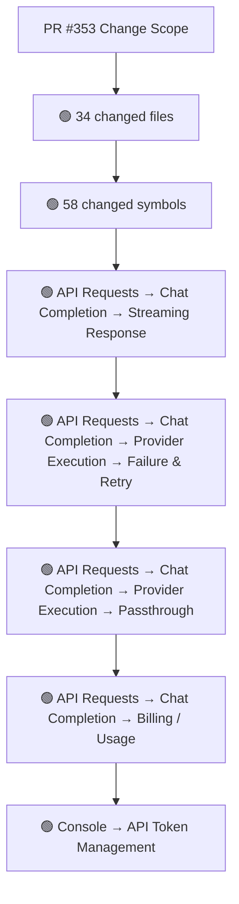
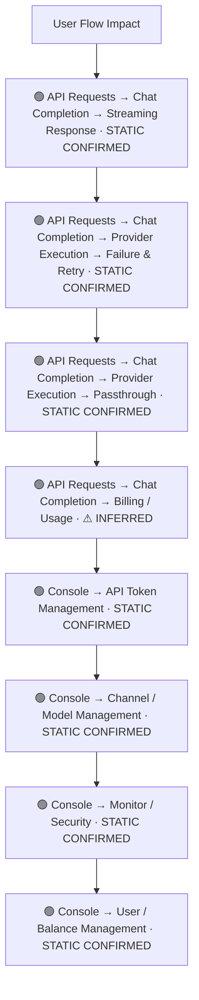
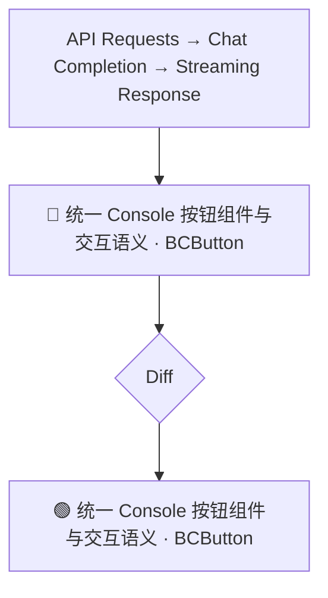
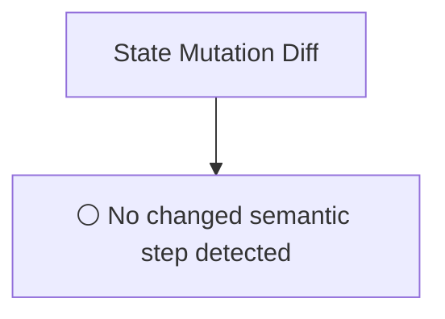
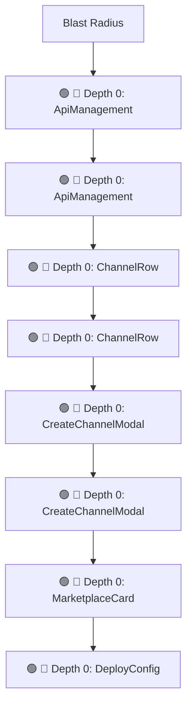

# Commit Change Atlas

## Executive Summary

| Field | Value |
|---|---|
| Commit | `8e8692ad01447b00b6b7c03f776d2bb36edbe7f5` |
| Base | `5c0772cea399af31d96d09d040299ddf2dc37a5d` |
| Merged PR | [#353](https://github.com/burncloud/burncloud/pull/353) |
| Merged At | `2026-07-05T16:56:52Z` |
| Intent | refactor(client): unify design system CSS injection and console styling |
| Intent Truth | **AUTHOR-STATED** (PR title/body) |
| Risk | **HIGH (37)** |
| Changed Files | 34 |
| Changed Symbols | 58 |
| Changed Functions | 39 |
| Changed Routes | 0 |
| Changed Test Files | 0 |
| Affected User Flows | 8 |
| API Contract | Changed |
| Database | Changed |
| External | Changed |
| Tests | ❌ Missing |

**Source Diff:** [BASE `5c0772cea399` → TARGET `8e8692ad0144`](https://github.com/burncloud/burncloud/compare/5c0772cea399af31d96d09d040299ddf2dc37a5d...8e8692ad01447b00b6b7c03f776d2bb36edbe7f5)

## Intent

**Intent:** refactor(client): unify design system CSS injection and console styling

**Truth:** **AUTHOR-STATED INTENT** — PR title/body; code facts below come from BASE→TARGET diff.

[Open merged PR #353](https://github.com/burncloud/burncloud/pull/353)

## 10-Dimension Dashboard

| Dimension | Status | Risk |
|---|---|---|
| 1. Change Scope | ● Changed | MEDIUM |
| 2. User Flow | ● Changed | MEDIUM |
| 3. Runtime | ● Changed | HIGH |
| 4. Control Flow | ● Changed | HIGH |
| 5. State | ○ No Change | LOW |
| 6. API Contract | ● Changed | HIGH |
| 7. Database | ● Changed | HIGH |
| 8. External | ● Changed | MEDIUM |
| 9. Blast Radius | ● Changed | MEDIUM |
| 10. Tests | ● Changed | HIGH |

---

## 1. Change Scope

### What changed?

Files **34** · Symbols **58** · Functions **39** · Routes **0** · Test files **0**

### Change Scope Map

### Changed Files

- 🟡 MODIFIED `crates/client/crates/client-access/src/lib.rs`
- 🟡 MODIFIED `crates/client/crates/client-api/src/api.rs`
- 🟡 MODIFIED `crates/client/crates/client-connect/src/lib.rs`
- 🟡 MODIFIED `crates/client/crates/client-deploy/src/deploy.rs`
- 🟡 MODIFIED `crates/client/crates/client-finance/src/lib.rs`
- 🟡 MODIFIED `crates/client/crates/client-log/src/lib.rs`
- 🟡 MODIFIED `crates/client/crates/client-models/src/models.rs`
- 🟡 MODIFIED `crates/client/crates/client-monitor/src/monitor.rs`
- 🟡 MODIFIED `crates/client/crates/client-playground/src/lib.rs`
- 🟡 MODIFIED `crates/client/crates/client-settings/src/groups.rs`
- 🟡 MODIFIED `crates/client/crates/client-settings/src/settings.rs`
- 🟢 ADDED `crates/client/crates/client-shared/src/app_styles.rs`
- 🟡 MODIFIED `crates/client/crates/client-shared/src/components/bc_button.rs`
- 🟡 MODIFIED `crates/client/crates/client-shared/src/components/bc_card.rs`
- 🟡 MODIFIED `crates/client/crates/client-shared/src/components/bc_input.rs`
- 🟡 MODIFIED `crates/client/crates/client-shared/src/components/bc_modal.rs`
- 🟡 MODIFIED `crates/client/crates/client-shared/src/components/bc_table.rs`
- 🟢 ADDED `crates/client/crates/client-shared/src/components/console_sidebar.rs`
- 🟡 MODIFIED `crates/client/crates/client-shared/src/components/layout.rs`
- 🟡 MODIFIED `crates/client/crates/client-shared/src/components/mod.rs`
- 🟡 MODIFIED `crates/client/crates/client-shared/src/components/schema_table.rs`
- 🟡 MODIFIED `crates/client/crates/client-shared/src/components/sidebar.rs`
- 🟡 MODIFIED `crates/client/crates/client-shared/src/lib.rs`
- 🟡 MODIFIED `crates/client/crates/client-shared/src/styles.rs`
- 🟡 MODIFIED `crates/client/crates/client-users/src/lib.rs`

### Changed Symbols

- 🟡 `function` `ApiManagement` — `crates/client/crates/client-api/src/api.rs:L5`
- 🟡 `function` `ApiManagement` — `crates/client/crates/client-api/src/api.rs:L8`
- 🟡 `function` `ChannelRow` — `crates/client/crates/client-api/src/api.rs:L96`
- 🟡 `function` `ChannelRow` — `crates/client/crates/client-api/src/api.rs:L109`
- 🟡 `function` `CreateChannelModal` — `crates/client/crates/client-api/src/api.rs:L140`
- 🟡 `function` `CreateChannelModal` — `crates/client/crates/client-api/src/api.rs:L160`
- 🟡 `function` `MarketplaceCard` — `crates/client/crates/client-connect/src/lib.rs:L400`
- 🟡 `function` `DeployConfig` — `crates/client/crates/client-deploy/src/deploy.rs:L11`
- 🟡 `function` `SystemSettings` — `crates/client/crates/client-settings/src/settings.rs:L49`
- 🟡 `const` `SVG_DEFAULTS` — `crates/client/crates/client-shared/src/app_styles.rs:L11`
- 🟡 `const` `TAILWIND_CSS` — `crates/client/crates/client-shared/src/app_styles.rs:L9`
- 🟡 `function` `AppStyles` — `crates/client/crates/client-shared/src/app_styles.rs:L21`
- 🟡 `function` `liveview_style_tags` — `crates/client/crates/client-shared/src/app_styles.rs:L14`
- 🟡 `function` `BCButton` — `crates/client/crates/client-shared/src/components/bc_button.rs:L24`
- 🟡 `function` `BCCard` — `crates/client/crates/client-shared/src/components/bc_card.rs:L12`
- 🟡 `function` `BCInput` — `crates/client/crates/client-shared/src/components/bc_input.rs:L4`
- 🟡 `function` `BCModal` — `crates/client/crates/client-shared/src/components/bc_modal.rs:L4`
- 🟡 `function` `BCPagination` — `crates/client/crates/client-shared/src/components/bc_table.rs:L28`
- 🟡 `const` `NAV_ITEMS` — `crates/client/crates/client-shared/src/components/console_sidebar.rs:L38`
- 🟡 `enum` `NavId` — `crates/client/crates/client-shared/src/components/console_sidebar.rs:L12`
- 🟡 `enum` `NavSection` — `crates/client/crates/client-shared/src/components/console_sidebar.rs:L109`
- 🟡 `function` `ConsoleSidebar` — `crates/client/crates/client-shared/src/components/console_sidebar.rs:L175`
- 🟡 `function` `SidebarItemLink` — `crates/client/crates/client-shared/src/components/console_sidebar.rs:L136`
- 🟡 `function` `label_for` — `crates/client/crates/client-shared/src/components/console_sidebar.rs:L125`
- 🟡 `function` `nav_route` — `crates/client/crates/client-shared/src/components/console_sidebar.rs:L28`

### Evidence

- **AFTER:** [`crates/client/crates/client-access/src/lib.rs:L134-L134`](https://github.com/burncloud/burncloud/blob/8e8692ad01447b00b6b7c03f776d2bb36edbe7f5/crates/client/crates/client-access/src/lib.rs#L134-L134)
- **BASE:** [`crates/client/crates/client-access/src/lib.rs:L134-L134`](https://github.com/burncloud/burncloud/blob/5c0772cea399af31d96d09d040299ddf2dc37a5d/crates/client/crates/client-access/src/lib.rs#L134-L134)
- **AFTER:** [`crates/client/crates/client-access/src/lib.rs:L157-L171`](https://github.com/burncloud/burncloud/blob/8e8692ad01447b00b6b7c03f776d2bb36edbe7f5/crates/client/crates/client-access/src/lib.rs#L157-L171)
- **AFTER:** [`crates/client/crates/client-access/src/lib.rs:L173-L174`](https://github.com/burncloud/burncloud/blob/8e8692ad01447b00b6b7c03f776d2bb36edbe7f5/crates/client/crates/client-access/src/lib.rs#L173-L174)
- **BASE:** [`crates/client/crates/client-access/src/lib.rs:L158-L159`](https://github.com/burncloud/burncloud/blob/5c0772cea399af31d96d09d040299ddf2dc37a5d/crates/client/crates/client-access/src/lib.rs#L158-L159)
- **BASE:** [`crates/client/crates/client-access/src/lib.rs:L172-L187`](https://github.com/burncloud/burncloud/blob/5c0772cea399af31d96d09d040299ddf2dc37a5d/crates/client/crates/client-access/src/lib.rs#L172-L187)
- **AFTER:** [`crates/client/crates/client-access/src/lib.rs:L195-L202`](https://github.com/burncloud/burncloud/blob/8e8692ad01447b00b6b7c03f776d2bb36edbe7f5/crates/client/crates/client-access/src/lib.rs#L195-L202)
- **AFTER:** [`crates/client/crates/client-access/src/lib.rs:L209-L209`](https://github.com/burncloud/burncloud/blob/8e8692ad01447b00b6b7c03f776d2bb36edbe7f5/crates/client/crates/client-access/src/lib.rs#L209-L209)

---

## 2. User Flow Impact

### Which user behaviors changed?

- **API Requests → Chat Completion → Streaming Response** — STATIC CONFIRMED
- **API Requests → Chat Completion → Provider Execution → Failure & Retry** — STATIC CONFIRMED
- **API Requests → Chat Completion → Provider Execution → Passthrough** — STATIC CONFIRMED
- **API Requests → Chat Completion → Billing / Usage** — ⚠ INFERRED
- **Console → API Token Management** — STATIC CONFIRMED
- **Console → Channel / Model Management** — STATIC CONFIRMED
- **Console → Monitor / Security** — STATIC CONFIRMED
- **Console → User / Balance Management** — STATIC CONFIRMED

### User Flow Impact Map

Only explicit runtime/UI entry evidence is STATIC CONFIRMED; path/module mappings remain `⚠ INFERRED` where applicable.

### Evidence

- **AFTER:** [`crates/client/crates/client-access/src/lib.rs:L134-L134`](https://github.com/burncloud/burncloud/blob/8e8692ad01447b00b6b7c03f776d2bb36edbe7f5/crates/client/crates/client-access/src/lib.rs#L134-L134)
- **BASE:** [`crates/client/crates/client-access/src/lib.rs:L134-L134`](https://github.com/burncloud/burncloud/blob/5c0772cea399af31d96d09d040299ddf2dc37a5d/crates/client/crates/client-access/src/lib.rs#L134-L134)
- **AFTER:** [`crates/client/crates/client-access/src/lib.rs:L157-L171`](https://github.com/burncloud/burncloud/blob/8e8692ad01447b00b6b7c03f776d2bb36edbe7f5/crates/client/crates/client-access/src/lib.rs#L157-L171)
- **AFTER:** [`crates/client/crates/client-access/src/lib.rs:L173-L174`](https://github.com/burncloud/burncloud/blob/8e8692ad01447b00b6b7c03f776d2bb36edbe7f5/crates/client/crates/client-access/src/lib.rs#L173-L174)
- **BASE:** [`crates/client/crates/client-access/src/lib.rs:L158-L159`](https://github.com/burncloud/burncloud/blob/5c0772cea399af31d96d09d040299ddf2dc37a5d/crates/client/crates/client-access/src/lib.rs#L158-L159)
- **BASE:** [`crates/client/crates/client-access/src/lib.rs:L172-L187`](https://github.com/burncloud/burncloud/blob/5c0772cea399af31d96d09d040299ddf2dc37a5d/crates/client/crates/client-access/src/lib.rs#L172-L187)
- **AFTER:** [`crates/client/crates/client-access/src/lib.rs:L195-L202`](https://github.com/burncloud/burncloud/blob/8e8692ad01447b00b6b7c03f776d2bb36edbe7f5/crates/client/crates/client-access/src/lib.rs#L195-L202)
- **AFTER:** [`crates/client/crates/client-access/src/lib.rs:L209-L209`](https://github.com/burncloud/burncloud/blob/8e8692ad01447b00b6b7c03f776d2bb36edbe7f5/crates/client/crates/client-access/src/lib.rs#L209-L209)

---

## 3. End-to-End Runtime Diff

### What changed at runtime?

Changed production runtime signals were detected.

### E2E Diff

### Decisions

Changed control statements are isolated in Dimension 4. Unproven edges are not invented.

### Evidence

- **AFTER:** [`crates/client/crates/client-access/src/lib.rs:L134-L134`](https://github.com/burncloud/burncloud/blob/8e8692ad01447b00b6b7c03f776d2bb36edbe7f5/crates/client/crates/client-access/src/lib.rs#L134-L134)
- **BASE:** [`crates/client/crates/client-access/src/lib.rs:L134-L134`](https://github.com/burncloud/burncloud/blob/5c0772cea399af31d96d09d040299ddf2dc37a5d/crates/client/crates/client-access/src/lib.rs#L134-L134)
- **AFTER:** [`crates/client/crates/client-access/src/lib.rs:L157-L171`](https://github.com/burncloud/burncloud/blob/8e8692ad01447b00b6b7c03f776d2bb36edbe7f5/crates/client/crates/client-access/src/lib.rs#L157-L171)
- **AFTER:** [`crates/client/crates/client-access/src/lib.rs:L173-L174`](https://github.com/burncloud/burncloud/blob/8e8692ad01447b00b6b7c03f776d2bb36edbe7f5/crates/client/crates/client-access/src/lib.rs#L173-L174)
- **BASE:** [`crates/client/crates/client-access/src/lib.rs:L158-L159`](https://github.com/burncloud/burncloud/blob/5c0772cea399af31d96d09d040299ddf2dc37a5d/crates/client/crates/client-access/src/lib.rs#L158-L159)
- **BASE:** [`crates/client/crates/client-access/src/lib.rs:L172-L187`](https://github.com/burncloud/burncloud/blob/5c0772cea399af31d96d09d040299ddf2dc37a5d/crates/client/crates/client-access/src/lib.rs#L172-L187)
- **AFTER:** [`crates/client/crates/client-access/src/lib.rs:L195-L202`](https://github.com/burncloud/burncloud/blob/8e8692ad01447b00b6b7c03f776d2bb36edbe7f5/crates/client/crates/client-access/src/lib.rs#L195-L202)
- **AFTER:** [`crates/client/crates/client-access/src/lib.rs:L209-L209`](https://github.com/burncloud/burncloud/blob/8e8692ad01447b00b6b7c03f776d2bb36edbe7f5/crates/client/crates/client-access/src/lib.rs#L209-L209)

---

## 4. ICFG Diff

### Which control-flow semantics changed?

```mermaid
flowchart TD
  S["Changed Control Region"]
  R1["🔴 spawn（async move ｛"]
  S --> R1
  R2["🔴 match TokenService::delete（&amp;id）.await ｛"]
  R1 --> R2
  R3["🔴 if show_create_modal（） ｛"]
  R2 --> R3
  R4["🔴 // Emergency circuit break modal"]
  R3 --> R4
  R5["🔴 style: if show_emergency_modal（） ｛ '--bc-dynamic-display:flex' ｝ else ｛ '--bc-dynamic-display:none' ｝,"]
  R4 --> R5
  R6["🔴 if let Some（err） = emergency_error（） ｛"]
  R5 --> R6
  R7["🔴 if emergency_loading（） ｛ ｛t（*lang.read（）, 'monitor.emergency.executing'）｝ ｝ else ｛ ｛t（*lang.read（）, 'monitor.…"]
  R6 --> R7
  R8["🔴 if let Some（err） = error_msg（） ｛"]
  R7 --> R8
  R8 --> D{"Diff"}
  A9["🟢 spawn（async move ｛"]
  D --> A9
  A10["🟢 match TokenService::delete（&amp;id）.await ｛"]
  A9 --> A10
  A11["🟢 if emergency_loading（） ｛ ｛t（*lang.read（）, 'monitor.emergency.executing'）｝ ｝ else ｛ ｛t（*lang.read（）, 'monitor.…"]
  A10 --> A11
  A12["🟢 if let Some（err） = emergency_error（） ｛"]
  A11 --> A12
  A13["🟢 if let Some（err） = error_msg（） ｛"]
  A12 --> A13
  A14["🟢 //! Single injection point for Tailwind （layout） + BurnCloud design system （visual）."]
  A13 --> A14
  A15["🟢 /// Inline ′‹style›′ blocks for LiveView / SSR HTML shells."]
  A14 --> A15
  A16["🟢 match self ｛"]
  A15 --> A16
  A17["🟢 if let Some（fixed） = item.fixed_label ｛"]
  A16 --> A17
  A18["🟢 ｝ else if let Some（key） = item.label_key ｛"]
  A17 --> A18
  A19["🟢 class: format!（'nav-item ｛｝', if active ｛ 'active' ｝ else ｛ '' ｝）,"]
  A18 --> A19
  A20["🟢 div ｛ class: format!（'icon ｛｝', if active ｛ 'text-on-accent' ｝ else ｛ 'opacity-70' ｝）,"]
  A19 --> A20
```

⚠ Diagram contains changed control statements only; unproven interprocedural edges are not invented.

### Evidence

- **AFTER:** [`crates/client/crates/client-access/src/lib.rs:L240-L263`](https://github.com/burncloud/burncloud/blob/8e8692ad01447b00b6b7c03f776d2bb36edbe7f5/crates/client/crates/client-access/src/lib.rs#L240-L263)
- **BASE:** [`crates/client/crates/client-access/src/lib.rs:L258-L281`](https://github.com/burncloud/burncloud/blob/5c0772cea399af31d96d09d040299ddf2dc37a5d/crates/client/crates/client-access/src/lib.rs#L258-L281)
- **AFTER:** [`crates/client/crates/client-api/src/api.rs:L84-L90`](https://github.com/burncloud/burncloud/blob/8e8692ad01447b00b6b7c03f776d2bb36edbe7f5/crates/client/crates/client-api/src/api.rs#L84-L90)
- **BASE:** [`crates/client/crates/client-api/src/api.rs:L95-L102`](https://github.com/burncloud/burncloud/blob/5c0772cea399af31d96d09d040299ddf2dc37a5d/crates/client/crates/client-api/src/api.rs#L95-L102)
- **AFTER:** [`crates/client/crates/client-monitor/src/monitor.rs:L207-L213`](https://github.com/burncloud/burncloud/blob/8e8692ad01447b00b6b7c03f776d2bb36edbe7f5/crates/client/crates/client-monitor/src/monitor.rs#L207-L213)
- **BASE:** [`crates/client/crates/client-monitor/src/monitor.rs:L207-L214`](https://github.com/burncloud/burncloud/blob/5c0772cea399af31d96d09d040299ddf2dc37a5d/crates/client/crates/client-monitor/src/monitor.rs#L207-L214)
- **AFTER:** [`crates/client/crates/client-monitor/src/monitor.rs:L218-L224`](https://github.com/burncloud/burncloud/blob/8e8692ad01447b00b6b7c03f776d2bb36edbe7f5/crates/client/crates/client-monitor/src/monitor.rs#L218-L224)
- **AFTER:** [`crates/client/crates/client-monitor/src/monitor.rs:L226-L228`](https://github.com/burncloud/burncloud/blob/8e8692ad01447b00b6b7c03f776d2bb36edbe7f5/crates/client/crates/client-monitor/src/monitor.rs#L226-L228)

---

## 5. State Mutation Diff

### What state behavior changed?

**⚪ NO STATE MUTATION CHANGE DETECTED**

### State Diff

### Evidence

- **COMPLETE DIFF SCAN:** No changed DB/cache/counter/update state signal detected.
- [Open complete BASE → TARGET diff](https://github.com/burncloud/burncloud/compare/5c0772cea399af31d96d09d040299ddf2dc37a5d...8e8692ad01447b00b6b7c03f776d2bb36edbe7f5)

---

## 6. API Contract Diff

### API changes

| Before | After |
|---|---|
| 🔴 option ｛ value: 'Bearer', 'Bearer Token （OpenAI）' ｝ | 🟢 option ｛ value: 'Bearer', 'Bearer Token （OpenAI）' ｝ |

API Contract changes are never rated below MEDIUM.

### Evidence

- **AFTER:** [`crates/client/crates/client-api/src/api.rs:L196-L201`](https://github.com/burncloud/burncloud/blob/8e8692ad01447b00b6b7c03f776d2bb36edbe7f5/crates/client/crates/client-api/src/api.rs#L196-L201)
- **BASE:** [`crates/client/crates/client-api/src/api.rs:L231-L258`](https://github.com/burncloud/burncloud/blob/5c0772cea399af31d96d09d040299ddf2dc37a5d/crates/client/crates/client-api/src/api.rs#L231-L258)
- **AFTER:** [`crates/client/crates/client-api/src/api.rs:L210-L220`](https://github.com/burncloud/burncloud/blob/8e8692ad01447b00b6b7c03f776d2bb36edbe7f5/crates/client/crates/client-api/src/api.rs#L210-L220)
- **BASE:** [`crates/client/crates/client-api/src/api.rs:L273-L282`](https://github.com/burncloud/burncloud/blob/5c0772cea399af31d96d09d040299ddf2dc37a5d/crates/client/crates/client-api/src/api.rs#L273-L282)

---

## 7. Database / Persistence Diff

### Persistence changes

| Before | After |
|---|---|
| 🔴 select ｛ | 🟢 select ｛ |
| 🔴 class: 'select', | 🟢 class: 'select bc-mono-sm', |
| 🔴 div ｛ class: 'flex flex-col h-full gap-6 select-none pt-4', | 🟢 div ｛ class: 'flex flex-col h-full gap-6 select-none pt-4', |
| 🔴 /* Select bordered — replaces ′select select-bordered select-sm select-primary′ */ | 🟢 div ｛ class: 'relative flex flex-col h-screen w-screen bg-bc-canvas text-bc-text overflow-hidden select-none', 'data-th… |
| 🔴 div ｛ class: 'relative flex flex-col h-screen w-screen bg-base-100 text-base-content overflow-hidden select-none', 'dat… | 🟢 .select.bc-mono-sm ｛ |

Database/migration/SQL persistence surface changed.

### Evidence

- **AFTER:** [`crates/client/crates/client-api/src/api.rs:L196-L201`](https://github.com/burncloud/burncloud/blob/8e8692ad01447b00b6b7c03f776d2bb36edbe7f5/crates/client/crates/client-api/src/api.rs#L196-L201)
- **BASE:** [`crates/client/crates/client-api/src/api.rs:L231-L258`](https://github.com/burncloud/burncloud/blob/5c0772cea399af31d96d09d040299ddf2dc37a5d/crates/client/crates/client-api/src/api.rs#L231-L258)
- **AFTER:** [`crates/client/crates/client-api/src/api.rs:L210-L220`](https://github.com/burncloud/burncloud/blob/8e8692ad01447b00b6b7c03f776d2bb36edbe7f5/crates/client/crates/client-api/src/api.rs#L210-L220)
- **BASE:** [`crates/client/crates/client-api/src/api.rs:L273-L282`](https://github.com/burncloud/burncloud/blob/5c0772cea399af31d96d09d040299ddf2dc37a5d/crates/client/crates/client-api/src/api.rs#L273-L282)
- **AFTER:** [`crates/client/crates/client-shared/src/components/console_sidebar.rs:L1-L220`](https://github.com/burncloud/burncloud/blob/8e8692ad01447b00b6b7c03f776d2bb36edbe7f5/crates/client/crates/client-shared/src/components/console_sidebar.rs#L1-L220)
- **AFTER:** [`crates/client/crates/client-shared/src/components/layout.rs:L49-L69`](https://github.com/burncloud/burncloud/blob/8e8692ad01447b00b6b7c03f776d2bb36edbe7f5/crates/client/crates/client-shared/src/components/layout.rs#L49-L69)
- **BASE:** [`crates/client/crates/client-shared/src/components/layout.rs:L49-L54`](https://github.com/burncloud/burncloud/blob/5c0772cea399af31d96d09d040299ddf2dc37a5d/crates/client/crates/client-shared/src/components/layout.rs#L49-L54)
- **AFTER:** [`crates/client/crates/client-shared/src/components/sidebar.rs:L29-L29`](https://github.com/burncloud/burncloud/blob/8e8692ad01447b00b6b7c03f776d2bb36edbe7f5/crates/client/crates/client-shared/src/components/sidebar.rs#L29-L29)

---

## 8. External Dependency Diff

### External behavior changes

| Before | After |
|---|---|
| 🔴 div ｛ class: 'text-xxs text-secondary mt-xs truncate', style: 'font-family: monospace;', title: '｛channel.base_url｝', | 🟢 div ｛ class: 'text-xxs text-bc-text-secondary mt-xs truncate bc-mono-sm', title: '｛channel.base_url｝', |
| 🔴 value: '｛base_url｝', | 🟢 value: base_url（）, |
| 🔴 oninput: move ¦e¦ base_url.set（e.value（）） | 🟢 oninput: move ¦e: FormEvent¦ base_url.set（e.value（））, |
| 🔴 option ｛ value: 'Bearer', 'Bearer Token （OpenAI）' ｝ | 🟢 option ｛ value: 'Bearer', 'Bearer Token （OpenAI）' ｝ |
| 🔴 td ｛ class: 'mono text-caption text-secondary', '｛ch.base_url｝' ｝ | 🟢 td ｛ class: 'mono text-caption text-bc-text-secondary', '｛ch.base_url｝' ｝ |
| 🔴 div ｛ class: 'mono text-caption text-secondary mt-xs', 'https∶／／pool.skynet-ops.io' ｝ | 🟢 div ｛ class: 'mono text-caption text-bc-text-secondary mt-xs', 'https∶／／pool.skynet-ops.io' ｝ |

**🟣 DYNAMIC:** concrete Provider/Adaptor target remains runtime-dependent.

### Evidence

- **AFTER:** [`crates/client/crates/client-api/src/api.rs:L113-L113`](https://github.com/burncloud/burncloud/blob/8e8692ad01447b00b6b7c03f776d2bb36edbe7f5/crates/client/crates/client-api/src/api.rs#L113-L113)
- **BASE:** [`crates/client/crates/client-api/src/api.rs:L130-L130`](https://github.com/burncloud/burncloud/blob/5c0772cea399af31d96d09d040299ddf2dc37a5d/crates/client/crates/client-api/src/api.rs#L130-L130)
- **AFTER:** [`crates/client/crates/client-api/src/api.rs:L196-L201`](https://github.com/burncloud/burncloud/blob/8e8692ad01447b00b6b7c03f776d2bb36edbe7f5/crates/client/crates/client-api/src/api.rs#L196-L201)
- **BASE:** [`crates/client/crates/client-api/src/api.rs:L231-L258`](https://github.com/burncloud/burncloud/blob/5c0772cea399af31d96d09d040299ddf2dc37a5d/crates/client/crates/client-api/src/api.rs#L231-L258)
- **AFTER:** [`crates/client/crates/client-api/src/api.rs:L203-L208`](https://github.com/burncloud/burncloud/blob/8e8692ad01447b00b6b7c03f776d2bb36edbe7f5/crates/client/crates/client-api/src/api.rs#L203-L208)
- **BASE:** [`crates/client/crates/client-api/src/api.rs:L260-L271`](https://github.com/burncloud/burncloud/blob/5c0772cea399af31d96d09d040299ddf2dc37a5d/crates/client/crates/client-api/src/api.rs#L260-L271)
- **AFTER:** [`crates/client/crates/client-api/src/api.rs:L210-L220`](https://github.com/burncloud/burncloud/blob/8e8692ad01447b00b6b7c03f776d2bb36edbe7f5/crates/client/crates/client-api/src/api.rs#L210-L220)
- **BASE:** [`crates/client/crates/client-api/src/api.rs:L273-L282`](https://github.com/burncloud/burncloud/blob/5c0772cea399af31d96d09d040299ddf2dc37a5d/crates/client/crates/client-api/src/api.rs#L273-L282)

---

## 9. Blast Radius

### What else may be affected?

| Depth | Impact | Evidence location |
|---|---|---|
| 🔴 Depth 0 | ApiManagement | `crates/client/crates/client-api/src/api.rs:L5` |
| 🔴 Depth 0 | ApiManagement | `crates/client/crates/client-api/src/api.rs:L8` |
| 🔴 Depth 0 | ChannelRow | `crates/client/crates/client-api/src/api.rs:L96` |
| 🔴 Depth 0 | ChannelRow | `crates/client/crates/client-api/src/api.rs:L109` |
| 🔴 Depth 0 | CreateChannelModal | `crates/client/crates/client-api/src/api.rs:L140` |
| 🔴 Depth 0 | CreateChannelModal | `crates/client/crates/client-api/src/api.rs:L160` |
| 🔴 Depth 0 | MarketplaceCard | `crates/client/crates/client-connect/src/lib.rs:L400` |
| 🔴 Depth 0 | DeployConfig | `crates/client/crates/client-deploy/src/deploy.rs:L11` |

### Blast Radius Map

🔴 Depth 0 is direct. 🟡 lexical references are **impact candidates**, not compiler-proven call edges. Dynamic dispatch is never promoted to a confirmed edge.

### Evidence

- **AFTER:** [`crates/client/crates/client-access/src/lib.rs:L134-L134`](https://github.com/burncloud/burncloud/blob/8e8692ad01447b00b6b7c03f776d2bb36edbe7f5/crates/client/crates/client-access/src/lib.rs#L134-L134)
- **BASE:** [`crates/client/crates/client-access/src/lib.rs:L134-L134`](https://github.com/burncloud/burncloud/blob/5c0772cea399af31d96d09d040299ddf2dc37a5d/crates/client/crates/client-access/src/lib.rs#L134-L134)
- **AFTER:** [`crates/client/crates/client-access/src/lib.rs:L157-L171`](https://github.com/burncloud/burncloud/blob/8e8692ad01447b00b6b7c03f776d2bb36edbe7f5/crates/client/crates/client-access/src/lib.rs#L157-L171)
- **AFTER:** [`crates/client/crates/client-access/src/lib.rs:L173-L174`](https://github.com/burncloud/burncloud/blob/8e8692ad01447b00b6b7c03f776d2bb36edbe7f5/crates/client/crates/client-access/src/lib.rs#L173-L174)
- **BASE:** [`crates/client/crates/client-access/src/lib.rs:L158-L159`](https://github.com/burncloud/burncloud/blob/5c0772cea399af31d96d09d040299ddf2dc37a5d/crates/client/crates/client-access/src/lib.rs#L158-L159)
- **BASE:** [`crates/client/crates/client-access/src/lib.rs:L172-L187`](https://github.com/burncloud/burncloud/blob/5c0772cea399af31d96d09d040299ddf2dc37a5d/crates/client/crates/client-access/src/lib.rs#L172-L187)
- **AFTER:** [`crates/client/crates/client-access/src/lib.rs:L195-L202`](https://github.com/burncloud/burncloud/blob/8e8692ad01447b00b6b7c03f776d2bb36edbe7f5/crates/client/crates/client-access/src/lib.rs#L195-L202)

---

## 10. Test Coverage & Evidence

### Coverage Matrix

**Overall:** ❌ Missing

- Changed test files: **0**
- Lexical references from changed symbols into tests: **0**

### Missing Coverage

- ❌ Direct changed-test coverage was not detected for changed production symbols.

### Source Evidence

- **COMPLETE DIFF SCAN:** No changed test hunk; coverage status uses changed tests plus lexical test references.
- [Open complete BASE → TARGET diff](https://github.com/burncloud/burncloud/compare/5c0772cea399af31d96d09d040299ddf2dc37a5d...8e8692ad01447b00b6b7c03f776d2bb36edbe7f5)

---

## Risk Assessment

**Score: 37 → HIGH**

### Risk Drivers

- `Authentication change` **+5**
- `Authorization change` **+5**
- `Billing change` **+5**
- `Public API contract` **+5**
- `Provider request` **+4**
- `Streaming` **+4**
- `Dynamic dispatch boundary` **+3**
- `Missing direct changed tests` **+3**
- `Large blast radius` **+3**

The score is rule-based, not an LLM impression.

## Reviewer Checklist

- [ ] Intent 与代码变化一致
- [ ] User Flow impact 已确认
- [ ] Runtime Diff 已确认
- [ ] Control-flow changes 已确认
- [ ] State mutation 已确认
- [ ] API contract 已确认
- [ ] Database behavior 已确认
- [ ] External Provider behavior 已确认
- [ ] Blast Radius 可接受
- [ ] Tests 覆盖 changed runtime paths
- [ ] Dynamic / Inferred relationships 已正确标记
- [ ] Source Evidence 可追溯

## Source Diff Entry Points

- [Complete BASE → TARGET diff](https://github.com/burncloud/burncloud/compare/5c0772cea399af31d96d09d040299ddf2dc37a5d...8e8692ad01447b00b6b7c03f776d2bb36edbe7f5)
- [Merged PR #353](https://github.com/burncloud/burncloud/pull/353)
