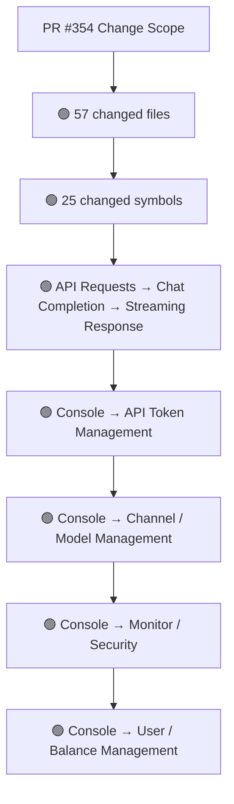
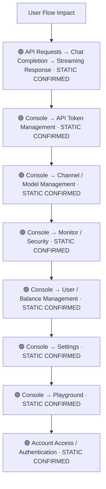
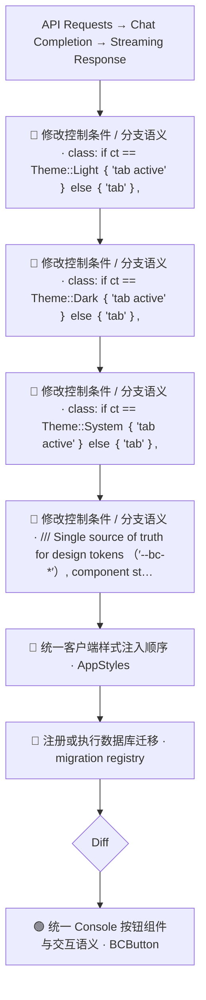
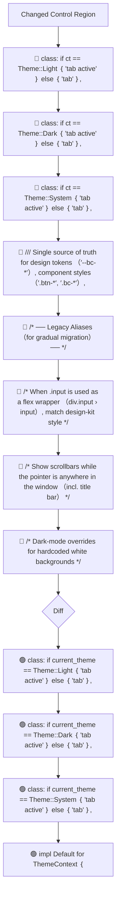
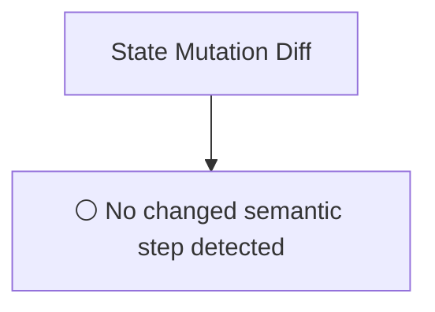
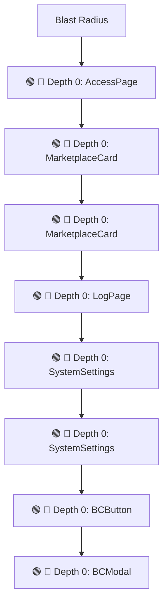

# Commit Change Atlas

## Executive Summary

| Field | Value |
|---|---|
| Commit | `876bf8dc06bf8874ff433bf01c8fb5582a1e2c39` |
| Base | `8e8692ad01447b00b6b7c03f776d2bb36edbe7f5` |
| Merged PR | [#354](https://github.com/burncloud/burncloud/pull/354) |
| Merged At | `2026-07-07T04:58:42Z` |
| Intent | feat(client): UI design system docs, split CSS, and BCButton migration |
| Intent Truth | **AUTHOR-STATED** (PR title/body) |
| Risk | **HIGH (38)** |
| Changed Files | 57 |
| Changed Symbols | 25 |
| Changed Functions | 20 |
| Changed Routes | 1 |
| Changed Test Files | 0 |
| Affected User Flows | 8 |
| API Contract | Changed |
| Database | Changed |
| External | Changed |
| Tests | ❌ Missing |

**Source Diff:** [BASE `8e8692ad0144` → TARGET `876bf8dc06bf`](https://github.com/burncloud/burncloud/compare/8e8692ad01447b00b6b7c03f776d2bb36edbe7f5...876bf8dc06bf8874ff433bf01c8fb5582a1e2c39)

## Intent

**Intent:** feat(client): UI design system docs, split CSS, and BCButton migration

**Truth:** **AUTHOR-STATED INTENT** — PR title/body; code facts below come from BASE→TARGET diff.

[Open merged PR #354](https://github.com/burncloud/burncloud/pull/354)

## 10-Dimension Dashboard

| Dimension | Status | Risk |
|---|---|---|
| 1. Change Scope | ● Changed | MEDIUM |
| 2. User Flow | ● Changed | MEDIUM |
| 3. Runtime | ● Changed | HIGH |
| 4. Control Flow | ● Changed | HIGH |
| 5. State | ○ No Change | LOW |
| 6. API Contract | ● Changed | HIGH |
| 7. Database | ● Changed | HIGH |
| 8. External | ● Changed | MEDIUM |
| 9. Blast Radius | ● Changed | MEDIUM |
| 10. Tests | ● Changed | HIGH |

---

## 1. Change Scope

### What changed?

Files **57** · Symbols **25** · Functions **20** · Routes **1** · Test files **0**

### Change Scope Map

### Changed Files

- 🟢 ADDED `.github/workflows/client-ui.yml`
- 🟡 MODIFIED `crates/client/crates/client-access/src/lib.rs`
- 🟡 MODIFIED `crates/client/crates/client-api/docs/06-css-design-system.md`
- 🟡 MODIFIED `crates/client/crates/client-connect/src/lib.rs`
- 🟡 MODIFIED `crates/client/crates/client-log/src/lib.rs`
- 🟡 MODIFIED `crates/client/crates/client-models/src/models.rs`
- 🟡 MODIFIED `crates/client/crates/client-monitor/src/monitor.rs`
- 🟡 MODIFIED `crates/client/crates/client-playground/src/lib.rs`
- 🟡 MODIFIED `crates/client/crates/client-settings/src/groups.rs`
- 🟡 MODIFIED `crates/client/crates/client-settings/src/settings.rs`
- 🟢 ADDED `crates/client/crates/client-shared/scripts/split_styles.py`
- 🟡 MODIFIED `crates/client/crates/client-shared/src/components/bc_button.rs`
- 🟡 MODIFIED `crates/client/crates/client-shared/src/components/bc_modal.rs`
- 🟡 MODIFIED `crates/client/crates/client-shared/src/components/bc_table.rs`
- 🟡 MODIFIED `crates/client/crates/client-shared/src/components/schema_table.rs`
- 🟡 MODIFIED `crates/client/crates/client-shared/src/lib.rs`
- 🔴 REMOVED `crates/client/crates/client-shared/src/styles.rs`
- 🟢 ADDED `crates/client/crates/client-shared/src/styles/00_burncloud_design_system_apple_inspired.css`
- 🟢 ADDED `crates/client/crates/client-shared/src/styles/01_base_element_styles.css`
- 🟢 ADDED `crates/client/crates/client-shared/src/styles/02_acrylic_glass_effects.css`
- 🟢 ADDED `crates/client/crates/client-shared/src/styles/03_card_styles.css`
- 🟢 ADDED `crates/client/crates/client-shared/src/styles/04_button_styles.css`
- 🟢 ADDED `crates/client/crates/client-shared/src/styles/05_input_styles.css`
- 🟢 ADDED `crates/client/crates/client-shared/src/styles/06_progress_bar.css`
- 🟢 ADDED `crates/client/crates/client-shared/src/styles/07_status_indicators.css`

### Changed Symbols

- 🟡 `function` `AccessPage` — `crates/client/crates/client-access/src/lib.rs:L28`
- 🟡 `function` `MarketplaceCard` — `crates/client/crates/client-connect/src/lib.rs:L400`
- 🟡 `function` `MarketplaceCard` — `crates/client/crates/client-connect/src/lib.rs:L401`
- 🟡 `function` `LogPage` — `crates/client/crates/client-log/src/lib.rs:L104`
- 🟡 `function` `SystemSettings` — `crates/client/crates/client-settings/src/settings.rs:L49`
- 🟡 `function` `SystemSettings` — `crates/client/crates/client-settings/src/settings.rs:L50`
- 🟡 `function` `BCButton` — `crates/client/crates/client-shared/src/components/bc_button.rs:L24`
- 🟡 `function` `BCModal` — `crates/client/crates/client-shared/src/components/bc_modal.rs:L4`
- 🟡 `function` `BCModal` — `crates/client/crates/client-shared/src/components/bc_modal.rs:L6`
- 🟡 `function` `BCPagination` — `crates/client/crates/client-shared/src/components/bc_table.rs:L28`
- 🟡 `function` `BCPagination` — `crates/client/crates/client-shared/src/components/bc_table.rs:L30`
- 🟡 `mod` `theme_context` — `crates/client/crates/client-shared/src/lib.rs:L10`
- 🟡 `mod` `utils` — `crates/client/crates/client-shared/src/lib.rs:L11`
- 🟡 `const` `DESIGN_SYSTEM_CSS` — `crates/client/crates/client-shared/src/styles.rs:L8`
- 🟡 `const` `DESIGN_SYSTEM_CSS` — `crates/client/crates/client-shared/src/styles/mod.rs:L7`
- 🟡 `function` `data_theme_attr` — `crates/client/crates/client-shared/src/theme_context.rs:L24`
- 🟡 `function` `default` — `crates/client/crates/client-shared/src/theme_context.rs:L30`
- 🟡 `function` `new` — `crates/client/crates/client-shared/src/theme_context.rs:L10`
- 🟡 `function` `set_theme` — `crates/client/crates/client-shared/src/theme_context.rs:L17`
- 🟡 `function` `use_init_theme` — `crates/client/crates/client-shared/src/theme_context.rs:L39`
- 🟡 `function` `use_theme` — `crates/client/crates/client-shared/src/theme_context.rs:L35`
- 🟡 `struct` `ThemeContext` — `crates/client/crates/client-shared/src/theme_context.rs:L5`
- 🟡 `function` `UsersPage` — `crates/client/crates/client-users/src/lib.rs:L16`
- 🟡 `function` `App` — `crates/client/src/app.rs:L72`
- 🟡 `function` `Layout` — `crates/client/src/components/layout.rs:L12`

### Evidence

- **AFTER:** [`.github/workflows/client-ui.yml:L1-L23`](https://github.com/burncloud/burncloud/blob/876bf8dc06bf8874ff433bf01c8fb5582a1e2c39/.github/workflows/client-ui.yml#L1-L23)
- **AFTER:** [`crates/client/crates/client-access/src/lib.rs:L77-L77`](https://github.com/burncloud/burncloud/blob/876bf8dc06bf8874ff433bf01c8fb5582a1e2c39/crates/client/crates/client-access/src/lib.rs#L77-L77)
- **BASE:** [`crates/client/crates/client-access/src/lib.rs:L77-L77`](https://github.com/burncloud/burncloud/blob/8e8692ad01447b00b6b7c03f776d2bb36edbe7f5/crates/client/crates/client-access/src/lib.rs#L77-L77)
- **AFTER:** [`crates/client/crates/client-access/src/lib.rs:L96-L96`](https://github.com/burncloud/burncloud/blob/876bf8dc06bf8874ff433bf01c8fb5582a1e2c39/crates/client/crates/client-access/src/lib.rs#L96-L96)
- **BASE:** [`crates/client/crates/client-access/src/lib.rs:L96-L96`](https://github.com/burncloud/burncloud/blob/8e8692ad01447b00b6b7c03f776d2bb36edbe7f5/crates/client/crates/client-access/src/lib.rs#L96-L96)
- **AFTER:** [`crates/client/crates/client-access/src/lib.rs:L247-L247`](https://github.com/burncloud/burncloud/blob/876bf8dc06bf8874ff433bf01c8fb5582a1e2c39/crates/client/crates/client-access/src/lib.rs#L247-L247)
- **BASE:** [`crates/client/crates/client-access/src/lib.rs:L247-L247`](https://github.com/burncloud/burncloud/blob/8e8692ad01447b00b6b7c03f776d2bb36edbe7f5/crates/client/crates/client-access/src/lib.rs#L247-L247)
- **AFTER:** [`crates/client/crates/client-api/docs/06-css-design-system.md:L3-L8`](https://github.com/burncloud/burncloud/blob/876bf8dc06bf8874ff433bf01c8fb5582a1e2c39/crates/client/crates/client-api/docs/06-css-design-system.md#L3-L8)

---

## 2. User Flow Impact

### Which user behaviors changed?

- **API Requests → Chat Completion → Streaming Response** — STATIC CONFIRMED
- **Console → API Token Management** — STATIC CONFIRMED
- **Console → Channel / Model Management** — STATIC CONFIRMED
- **Console → Monitor / Security** — STATIC CONFIRMED
- **Console → User / Balance Management** — STATIC CONFIRMED
- **Console → Settings** — STATIC CONFIRMED
- **Console → Playground** — STATIC CONFIRMED
- **Account Access / Authentication** — STATIC CONFIRMED

### User Flow Impact Map

Only explicit runtime/UI entry evidence is STATIC CONFIRMED; path/module mappings remain `⚠ INFERRED` where applicable.

### Evidence

- **AFTER:** [`crates/client/crates/client-access/src/lib.rs:L77-L77`](https://github.com/burncloud/burncloud/blob/876bf8dc06bf8874ff433bf01c8fb5582a1e2c39/crates/client/crates/client-access/src/lib.rs#L77-L77)
- **BASE:** [`crates/client/crates/client-access/src/lib.rs:L77-L77`](https://github.com/burncloud/burncloud/blob/8e8692ad01447b00b6b7c03f776d2bb36edbe7f5/crates/client/crates/client-access/src/lib.rs#L77-L77)
- **AFTER:** [`crates/client/crates/client-access/src/lib.rs:L96-L96`](https://github.com/burncloud/burncloud/blob/876bf8dc06bf8874ff433bf01c8fb5582a1e2c39/crates/client/crates/client-access/src/lib.rs#L96-L96)
- **BASE:** [`crates/client/crates/client-access/src/lib.rs:L96-L96`](https://github.com/burncloud/burncloud/blob/8e8692ad01447b00b6b7c03f776d2bb36edbe7f5/crates/client/crates/client-access/src/lib.rs#L96-L96)
- **AFTER:** [`crates/client/crates/client-access/src/lib.rs:L247-L247`](https://github.com/burncloud/burncloud/blob/876bf8dc06bf8874ff433bf01c8fb5582a1e2c39/crates/client/crates/client-access/src/lib.rs#L247-L247)
- **BASE:** [`crates/client/crates/client-access/src/lib.rs:L247-L247`](https://github.com/burncloud/burncloud/blob/8e8692ad01447b00b6b7c03f776d2bb36edbe7f5/crates/client/crates/client-access/src/lib.rs#L247-L247)
- **AFTER:** [`crates/client/crates/client-connect/src/lib.rs:L139-L139`](https://github.com/burncloud/burncloud/blob/876bf8dc06bf8874ff433bf01c8fb5582a1e2c39/crates/client/crates/client-connect/src/lib.rs#L139-L139)
- **BASE:** [`crates/client/crates/client-connect/src/lib.rs:L139-L139`](https://github.com/burncloud/burncloud/blob/8e8692ad01447b00b6b7c03f776d2bb36edbe7f5/crates/client/crates/client-connect/src/lib.rs#L139-L139)

---

## 3. End-to-End Runtime Diff

### What changed at runtime?

Changed production runtime signals were detected.

### E2E Diff

### Decisions

Changed control statements are isolated in Dimension 4. Unproven edges are not invented.

### Evidence

- **AFTER:** [`crates/client/crates/client-access/src/lib.rs:L77-L77`](https://github.com/burncloud/burncloud/blob/876bf8dc06bf8874ff433bf01c8fb5582a1e2c39/crates/client/crates/client-access/src/lib.rs#L77-L77)
- **BASE:** [`crates/client/crates/client-access/src/lib.rs:L77-L77`](https://github.com/burncloud/burncloud/blob/8e8692ad01447b00b6b7c03f776d2bb36edbe7f5/crates/client/crates/client-access/src/lib.rs#L77-L77)
- **AFTER:** [`crates/client/crates/client-access/src/lib.rs:L96-L96`](https://github.com/burncloud/burncloud/blob/876bf8dc06bf8874ff433bf01c8fb5582a1e2c39/crates/client/crates/client-access/src/lib.rs#L96-L96)
- **BASE:** [`crates/client/crates/client-access/src/lib.rs:L96-L96`](https://github.com/burncloud/burncloud/blob/8e8692ad01447b00b6b7c03f776d2bb36edbe7f5/crates/client/crates/client-access/src/lib.rs#L96-L96)
- **AFTER:** [`crates/client/crates/client-access/src/lib.rs:L247-L247`](https://github.com/burncloud/burncloud/blob/876bf8dc06bf8874ff433bf01c8fb5582a1e2c39/crates/client/crates/client-access/src/lib.rs#L247-L247)
- **BASE:** [`crates/client/crates/client-access/src/lib.rs:L247-L247`](https://github.com/burncloud/burncloud/blob/8e8692ad01447b00b6b7c03f776d2bb36edbe7f5/crates/client/crates/client-access/src/lib.rs#L247-L247)
- **AFTER:** [`crates/client/crates/client-connect/src/lib.rs:L139-L139`](https://github.com/burncloud/burncloud/blob/876bf8dc06bf8874ff433bf01c8fb5582a1e2c39/crates/client/crates/client-connect/src/lib.rs#L139-L139)
- **BASE:** [`crates/client/crates/client-connect/src/lib.rs:L139-L139`](https://github.com/burncloud/burncloud/blob/8e8692ad01447b00b6b7c03f776d2bb36edbe7f5/crates/client/crates/client-connect/src/lib.rs#L139-L139)

---

## 4. ICFG Diff

### Which control-flow semantics changed?

⚠ Diagram contains changed control statements only; unproven interprocedural edges are not invented.

### Evidence

- **AFTER:** [`crates/client/crates/client-settings/src/settings.rs:L128-L141`](https://github.com/burncloud/burncloud/blob/876bf8dc06bf8874ff433bf01c8fb5582a1e2c39/crates/client/crates/client-settings/src/settings.rs#L128-L141)
- **BASE:** [`crates/client/crates/client-settings/src/settings.rs:L125-L156`](https://github.com/burncloud/burncloud/blob/8e8692ad01447b00b6b7c03f776d2bb36edbe7f5/crates/client/crates/client-settings/src/settings.rs#L125-L156)
- **AFTER:** [`crates/client/crates/client-shared/scripts/split_styles.py:L1-L30`](https://github.com/burncloud/burncloud/blob/876bf8dc06bf8874ff433bf01c8fb5582a1e2c39/crates/client/crates/client-shared/scripts/split_styles.py#L1-L30)
- **BASE:** [`crates/client/crates/client-shared/src/styles.rs:L1-L2355`](https://github.com/burncloud/burncloud/blob/8e8692ad01447b00b6b7c03f776d2bb36edbe7f5/crates/client/crates/client-shared/src/styles.rs#L1-L2355)
- **AFTER:** [`crates/client/crates/client-shared/src/styles/05_input_styles.css:L1-L131`](https://github.com/burncloud/burncloud/blob/876bf8dc06bf8874ff433bf01c8fb5582a1e2c39/crates/client/crates/client-shared/src/styles/05_input_styles.css#L1-L131)
- **AFTER:** [`crates/client/crates/client-shared/src/styles/15_macos_style_scrollbars_hidden_by_default_show_on.css:L1-L77`](https://github.com/burncloud/burncloud/blob/876bf8dc06bf8874ff433bf01c8fb5582a1e2c39/crates/client/crates/client-shared/src/styles/15_macos_style_scrollbars_hidden_by_default_show_on.css#L1-L77)
- **AFTER:** [`crates/client/crates/client-shared/src/styles/17_scrollbar_theme.css:L1-L143`](https://github.com/burncloud/burncloud/blob/876bf8dc06bf8874ff433bf01c8fb5582a1e2c39/crates/client/crates/client-shared/src/styles/17_scrollbar_theme.css#L1-L143)
- **AFTER:** [`crates/client/crates/client-shared/src/styles/22_legacy_daisyui_class_aliases_migrate_to_bc_over.css:L1-L117`](https://github.com/burncloud/burncloud/blob/876bf8dc06bf8874ff433bf01c8fb5582a1e2c39/crates/client/crates/client-shared/src/styles/22_legacy_daisyui_class_aliases_migrate_to_bc_over.css#L1-L117)

---

## 5. State Mutation Diff

### What state behavior changed?

**⚪ NO STATE MUTATION CHANGE DETECTED**

### State Diff

### Evidence

- **COMPLETE DIFF SCAN:** No changed DB/cache/counter/update state signal detected.
- [Open complete BASE → TARGET diff](https://github.com/burncloud/burncloud/compare/8e8692ad01447b00b6b7c03f776d2bb36edbe7f5...876bf8dc06bf8874ff433bf01c8fb5582a1e2c39)

---

## 6. API Contract Diff

### API changes

| Before | After |
|---|---|
| — | 🟢 /api/xxx |

API Contract changes are never rated below MEDIUM.

### Evidence

- **AFTER:** [`docs/ui/pages.md:L1-L163`](https://github.com/burncloud/burncloud/blob/876bf8dc06bf8874ff433bf01c8fb5582a1e2c39/docs/ui/pages.md#L1-L163)

---

## 7. Database / Persistence Diff

### Persistence changes

| Before | After |
|---|---|
| 🔴 user-select: none; | 🟢 user-select: none; |
| 🔴 .select ｛ | 🟢 Schema form selectors （.select / .textarea） + shared modifiers |
| 🔴 .select:hover ｛ border-color: var（--bc-border-hover）; ｝ | 🟢 .select ｛ |
| 🔴 .select:focus, .select.select-primary:focus ｛ | 🟢 .select:hover ｛ border-color: var（--bc-border-hover）; ｝ |
| 🔴 .select-bordered ｛ /* alias */ ｝ | 🟢 .select:focus, .select.select-primary:focus ｛ |
| 🔴 .select-primary ｛｝ | 🟢 .select-sm ｛ height: 32px; font-size: var（--bc-font-sm）; padding-right: 32px; ｝ |
| 🔴 .select-sm ｛ height: 32px; font-size: var（--bc-font-sm）; padding-right: 32px; ｝ | 🟢 .select.bc-mono-sm ｛ |
| 🔴 .select.bc-mono-sm ｛ | 🟢 .form-row select, .form-row textarea ｛ font-family: inherit; font-size: 14px; ｝ |
| 🔴 .form-row select, .form-row textarea ｛ font-family: inherit; font-size: 14px; ｝ | 🟢 .select-input ｛ display:flex; align-items:center; height: 40px; padding: 0 12px; background: var（--bc-bg-card-solid）; b… |
| 🔴 .select-input ｛ display:flex; align-items:center; height: 40px; padding: 0 12px; background: var（--bc-bg-card-solid）; b… | 🟢 .select-input select ｛ flex:1; border:none; background: transparent; outline: none; font-family: inherit; font-size: 14… |
| 🔴 .select-input select ｛ flex:1; border:none; background: transparent; outline: none; font-family: inherit; font-size: 14… | 🟢 .bc-terms-label ｛ display: flex; align-items: flex-start; gap: 10px; font-size: var（--bc-font-sm）; color: var（--bc-text… |
| 🔴 .bc-terms-label ｛ display: flex; align-items: flex-start; gap: 10px; font-size: var（--bc-font-sm）; color: var（--bc-text… | — |

Database/migration/SQL persistence surface changed.

### Evidence

- **BASE:** [`crates/client/crates/client-shared/src/styles.rs:L1-L2355`](https://github.com/burncloud/burncloud/blob/8e8692ad01447b00b6b7c03f776d2bb36edbe7f5/crates/client/crates/client-shared/src/styles.rs#L1-L2355)
- **AFTER:** [`crates/client/crates/client-shared/src/styles/12_navigation.css:L1-L40`](https://github.com/burncloud/burncloud/blob/876bf8dc06bf8874ff433bf01c8fb5582a1e2c39/crates/client/crates/client-shared/src/styles/12_navigation.css#L1-L40)
- **AFTER:** [`crates/client/crates/client-shared/src/styles/16_macos_window_control_colors.css:L1-L109`](https://github.com/burncloud/burncloud/blob/876bf8dc06bf8874ff433bf01c8fb5582a1e2c39/crates/client/crates/client-shared/src/styles/16_macos_window_control_colors.css#L1-L109)
- **AFTER:** [`crates/client/crates/client-shared/src/styles/22_legacy_daisyui_class_aliases_migrate_to_bc_over.css:L1-L117`](https://github.com/burncloud/burncloud/blob/876bf8dc06bf8874ff433bf01c8fb5582a1e2c39/crates/client/crates/client-shared/src/styles/22_legacy_daisyui_class_aliases_migrate_to_bc_over.css#L1-L117)
- **AFTER:** [`crates/client/crates/client-shared/src/styles/23_page_level_helpers_from_design_kit_styles_css.css:L1-L156`](https://github.com/burncloud/burncloud/blob/876bf8dc06bf8874ff433bf01c8fb5582a1e2c39/crates/client/crates/client-shared/src/styles/23_page_level_helpers_from_design_kit_styles_css.css#L1-L156)
- **AFTER:** [`crates/client/crates/client-shared/src/styles/24_semantic_component_classes_register_users_api_mi.css:L1-L163`](https://github.com/burncloud/burncloud/blob/876bf8dc06bf8874ff433bf01c8fb5582a1e2c39/crates/client/crates/client-shared/src/styles/24_semantic_component_classes_register_users_api_mi.css#L1-L163)

---

## 8. External Dependency Diff

### External behavior changes

| Before | After |
|---|---|
| 🔴 background-image: url（'data:image/svg+xml;charset=utf-8,%3Csvg xmlns='http∶／／www.w3.org/2000/svg' width='12' height='12… | — |

### Evidence

- **BASE:** [`crates/client/crates/client-shared/src/styles.rs:L1-L2355`](https://github.com/burncloud/burncloud/blob/8e8692ad01447b00b6b7c03f776d2bb36edbe7f5/crates/client/crates/client-shared/src/styles.rs#L1-L2355)
- **AFTER:** [`crates/client/crates/client-shared/src/styles/22_legacy_daisyui_class_aliases_migrate_to_bc_over.css:L1-L117`](https://github.com/burncloud/burncloud/blob/876bf8dc06bf8874ff433bf01c8fb5582a1e2c39/crates/client/crates/client-shared/src/styles/22_legacy_daisyui_class_aliases_migrate_to_bc_over.css#L1-L117)

---

## 9. Blast Radius

### What else may be affected?

| Depth | Impact | Evidence location |
|---|---|---|
| 🔴 Depth 0 | AccessPage | `crates/client/crates/client-access/src/lib.rs:L28` |
| 🔴 Depth 0 | MarketplaceCard | `crates/client/crates/client-connect/src/lib.rs:L400` |
| 🔴 Depth 0 | MarketplaceCard | `crates/client/crates/client-connect/src/lib.rs:L401` |
| 🔴 Depth 0 | LogPage | `crates/client/crates/client-log/src/lib.rs:L104` |
| 🔴 Depth 0 | SystemSettings | `crates/client/crates/client-settings/src/settings.rs:L49` |
| 🔴 Depth 0 | SystemSettings | `crates/client/crates/client-settings/src/settings.rs:L50` |
| 🔴 Depth 0 | BCButton | `crates/client/crates/client-shared/src/components/bc_button.rs:L24` |
| 🔴 Depth 0 | BCModal | `crates/client/crates/client-shared/src/components/bc_modal.rs:L4` |

### Blast Radius Map

🔴 Depth 0 is direct. 🟡 lexical references are **impact candidates**, not compiler-proven call edges. Dynamic dispatch is never promoted to a confirmed edge.

### Evidence

- **AFTER:** [`.github/workflows/client-ui.yml:L1-L23`](https://github.com/burncloud/burncloud/blob/876bf8dc06bf8874ff433bf01c8fb5582a1e2c39/.github/workflows/client-ui.yml#L1-L23)
- **AFTER:** [`crates/client/crates/client-access/src/lib.rs:L77-L77`](https://github.com/burncloud/burncloud/blob/876bf8dc06bf8874ff433bf01c8fb5582a1e2c39/crates/client/crates/client-access/src/lib.rs#L77-L77)
- **BASE:** [`crates/client/crates/client-access/src/lib.rs:L77-L77`](https://github.com/burncloud/burncloud/blob/8e8692ad01447b00b6b7c03f776d2bb36edbe7f5/crates/client/crates/client-access/src/lib.rs#L77-L77)
- **AFTER:** [`crates/client/crates/client-access/src/lib.rs:L96-L96`](https://github.com/burncloud/burncloud/blob/876bf8dc06bf8874ff433bf01c8fb5582a1e2c39/crates/client/crates/client-access/src/lib.rs#L96-L96)
- **BASE:** [`crates/client/crates/client-access/src/lib.rs:L96-L96`](https://github.com/burncloud/burncloud/blob/8e8692ad01447b00b6b7c03f776d2bb36edbe7f5/crates/client/crates/client-access/src/lib.rs#L96-L96)
- **AFTER:** [`crates/client/crates/client-access/src/lib.rs:L247-L247`](https://github.com/burncloud/burncloud/blob/876bf8dc06bf8874ff433bf01c8fb5582a1e2c39/crates/client/crates/client-access/src/lib.rs#L247-L247)
- **BASE:** [`crates/client/crates/client-access/src/lib.rs:L247-L247`](https://github.com/burncloud/burncloud/blob/8e8692ad01447b00b6b7c03f776d2bb36edbe7f5/crates/client/crates/client-access/src/lib.rs#L247-L247)

---

## 10. Test Coverage & Evidence

### Coverage Matrix

**Overall:** ❌ Missing

- Changed test files: **0**
- Lexical references from changed symbols into tests: **0**

### Missing Coverage

- ❌ Direct changed-test coverage was not detected for changed production symbols.

### Source Evidence

- **COMPLETE DIFF SCAN:** No changed test hunk; coverage status uses changed tests plus lexical test references.
- [Open complete BASE → TARGET diff](https://github.com/burncloud/burncloud/compare/8e8692ad01447b00b6b7c03f776d2bb36edbe7f5...876bf8dc06bf8874ff433bf01c8fb5582a1e2c39)

---

## Risk Assessment

**Score: 38 → HIGH**

### Risk Drivers

- `Authentication change` **+5**
- `Authorization change` **+5**
- `Public API contract` **+5**
- `Database schema` **+5**
- `Provider request` **+4**
- `Streaming` **+4**
- `Retry/failover` **+4**
- `Missing direct changed tests` **+3**
- `Large blast radius` **+3**

The score is rule-based, not an LLM impression.

## Reviewer Checklist

- [ ] Intent 与代码变化一致
- [ ] User Flow impact 已确认
- [ ] Runtime Diff 已确认
- [ ] Control-flow changes 已确认
- [ ] State mutation 已确认
- [ ] API contract 已确认
- [ ] Database behavior 已确认
- [ ] External Provider behavior 已确认
- [ ] Blast Radius 可接受
- [ ] Tests 覆盖 changed runtime paths
- [ ] Dynamic / Inferred relationships 已正确标记
- [ ] Source Evidence 可追溯

## Source Diff Entry Points

- [Complete BASE → TARGET diff](https://github.com/burncloud/burncloud/compare/8e8692ad01447b00b6b7c03f776d2bb36edbe7f5...876bf8dc06bf8874ff433bf01c8fb5582a1e2c39)
- [Merged PR #354](https://github.com/burncloud/burncloud/pull/354)
