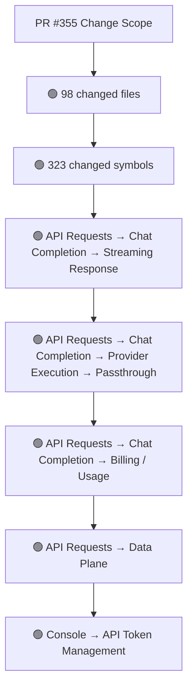
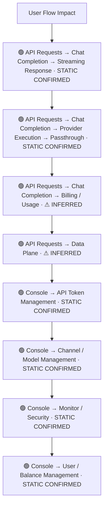
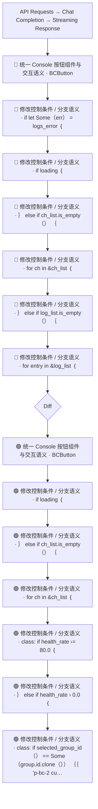
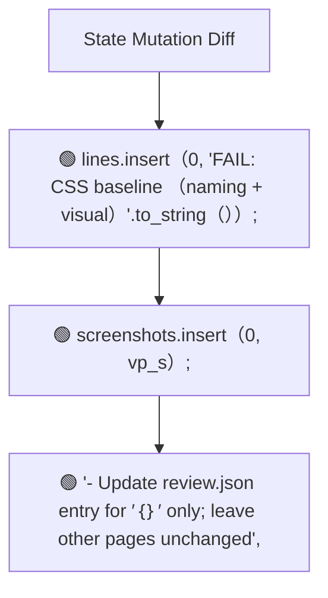
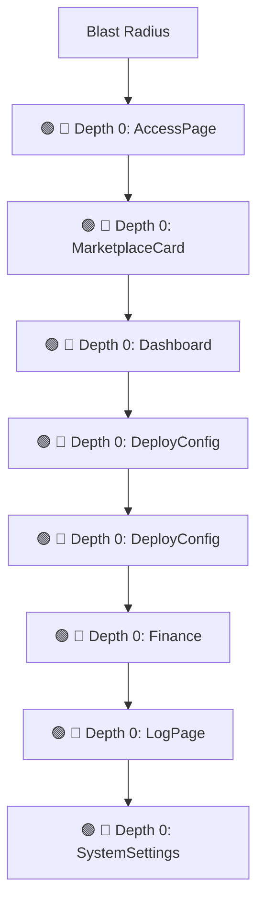

# Commit Change Atlas

## Executive Summary

| Field | Value |
|---|---|
| Commit | `c7107382b8479deb44f992e9e5ae8dcac5efb417` |
| Base | `876bf8dc06bf8874ff433bf01c8fb5582a1e2c39` |
| Merged PR | [#355](https://github.com/burncloud/burncloud/pull/355) |
| Merged At | `2026-07-08T05:55:51Z` |
| Intent | feat(client): E2E preview routes, jobs-aesthetic loop, and CSS acceptance gates |
| Intent Truth | **AUTHOR-STATED** (PR title/body) |
| Risk | **HIGH (55)** |
| Changed Files | 98 |
| Changed Symbols | 323 |
| Changed Functions | 213 |
| Changed Routes | 20 |
| Changed Test Files | 6 |
| Affected User Flows | 8 |
| API Contract | Changed |
| Database | Changed |
| External | Changed |
| Tests | 🟢 New Coverage |

**Source Diff:** [BASE `876bf8dc06bf` → TARGET `c7107382b847`](https://github.com/burncloud/burncloud/compare/876bf8dc06bf8874ff433bf01c8fb5582a1e2c39...c7107382b8479deb44f992e9e5ae8dcac5efb417)

## Intent

**Intent:** feat(client): E2E preview routes, jobs-aesthetic loop, and CSS acceptance gates

**Truth:** **AUTHOR-STATED INTENT** — PR title/body; code facts below come from BASE→TARGET diff.

[Open merged PR #355](https://github.com/burncloud/burncloud/pull/355)

## 10-Dimension Dashboard

| Dimension | Status | Risk |
|---|---|---|
| 1. Change Scope | ● Changed | MEDIUM |
| 2. User Flow | ● Changed | MEDIUM |
| 3. Runtime | ● Changed | HIGH |
| 4. Control Flow | ● Changed | HIGH |
| 5. State | ● Changed | MEDIUM |
| 6. API Contract | ● Changed | HIGH |
| 7. Database | ● Changed | HIGH |
| 8. External | ● Changed | MEDIUM |
| 9. Blast Radius | ● Changed | MEDIUM |
| 10. Tests | ● Changed | HIGH |

---

## 1. Change Scope

### What changed?

Files **98** · Symbols **323** · Functions **213** · Routes **20** · Test files **6**

### Change Scope Map

### Changed Files

- 🟡 MODIFIED `Cargo.toml`
- 🟡 MODIFIED `crates/client/Cargo.toml`
- 🟡 MODIFIED `crates/client/crates/client-access/src/lib.rs`
- 🟡 MODIFIED `crates/client/crates/client-connect/src/lib.rs`
- 🟡 MODIFIED `crates/client/crates/client-dashboard/src/dashboard.rs`
- 🟡 MODIFIED `crates/client/crates/client-deploy/src/deploy.rs`
- 🟡 MODIFIED `crates/client/crates/client-finance/src/lib.rs`
- 🟡 MODIFIED `crates/client/crates/client-log/src/lib.rs`
- 🟡 MODIFIED `crates/client/crates/client-models/src/models.rs`
- 🟡 MODIFIED `crates/client/crates/client-monitor/src/monitor.rs`
- 🟡 MODIFIED `crates/client/crates/client-playground/src/lib.rs`
- 🟡 MODIFIED `crates/client/crates/client-settings/src/groups.rs`
- 🟡 MODIFIED `crates/client/crates/client-settings/src/settings.rs`
- 🟡 MODIFIED `crates/client/crates/client-settings/src/tokens.rs`
- 🟡 MODIFIED `crates/client/crates/client-shared/Cargo.toml`
- 🟡 MODIFIED `crates/client/crates/client-shared/src/components/bc_card.rs`
- 🟡 MODIFIED `crates/client/crates/client-shared/src/components/bc_magic_button.rs`
- 🟡 MODIFIED `crates/client/crates/client-shared/src/components/bc_modal.rs`
- 🟡 MODIFIED `crates/client/crates/client-shared/src/components/bc_table.rs`
- 🟡 MODIFIED `crates/client/crates/client-shared/src/components/console_sidebar.rs`
- 🟡 MODIFIED `crates/client/crates/client-shared/src/components/glass_card.rs`
- 🟡 MODIFIED `crates/client/crates/client-shared/src/components/layout.rs`
- 🟡 MODIFIED `crates/client/crates/client-shared/src/components/page_header.rs`
- 🟡 MODIFIED `crates/client/crates/client-shared/src/components/schema_form.rs`
- 🟡 MODIFIED `crates/client/crates/client-shared/src/components/schema_table.rs`

### Changed Symbols

- 🟡 `function` `AccessPage` — `crates/client/crates/client-access/src/lib.rs:L28`
- 🟡 `function` `MarketplaceCard` — `crates/client/crates/client-connect/src/lib.rs:L401`
- 🟡 `function` `Dashboard` — `crates/client/crates/client-dashboard/src/dashboard.rs:L57`
- 🟡 `function` `DeployConfig` — `crates/client/crates/client-deploy/src/deploy.rs:L11`
- 🟡 `function` `DeployConfig` — `crates/client/crates/client-deploy/src/deploy.rs:L12`
- 🟡 `function` `Finance` — `crates/client/crates/client-finance/src/lib.rs:L47`
- 🟡 `function` `LogPage` — `crates/client/crates/client-log/src/lib.rs:L104`
- 🟡 `function` `SystemSettings` — `crates/client/crates/client-settings/src/settings.rs:L50`
- 🟡 `function` `BCCard` — `crates/client/crates/client-shared/src/components/bc_card.rs:L12`
- 🟡 `function` `BCMagicButton` — `crates/client/crates/client-shared/src/components/bc_magic_button.rs:L11`
- 🟡 `function` `BCModal` — `crates/client/crates/client-shared/src/components/bc_modal.rs:L6`
- 🟡 `function` `BCPagination` — `crates/client/crates/client-shared/src/components/bc_table.rs:L30`
- 🟡 `function` `BCTable` — `crates/client/crates/client-shared/src/components/bc_table.rs:L6`
- 🟡 `function` `ConsoleSidebar` — `crates/client/crates/client-shared/src/components/console_sidebar.rs:L175`
- 🟡 `function` `GlassCard` — `crates/client/crates/client-shared/src/components/glass_card.rs:L42`
- 🟡 `function` `Layout` — `crates/client/crates/client-shared/src/components/layout.rs:L44`
- 🟡 `function` `Layout` — `crates/client/crates/client-shared/src/components/layout.rs:L45`
- 🟡 `function` `PageHeader` — `crates/client/crates/client-shared/src/components/page_header.rs:L4`
- 🟡 `function` `SchemaForm` — `crates/client/crates/client-shared/src/components/schema_form.rs:L273`
- 🟡 `function` `SchemaForm` — `crates/client/crates/client-shared/src/components/schema_form.rs:L274`
- 🟡 `function` `render_field` — `crates/client/crates/client-shared/src/components/schema_form.rs:L56`
- 🟡 `function` `SchemaTable` — `crates/client/crates/client-shared/src/components/schema_table.rs:L96`
- 🟡 `function` `render_cell` — `crates/client/crates/client-shared/src/components/schema_table.rs:L10`
- 🟡 `function` `TitleBar` — `crates/client/crates/client-shared/src/components/title_bar.rs:L8`
- 🟡 `function` `ToastContainer` — `crates/client/crates/client-shared/src/components/toast.rs:L86`

### Evidence

- **AFTER:** [`Cargo.toml:L47-L47`](https://github.com/burncloud/burncloud/blob/c7107382b8479deb44f992e9e5ae8dcac5efb417/Cargo.toml#L47-L47)
- **AFTER:** [`crates/client/Cargo.toml:L16-L17`](https://github.com/burncloud/burncloud/blob/c7107382b8479deb44f992e9e5ae8dcac5efb417/crates/client/Cargo.toml#L16-L17)
- **AFTER:** [`crates/client/crates/client-access/src/lib.rs:L75-L75`](https://github.com/burncloud/burncloud/blob/c7107382b8479deb44f992e9e5ae8dcac5efb417/crates/client/crates/client-access/src/lib.rs#L75-L75)
- **AFTER:** [`crates/client/crates/client-access/src/lib.rs:L85-L85`](https://github.com/burncloud/burncloud/blob/c7107382b8479deb44f992e9e5ae8dcac5efb417/crates/client/crates/client-access/src/lib.rs#L85-L85)
- **BASE:** [`crates/client/crates/client-access/src/lib.rs:L84-L84`](https://github.com/burncloud/burncloud/blob/876bf8dc06bf8874ff433bf01c8fb5582a1e2c39/crates/client/crates/client-access/src/lib.rs#L84-L84)
- **AFTER:** [`crates/client/crates/client-access/src/lib.rs:L92-L92`](https://github.com/burncloud/burncloud/blob/c7107382b8479deb44f992e9e5ae8dcac5efb417/crates/client/crates/client-access/src/lib.rs#L92-L92)
- **BASE:** [`crates/client/crates/client-access/src/lib.rs:L91-L91`](https://github.com/burncloud/burncloud/blob/876bf8dc06bf8874ff433bf01c8fb5582a1e2c39/crates/client/crates/client-access/src/lib.rs#L91-L91)
- **AFTER:** [`crates/client/crates/client-access/src/lib.rs:L97-L97`](https://github.com/burncloud/burncloud/blob/c7107382b8479deb44f992e9e5ae8dcac5efb417/crates/client/crates/client-access/src/lib.rs#L97-L97)

---

## 2. User Flow Impact

### Which user behaviors changed?

- **API Requests → Chat Completion → Streaming Response** — STATIC CONFIRMED
- **API Requests → Chat Completion → Provider Execution → Passthrough** — STATIC CONFIRMED
- **API Requests → Chat Completion → Billing / Usage** — ⚠ INFERRED
- **API Requests → Data Plane** — ⚠ INFERRED
- **Console → API Token Management** — STATIC CONFIRMED
- **Console → Channel / Model Management** — STATIC CONFIRMED
- **Console → Monitor / Security** — STATIC CONFIRMED
- **Console → User / Balance Management** — STATIC CONFIRMED

### User Flow Impact Map

Only explicit runtime/UI entry evidence is STATIC CONFIRMED; path/module mappings remain `⚠ INFERRED` where applicable.

### Evidence

- **AFTER:** [`crates/client/crates/client-access/src/lib.rs:L75-L75`](https://github.com/burncloud/burncloud/blob/c7107382b8479deb44f992e9e5ae8dcac5efb417/crates/client/crates/client-access/src/lib.rs#L75-L75)
- **AFTER:** [`crates/client/crates/client-access/src/lib.rs:L85-L85`](https://github.com/burncloud/burncloud/blob/c7107382b8479deb44f992e9e5ae8dcac5efb417/crates/client/crates/client-access/src/lib.rs#L85-L85)
- **BASE:** [`crates/client/crates/client-access/src/lib.rs:L84-L84`](https://github.com/burncloud/burncloud/blob/876bf8dc06bf8874ff433bf01c8fb5582a1e2c39/crates/client/crates/client-access/src/lib.rs#L84-L84)
- **AFTER:** [`crates/client/crates/client-access/src/lib.rs:L92-L92`](https://github.com/burncloud/burncloud/blob/c7107382b8479deb44f992e9e5ae8dcac5efb417/crates/client/crates/client-access/src/lib.rs#L92-L92)
- **BASE:** [`crates/client/crates/client-access/src/lib.rs:L91-L91`](https://github.com/burncloud/burncloud/blob/876bf8dc06bf8874ff433bf01c8fb5582a1e2c39/crates/client/crates/client-access/src/lib.rs#L91-L91)
- **AFTER:** [`crates/client/crates/client-access/src/lib.rs:L97-L97`](https://github.com/burncloud/burncloud/blob/c7107382b8479deb44f992e9e5ae8dcac5efb417/crates/client/crates/client-access/src/lib.rs#L97-L97)
- **BASE:** [`crates/client/crates/client-access/src/lib.rs:L96-L96`](https://github.com/burncloud/burncloud/blob/876bf8dc06bf8874ff433bf01c8fb5582a1e2c39/crates/client/crates/client-access/src/lib.rs#L96-L96)
- **AFTER:** [`crates/client/crates/client-access/src/lib.rs:L104-L104`](https://github.com/burncloud/burncloud/blob/c7107382b8479deb44f992e9e5ae8dcac5efb417/crates/client/crates/client-access/src/lib.rs#L104-L104)

---

## 3. End-to-End Runtime Diff

### What changed at runtime?

Changed production runtime signals were detected.

### E2E Diff

### Decisions

Changed control statements are isolated in Dimension 4. Unproven edges are not invented.

### Evidence

- **AFTER:** [`crates/client/crates/client-access/src/lib.rs:L75-L75`](https://github.com/burncloud/burncloud/blob/c7107382b8479deb44f992e9e5ae8dcac5efb417/crates/client/crates/client-access/src/lib.rs#L75-L75)
- **AFTER:** [`crates/client/crates/client-access/src/lib.rs:L85-L85`](https://github.com/burncloud/burncloud/blob/c7107382b8479deb44f992e9e5ae8dcac5efb417/crates/client/crates/client-access/src/lib.rs#L85-L85)
- **BASE:** [`crates/client/crates/client-access/src/lib.rs:L84-L84`](https://github.com/burncloud/burncloud/blob/876bf8dc06bf8874ff433bf01c8fb5582a1e2c39/crates/client/crates/client-access/src/lib.rs#L84-L84)
- **AFTER:** [`crates/client/crates/client-access/src/lib.rs:L92-L92`](https://github.com/burncloud/burncloud/blob/c7107382b8479deb44f992e9e5ae8dcac5efb417/crates/client/crates/client-access/src/lib.rs#L92-L92)
- **BASE:** [`crates/client/crates/client-access/src/lib.rs:L91-L91`](https://github.com/burncloud/burncloud/blob/876bf8dc06bf8874ff433bf01c8fb5582a1e2c39/crates/client/crates/client-access/src/lib.rs#L91-L91)
- **AFTER:** [`crates/client/crates/client-access/src/lib.rs:L97-L97`](https://github.com/burncloud/burncloud/blob/c7107382b8479deb44f992e9e5ae8dcac5efb417/crates/client/crates/client-access/src/lib.rs#L97-L97)
- **BASE:** [`crates/client/crates/client-access/src/lib.rs:L96-L96`](https://github.com/burncloud/burncloud/blob/876bf8dc06bf8874ff433bf01c8fb5582a1e2c39/crates/client/crates/client-access/src/lib.rs#L96-L96)
- **AFTER:** [`crates/client/crates/client-access/src/lib.rs:L104-L104`](https://github.com/burncloud/burncloud/blob/c7107382b8479deb44f992e9e5ae8dcac5efb417/crates/client/crates/client-access/src/lib.rs#L104-L104)

---

## 4. ICFG Diff

### Which control-flow semantics changed?

```mermaid
flowchart TD
  S["Changed Control Region"]
  R1["🔴 if let Some（err） = logs_error ｛"]
  S --> R1
  R2["🔴 if loading ｛"]
  R1 --> R2
  R3["🔴 ｝ else if ch_list.is_empty（） ｛"]
  R2 --> R3
  R4["🔴 for ch in &amp;ch_list ｛"]
  R3 --> R4
  R5["🔴 ｝ else if log_list.is_empty（） ｛"]
  R4 --> R5
  R6["🔴 for entry in &amp;log_list ｛"]
  R5 --> R6
  R7["🔴 let level = if entry.status_code ›= 500 ｛ 'ERROR' ｝ else if entry.status_code ›= 400 ｛ 'WARN ' ｝ else ｛ 'INFO…"]
  R6 --> R7
  R8["🔴 let level_cls = if entry.status_code ›= 500 ｛ 'log-err' ｝ else if entry.status_code ›= 400 ｛ 'log-warn' ｝ els…"]
  R7 --> R8
  R8 --> D{"Diff"}
  A9["🟢 if loading ｛"]
  D --> A9
  A10["🟢 ｝ else if ch_list.is_empty（） ｛"]
  A9 --> A10
  A11["🟢 for ch in &amp;ch_list ｛"]
  A10 --> A11
  A12["🟢 class: if health_rate ›= 80.0 ｛"]
  A11 --> A12
  A13["🟢 ｝ else if health_rate › 0.0 ｛"]
  A12 --> A13
  A14["🟢 class: if selected_group_id（） == Some（group.id.clone（）） ｛｛ 'p-bc-2 cursor-pointer group-item-selected' ｝｝ els…"]
  A13 --> A14
  A15["🟢 class: if current_theme == Theme::Light ｛ 'chip active' ｝ else ｛ 'chip' ｝,"]
  A14 --> A15
  A16["🟢 class: if current_theme == Theme::Dark ｛ 'chip active' ｝ else ｛ 'chip' ｝,"]
  A15 --> A16
  A17["🟢 class: if current_theme == Theme::System ｛ 'chip active' ｝ else ｛ 'chip' ｝,"]
  A16 --> A17
  A18["🟢 let titlebar_pad = if try_use_context::‹DesktopMode›（）.is_some（） ｛"]
  A17 --> A18
  A19["🟢 //! Static fixtures for E2E preview routes （visual/aesthetic tests only）."]
  A18 --> A19
  A20["🟢 match page ｛"]
  A19 --> A20
```

⚠ Diagram contains changed control statements only; unproven interprocedural edges are not invented.

### Evidence

- **AFTER:** [`crates/client/crates/client-dashboard/src/dashboard.rs:L179-L180`](https://github.com/burncloud/burncloud/blob/c7107382b8479deb44f992e9e5ae8dcac5efb417/crates/client/crates/client-dashboard/src/dashboard.rs#L179-L180)
- **BASE:** [`crates/client/crates/client-dashboard/src/dashboard.rs:L187-L195`](https://github.com/burncloud/burncloud/blob/876bf8dc06bf8874ff433bf01c8fb5582a1e2c39/crates/client/crates/client-dashboard/src/dashboard.rs#L187-L195)
- **AFTER:** [`crates/client/crates/client-dashboard/src/dashboard.rs:L244-L248`](https://github.com/burncloud/burncloud/blob/c7107382b8479deb44f992e9e5ae8dcac5efb417/crates/client/crates/client-dashboard/src/dashboard.rs#L244-L248)
- **BASE:** [`crates/client/crates/client-dashboard/src/dashboard.rs:L266-L318`](https://github.com/burncloud/burncloud/blob/876bf8dc06bf8874ff433bf01c8fb5582a1e2c39/crates/client/crates/client-dashboard/src/dashboard.rs#L266-L318)
- **AFTER:** [`crates/client/crates/client-dashboard/src/dashboard.rs:L251-L259`](https://github.com/burncloud/burncloud/blob/c7107382b8479deb44f992e9e5ae8dcac5efb417/crates/client/crates/client-dashboard/src/dashboard.rs#L251-L259)
- **BASE:** [`crates/client/crates/client-dashboard/src/dashboard.rs:L321-L325`](https://github.com/burncloud/burncloud/blob/876bf8dc06bf8874ff433bf01c8fb5582a1e2c39/crates/client/crates/client-dashboard/src/dashboard.rs#L321-L325)
- **AFTER:** [`crates/client/crates/client-dashboard/src/dashboard.rs:L261-L270`](https://github.com/burncloud/burncloud/blob/c7107382b8479deb44f992e9e5ae8dcac5efb417/crates/client/crates/client-dashboard/src/dashboard.rs#L261-L270)
- **BASE:** [`crates/client/crates/client-dashboard/src/dashboard.rs:L327-L336`](https://github.com/burncloud/burncloud/blob/876bf8dc06bf8874ff433bf01c8fb5582a1e2c39/crates/client/crates/client-dashboard/src/dashboard.rs#L327-L336)

---

## 5. State Mutation Diff

### What state behavior changed?

| Before | After |
|---|---|
| — | 🟢 lines.insert（0, 'FAIL: CSS baseline （naming + visual）'.to_string（））; |
| — | 🟢 screenshots.insert（0, vp_s）; |
| — | 🟢 '- Update review.json entry for ′｛｝′ only; leave other pages unchanged', |

### State Diff

### Evidence

- **AFTER:** [`crates/loops/src/gates/mod.rs:L1-L247`](https://github.com/burncloud/burncloud/blob/c7107382b8479deb44f992e9e5ae8dcac5efb417/crates/loops/src/gates/mod.rs#L1-L247)
- **AFTER:** [`crates/loops/src/prompt/jobs_aesthetic.rs:L1-L545`](https://github.com/burncloud/burncloud/blob/c7107382b8479deb44f992e9e5ae8dcac5efb417/crates/loops/src/prompt/jobs_aesthetic.rs#L1-L545)
- **AFTER:** [`crates/tests/tests/e2e/aesthetic_acceptance.rs:L1-L442`](https://github.com/burncloud/burncloud/blob/c7107382b8479deb44f992e9e5ae8dcac5efb417/crates/tests/tests/e2e/aesthetic_acceptance.rs#L1-L442)
- **AFTER:** [`crates/tests/tests/e2e/agent_browser.rs:L73-L74`](https://github.com/burncloud/burncloud/blob/c7107382b8479deb44f992e9e5ae8dcac5efb417/crates/tests/tests/e2e/agent_browser.rs#L73-L74)

---

## 6. API Contract Diff

### API changes

| Before | After |
|---|---|
| 🔴 .route（'/console/｛*path｝', html_handler.clone（）） | 🟢 .route（'/console/｛*path｝', html_handler.clone（））; |
| 🔴 /console/｛*path｝ | 🟢 .route（'/preview/home', html_handler.clone（）） |
| — | 🟢 .route（'/preview/login', html_handler.clone（）） |
| — | 🟢 .route（'/preview/console', html_handler.clone（）） |
| — | 🟢 .route（'/preview/console/', html_handler.clone（）） |
| — | 🟢 .route（'/preview/console/｛*path｝', html_handler.clone（））; |
| — | 🟢 /v1/chat/completions |
| — | 🟢 /preview/home |
| — | 🟢 /preview/login |
| — | 🟢 /console/dashboard |
| — | 🟢 /preview/console/dashboard |
| — | 🟢 /console/models |
| — | 🟢 /preview/console/models |
| — | 🟢 /console/access |
| — | 🟢 /preview/console/access |
| — | 🟢 /console/settings |
| — | 🟢 /preview/console/settings |
| — | 🟢 /console/finance |
| — | 🟢 /preview/console/finance |
| — | 🟢 /console/monitor |
| — | 🟢 /preview/console/monitor |
| — | 🟢 /console/playground |
| — | 🟢 /preview/console/playground |
| — | 🟢 /console/｛*path｝ |
| — | 🟢 /preview/console |
| — | 🟢 /preview/console/ |

API Contract changes are never rated below MEDIUM.

### Evidence

- **AFTER:** [`crates/client/crates/client-shared/src/e2e_mock/fixtures.rs:L1-L198`](https://github.com/burncloud/burncloud/blob/c7107382b8479deb44f992e9e5ae8dcac5efb417/crates/client/crates/client-shared/src/e2e_mock/fixtures.rs#L1-L198)
- **AFTER:** [`crates/client/crates/client-shared/src/e2e_mock/mod.rs:L1-L219`](https://github.com/burncloud/burncloud/blob/c7107382b8479deb44f992e9e5ae8dcac5efb417/crates/client/crates/client-shared/src/e2e_mock/mod.rs#L1-L219)
- **AFTER:** [`crates/client/src/app.rs:L50-L76`](https://github.com/burncloud/burncloud/blob/c7107382b8479deb44f992e9e5ae8dcac5efb417/crates/client/src/app.rs#L50-L76)
- **AFTER:** [`crates/client/src/lib.rs:L71-L81`](https://github.com/burncloud/burncloud/blob/c7107382b8479deb44f992e9e5ae8dcac5efb417/crates/client/src/lib.rs#L71-L81)
- **BASE:** [`crates/client/src/lib.rs:L71-L71`](https://github.com/burncloud/burncloud/blob/876bf8dc06bf8874ff433bf01c8fb5582a1e2c39/crates/client/src/lib.rs#L71-L71)
- **AFTER:** [`crates/loops/src/prompt/jobs_aesthetic.rs:L1-L545`](https://github.com/burncloud/burncloud/blob/c7107382b8479deb44f992e9e5ae8dcac5efb417/crates/loops/src/prompt/jobs_aesthetic.rs#L1-L545)
- **AFTER:** [`crates/tests/tests/e2e/aesthetic_acceptance.rs:L1-L442`](https://github.com/burncloud/burncloud/blob/c7107382b8479deb44f992e9e5ae8dcac5efb417/crates/tests/tests/e2e/aesthetic_acceptance.rs#L1-L442)
- **AFTER:** [`crates/tests/tests/e2e/css_visual_acceptance.rs:L1-L227`](https://github.com/burncloud/burncloud/blob/c7107382b8479deb44f992e9e5ae8dcac5efb417/crates/tests/tests/e2e/css_visual_acceptance.rs#L1-L227)

---

## 7. Database / Persistence Diff

### Persistence changes

| Before | After |
|---|---|
| 🔴 div ｛ class: 'flex flex-col h-full gap-6 select-none pt-4', | 🟢 div ｛ class: 'flex flex-col h-full gap-bc-6 select-none pt-bc-4', |
| — | 🟢 div ｛ class: 'relative flex flex-col h-screen w-screen bg-bc-canvas text-bc-text overflow-hidden select-none', 'data-th… |
| — | 🟢 '- Update review.json entry for ′｛｝′ only; leave other pages unchanged', |

Database/migration/SQL persistence surface changed.

### Evidence

- **AFTER:** [`crates/client/crates/client-shared/src/components/console_sidebar.rs:L183-L185`](https://github.com/burncloud/burncloud/blob/c7107382b8479deb44f992e9e5ae8dcac5efb417/crates/client/crates/client-shared/src/components/console_sidebar.rs#L183-L185)
- **BASE:** [`crates/client/crates/client-shared/src/components/console_sidebar.rs:L183-L185`](https://github.com/burncloud/burncloud/blob/876bf8dc06bf8874ff433bf01c8fb5582a1e2c39/crates/client/crates/client-shared/src/components/console_sidebar.rs#L183-L185)
- **AFTER:** [`crates/client/src/pages/e2e_preview.rs:L1-L139`](https://github.com/burncloud/burncloud/blob/c7107382b8479deb44f992e9e5ae8dcac5efb417/crates/client/src/pages/e2e_preview.rs#L1-L139)
- **AFTER:** [`crates/loops/src/prompt/jobs_aesthetic.rs:L1-L545`](https://github.com/burncloud/burncloud/blob/c7107382b8479deb44f992e9e5ae8dcac5efb417/crates/loops/src/prompt/jobs_aesthetic.rs#L1-L545)

---

## 8. External Dependency Diff

### External behavior changes

| Before | After |
|---|---|
| 🔴 div ｛ class: 'mono text-caption text-bc-text-secondary mt-xs', 'https∶／／pool.skynet-ops.io' ｝ | 🟢 div ｛ class: 'mono text-caption text-bc-text-secondary mt-bc-1', 'https∶／／pool.skynet-ops.io' ｝ |
| — | 🟢 base_url: 'https∶／／api.openai.com'.into（）, |
| — | 🟢 base_url: 'https∶／／api.anthropic.com'.into（）, |
| — | 🟢 Command::new（'tasklist'） |
| — | 🟢 let status = Command::new（&agent） |
| — | 🟢 println!（' E2E server : ｛｝ （persistent）', server.base_url）; |
| — | 🟢 let _ = Command::new（'powershell'） |
| — | 🟢 let _ = Command::new（'pkill'） |
| — | 🟢 pub base_url: String, |
| — | 🟢 let status = Command::new（'cargo'） |
| — | 🟢 let base_url = format!（'http∶／／127.0.0.1:｛port｝'）; |
| — | 🟢 eprintln!（'Starting loop E2E server at ｛base_url｝ （persistent across iterations）...'）; |

### Evidence

- **AFTER:** [`crates/client/crates/client-connect/src/lib.rs:L300-L300`](https://github.com/burncloud/burncloud/blob/c7107382b8479deb44f992e9e5ae8dcac5efb417/crates/client/crates/client-connect/src/lib.rs#L300-L300)
- **BASE:** [`crates/client/crates/client-connect/src/lib.rs:L300-L300`](https://github.com/burncloud/burncloud/blob/876bf8dc06bf8874ff433bf01c8fb5582a1e2c39/crates/client/crates/client-connect/src/lib.rs#L300-L300)
- **AFTER:** [`crates/client/crates/client-shared/src/e2e_mock/fixtures.rs:L1-L198`](https://github.com/burncloud/burncloud/blob/c7107382b8479deb44f992e9e5ae8dcac5efb417/crates/client/crates/client-shared/src/e2e_mock/fixtures.rs#L1-L198)
- **AFTER:** [`crates/loops/Cargo.toml:L1-L24`](https://github.com/burncloud/burncloud/blob/c7107382b8479deb44f992e9e5ae8dcac5efb417/crates/loops/Cargo.toml#L1-L24)
- **AFTER:** [`crates/loops/acceptance/css-optimize-acceptance.md:L1-L163`](https://github.com/burncloud/burncloud/blob/c7107382b8479deb44f992e9e5ae8dcac5efb417/crates/loops/acceptance/css-optimize-acceptance.md#L1-L163)
- **AFTER:** [`crates/loops/src/gates/cargo_test.rs:L1-L245`](https://github.com/burncloud/burncloud/blob/c7107382b8479deb44f992e9e5ae8dcac5efb417/crates/loops/src/gates/cargo_test.rs#L1-L245)
- **AFTER:** [`crates/loops/src/lock.rs:L1-L57`](https://github.com/burncloud/burncloud/blob/c7107382b8479deb44f992e9e5ae8dcac5efb417/crates/loops/src/lock.rs#L1-L57)
- **AFTER:** [`crates/loops/src/loops/css_optimize.rs:L1-L134`](https://github.com/burncloud/burncloud/blob/c7107382b8479deb44f992e9e5ae8dcac5efb417/crates/loops/src/loops/css_optimize.rs#L1-L134)

---

## 9. Blast Radius

### What else may be affected?

| Depth | Impact | Evidence location |
|---|---|---|
| 🔴 Depth 0 | AccessPage | `crates/client/crates/client-access/src/lib.rs:L28` |
| 🔴 Depth 0 | MarketplaceCard | `crates/client/crates/client-connect/src/lib.rs:L401` |
| 🔴 Depth 0 | Dashboard | `crates/client/crates/client-dashboard/src/dashboard.rs:L57` |
| 🔴 Depth 0 | DeployConfig | `crates/client/crates/client-deploy/src/deploy.rs:L11` |
| 🔴 Depth 0 | DeployConfig | `crates/client/crates/client-deploy/src/deploy.rs:L12` |
| 🔴 Depth 0 | Finance | `crates/client/crates/client-finance/src/lib.rs:L47` |
| 🔴 Depth 0 | LogPage | `crates/client/crates/client-log/src/lib.rs:L104` |
| 🔴 Depth 0 | SystemSettings | `crates/client/crates/client-settings/src/settings.rs:L50` |

### Blast Radius Map

🔴 Depth 0 is direct. 🟡 lexical references are **impact candidates**, not compiler-proven call edges. Dynamic dispatch is never promoted to a confirmed edge.

### Evidence

- **AFTER:** [`Cargo.toml:L47-L47`](https://github.com/burncloud/burncloud/blob/c7107382b8479deb44f992e9e5ae8dcac5efb417/Cargo.toml#L47-L47)
- **AFTER:** [`crates/client/Cargo.toml:L16-L17`](https://github.com/burncloud/burncloud/blob/c7107382b8479deb44f992e9e5ae8dcac5efb417/crates/client/Cargo.toml#L16-L17)
- **AFTER:** [`crates/client/crates/client-access/src/lib.rs:L75-L75`](https://github.com/burncloud/burncloud/blob/c7107382b8479deb44f992e9e5ae8dcac5efb417/crates/client/crates/client-access/src/lib.rs#L75-L75)
- **AFTER:** [`crates/client/crates/client-access/src/lib.rs:L85-L85`](https://github.com/burncloud/burncloud/blob/c7107382b8479deb44f992e9e5ae8dcac5efb417/crates/client/crates/client-access/src/lib.rs#L85-L85)
- **BASE:** [`crates/client/crates/client-access/src/lib.rs:L84-L84`](https://github.com/burncloud/burncloud/blob/876bf8dc06bf8874ff433bf01c8fb5582a1e2c39/crates/client/crates/client-access/src/lib.rs#L84-L84)
- **AFTER:** [`crates/client/crates/client-access/src/lib.rs:L92-L92`](https://github.com/burncloud/burncloud/blob/c7107382b8479deb44f992e9e5ae8dcac5efb417/crates/client/crates/client-access/src/lib.rs#L92-L92)
- **BASE:** [`crates/client/crates/client-access/src/lib.rs:L91-L91`](https://github.com/burncloud/burncloud/blob/876bf8dc06bf8874ff433bf01c8fb5582a1e2c39/crates/client/crates/client-access/src/lib.rs#L91-L91)

---

## 10. Test Coverage & Evidence

### Coverage Matrix

**Overall:** 🟢 New Coverage

- Changed test files: **6**
- Lexical references from changed symbols into tests: **2**

### Missing Coverage

- No additional missing direct-coverage claim beyond evidence above.

### Source Evidence

- **AFTER:** [`crates/loops/src/gates/cargo_test.rs:L1-L245`](https://github.com/burncloud/burncloud/blob/c7107382b8479deb44f992e9e5ae8dcac5efb417/crates/loops/src/gates/cargo_test.rs#L1-L245)
- **AFTER:** [`crates/tests/tests/common/mod.rs:L46-L50`](https://github.com/burncloud/burncloud/blob/c7107382b8479deb44f992e9e5ae8dcac5efb417/crates/tests/tests/common/mod.rs#L46-L50)
- **BASE:** [`crates/tests/tests/common/mod.rs:L46-L47`](https://github.com/burncloud/burncloud/blob/876bf8dc06bf8874ff433bf01c8fb5582a1e2c39/crates/tests/tests/common/mod.rs#L46-L47)
- **AFTER:** [`crates/tests/tests/common/mod.rs:L57-L59`](https://github.com/burncloud/burncloud/blob/c7107382b8479deb44f992e9e5ae8dcac5efb417/crates/tests/tests/common/mod.rs#L57-L59)
- **AFTER:** [`crates/tests/tests/common/mod.rs:L125-L129`](https://github.com/burncloud/burncloud/blob/c7107382b8479deb44f992e9e5ae8dcac5efb417/crates/tests/tests/common/mod.rs#L125-L129)
- **BASE:** [`crates/tests/tests/common/mod.rs:L119-L120`](https://github.com/burncloud/burncloud/blob/876bf8dc06bf8874ff433bf01c8fb5582a1e2c39/crates/tests/tests/common/mod.rs#L119-L120)
- **AFTER:** [`crates/tests/tests/common/mod.rs:L132-L138`](https://github.com/burncloud/burncloud/blob/c7107382b8479deb44f992e9e5ae8dcac5efb417/crates/tests/tests/common/mod.rs#L132-L138)
- **BASE:** [`crates/tests/tests/common/mod.rs:L123-L123`](https://github.com/burncloud/burncloud/blob/876bf8dc06bf8874ff433bf01c8fb5582a1e2c39/crates/tests/tests/common/mod.rs#L123-L123)

---

## Risk Assessment

**Score: 55 → HIGH**

### Risk Drivers

- `Authentication change` **+5**
- `Authorization change` **+5**
- `Billing change` **+5**
- `Quota change` **+5**
- `Public API contract` **+5**
- `Database schema` **+5**
- `Routing decision` **+4**
- `Provider request` **+4**
- `Streaming` **+4**
- `Retry/failover` **+4**
- `State mutation` **+3**
- `Cache behavior` **+3**
- `Large blast radius` **+3**

The score is rule-based, not an LLM impression.

## Reviewer Checklist

- [ ] Intent 与代码变化一致
- [ ] User Flow impact 已确认
- [ ] Runtime Diff 已确认
- [ ] Control-flow changes 已确认
- [ ] State mutation 已确认
- [ ] API contract 已确认
- [ ] Database behavior 已确认
- [ ] External Provider behavior 已确认
- [ ] Blast Radius 可接受
- [ ] Tests 覆盖 changed runtime paths
- [ ] Dynamic / Inferred relationships 已正确标记
- [ ] Source Evidence 可追溯

## Source Diff Entry Points

- [Complete BASE → TARGET diff](https://github.com/burncloud/burncloud/compare/876bf8dc06bf8874ff433bf01c8fb5582a1e2c39...c7107382b8479deb44f992e9e5ae8dcac5efb417)
- [Merged PR #355](https://github.com/burncloud/burncloud/pull/355)
