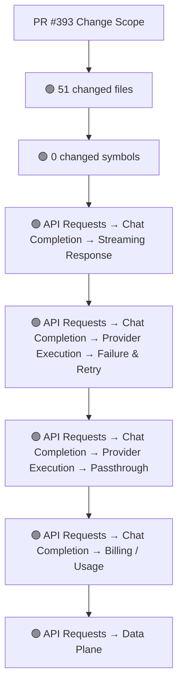
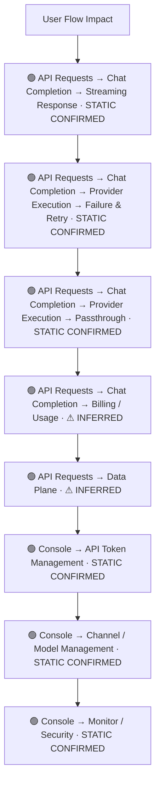
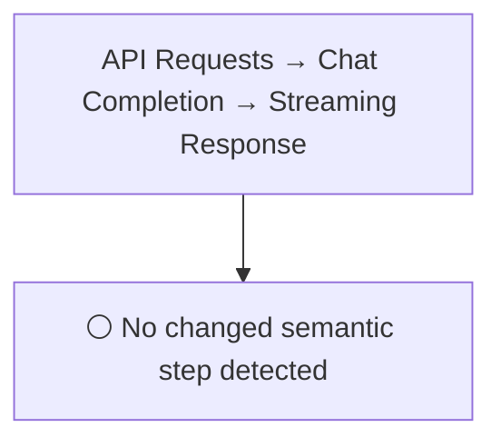
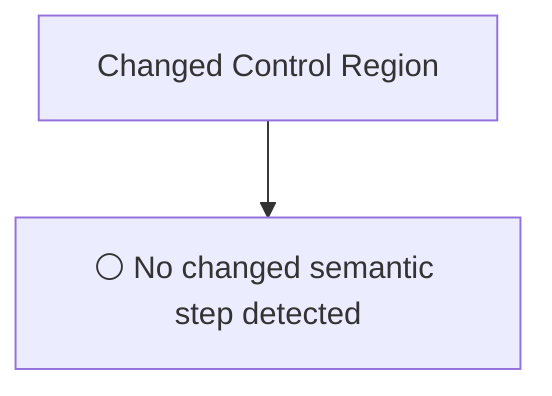
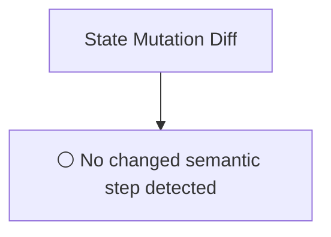
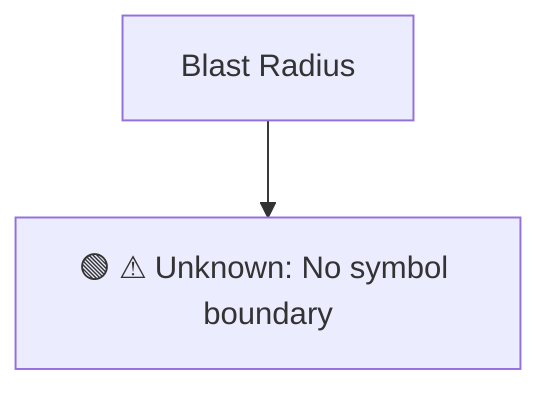

# Commit Change Atlas

## Executive Summary

| Field | Value |
|---|---|
| Commit | `956041a8b54d8c6964e57fa2284f825cc322b0d2` |
| Base | `c7107382b8479deb44f992e9e5ae8dcac5efb417` |
| Merged PR | [#393](https://github.com/burncloud/burncloud/pull/393) |
| Merged At | `2026-08-10T12:01:39Z` |
| Intent | docs: replace legacy docs with AI agent engineering harness |
| Intent Truth | **AUTHOR-STATED** (PR title/body) |
| Risk | **HIGH (55)** |
| Changed Files | 51 |
| Changed Symbols | 0 |
| Changed Functions | 0 |
| Changed Routes | 6 |
| Changed Test Files | 0 |
| Affected User Flows | 8 |
| API Contract | Changed |
| Database | Changed |
| External | No Change |
| Tests | ? Unable to determine |

**Source Diff:** [BASE `c7107382b847` → TARGET `956041a8b54d`](https://github.com/burncloud/burncloud/compare/c7107382b8479deb44f992e9e5ae8dcac5efb417...956041a8b54d8c6964e57fa2284f825cc322b0d2)

## Intent

**Intent:** docs: replace legacy docs with AI agent engineering harness

**Truth:** **AUTHOR-STATED INTENT** — PR title/body; code facts below come from BASE→TARGET diff.

[Open merged PR #393](https://github.com/burncloud/burncloud/pull/393)

## 10-Dimension Dashboard

| Dimension | Status | Risk |
|---|---|---|
| 1. Change Scope | ● Changed | MEDIUM |
| 2. User Flow | ● Changed | MEDIUM |
| 3. Runtime | ○ No Change | LOW |
| 4. Control Flow | ○ No Change | LOW |
| 5. State | ○ No Change | LOW |
| 6. API Contract | ● Changed | HIGH |
| 7. Database | ● Changed | HIGH |
| 8. External | ○ No Change | LOW |
| 9. Blast Radius | ● Changed | MEDIUM |
| 10. Tests | ● Changed | HIGH |

---

## 1. Change Scope

### What changed?

Files **51** · Symbols **0** · Functions **0** · Routes **6** · Test files **0**

### Change Scope Map

### Changed Files

- 🟡 MODIFIED `README.md`
- 🟡 MODIFIED `crates/router/README.md`
- 🟡 MODIFIED `crates/router/scripts/check-router-deps.sh`
- 🔴 REMOVED `docs/BLUEPRINT.md`
- 🟡 MODIFIED `docs/CLAUDE.md`
- 🔴 REMOVED `docs/CONSTITUTION.md`
- 🔴 REMOVED `docs/CONSTITUTION_ZH.md`
- 🔴 REMOVED `docs/E2E_FRAMEWORK_COMPARISON.md`
- 🟢 ADDED `docs/README.md`
- 🔴 REMOVED `docs/README/CN.md`
- 🔴 REMOVED `docs/README_CN.md`
- 🔴 REMOVED `docs/SCHEMA.md`
- 🟢 ADDED `docs/agent/CHANGE_PROTOCOL.md`
- 🟢 ADDED `docs/agent/DOC_PRIORITY.md`
- 🟢 ADDED `docs/agent/INVARIANTS.md`
- 🟢 ADDED `docs/agent/START_HERE.md`
- 🟢 ADDED `docs/agent/TASK_ROUTER.md`
- 🟢 ADDED `docs/agent/TEST_MATRIX.md`
- 🔴 REMOVED `docs/api/error-contract.md`
- 🟢 ADDED `docs/architecture/CURRENT_SYSTEM.md`
- 🔴 REMOVED `docs/assets/screenshots/issue-299.png`
- 🔴 REMOVED `docs/assets/screenshots/issue-306-start-button.png`
- 🔴 REMOVED `docs/assets/screenshots/issue-307.png`
- 🔴 REMOVED `docs/assets/screenshots/pr308-verification.png`
- 🔴 REMOVED `docs/code/ARCHITECTURE.md`

### Changed Symbols

- No safe Rust symbol boundary resolved; no symbol is guessed.

### Evidence

- **BASE:** [`README.md:L8-L8`](https://github.com/burncloud/burncloud/blob/c7107382b8479deb44f992e9e5ae8dcac5efb417/README.md#L8-L8)
- **AFTER:** [`README.md:L9-L9`](https://github.com/burncloud/burncloud/blob/956041a8b54d8c6964e57fa2284f825cc322b0d2/README.md#L9-L9)
- **BASE:** [`README.md:L10-L10`](https://github.com/burncloud/burncloud/blob/c7107382b8479deb44f992e9e5ae8dcac5efb417/README.md#L10-L10)
- **AFTER:** [`README.md:L11-L11`](https://github.com/burncloud/burncloud/blob/956041a8b54d8c6964e57fa2284f825cc322b0d2/README.md#L11-L11)
- **BASE:** [`README.md:L12-L14`](https://github.com/burncloud/burncloud/blob/c7107382b8479deb44f992e9e5ae8dcac5efb417/README.md#L12-L14)
- **AFTER:** [`README.md:L17-L17`](https://github.com/burncloud/burncloud/blob/956041a8b54d8c6964e57fa2284f825cc322b0d2/README.md#L17-L17)
- **BASE:** [`README.md:L20-L37`](https://github.com/burncloud/burncloud/blob/c7107382b8479deb44f992e9e5ae8dcac5efb417/README.md#L20-L37)
- **AFTER:** [`README.md:L19-L19`](https://github.com/burncloud/burncloud/blob/956041a8b54d8c6964e57fa2284f825cc322b0d2/README.md#L19-L19)

---

## 2. User Flow Impact

### Which user behaviors changed?

- **API Requests → Chat Completion → Streaming Response** — STATIC CONFIRMED
- **API Requests → Chat Completion → Provider Execution → Failure & Retry** — STATIC CONFIRMED
- **API Requests → Chat Completion → Provider Execution → Passthrough** — STATIC CONFIRMED
- **API Requests → Chat Completion → Billing / Usage** — ⚠ INFERRED
- **API Requests → Data Plane** — ⚠ INFERRED
- **Console → API Token Management** — STATIC CONFIRMED
- **Console → Channel / Model Management** — STATIC CONFIRMED
- **Console → Monitor / Security** — STATIC CONFIRMED

### User Flow Impact Map

Only explicit runtime/UI entry evidence is STATIC CONFIRMED; path/module mappings remain `⚠ INFERRED` where applicable.

### Evidence

- **BASE:** [`README.md:L8-L8`](https://github.com/burncloud/burncloud/blob/c7107382b8479deb44f992e9e5ae8dcac5efb417/README.md#L8-L8)
- **AFTER:** [`README.md:L9-L9`](https://github.com/burncloud/burncloud/blob/956041a8b54d8c6964e57fa2284f825cc322b0d2/README.md#L9-L9)
- **BASE:** [`README.md:L10-L10`](https://github.com/burncloud/burncloud/blob/c7107382b8479deb44f992e9e5ae8dcac5efb417/README.md#L10-L10)
- **AFTER:** [`README.md:L11-L11`](https://github.com/burncloud/burncloud/blob/956041a8b54d8c6964e57fa2284f825cc322b0d2/README.md#L11-L11)
- **BASE:** [`README.md:L12-L14`](https://github.com/burncloud/burncloud/blob/c7107382b8479deb44f992e9e5ae8dcac5efb417/README.md#L12-L14)

---

## 3. End-to-End Runtime Diff

### What changed at runtime?

**⚪ NO PRODUCTION RUNTIME EXECUTION CHANGE DETECTED.**

### E2E Diff

### Decisions

⚪ No changed control statement detected. Unproven edges are not invented.

### Evidence

- **COMPLETE DIFF SCAN:** No conservative runtime-semantic hunk matched.
- [Open complete BASE → TARGET diff](https://github.com/burncloud/burncloud/compare/c7107382b8479deb44f992e9e5ae8dcac5efb417...956041a8b54d8c6964e57fa2284f825cc322b0d2)

---

## 4. ICFG Diff

### Which control-flow semantics changed?

**⚪ NO CONTROL-FLOW CHANGE DETECTED.**

### Evidence

- **BASE:** [`README.md:L8-L8`](https://github.com/burncloud/burncloud/blob/c7107382b8479deb44f992e9e5ae8dcac5efb417/README.md#L8-L8)
- **AFTER:** [`README.md:L19-L19`](https://github.com/burncloud/burncloud/blob/956041a8b54d8c6964e57fa2284f825cc322b0d2/README.md#L19-L19)
- **BASE:** [`README.md:L39-L42`](https://github.com/burncloud/burncloud/blob/c7107382b8479deb44f992e9e5ae8dcac5efb417/README.md#L39-L42)
- **AFTER:** [`README.md:L21-L21`](https://github.com/burncloud/burncloud/blob/956041a8b54d8c6964e57fa2284f825cc322b0d2/README.md#L21-L21)
- **BASE:** [`README.md:L44-L47`](https://github.com/burncloud/burncloud/blob/c7107382b8479deb44f992e9e5ae8dcac5efb417/README.md#L44-L47)
- **AFTER:** [`README.md:L27-L32`](https://github.com/burncloud/burncloud/blob/956041a8b54d8c6964e57fa2284f825cc322b0d2/README.md#L27-L32)
- **BASE:** [`README.md:L59-L62`](https://github.com/burncloud/burncloud/blob/c7107382b8479deb44f992e9e5ae8dcac5efb417/README.md#L59-L62)
- **AFTER:** [`README.md:L34-L34`](https://github.com/burncloud/burncloud/blob/956041a8b54d8c6964e57fa2284f825cc322b0d2/README.md#L34-L34)

---

## 5. State Mutation Diff

### What state behavior changed?

**⚪ NO STATE MUTATION CHANGE DETECTED**

### State Diff

### Evidence

- **AFTER:** [`crates/router/scripts/check-router-deps.sh:L82-L84`](https://github.com/burncloud/burncloud/blob/956041a8b54d8c6964e57fa2284f825cc322b0d2/crates/router/scripts/check-router-deps.sh#L82-L84)
- **BASE:** [`crates/router/scripts/check-router-deps.sh:L88-L90`](https://github.com/burncloud/burncloud/blob/c7107382b8479deb44f992e9e5ae8dcac5efb417/crates/router/scripts/check-router-deps.sh#L88-L90)
- **BASE:** [`docs/CONSTITUTION.md:L1-L216`](https://github.com/burncloud/burncloud/blob/c7107382b8479deb44f992e9e5ae8dcac5efb417/docs/CONSTITUTION.md#L1-L216)
- **BASE:** [`docs/CONSTITUTION_ZH.md:L1-L216`](https://github.com/burncloud/burncloud/blob/c7107382b8479deb44f992e9e5ae8dcac5efb417/docs/CONSTITUTION_ZH.md#L1-L216)
- **AFTER:** [`docs/README.md:L1-L61`](https://github.com/burncloud/burncloud/blob/956041a8b54d8c6964e57fa2284f825cc322b0d2/docs/README.md#L1-L61)
- **AFTER:** [`docs/agent/CHANGE_PROTOCOL.md:L1-L61`](https://github.com/burncloud/burncloud/blob/956041a8b54d8c6964e57fa2284f825cc322b0d2/docs/agent/CHANGE_PROTOCOL.md#L1-L61)
- **AFTER:** [`docs/agent/DOC_PRIORITY.md:L1-L51`](https://github.com/burncloud/burncloud/blob/956041a8b54d8c6964e57fa2284f825cc322b0d2/docs/agent/DOC_PRIORITY.md#L1-L51)
- **AFTER:** [`docs/agent/INVARIANTS.md:L1-L83`](https://github.com/burncloud/burncloud/blob/956041a8b54d8c6964e57fa2284f825cc322b0d2/docs/agent/INVARIANTS.md#L1-L83)

---

## 6. API Contract Diff

### API changes

| Before | After |
|---|---|
| 🔴 -H 'Authorization: Bearer YOUR_TOKEN' ＼ | — |
| 🔴 -H 'Content-Type: application/json' ＼ | — |
| 🔴 ¦ 响应错误 ¦ ′err（'message'）.into_response（）′ ¦ 手写 ′StatusCode::BAD_REQUEST′ ¦ | — |
| 🔴 * Router must verify the user's Bearer Token before forwarding requests. | — |
| 🔴 * Router 必须验证用户的 Bearer Token 才能转发请求。 | — |
| 🔴 await page.route（'**/tracking.js', route =› route.abort（））; | — |
| 🔴 BurnCloud 路由层有 3 种'主动拒绝'路径：上游 LLM 提供商真正返回的 429 永远透传给客户端（带原始 ′Retry-After′ 等 header），而**路由器本地拒绝**（OrderType 价格约束 / 调度无可用… | — |
| 🔴 ¦ 上游 LLM 真正限速 ¦ ′429′ ¦ 上游透传 ¦ 上游配额问题，等到 ′Retry-After′ ¦ | — |
| 🔴 所有 503 拒绝响应**必带** ′X-Rejected-By′ 与 ′Retry-After′ 两个 header（蓝图决策 D12）。客户端必须读 ′X-Rejected-By′ 决定后续行为，仅看 status code 不够。 | — |
| 🔴 **′Retry-After′ 语义**：固定 ′60′ 秒。**重试策略**：单纯重试**不会**让 cap 重新匹配——客户端应当： | — |
| 🔴 **′Retry-After′ 语义**：固定 ′60′ 秒。**重试策略**：60 秒覆盖的场景： | — |
| 🔴 **′Retry-After′ 语义**：固定 ′60′ 秒。**重试策略**：**60 秒后桶必然 refill**（′REFILL_WINDOW = Duration::from_secs（60）′，′crates/router/sr… | — |
| 🔴 /api/login | — |
| 🔴 /api/protected | — |
| 🔴 /api/xxx | — |
| 🔴 /api/xxx/｛id｝ | — |
| 🔴 /api/users/register | — |
| 🔴 /v1/messages | — |

API Contract changes are never rated below MEDIUM.

### Evidence

- **AFTER:** [`README.md:L61-L62`](https://github.com/burncloud/burncloud/blob/956041a8b54d8c6964e57fa2284f825cc322b0d2/README.md#L61-L62)
- **BASE:** [`README.md:L122-L131`](https://github.com/burncloud/burncloud/blob/c7107382b8479deb44f992e9e5ae8dcac5efb417/README.md#L122-L131)
- **AFTER:** [`docs/CLAUDE.md:L2-L6`](https://github.com/burncloud/burncloud/blob/956041a8b54d8c6964e57fa2284f825cc322b0d2/docs/CLAUDE.md#L2-L6)
- **BASE:** [`docs/CLAUDE.md:L26-L39`](https://github.com/burncloud/burncloud/blob/c7107382b8479deb44f992e9e5ae8dcac5efb417/docs/CLAUDE.md#L26-L39)
- **BASE:** [`docs/CONSTITUTION.md:L1-L216`](https://github.com/burncloud/burncloud/blob/c7107382b8479deb44f992e9e5ae8dcac5efb417/docs/CONSTITUTION.md#L1-L216)
- **BASE:** [`docs/CONSTITUTION_ZH.md:L1-L216`](https://github.com/burncloud/burncloud/blob/c7107382b8479deb44f992e9e5ae8dcac5efb417/docs/CONSTITUTION_ZH.md#L1-L216)
- **BASE:** [`docs/E2E_FRAMEWORK_COMPARISON.md:L1-L907`](https://github.com/burncloud/burncloud/blob/c7107382b8479deb44f992e9e5ae8dcac5efb417/docs/E2E_FRAMEWORK_COMPARISON.md#L1-L907)
- **BASE:** [`docs/api/error-contract.md:L1-L184`](https://github.com/burncloud/burncloud/blob/c7107382b8479deb44f992e9e5ae8dcac5efb417/docs/api/error-contract.md#L1-L184)

---

## 7. Database / Persistence Diff

### Persistence changes

| Before | After |
|---|---|
| 🔴 - **关于与更新 （About & Update）**: | 🟢 # dependency requires architecture review and an explicit whitelist update. |
| 🔴 - 集成 ′auto-update′ crate，检查 GitHub Release 更新。 | 🟢 echo ' and an explicit update to the whitelist if the new dependency is accepted.' |
| 🔴 * ′📚 docs: update CONSTITUTION.md′ | 🟢 When code changes observable runtime behavior, routing, persistence, authentication, billing, or an invariant listed he… |
| 🔴 * Regardless of the language used by the user to ask questions, the AI agent must use **Chinese** when **summarizing up… | 🟢 Update a doc only if its declared truth changed. In particular update: |
| 🔴 * Content: Must include a **Simple functional update description**, clearly and accurately describing the changes. | 🟢 - A ′source-derived′ document becomes stale when source behavior changes; update it with that change. |
| 🔴 * 内容：必须包含简单的功能更新说明 （Simple functional update description）。 | 🟢 These are high-value facts visible in current code. If a change intentionally alters one, update code, tests, and this … |
| 🔴 SELECT | 🟢 Read ［′INVARIANTS.md′］（INVARIANTS.md）. If the change would alter an invariant, call that out explicitly and update the … |
| 🔴 - ′crates/database/src/schema.rs′ 是所有核心业务表的唯一 CREATE TABLE 来源。 | 🟢 ### 8. Update docs only when the truth changed |
| 🔴 - Sub-crate 的 ′init（）′ 只能执行 ′ALTER TABLE ... ADD COLUMN IF NOT EXISTS′。 | 🟢 Update docs when the code changes: |
| 🔴 - 只有独立 crate（′setting′, ′installer′, ′download′）可自行 CREATE TABLE， | 🟢 Do not update docs for internal refactors that preserve these truths unless source locations/ownership changed material… |
| 🔴 - 禁止在多个 crate 中重复定义同一张表的 CREATE TABLE。 | 🟢 ¦ Installer / download / update ¦ corresponding crate under ′crates/installer′, ′crates/download′, ′crates/auto-update′… |
| 🔴 2. 表名先在 ′schema.rs′ 添加 CREATE TABLE | 🟢 - do not silently update the test to make the PR green; |

Database/migration/SQL persistence surface changed.

### Evidence

- **AFTER:** [`crates/router/scripts/check-router-deps.sh:L6-L6`](https://github.com/burncloud/burncloud/blob/956041a8b54d8c6964e57fa2284f825cc322b0d2/crates/router/scripts/check-router-deps.sh#L6-L6)
- **BASE:** [`crates/router/scripts/check-router-deps.sh:L6-L6`](https://github.com/burncloud/burncloud/blob/c7107382b8479deb44f992e9e5ae8dcac5efb417/crates/router/scripts/check-router-deps.sh#L6-L6)
- **AFTER:** [`crates/router/scripts/check-router-deps.sh:L82-L84`](https://github.com/burncloud/burncloud/blob/956041a8b54d8c6964e57fa2284f825cc322b0d2/crates/router/scripts/check-router-deps.sh#L82-L84)
- **BASE:** [`crates/router/scripts/check-router-deps.sh:L88-L90`](https://github.com/burncloud/burncloud/blob/c7107382b8479deb44f992e9e5ae8dcac5efb417/crates/router/scripts/check-router-deps.sh#L88-L90)
- **BASE:** [`docs/BLUEPRINT.md:L1-L255`](https://github.com/burncloud/burncloud/blob/c7107382b8479deb44f992e9e5ae8dcac5efb417/docs/BLUEPRINT.md#L1-L255)
- **BASE:** [`docs/CONSTITUTION.md:L1-L216`](https://github.com/burncloud/burncloud/blob/c7107382b8479deb44f992e9e5ae8dcac5efb417/docs/CONSTITUTION.md#L1-L216)
- **BASE:** [`docs/CONSTITUTION_ZH.md:L1-L216`](https://github.com/burncloud/burncloud/blob/c7107382b8479deb44f992e9e5ae8dcac5efb417/docs/CONSTITUTION_ZH.md#L1-L216)
- **AFTER:** [`docs/README.md:L1-L61`](https://github.com/burncloud/burncloud/blob/956041a8b54d8c6964e57fa2284f825cc322b0d2/docs/README.md#L1-L61)

---

## 8. External Dependency Diff

### External behavior changes

**⚪ NO EXTERNAL DEPENDENCY CHANGE DETECTED**

**⚪ NO EXTERNAL DEPENDENCY CHANGE DETECTED** by complete diff scan.

### Evidence

- **BASE:** [`README.md:L8-L8`](https://github.com/burncloud/burncloud/blob/c7107382b8479deb44f992e9e5ae8dcac5efb417/README.md#L8-L8)
- **AFTER:** [`README.md:L11-L11`](https://github.com/burncloud/burncloud/blob/956041a8b54d8c6964e57fa2284f825cc322b0d2/README.md#L11-L11)
- **BASE:** [`README.md:L12-L14`](https://github.com/burncloud/burncloud/blob/c7107382b8479deb44f992e9e5ae8dcac5efb417/README.md#L12-L14)
- **AFTER:** [`README.md:L27-L32`](https://github.com/burncloud/burncloud/blob/956041a8b54d8c6964e57fa2284f825cc322b0d2/README.md#L27-L32)
- **BASE:** [`README.md:L59-L62`](https://github.com/burncloud/burncloud/blob/c7107382b8479deb44f992e9e5ae8dcac5efb417/README.md#L59-L62)
- **AFTER:** [`README.md:L40-L40`](https://github.com/burncloud/burncloud/blob/956041a8b54d8c6964e57fa2284f825cc322b0d2/README.md#L40-L40)
- **BASE:** [`README.md:L70-L70`](https://github.com/burncloud/burncloud/blob/c7107382b8479deb44f992e9e5ae8dcac5efb417/README.md#L70-L70)
- **AFTER:** [`README.md:L55-L55`](https://github.com/burncloud/burncloud/blob/956041a8b54d8c6964e57fa2284f825cc322b0d2/README.md#L55-L55)

---

## 9. Blast Radius

### What else may be affected?

| Depth | Impact | Evidence location |
|---|---|---|
| ⚠ Unknown | No symbol boundary | `Unable to compute lexical blast radius` |

### Blast Radius Map

🔴 Depth 0 is direct. 🟡 lexical references are **impact candidates**, not compiler-proven call edges. Dynamic dispatch is never promoted to a confirmed edge.

### Evidence

- **BASE:** [`README.md:L8-L8`](https://github.com/burncloud/burncloud/blob/c7107382b8479deb44f992e9e5ae8dcac5efb417/README.md#L8-L8)
- **AFTER:** [`README.md:L9-L9`](https://github.com/burncloud/burncloud/blob/956041a8b54d8c6964e57fa2284f825cc322b0d2/README.md#L9-L9)
- **BASE:** [`README.md:L10-L10`](https://github.com/burncloud/burncloud/blob/c7107382b8479deb44f992e9e5ae8dcac5efb417/README.md#L10-L10)
- **AFTER:** [`README.md:L11-L11`](https://github.com/burncloud/burncloud/blob/956041a8b54d8c6964e57fa2284f825cc322b0d2/README.md#L11-L11)
- **BASE:** [`README.md:L12-L14`](https://github.com/burncloud/burncloud/blob/c7107382b8479deb44f992e9e5ae8dcac5efb417/README.md#L12-L14)
- **AFTER:** [`README.md:L17-L17`](https://github.com/burncloud/burncloud/blob/956041a8b54d8c6964e57fa2284f825cc322b0d2/README.md#L17-L17)
- **BASE:** [`README.md:L20-L37`](https://github.com/burncloud/burncloud/blob/c7107382b8479deb44f992e9e5ae8dcac5efb417/README.md#L20-L37)

---

## 10. Test Coverage & Evidence

### Coverage Matrix

**Overall:** ? Unable to determine

- Changed test files: **0**
- Lexical references from changed symbols into tests: **0**

### Missing Coverage

- No additional missing direct-coverage claim beyond evidence above.

### Source Evidence

- **COMPLETE DIFF SCAN:** No changed test hunk; coverage status uses changed tests plus lexical test references.
- [Open complete BASE → TARGET diff](https://github.com/burncloud/burncloud/compare/c7107382b8479deb44f992e9e5ae8dcac5efb417...956041a8b54d8c6964e57fa2284f825cc322b0d2)

---

## Risk Assessment

**Score: 55 → HIGH**

### Risk Drivers

- `Authentication change` **+5**
- `Authorization change` **+5**
- `Billing change` **+5**
- `Quota change` **+5**
- `Public API contract` **+5**
- `Database schema` **+5**
- `Routing decision` **+4**
- `Provider request` **+4**
- `Streaming` **+4**
- `Retry/failover` **+4**
- `Dynamic dispatch boundary` **+3**
- `Cache behavior` **+3**
- `Large blast radius` **+3**

The score is rule-based, not an LLM impression.

## Reviewer Checklist

- [ ] Intent 与代码变化一致
- [ ] User Flow impact 已确认
- [ ] Runtime Diff 已确认
- [ ] Control-flow changes 已确认
- [ ] State mutation 已确认
- [ ] API contract 已确认
- [ ] Database behavior 已确认
- [ ] External Provider behavior 已确认
- [ ] Blast Radius 可接受
- [ ] Tests 覆盖 changed runtime paths
- [ ] Dynamic / Inferred relationships 已正确标记
- [ ] Source Evidence 可追溯

## Source Diff Entry Points

- [Complete BASE → TARGET diff](https://github.com/burncloud/burncloud/compare/c7107382b8479deb44f992e9e5ae8dcac5efb417...956041a8b54d8c6964e57fa2284f825cc322b0d2)
- [Merged PR #393](https://github.com/burncloud/burncloud/pull/393)
