# GET /v1/models

**树路径：** `BurnCloud → HTTP / API → AI API / Data Plane → GET /v1/models`

> 本页只保留一张总图。目标不是“图多”，而是用一张图把这条请求从**哪里发起、经过哪些文件/函数、做了哪些判断、访问什么数据、异常怎么走、最后在哪里结束**一次看完整。
>
> **源码基线：** `burncloud/burncloud@aa54e21393c6d46a6b09555ffd3661c1f22484f3`

## 完整 End-to-End Request Flow + ICFG

```mermaid
flowchart TD
    START(["开始：用户 / OpenAI SDK / curl / AI Client"])
    REQ["发起 HTTP Request<br/><b>GET /v1/models</b>"]

    START --> REQ

    subgraph SERVER["① HTTP Server · crates/server/src/lib.rs"]
        S1["Server 已启动<br/>start_server()<br/>TcpListener::bind → axum::serve"]
        S2["Unified Axum App<br/>由 create_app() 在启动时构建"]
        S3["经过全局 Middleware Stack<br/>CORS · TraceLayer · x-request-id"]
        S4{"Unified App 有更高优先级路由命中吗？<br/>/health<br/>Management API<br/>Router Internal API<br/>LiveView"}
        S5["命中其它顶层 Handler<br/>与本页请求无关"]
        S6["没有命中<br/>进入 fallback_service(router_app)"]

        S1 -. "服务器运行前已完成" .-> S2
        S2 --> S3
        S3 --> S4
        S4 -->|"YES"| S5
        S4 -->|"NO：/v1/models"| S6
    end

    REQ --> S3

    subgraph ROUTE["② Data Plane Router · crates/router/src/lib.rs"]
        R1["router_app<br/>由 create_router_app() 在启动时构建"]
        R2{"显式 Route 是否匹配？<br/>Method = GET<br/>Path = /v1/models"}
        R3["其它显式 Usage Route"]
        R4["proxy_handler fallback<br/>只有未命中显式 route 才进入"]
        R5["命中 models_handler(State&lt;AppState&gt;)"]
        AUTH["此 Endpoint 当前没有鉴权步骤<br/>不读取 Authorization<br/>不调用 Token Validation / JWT Validation"]

        R1 --> R2
        R2 -->|"YES"| R5
        R2 -->|"其它显式路径"| R3
        R2 -->|"NO"| R4
        R5 -. "当前源码事实" .-> AUTH
    end

    S6 --> R2

    subgraph HANDLER1["③ models_handler 前半段 · crates/router/src/lib.rs"]
        H1["初始化<br/>model_entries = []"]
        H2["SystemTime::now()"]
        H3["duration_since(UNIX_EPOCH)"]
        H4{"系统时间可转换为 UNIX duration？"}
        H5["current_time = duration.as_secs()"]
        H6["异常时 unwrap_or_default()<br/>current_time = 0"]
        H7["调用<br/>ChannelAbilityModel::list_distinct_models(&amp;state.db)"]

        H1 --> H2 --> H3 --> H4
        H4 -->|"YES"| H5
        H4 -->|"NO"| H6
        H5 --> H7
        H6 --> H7
    end

    R5 --> H1

    subgraph DATABASE["④ Database Query · crates/database/crates/channel/src/channel_ability.rs"]
        D1["list_distinct_models(db)"]
        D2["db.get_connection()"]
        D3{"数据库连接获取成功？"}
        D4["返回 Err"]
        D5["conn.pool()"]
        D6["执行固定 SQL<br/><br/>SELECT DISTINCT model<br/>FROM channel_abilities<br/>WHERE enabled = 1<br/>ORDER BY model"]
        D7["sqlx::query_as(sql).fetch_all(pool).await"]
        D8{"SQL 查询成功？"}
        D9["返回 Err"]
        D10["得到 Vec&lt;(String,)&gt;"]
        D11["map tuple → model String"]
        D12["返回 Ok(Vec&lt;String&gt;)"]
        VIS["可见性逻辑只有 enabled = 1<br/>没有 user/group 过滤<br/>没有 JOIN channel_providers<br/>没有 health / circuit / capacity / quota / price 判断"]

        D1 --> D2 --> D3
        D3 -->|"NO"| D4
        D3 -->|"YES"| D5 --> D6 --> D7 --> D8
        D8 -->|"NO"| D9
        D8 -->|"YES"| D10 --> D11 --> D12
        D6 -. "SQL 决定当前模型目录语义" .-> VIS
    end

    H7 --> D1

    subgraph HANDLER2["⑤ models_handler 后半段 · crates/router/src/lib.rs"]
        B1{"list_distinct_models 返回 Ok？"}
        B2["DB 错误被 if let Ok(...) 吞掉<br/>model_entries 继续保持 []"]
        B3{"models 是否为空？"}
        B4["不进入循环<br/>model_entries = []"]
        B5["for model in models"]
        B6["为当前 model 构造 JSON Object<br/><br/>id = model<br/>object = model<br/>created = current_time<br/>owned_by = burncloud<br/>permission = []<br/>root = model<br/>parent = null"]
        B7["push → model_entries"]
        B8{"还有下一个 model？"}
        B9["构造 response_json<br/>{ object: list, data: model_entries }"]
        B10["serde_json::to_string(response_json)"]
        B11{"JSON 序列化成功？"}
        B12["使用正常序列化 JSON"]
        B13["序列化失败 fallback<br/>{ object: list, data: [] }"]

        B1 -->|"NO / Err"| B2 --> B9
        B1 -->|"YES"| B3
        B3 -->|"YES"| B4 --> B9
        B3 -->|"NO"| B5 --> B6 --> B7 --> B8
        B8 -->|"YES"| B5
        B8 -->|"NO"| B9
        B9 --> B10 --> B11
        B11 -->|"YES"| B12
        B11 -->|"NO"| B13
    end

    D4 --> B1
    D9 --> B1
    D12 --> B1

    subgraph RESPONSE["⑥ HTTP Response Builder · crates/router/src/lib.rs"]
        P1["build_response_with_header(<br/>StatusCode::OK,<br/>content-type = application/json,<br/>Body::from(json)<br/>)"]
        P2["Response::builder()<br/>status(200)<br/>header(content-type)<br/>body(body)"]
        P3{"Response builder 成功？"}
        P4["HTTP Response<br/>200 OK<br/>Content-Type: application/json<br/>Body: models list"]
        P5["第一层 builder 失败<br/>重新 builder：status(200) + empty body"]
        P6{"第二层 builder 成功？"}
        P7["返回 status(200) + empty body"]
        P8["仍失败：Response::new(Body::empty())"]

        P1 --> P2 --> P3
        P3 -->|"YES"| P4
        P3 -->|"NO"| P5 --> P6
        P6 -->|"YES"| P7
        P6 -->|"NO"| P8
    end

    B12 --> P1
    B13 --> P1

    END(["结束：HTTP Response 返回用户 / SDK"])
    P4 --> END
    P7 --> END
    P8 --> END

    NOPATH["这条请求明确不经过：<br/>proxy_handler<br/>API Token / JWT Authentication<br/>Quota Check<br/>Rate Limiter<br/>ModelRouter<br/>Scheduler / Affinity<br/>Rate Budget / Shaper<br/>Circuit Breaker<br/>Billing Preflight<br/>Provider Adaptor<br/>Upstream AI Provider"]

    R5 -. "因为 /v1/models 是显式 GET Route" .-> NOPATH

    RESULT["最终业务语义：<br/>返回 channel_abilities 中 enabled = 1 的 DISTINCT model 名称<br/><br/>注意：DB 连接失败 / SQL 失败 / 真正没有模型<br/>当前都可能表现为 HTTP 200 + data=[]"]

    END --> RESULT
```

## 一眼读懂这张图

这条请求真正穿过的核心源码只有三层：

| 顺序 | 文件 | 关键函数 / 逻辑 |
|---|---|---|
| 1 | `crates/server/src/lib.rs` | `start_server()` / `create_app()` / `fallback_service(router_app)` |
| 2 | `crates/router/src/lib.rs` | `create_router_app()` → 显式 `GET /v1/models` → `models_handler()` → Response Builder |
| 3 | `crates/database/crates/channel/src/channel_ability.rs` | `ChannelAbilityModel::list_distinct_models()` → `channel_abilities` SQL |

最关键的判断只有四组：**顶层 Route 是否命中 → Data Plane 显式 Route 是否命中 → DB/SQL 是否成功 → JSON/Response 构造是否成功。**

当前实现中，数据库读取失败不会向客户端返回 `500/503`，而是被 `models_handler()` 吞掉并最终可能表现成 `200 + data: []`。同时，该接口当前没有 Token/JWT、User/Group、Channel Health、Scheduler、Billing 或 Provider 调用。

**Execution classification: STATIC CONFIRMED** — 页面中的执行路径、SQL、分支和文件位置均按当前 BurnCloud 源码确认。
