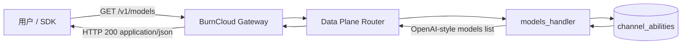
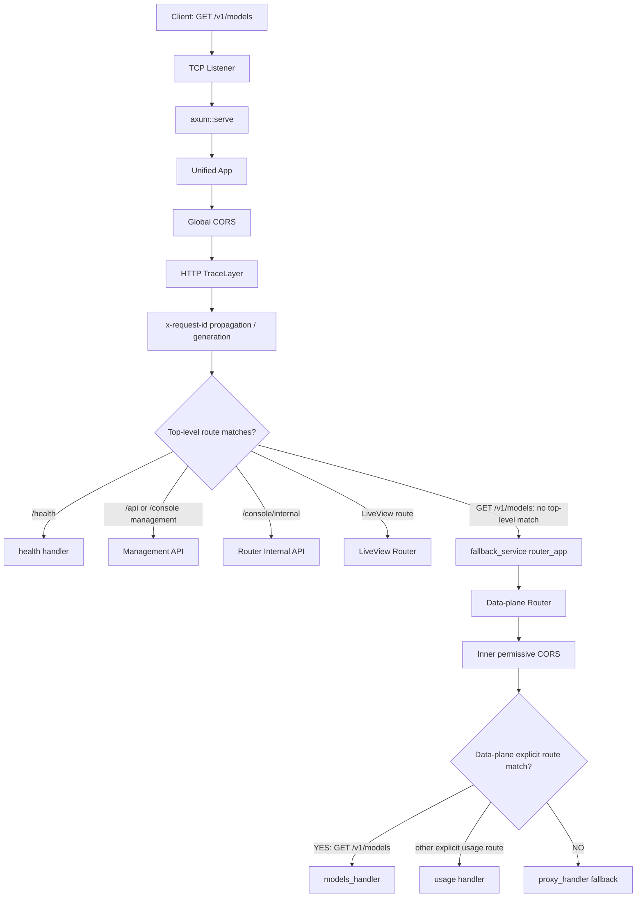
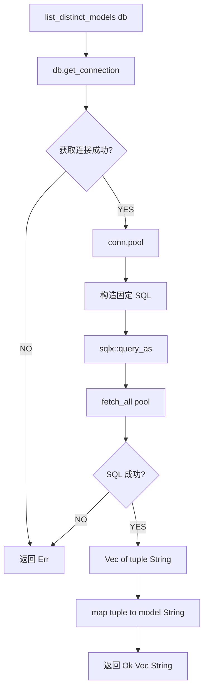
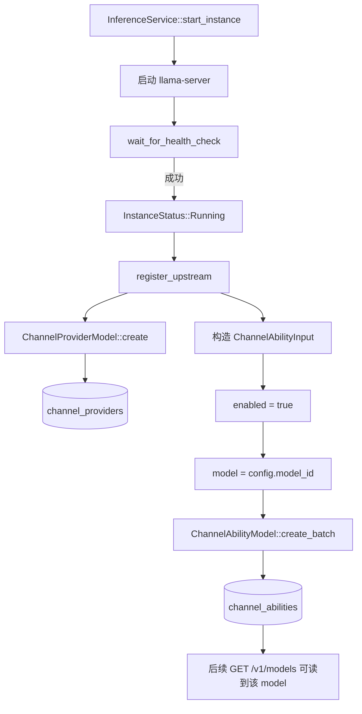
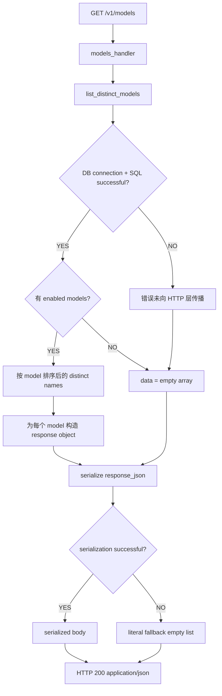
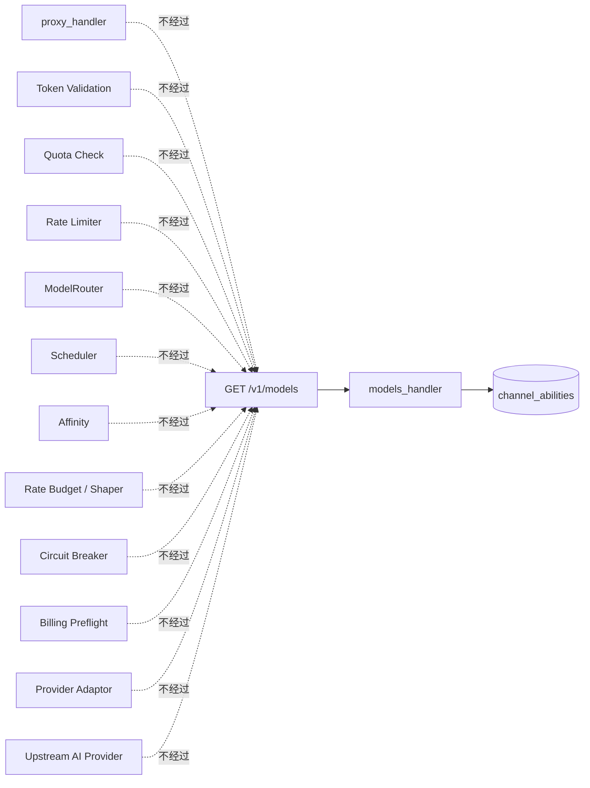

# GET /v1/models

**树路径：** `BurnCloud → HTTP / API → AI API / Data Plane → GET /v1/models`

> 本页只解释当前源码中真实存在的 `GET /v1/models`。所有执行结论以 `burncloud/burncloud@aa54e21393c6d46a6b09555ffd3661c1f22484f3` 为基线。

## 0. 这条接口到底做什么

它回答一个非常具体的问题：

> **BurnCloud 数据库的 `channel_abilities` 表里，现在有哪些 `enabled = 1` 的不同模型名？**

当前实现不会调用上游 Provider，也不会执行模型路由。它从数据库拿到去重后的模型名，再包装成 OpenAI 风格的 models list JSON。

```text
Client
  ↓
GET /v1/models
  ↓
Unified Axum Server
  ↓
Data-plane Router
  ↓
models_handler()
  ↓
ChannelAbilityModel::list_distinct_models()
  ↓
channel_abilities
  ↓
SELECT DISTINCT model
WHERE enabled = 1
ORDER BY model
  ↓
OpenAI-style model objects
  ↓
HTTP 200 JSON
  ↓
Client
```

### 当前行为摘要

| 项目 | 当前源码行为 |
|---|---|
| HTTP Method | `GET` |
| Path | `/v1/models` |
| Axum handler | `models_handler()` |
| 数据源 | `channel_abilities` |
| 过滤条件 | `enabled = 1` |
| 去重 | `DISTINCT model` |
| 排序 | `ORDER BY model` |
| API Token 鉴权 | **没有** |
| JWT 鉴权 | **没有** |
| User / Group 过滤 | **没有** |
| Channel provider status join | **没有** |
| Scheduler | **不经过** |
| ModelRouter | **不经过** |
| Provider / Upstream | **不访问** |
| Quota / Billing | **不经过** |
| Cache | **不使用** |
| DB 读取失败 | 当前会降级为 `200 + data: []` |

---

# 1. L0 — 用户视角 E2E



从用户视角，整个动作只有三件事：

```text
1. 请求 BurnCloud 的 /v1/models
2. BurnCloud 从本地数据库读取当前 enabled abilities 对应的模型名
3. BurnCloud 返回 models list
```

**这里没有真正的模型调用。** `/v1/models` 是目录读取，不是 inference request。

---

# 2. L1 — 从 Socket 到 Handler 的完整 HTTP 入口链

`/v1/models` 首先进入统一 Server，而不是直接调用 `models_handler()`。



### 最重要的路由逻辑

```text
create_app()
│
├── GET /health
├── merge Management API
├── merge Router Internal API
├── merge LiveView Router (optional)
│
└── fallback_service(router_app)
          │
          ├── GET /v1/models        → models_handler()
          ├── GET /api/v1/usage     → usage_handler()
          ├── GET /api/v1/usage/models
          │
          └── fallback              → proxy_handler()
```

所以 `/v1/models` 的真实入口结论是：

> **Unified Server 顶层没有 `/v1/models` → 进入 data-plane fallback service → data-plane Router 对 `/v1/models` 有显式 GET route → 命中 `models_handler()` → 不会进入 `proxy_handler()`。**

---

# 3. L2 — Handler ICFG：`models_handler()` 内部到底怎么跑

```mermaid
flowchart TD
    A[models_handler State AppState] --> B[model_entries = empty Vec]
    B --> C[读取 SystemTime::now]
    C --> D[转换 UNIX epoch seconds]
    D --> E[ChannelAbilityModel::list_distinct_models state.db]

    E --> F{DB 调用返回 Ok?}

    F -->|YES| G[for model in models]
    G --> H[构造 JSON model object]
    H --> I[push into model_entries]
    I --> J{还有 model?}
    J -->|YES| G
    J -->|NO| K[构造 response_json]

    F -->|NO| K

    K --> L[object = list]
    L --> M[data = model_entries]
    M --> N[serde_json::to_string]
    N --> O{序列化成功?}
    O -->|YES| P[使用序列化 JSON]
    O -->|NO| Q[使用 fallback: object=list,data=[]]
    P --> R[build_response_with_header]
    Q --> R
    R --> S[HTTP 200]
    S --> T[content-type: application/json]
```

## Handler 的伪代码

```rust
async fn models_handler(State(state): State<AppState>) -> Response {
    let mut model_entries = Vec::new();
    let current_time = now_as_unix_seconds();

    if let Ok(models) = ChannelAbilityModel::list_distinct_models(&state.db).await {
        for model in models {
            model_entries.push({
                id: model,
                object: "model",
                created: current_time,
                owned_by: "burncloud",
                permission: [],
                root: model,
                parent: null
            });
        }
    }

    return 200 JSON {
        object: "list",
        data: model_entries
    };
}
```

真正需要注意的不是代码有多少，而是这个 `if let Ok(...)`：

```text
DB 正常
  → 返回真实模型列表

DB 出错
  → 不 return error
  → model_entries 保持 []
  → 仍然返回 HTTP 200
```

---

# 4. L3 — Database ICFG：模型列表怎么从数据库出来

真正的数据读取函数：

`ChannelAbilityModel::list_distinct_models(&state.db)`



实际 SQL：

```sql
SELECT DISTINCT model
FROM channel_abilities
WHERE enabled = 1
ORDER BY model;
```

这条 SQL 决定了 `/v1/models` 的全部“可见性逻辑”。

```text
channel_abilities
│
├── model
├── channel_id
├── group
├── enabled
├── priority
└── weight

        ↓ 本接口只看

model + enabled

        ↓

WHERE enabled = 1
        ↓
DISTINCT model
        ↓
ORDER BY model
```

### 这条查询没有做的判断

```text
没有 WHERE group = 当前用户 group
没有 JOIN channel_providers
没有检查 channel_providers.status
没有检查 Channel health
没有检查 Circuit Breaker
没有检查 RPM / TPM capacity
没有检查价格
没有检查用户 price cap
没有检查 quota
```

因此当前 `/v1/models` 更准确的定义是：

> **列出数据库中至少存在一条 `enabled = 1` ability 的模型名。**

它并不能严格证明“这个模型对当前请求者此刻一定可成功路由”。

---

# 5. L4 — 数据从哪里来：`channel_abilities` 的状态来源

`/v1/models` 本身只读 `channel_abilities`，所以理解这个 Endpoint 还必须理解：**谁把数据写进这张表？**

当前源码中，一个明确可确认的写入链是本地 Inference 注册：



本地模型停止时：

```text
InferenceService::stop_instance
  ↓
unregister_upstream
  ↓
ChannelAbilityModel::delete_by_channel
  ↓
DELETE FROM channel_abilities WHERE channel_id = ?
  ↓
ChannelProviderModel::delete
```

因此对本地推理模型来说：

```text
启动并注册成功
  → ability 被写入且 enabled = true
  → /v1/models 出现该模型

注销并删除 ability
  → /v1/models 不再从这条 ability 看见该模型
```

注意：这里只把**当前源码可以直接确认的状态写入链**画进来，不用旧文档猜测其它写入来源。

---

# 6. L5 — Response 构造逻辑

数据库返回：

```text
[
  "gpt-4.1",
  "glm-5",
  "local-qwen"
]
```

Handler 会对每个模型生成：

```json
{
  "id": "gpt-4.1",
  "object": "model",
  "created": 1786420000,
  "owned_by": "burncloud",
  "permission": [],
  "root": "gpt-4.1",
  "parent": null
}
```

最终：

```json
{
  "object": "list",
  "data": [
    {
      "id": "gpt-4.1",
      "object": "model",
      "created": 1786420000,
      "owned_by": "burncloud",
      "permission": [],
      "root": "gpt-4.1",
      "parent": null
    }
  ]
}
```

### 字段来源

| Response field | 来源 / 逻辑 |
|---|---|
| `object` | 固定为 `list` |
| `data` | 遍历数据库返回的 distinct model |
| `data[].id` | `channel_abilities.model` |
| `data[].object` | 固定为 `model` |
| `data[].created` | **请求发生时**的 UNIX 时间，不是模型真实创建时间 |
| `data[].owned_by` | 固定为 `burncloud` |
| `data[].permission` | 固定空数组 |
| `data[].root` | 与 `id/model` 相同 |
| `data[].parent` | 固定 `null` |

---

# 7. 完整控制流：Success / DB Failure / Serialization Fallback



### 当前失败语义

| Failure point | 当前结果 |
|---|---|
| `db.get_connection()` 失败 | `list_distinct_models()` 返回 Err；handler 吞掉 Err；HTTP `200 data=[]` |
| SQL `fetch_all()` 失败 | 同上，HTTP `200 data=[]` |
| 没有 enabled ability | HTTP `200 data=[]` |
| JSON serialization 失败 | fallback literal `{"object":"list","data":[]}`，仍 HTTP 200 |

所以客户端目前无法仅凭 response 区分：

```text
A. 系统真的没有模型
B. 数据库连接失败
C. SQL 查询失败
D. JSON 序列化进入 fallback
```

这些情况最终都可能表现为：

```json
{
  "object": "list",
  "data": []
}
```

---

# 8. 明确没有进入的系统

理解 E2E 最容易犯的错误，是把整个 Router 的所有组件都画进每一个 Endpoint。

对 `GET /v1/models`，当前真实链路**不会**进入下面这些组件：



这也是为什么 `/v1/models` 的执行链比 `/v1/chat/completions` 短很多。

---

# 9. 当前逻辑的关键差异 / 风险点

## 9.1 当前没有鉴权

`create_router_app()` 对 `/v1/models` 直接注册：

```rust
.route("/v1/models", axum::routing::get(models_handler))
```

`models_handler()` 的参数只有：

```rust
State(state): State<AppState>
```

没有读取 Authorization Header，也没有调用 `extract_token_user()` 或 `RouterDatabase::validate_token_*()`。

所以当前结论是：

```text
GET /v1/models
  → 不要求 Bearer token
  → 不知道请求者是谁
  → 无法按 user / group 做模型可见性过滤
```

## 9.2 “enabled ability” 不等于“当前一定可路由”

当前 SQL 只有：

```sql
WHERE enabled = 1
```

没有 join `channel_providers`。

因此：

```text
enabled ability 存在
  ≠ provider channel 当前一定 enabled
  ≠ channel 当前 healthy
  ≠ circuit 当前 closed
  ≠ capacity 当前有余量
  ≠ 当前用户 group 有资格使用
```

## 9.3 DB 故障被伪装成空列表

当前 handler 没有：

```text
Err → 500 / 503
```

而是：

```text
Err → [] → 200
```

这对兼容性很宽松，但对故障可观测性不友好。

## 9.4 `created` 不是模型创建时间

每次请求都会重新：

```text
SystemTime::now()
  ↓
UNIX seconds
  ↓
给这一批所有 model 的 created 字段
```

所以两次请求同一个模型，`created` 可能不同。

---

# 10. 一条请求穿透后的最终心智模型

```text
GET /v1/models
│
├── Network / Server
│   ├── TcpListener
│   ├── axum::serve
│   ├── request-id middleware
│   ├── tracing middleware
│   └── CORS
│
├── Unified Routing
│   ├── management routes? NO
│   ├── internal routes?   NO
│   ├── liveview routes?   NO
│   └── fallback_service → data-plane router
│
├── Data-plane Routing
│   ├── explicit GET /v1/models? YES
│   └── models_handler
│
├── Handler Logic
│   ├── create empty model_entries
│   ├── current UNIX timestamp
│   └── query distinct models
│
├── Database
│   └── channel_abilities
│       └── SELECT DISTINCT model
│           WHERE enabled = 1
│           ORDER BY model
│
├── Branch Logic
│   ├── DB Ok  → build entries
│   └── DB Err → keep []
│
├── Response Mapping
│   ├── id       ← model
│   ├── object   ← "model"
│   ├── created  ← request current time
│   ├── owned_by ← "burncloud"
│   ├── root     ← model
│   └── parent   ← null
│
└── HTTP Response
    ├── status       200
    ├── content-type application/json
    └── body         {"object":"list","data":[...]}
```

---

# 11. Source Evidence

本页只引用当前源码的真实执行证据：

- Unified Server composition: `crates/server/src/lib.rs`  
  https://github.com/burncloud/burncloud/blob/aa54e21393c6d46a6b09555ffd3661c1f22484f3/crates/server/src/lib.rs
- Data-plane route + `models_handler()`: `crates/router/src/lib.rs`  
  https://github.com/burncloud/burncloud/blob/aa54e21393c6d46a6b09555ffd3661c1f22484f3/crates/router/src/lib.rs
- `ChannelAbilityModel::list_distinct_models()`: `crates/database/crates/channel/src/channel_ability.rs`  
  https://github.com/burncloud/burncloud/blob/aa54e21393c6d46a6b09555ffd3661c1f22484f3/crates/database/crates/channel/src/channel_ability.rs
- Confirmed local inference ability writer: `crates/service/crates/inference/src/lib.rs`  
  https://github.com/burncloud/burncloud/blob/aa54e21393c6d46a6b09555ffd3661c1f22484f3/crates/service/crates/inference/src/lib.rs

**Execution classification:** STATIC CONFIRMED。上述路径、函数、SQL 和分支均由当前源码直接确认；没有把未挂载模块或推测中的 Provider 流程画入 `/v1/models`。
