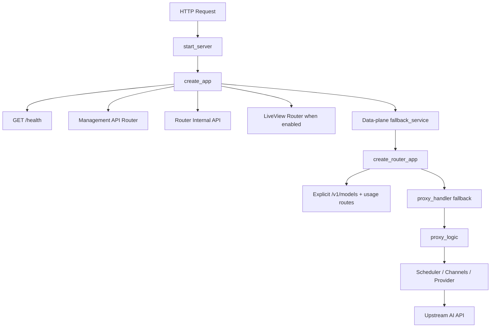
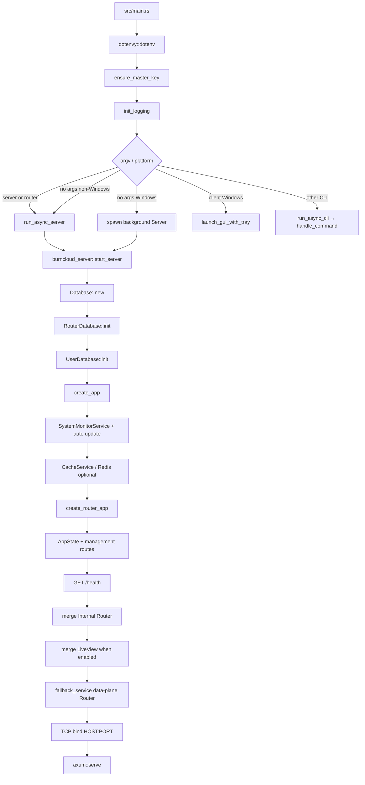

# BurnCloud Entry Point Atlas

> **阅读原则：不要从文件夹理解 BurnCloud，从所有可执行入口理解 BurnCloud。**  
> Entry Point → Business Capability → User Journey → Runtime → State / DB → Module → Function → Source.

本页是 BurnCloud 的**单页功能总目录**。旧的多页 Runtime Atlas、Commit Atlas 与分散功能页不再作为本站导航结构。

**源码审计基线：** `burncloud/burncloud@aa54e21393c6d46a6b09555ffd3661c1f22484f3`（2026-08-11）。  
**覆盖边界：** 当前可执行源码中的 HTTP/API、主 CLI、workspace binary、后台/异步任务、启动初始化、Dioxus/LiveView UI 路由与本地 UI 行为。测试、example、README 中的示例入口不作为产品入口；源码存在但未挂载的模块会明确标注。

---

## 0. 一张图先看完整 BurnCloud

```text
BurnCloud
│
├── 1. HTTP / API
│   │
│   ├── AI API / Data Plane
│   │   ├── GET  /v1/models
│   │   ├── POST /v1/chat/completions
│   │   ├── POST /chat/completions                     (OpenAI compatibility alias)
│   │   ├── POST /v1/completions
│   │   ├── POST /v1/embeddings
│   │   ├── POST /v1/messages
│   │   ├── POST /v1/video/generations
│   │   ├── GET  /v1/videos/{task_id}
│   │   ├── POST /v1beta/models/{model}:generateContent
│   │   ├── POST /v1beta/models/{model}:streamGenerateContent
│   │   ├── POST /v1beta/models/{model}:countTokens
│   │   ├── POST /v1beta/models/{model}:embedContent
│   │   ├── POST /v1/models/{model}:...                 (Gemini/Vertex native v1 family)
│   │   └── Router fallback → proxy_handler             (unmatched data-plane paths)
│   │
│   ├── Authentication
│   │   ├── POST /api/auth/register
│   │   ├── POST /api/auth/login
│   │   ├── POST /api/auth/forgot-password
│   │   ├── POST /api/auth/reset-password
│   │   ├── GET  /api/auth/google
│   │   └── GET  /api/auth/github
│   │
│   ├── Channel Management
│   ├── Token
│   ├── User
│   ├── Billing / Usage
│   ├── Logs
│   ├── Monitoring / Security
│   ├── Cache
│   ├── Admin / Internal
│   ├── OpenAPI / Swagger
│   └── Web UI / LiveView / WebSocket
│
├── 2. CLI / Executables
│   ├── burncloud
│   │   ├── server
│   │   ├── router
│   │   ├── client
│   │   ├── update
│   │   ├── install
│   │   ├── bundle
│   │   ├── channel
│   │   ├── price / tiered
│   │   ├── token
│   │   ├── protocol
│   │   ├── currency
│   │   ├── user
│   │   ├── log
│   │   └── monitor
│   └── workspace binaries / developer tools
│
├── 3. Background Jobs / Async Side Effects
│   ├── System Monitor Auto Update
│   ├── Price Sync
│   ├── Exchange Rate Sync
│   ├── AIMD Budget Feedback
│   ├── Async Router Log Writer
│   ├── Async Request Log Writer
│   ├── Token accessed_time update
│   ├── Quota deduction
│   ├── Video task mapping persistence
│   ├── API-version detection/update
│   ├── Download progress monitor
│   └── Windows tray / show-window poll loop
│
├── 4. Startup
│   ├── src/main.rs
│   ├── ensure_master_key
│   ├── init_logging
│   ├── start_server
│   ├── Database + RouterDatabase + UserDatabase init
│   ├── create_app
│   ├── create_router_app
│   ├── management API composition
│   ├── optional LiveView composition
│   └── Axum bind + serve
│
└── 5. UI-only Actions
    ├── Dioxus Route navigation
    ├── i18n context
    ├── Toast state
    ├── Auth context
    ├── Theme state
    ├── Console NotFound routing
    ├── Desktop window maximize/show/focus
    └── Windows tray interaction
```

---

# 1. HTTP / API

## 1.1 HTTP 的真正组合顺序



**关键事实：** `POST /v1/chat/completions` 没有单独注册 Axum Chat handler；它通过 Router 的 fallback 进入 `proxy_handler()`。因此理解 AI 请求时，应从 `create_app → create_router_app → proxy_handler → proxy_logic` 顺着读，而不是在 Server 路由表里找一个不存在的 Chat handler。

### 鉴权标记

| 标记 | 含义 |
|---|---|
| Public | 没有套 Server JWT middleware |
| JWT | 位于 `protected_routes()`，统一套 JWT middleware |
| API Token | Router 数据面 credential：Bearer / `x-api-key` / `x-goog-api-key`；token 验证失败时当前代码还有 JWT decode fallback |
| Internal | Router 内部接口；当前直接合并进统一 App，不自动套管理 JWT |
| UI shell | 返回 LiveView HTML shell / WebSocket，不等同于业务 REST API |

---

## 1.2 AI API / Data Plane

### 显式注册的数据面路由

| Method | Path | Auth | 业务意义 | 主要入口 |
|---|---|---|---|---|
| GET | `/v1/models` | API Token | 列出当前 token/group 可见模型 | `crates/router/src/lib.rs` |
| GET | `/api/v1/usage` | API Token | 当前 token/user usage | `crates/router/src/lib.rs` |
| GET | `/api/v1/usage/models` | API Token | 按模型聚合 usage | `crates/router/src/lib.rs` |

### 通过 Router fallback 进入 `proxy_handler()` 的已识别 AI 路径

| Method | Path / Pattern | 主要协议 | 当前路径语义 |
|---|---|---|---|
| POST | `/v1/chat/completions` | OpenAI-compatible | Chat Completions；当前候选路径过滤 OpenAI / Zai |
| POST | `/chat/completions` | OpenAI-compatible alias | OpenAI passthrough compatibility alias |
| POST | `/v1/completions` | OpenAI-compatible | Legacy Completions 路径族 |
| POST | `/v1/embeddings` | OpenAI-compatible | Embeddings 路径族 |
| POST | `/v1/messages` | Anthropic | Anthropic native Messages；当前候选过滤 Anthropic |
| POST | `/v1/video/generations` | Video task | 创建视频生成任务；成功后可保存 task mapping |
| GET | `/v1/videos/{task_id}` | Video task | 读取本地 task mapping 并轮询真实上游任务 |
| POST | `/v1beta/models/{model}:generateContent` | Gemini / Vertex | 原生 Generate Content |
| POST | `/v1beta/models/{model}:streamGenerateContent` | Gemini / Vertex | 原生流式 Generate Content |
| POST | `/v1beta/models/{model}:countTokens` | Gemini / Vertex | 原生 Count Tokens |
| POST | `/v1beta/models/{model}:embedContent` | Gemini / Vertex | 原生 Embed Content |
| POST | `/v1/models/{model}:generateContent` | Gemini / Vertex | v1 原生路径族 |
| POST | `/v1/models/{model}:streamGenerateContent` | Gemini / Vertex | v1 原生流式路径族 |
| POST | `/v1/models/{model}:countTokens` | Gemini / Vertex | v1 Count Tokens |
| POST | `/v1/models/{model}:embedContent` | Gemini / Vertex | v1 Embed Content |

### Compatibility path normalization

当前 `proxy_handler()` 会修正常见 SDK/客户端重复路径，包括：

- `/v1/v1/...` → `/v1/...`
- 重复的 `/v1/messages`
- 重复的 `/v1/chat/completions`
- 重复的 `/v1/embeddings`

这些是**兼容修正**，不是推荐的新公共 API。

### Catch-all 边界

`create_router_app()` 最后使用 `.fallback(proxy_handler)`，所以任何没有被前面 App/Router 路由命中的数据面请求都有机会进入 `proxy_handler()`。这意味着：

1. “能进入 handler”不等于“该 path 是正式支持的 API”。
2. 上表只把源码明确识别、过滤、passthrough 或特殊处理的 AI 路径标为当前 API family。
3. 新增 Provider path 时必须同时检查 path normalization、model extraction、candidate filtering、passthrough/adaptor、billing、tests。

### AI 请求下钻主链

```text
HTTP Request
  ↓
proxy_handler
  ├─ normalize path
  ├─ credential resolution
  ├─ token / JWT validation
  ├─ quota admission
  ├─ local rate limit
  ├─ buffer body
  └─ extract model
       ↓
proxy_logic
  ├─ scheduler policy
  ├─ traffic color / order type
  ├─ ModelRouter::route_with_scheduler
  ├─ endpoint-specific candidate filter
  ├─ billing preflight
  └─ candidate attempt loop
       ├─ L2 shaper
       ├─ circuit breaker
       ├─ passthrough / adaptor
       ├─ upstream HTTP
       └─ failover
            ↓
response
  ├─ usage extraction
  ├─ cost calculation
  ├─ RouterLog async write
  ├─ RequestLog async write
  ├─ quota async deduction
  └─ X-Channel-Id / X-Model-Id
```

---

## 1.3 Authentication

> 用户最初示例中的 `/console/api/login`、`/console/api/register` **不是当前源码真实的公共认证路径**。当前公共 Auth API 在 `/api/auth/*`。

| Method | Path | Auth | 行为 |
|---|---|---|---|
| POST | `/api/auth/register` | Public | 用户注册 |
| POST | `/api/auth/login` | Public | 用户名/密码登录，返回 JWT |
| POST | `/api/auth/forgot-password` | Public | 发起忘记密码流程 |
| POST | `/api/auth/reset-password` | Public | 使用 reset token 重置密码 |
| GET | `/api/auth/google` | Public | Google OAuth 入口/当前处理逻辑 |
| GET | `/api/auth/github` | Public | GitHub OAuth 入口/当前处理逻辑 |

`auth::protected_routes()` 当前为空；JWT 保护由 `api::create_routes()` 对整个 protected router 统一添加。

---

## 1.4 Channel Management

全部位于 JWT protected router；Channel handler 还会检查管理员角色。

| Method | Path | 行为 |
|---|---|---|
| GET | `/console/api/channel` | 列出 Channels |
| POST | `/console/api/channel` | 创建 Channel |
| PUT | `/console/api/channel` | 更新 Channel |
| GET | `/console/api/channel/{id}` | Channel 详情 |
| DELETE | `/console/api/channel/{id}` | 删除 Channel |

理解 Channel 时继续下钻：Channel → supported models/abilities → group/priority/weight → pricing region → RPM/TPM caps → Scheduler Candidate → Provider execution。

---

## 1.5 Token

全部 JWT protected。

| Method | Path | 行为 |
|---|---|---|
| GET | `/console/api/tokens` | token 列表 |
| POST | `/console/api/tokens` | 创建 token |
| GET | `/console/api/tokens/{token}` | token 详情 |
| PUT | `/console/api/tokens/{token}` | 更新 token |
| DELETE | `/console/api/tokens/{token}` | 删除 token |
| POST | `/console/api/tokens/{token}/rotate` | 轮换 token |
| POST | `/console/api/tokens/{token}/revoke-old` | 撤销旧 token |
| POST | `/console/api/tokens/{token}/ip-whitelist` | 更新 IP whitelist |

数据面 token 则在 `proxy_handler()` 中读取 `Authorization: Bearer`、`x-api-key`、`x-goog-api-key`，并关联 user/group/quota/order type/price cap。

---

## 1.6 User

以下路由当前都被 `protected_routes()` 包住，因此即使名字叫 `register/login/check_username`，**运行时仍套 JWT middleware**：

| Method | Path | 行为 |
|---|---|---|
| POST | `/console/api/user/register` | Console 用户注册逻辑 |
| POST | `/console/api/user/login` | Console 用户登录逻辑；当前还会写 client state |
| POST | `/console/api/user/topup` | 用户充值 |
| GET | `/console/api/user/check_username` | 检查用户名 |
| GET | `/console/api/user/recharges` | 查询充值记录 |
| GET | `/console/api/list_users` | 用户列表 |

公共注册/登录应优先看上一节 `/api/auth/*`；不要因为函数名相近把两套路由混为一条。

---

## 1.7 Billing / Usage

| Method | Path | Auth | 行为 |
|---|---|---|---|
| GET | `/api/billing/summary` | JWT | Billing summary |
| GET | `/api/v1/usage` | API Token | Data-plane usage |
| GET | `/api/v1/usage/models` | API Token | 按模型 usage |
| GET | `/console/api/usage/{user_id}` | JWT | Console 用户 usage 统计 |
| GET | `/console/internal/billing/summary` | JWT + optional internal secret check | 内部 billing summary；handler 可检查 `x-internal-secret` |

真正的请求结算不只由这些“查询 URL”组成。AI 请求结束后，Router 还会提取 unified usage、计算 cost、记录日志并异步扣 quota；所以 Billing 必须同时理解 HTTP 查询入口和 Router 的 post-response side effects。

---

## 1.8 Logs

| Method | Path | Auth | 行为 |
|---|---|---|---|
| GET | `/console/api/logs` | JWT | 请求日志列表 / 查询 |
| GET | `/console/api/usage/{user_id}` | JWT | usage 统计（与日志数据相关） |
| GET | `/console/internal/billing/summary` | JWT + optional secret | billing/log aggregation |

后台写入见 **3. Background Jobs**：RouterLog Writer 与 RequestLog Writer 是独立 async consumers。

---

## 1.9 Monitoring / Security

| Method | Path | Auth | 行为 |
|---|---|---|---|
| GET | `/console/api/monitor` | JWT | CPU / Memory / Disk 等系统指标 |
| GET | `/console/api/monitor/security` | JWT | 安全概览 |
| GET | `/console/api/monitor/security/events` | JWT | 安全事件 |
| GET | `/console/api/monitor/security/filters` | JWT | 读取安全过滤器 |
| PUT | `/console/api/monitor/security/filters` | JWT | 更新安全过滤器 |
| POST | `/console/api/monitor/security/emergency-circuit-break` | JWT | 紧急触发全局 circuit breaker |
| GET | `/console/api/monitor/security/circuit-breaker-status` | JWT | 查询 circuit breaker 状态 |

Security handler 内部会调用 Router Internal 的 circuit-breaker/health endpoints，因此这是“管理面 API → 内部 Router API”的跨层链路。

---

## 1.10 Cache

| Method | Path | Auth | 行为 |
|---|---|---|---|
| GET | `/console/api/cache/stats` | JWT | Cache 统计 |
| POST | `/console/api/cache/clear` | JWT | 清理 Cache |

`create_app()` 会初始化 CacheService；Redis 不可用时当前初始化逻辑允许服务继续启动并退化。

---

## 1.11 Admin / Internal / Health

### Root health

| Method | Path | Auth | 行为 |
|---|---|---|---|
| GET | `/health` | Public | 统一 Server 健康检查 |

### Router Internal

| Method | Path | Auth | 行为 |
|---|---|---|---|
| GET | `/console/internal/health` | Internal | Router health / circuit states |
| POST | `/console/internal/prices/sync` | Internal | 通过 channel 请求立即强制同步价格 |
| POST | `/console/internal/circuit-breaker/trip-all` | Internal | 紧急 trip 所有 channel circuit breaker |
| GET | `/console/internal/metrics` | Internal | Prometheus-style Router metrics |

这些 internal routes 当前由 `create_app()` 直接 merge，不经过管理 API 的统一 JWT middleware。部署时应把“internal”理解为**网络/部署边界语义**，而不是“源码已经自动鉴权”。

### Protected catch-all

| Method | Path | Auth | 行为 |
|---|---|---|---|
| GET | `/console/api/{*path}` | JWT | 未定义 Console GET API 返回 404 JSON |

---

## 1.12 OpenAPI / Swagger

这些 route 由 `openapi::routes()` 注册，但由于整个 router 被 merge 到 protected routes，当前实际也会经过 JWT middleware。

| Method | Path | 行为 |
|---|---|---|
| GET | `/api-docs/openapi.json` | OpenAPI JSON |
| GET | `/swagger-ui` | Swagger UI |
| GET | `/swagger-ui/` | Swagger UI trailing-slash variant |

注意：当前 OpenAPI spec 本身只描述部分接口；**不能拿 OpenAPI spec 当作完整路由清单**。本页的 HTTP 总表以实际 Router composition 为准。

---

## 1.13 Web UI / LiveView / WebSocket HTTP 入口

启用 `liveview` feature 时，Server merge `burncloud_client::liveview_router()`。

### HTML shell routes

| Method | Path |
|---|---|
| GET | `/` |
| GET | `/home` |
| GET | `/login` |
| GET | `/register` |
| GET | `/forgot-password` |
| GET | `/reset-password` |
| GET | `/console` |
| GET | `/console/` |
| GET | `/console/{*path}` |
| GET | `/favicon.ico` |

Debug 或 `e2e-preview` feature 下还会注册：

- `GET /preview/home`
- `GET /preview/login`
- `GET /preview/console`
- `GET /preview/console/`
- `GET /preview/console/{*path}`

### LiveView transport

| Method | Path | 行为 |
|---|---|---|
| GET → WebSocket Upgrade | `/ws` | Dioxus LiveView socket |

---

# 2. CLI / Executables

## 2.1 主程序：`burncloud`

根 binary 定义：`Cargo.toml [[bin]] name = "burncloud" path = "src/main.rs"`。

### 顶层运行模式

```text
burncloud                      Windows: background Server + desktop GUI/tray
                               non-Windows: Server + LiveView
burncloud server               run_async_server()
burncloud router               当前与 server 一样进入 run_async_server()
burncloud client               Windows desktop GUI；non-Windows 提示使用 server
```

### 完整 Clap command tree

```text
burncloud
├── update
│   └── --check-only
├── install [software]
│   ├── --list
│   ├── --status
│   ├── --auto-deps
│   ├── --local PATH
│   └── --bundle DIR
├── bundle
│   ├── create <software> [-o DIR]
│   └── verify <bundle-dir>
├── channel
│   ├── add
│   ├── list
│   ├── delete <id>
│   ├── show <id>
│   └── update <id>
├── price
│   ├── list
│   ├── set <model>
│   ├── get <model>
│   ├── show <model>
│   ├── delete <model>
│   ├── sync-status
│   ├── import <file>
│   ├── export <file>
│   ├── validate <file>
│   └── sync
├── tiered
│   ├── list-tiers <model>
│   ├── add-tier <model>
│   ├── import-tiered <file>
│   ├── delete-tiers <model>
│   └── check-tiered <model>
├── token
│   ├── list
│   ├── create
│   ├── update <key>
│   └── delete <key>
├── protocol
│   ├── list
│   ├── add
│   ├── delete <id>
│   ├── show <id>
│   └── test --channel-id <id>
├── currency
│   ├── list-rates
│   ├── set-rate
│   ├── refresh
│   └── convert <amount>
├── user
│   ├── register
│   ├── login
│   ├── list
│   ├── topup
│   ├── recharges
│   └── check-username
├── log
│   ├── list
│   └── usage
└── monitor
    ├── status
    └── server
```

### CLI 中存在但当前未挂到 `commands.rs` 的模块

`src/cli/plan.rs`、`src/cli/subscription.rs` 等文件存在于源码树，但当前 `handle_command()` 没有对应顶层 Clap subcommand。它们**不是当前可执行的 `burncloud plan` / `burncloud subscription` 入口**，所以不伪装成已开放功能。

---

## 2.2 Workspace 独立 binaries / developer executables

仅把 workspace 中真正存在 `main.rs` / bin target 的入口列在这里；`examples/*` 不算产品入口。

| Binary / target | Source | 作用 / 边界 |
|---|---|---|
| `burncloud` | `src/main.rs` | 主 Server / Router / Client / 管理 CLI |
| `burncloud-client` | `crates/client/src/main.rs` | 独立 Dioxus client；desktop/web 由 feature 决定 |
| `screenshot_gen` | `crates/client/src/bin/screenshot_gen.rs` | SSR 输出 Login 页 HTML，开发/截图辅助 |
| `burncloud-download` | `crates/download/src/main.rs` | DownloadManager 独立 binary；当前 main 含一个硬编码 Ubuntu ISO 下载演示流程 |
| `burncloud-loop` | `crates/loops/src/main.rs` | Agent-driven UI optimization loop / gates 工具 |
| client-api package binary | `crates/client/crates/client-api/src/main.rs` | 独立 API Management Dioxus desktop shell |
| client-shared package binary | `crates/client/crates/client-shared/src/main.rs` | 独立 CoreRoute Dioxus launcher |
| client-tray package binary | `crates/client/crates/client-tray/src/main.rs` | Windows tray launcher；非 Windows 仅提示 unsupported |

`burncloud-loop` 当前子命令：

```text
burncloud-loop
├── jobs-aesthetic
├── css-optimize
├── gate <name>
├── gates <suite>
└── list-gates
```

---

# 3. Background Jobs / Async Side Effects

不要把 Background Job 只理解成 cron。BurnCloud 当前有四种：**常驻启动任务、事件驱动 consumer、请求级 fire-and-forget、操作级异步 monitor**。

## 3.1 Server / Router 启动后长期存在

| Job | 启动位置 | Trigger / 周期 | 作用 |
|---|---|---|---|
| System Monitor Auto Update | `create_app()` → `SystemMonitorService::start_auto_update()` | 默认每 1 秒 | 并行采集 CPU / memory / disk，更新内存 cache |
| Price Sync | `create_router_app()` → `start_price_sync_task()` | startup + 默认 24h periodic + force-sync channel | local override / DB fast path / remote pricing_data；更新 DB 与 PriceCache |
| Exchange Rate Sync | `create_router_app()` → `ExchangeRateService::start_sync_task()` | 每 1 小时检查 | 从 DB reload 汇率；24h stale 检测；当前无外部 auto-refresh 配置时只告警 |
| AIMD Budget Feedback | `create_router_app()` | mpsc event-driven | adaptive limiter 学到 RPM 后重配 channel budget |
| Async RouterLog Writer | `create_router_app()` | mpsc event-driven | `RouterLog` 持久化 |
| Async Request Log Writer | `create_router_app()` | mpsc event-driven | detailed request/response log 持久化 |

## 3.2 请求结束/请求过程中 fire-and-forget

| Async side effect | 触发点 | 作用 |
|---|---|---|
| Token accessed-time update | token 校验成功 | 非阻塞更新 token 最后访问时间 |
| Quota deduction | 请求完成且 `cost > 0` | 异步按成本扣 user/token quota |
| Video task mapping save | 视频生成返回 task id | 异步保存 local task ↔ upstream task/channel 映射 |
| API-version detect/update | 特定 upstream error | 异步探测并更新动态 adaptor/API version 信息 |

这些任务会改变 DB/运行时状态，但没有独立 URL；如果只画 HTTP route，会全部漏掉。

## 3.3 Download operation background work

`DownloadManager::add_download()` 会为每个下载启动 progress monitor：约每 2 秒查询 aria2 状态并同步数据库，直到 `complete` / `error` 或 RPC client 不可用；初始化 `DownloadManager` 时还会恢复 active 的未完成下载并重新启动 monitor。

## 3.4 Desktop background work

Windows desktop `AppWithTray`：

- 单独 OS thread 启动 system tray；
- Dioxus async loop 约每 100ms 检查 `should_show_window()`；
- 命中后切换 visible 并 focus window。

---

# 4. Startup

## 4.1 主启动树



## 4.2 `src/main.rs` 启动前动作

1. 读取 `.env`（存在则加载）。
2. 校验 `MASTER_KEY`；缺失/非法时生成 32-byte random key，写入 `.env` 并放入 process env。
3. 根据是否 `server/router/client` 决定 stdout log level 行为。
4. 初始化 tracing/file logging。
5. 按平台和 subcommand 分派到 Server、Client 或 CLI。

## 4.3 `start_server()`

```text
HOST / PORT
  ↓
Database::new()
  ↓
RouterDatabase::init()
  ↓
UserDatabase::init()
  ↓
create_app(db)
  ↓
TcpListener::bind()
  ↓
axum::serve()
```

## 4.4 `create_app()` 初始化/组合

```text
SystemMonitorService
  └─ start_auto_update()

CacheService
  └─ Redis connection if available; fail-open startup behavior

create_router_app(db)
  ├─ data-plane Router
  ├─ internal Router
  └─ force price-sync sender

AppState
  └─ db + monitor + cache + force_price_sync_tx

Management API
  ├─ public auth routes
  └─ JWT-protected management routes

Unified Axum App
  ├─ GET /health
  ├─ merge management API
  ├─ merge router internal API
  ├─ optional LiveView router
  └─ fallback_service(data-plane router)
```

## 4.5 `create_router_app()` 初始化清单

按当前源码顺序/职责，Router 启动会建立或加载：

- shared `reqwest::Client`
- load balancer
- local rate limiter
- circuit breaker
- `ModelRouter`
- `ChannelStateTracker`
- `DynamicAdaptorFactory`
- API version detector
- `PriceCache`
- `CostCalculator`
- `ExchangeRateService` + DB rate load + sync task
- scheduler policies
- affinity cache
- rate budget / channel caps from DB
- billing strict-mode counters/config
- request-log storage policy
- AIMD feedback channel/task
- Price Sync task + force-sync channel
- async RouterLog channel/task
- async RequestLog channel/task
- Router Internal endpoints
- explicit models/usage endpoints
- final `proxy_handler` fallback

这张初始化清单解释了一个常见现象：很多能力**没有自己的 URL**，但已经在请求到达前被装进 RouterState，随后被每一条 AI 请求使用。

---

# 5. UI-only Actions

## 5.1 Dioxus client Route tree

以下是 `crates/client/src/app.rs :: Route` 中当前真实注册的页面路由。

### Guest / public-facing pages

```text
/
/home
/login
/register
/forgot-password
/reset-password?:token
```

### Console pages

```text
/console/dashboard
/console/deploy
/console/monitor
/console/access
/console/models
/console/users
/console/settings
/console/finance
/console/logs
/console/connect
/console/playground
/console/:..segments     → NotFoundPage
```

### Debug / e2e-preview-only pages

```text
/preview/home
/preview/login
/preview/console/dashboard
/preview/console/models
/preview/console/access
/preview/console/settings
/preview/console/finance
/preview/console/monitor
/preview/console/playground
```

**区分：** 上述 Dioxus route 是 UI navigation model；LiveView 部署下首次加载页面会命中上一节的 HTML shell route，随后交互通过 `/ws`。所以“页面路径”与“业务 REST API”不要混为一类。

## 5.2 App 初始化的本地状态

`App()` 在创建 Router 前初始化：

```text
use_init_i18n()
use_init_toast()
use_init_auth()
use_init_theme()
ToastContainer
Router<Route>
```

这些 context/state 本身不是独立 HTTP endpoint。

## 5.3 明确的 UI-only 行为

- Dioxus Router 页面切换与 NotFound 分派。
- Toast 的展示/关闭状态。
- Theme 本地状态及 Console layout 读取。
- i18n context 的语言状态。
- Auth context 的客户端状态维护（真正登录/注册仍会调用 HTTP API）。
- Desktop window 最大化。
- Windows tray 启动、显示窗口、隐藏/显示/focus 动作。
- `screenshot_gen` 只做本地 VirtualDom/SSR HTML 生成，不是服务端业务 URL。

---

# 6. 从这一个页面如何理解整个项目

不要按 `crates/server → crates/router → crates/database` 横向阅读。选一个入口，纵向走到底。

### 例：用户调用模型

```text
POST /v1/chat/completions
  ↓
proxy_handler
  ↓
auth / quota / rate limit
  ↓
proxy_logic
  ↓
ModelRouter + Scheduler
  ↓
Candidate Channels
  ↓
Shaper + Circuit Breaker
  ↓
Passthrough / Adaptor
  ↓
Upstream Provider
  ↓
Response / Stream
  ↓
Usage + Cost
  ↓
Logs + Quota Deduction
```

### 例：管理员新增 Channel

```text
POST /console/api/channel
  ↓
JWT middleware
  ↓
admin role check
  ↓
channel handler
  ↓
service / database
  ↓
Channel becomes routing data
  ↓
后续 AI Request 的 candidate selection 使用它
```

**理解单位不是“一个文件”，而是“一条可执行行为链”。**

---

# 7. Coverage / 防遗漏规则

本页“完整”的含义是：对审计基线 commit 中的**当前可执行入口**做 source-derived inventory，而不是把每一个函数都假装成入口。

本次入口审计至少覆盖这些权威位置：

| 范围 | Source of truth |
|---|---|
| Unified Server composition | `crates/server/src/lib.rs` |
| Management API composition | `crates/server/src/api/mod.rs` |
| Auth | `crates/server/src/api/auth.rs` |
| Channel | `crates/server/src/api/channel.rs` |
| Token | `crates/server/src/api/token.rs` |
| User | `crates/server/src/api/user.rs` |
| Billing | `crates/server/src/api/billing.rs` |
| Logs | `crates/server/src/api/log.rs` |
| Monitoring | `crates/server/src/api/monitor.rs` |
| Security | `crates/server/src/api/security.rs` |
| Cache | `crates/server/src/api/cache.rs` |
| OpenAPI | `crates/server/src/api/openapi.rs` |
| Data-plane Router | `crates/router/src/lib.rs` |
| Native passthrough detection | `crates/router/src/passthrough.rs` |
| Price background task | `crates/router/src/price_sync.rs` |
| Exchange-rate background task | `crates/router/src/exchange_rate.rs` |
| System monitor task | `crates/service/crates/monitor/src/service.rs` |
| Root CLI/startup | `src/main.rs`, `src/cli/commands.rs` |
| Dioxus routes | `crates/client/src/app.rs` |
| LiveView shell / WS | `crates/client/src/lib.rs` |
| Workspace members/binaries | root `Cargo.toml` + package `main.rs` / `[[bin]]` |

### 不纳入“产品入口”的东西

- `tests/` 中为了测试而构造的 Router/endpoint。
- `examples/` 示例程序。
- README/旧 docs 中描述但当前 Router 没有挂载的路径。
- 源码文件存在、但没有从当前 executable composition 被引用/挂载的 orphan/dead module。

例如 `crates/router/src/health_probe.rs` 当前文件存在，但当前 `crates/router/src/lib.rs` 没有把它作为运行模块挂入 Router 启动链；因此不能因为文件名看起来像“后台健康探针”，就把它伪造成正在运行的 Background Job。

---

# 8. 以后怎么维护这一页

任何 PR 只要发生以下变化，就应该同步更新本页相应区域：

- 新增/删除/修改 Axum `.route(...)`、`merge(...)`、`fallback(...)`；
- 新增 AI path normalization / provider native path / passthrough rule；
- 新增 CLI subcommand 或 workspace binary；
- 新增 `tokio::spawn`、长期 timer、mpsc consumer、请求级异步副作用；
- 修改 `src/main.rs` / `start_server` / `create_app` / `create_router_app` 初始化；
- 修改 Dioxus `#[route(...)]` 或 LiveView shell route；
- 一个原本未挂载模块真正进入 executable path。

维护原则只有一句：

> **先证明入口真实存在，再从入口向下恢复运行链；不要从文件夹、类名或旧文档反推系统一定会这样运行。**

---

## Source links

- BurnCloud source: https://github.com/burncloud/burncloud
- Audited source commit: https://github.com/burncloud/burncloud/commit/aa54e21393c6d46a6b09555ffd3661c1f22484f3
- `src/main.rs`: https://github.com/burncloud/burncloud/blob/aa54e21393c6d46a6b09555ffd3661c1f22484f3/src/main.rs
- Server composition: https://github.com/burncloud/burncloud/blob/aa54e21393c6d46a6b09555ffd3661c1f22484f3/crates/server/src/lib.rs
- Router composition: https://github.com/burncloud/burncloud/blob/aa54e21393c6d46a6b09555ffd3661c1f22484f3/crates/router/src/lib.rs
- Client routes: https://github.com/burncloud/burncloud/blob/aa54e21393c6d46a6b09555ffd3661c1f22484f3/crates/client/src/app.rs
