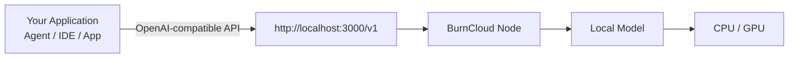
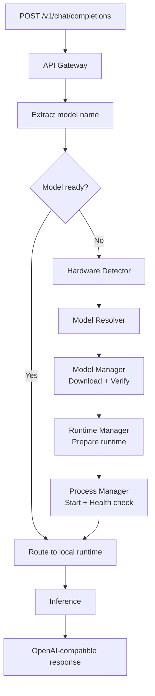
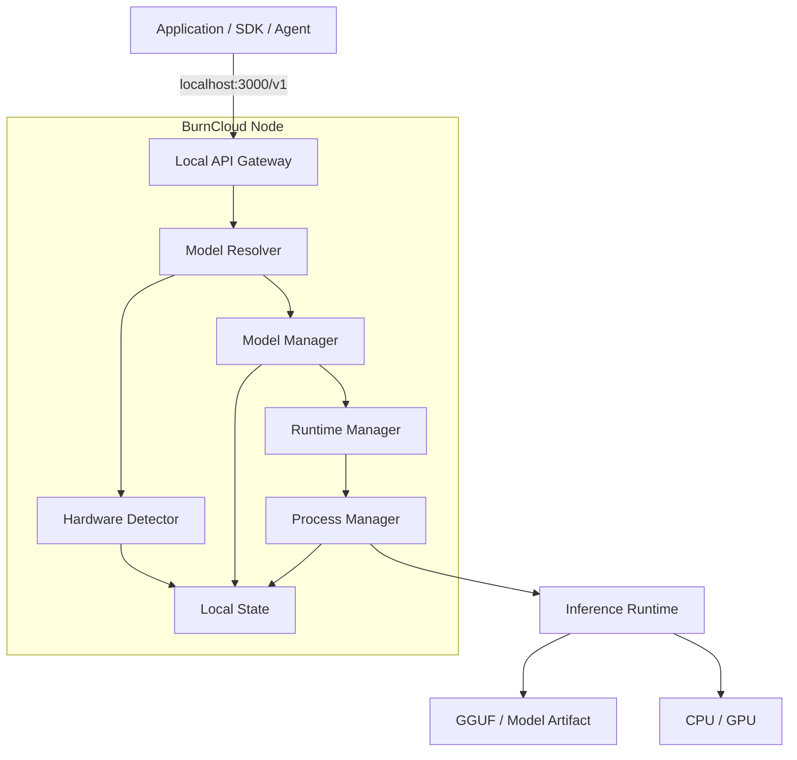
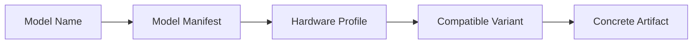
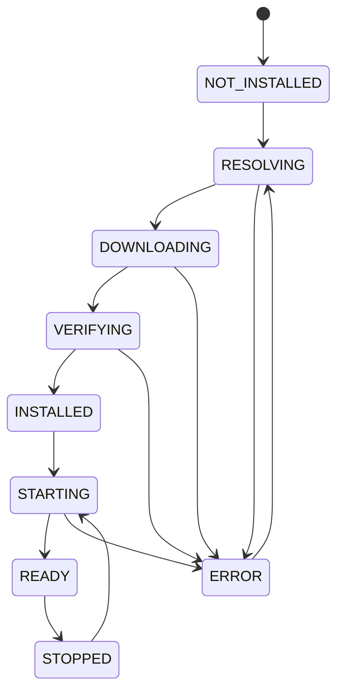
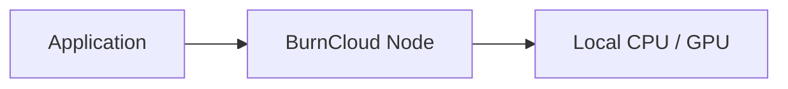
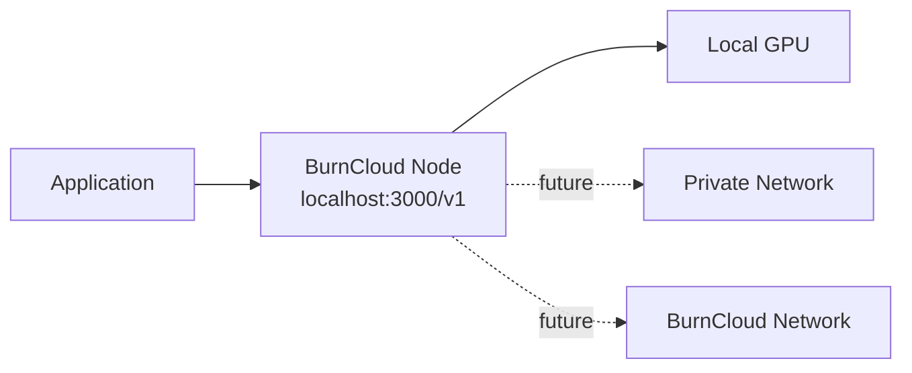

# BurnCloud Node

BurnCloud Node 是 BurnCloud 的本地运行节点。它的目标是让应用只面对一个稳定的 OpenAI-compatible API，而把本地模型文件、硬件判断、Runtime 和模型进程管理留给 BurnCloud。

> **阅读方式**
>
> - 普通用户：先看「一句话理解」「第一次调用」「Node 能做什么」。
> - 应用开发者：继续看「请求生命周期」「模型生命周期」「API Contract」。
> - BurnCloud Contributor：最后进入「当前源码与目标架构」「Source Reference」。

## 1. 一句话理解



对使用者来说，最重要的约定只有一个：

```text
http://localhost:3000/v1
```

应用不需要知道模型最终由哪个 GGUF 文件、哪个 Runtime、哪个内部端口运行。

**设计目标：Request a model, not a file.**

---

## 2. 第一次调用

应用仍然使用熟悉的 OpenAI Chat Completions 形式：

```bash
curl http://localhost:3000/v1/chat/completions \
  -H "Content-Type: application/json" \
  -d '{
    "model": "deepseek-r1-7b",
    "messages": [
      {
        "role": "user",
        "content": "Hello"
      }
    ]
  }'
```

Node v0.1 的目标体验是：如果模型已经准备好，直接推理；如果模型不存在，BurnCloud 自动进入模型准备流程，而不是要求用户先理解 GGUF、量化版本和 Runtime 参数。

```text
Application
    │
    │ model = deepseek-r1-7b
    ▼
BurnCloud Node
    │
    ├─ model ready ───────────────► inference
    │
    └─ model missing
           │
           ├─ detect hardware
           ├─ resolve model variant
           ├─ download / verify
           ├─ prepare runtime
           └─ start model
                  │
                  ▼
               inference
```

> **状态说明**：仓库当前已经存在统一 `/v1` 数据面和 Router 执行链；“根据模型名自动选择本地模型文件并准备本地 Runtime”属于 BurnCloud Node v0.1 正在收敛的目标架构。本文会明确区分当前源码事实与目标设计。

---

## 3. BurnCloud Node 能做什么

Node 的最小职责先控制在六个组件内。

| 组件 | 用户看到的能力 | 技术职责 | 阶段 |
|---|---|---|---|
| **Local API Gateway** | 一个 `/v1` 地址 | 接收兼容 API、解析模型名、流式返回、统一错误 | ✅ 当前已有统一数据面；本地 Runtime 路由继续收敛 |
| **Hardware Detector** | 自动识别机器 | CPU、架构、RAM、GPU、VRAM、磁盘等能力描述 | 🎯 Node v0.1 |
| **Model Resolver** | 只写模型名 | 模型别名 → Manifest → 硬件约束 → Variant / Artifact | 🎯 Node v0.1 |
| **Model Manager** | 自动准备模型 | 下载、断点续传、校验、缓存、删除、状态管理 | 🎯 Node v0.1 |
| **Runtime Manager** | 不手工安装推理服务 | prepare / start / stop / health；v0.1 优先聚焦 GGUF + llama.cpp 路线 | 🎯 Node v0.1 |
| **Process Manager** | 模型服务保持可用 | PID、内部端口、健康检查、退出、日志、恢复 | 🎯 Node v0.1 |

### Node 不应该要求用户先做什么

Node 的价值不是增加一层配置，而是逐步消除本地模型运行前的人工工作：

```text
不要求应用直接管理模型文件
不要求应用固定 Runtime 内部端口
不要求调用方理解 Q4 / Q8 等具体文件名
不要求每个应用分别管理模型进程
```

---

## 4. 一次请求如何工作

这是 BurnCloud Node 最重要的 E2E 流程。



### 对用户的稳定边界

外部应用只依赖：

```text
localhost:3000/v1
```

内部实现可以变化：

```text
GGUF 文件名可以变化
量化版本可以变化
Runtime 可以升级
内部监听端口可以变化
模型进程可以重启
```

因此 Node 的核心架构原则是：

> **API 是稳定边界，Runtime 是内部实现。**

---

## 5. Node Architecture



这里的职责边界非常重要：

- **API Gateway** 不负责下载模型。
- **Model Resolver** 决定“应该用哪个模型版本”，不负责启动进程。
- **Model Manager** 管理模型 Artifact，不直接暴露给应用。
- **Runtime Manager** 管 Runtime 生命周期。
- **Process Manager** 管实际运行进程和健康状态。
- **Local State** 保存可恢复状态，让 Node 重启后仍知道机器上有什么。

---

## 6. Model Resolver：模型名，而不是文件名

调用方使用稳定模型名：

```text
deepseek-r1-7b
```

Node 内部再解析到具体 Artifact：



一个目标 Manifest 可以表达：

```yaml
name: deepseek-r1-7b
variants:
  - runtime: llama.cpp
    format: gguf
    quantization: q4_k_m
    min_ram_gb: 8
    artifact: "..."

  - runtime: llama.cpp
    format: gguf
    quantization: q8_0
    min_ram_gb: 16
    artifact: "..."
```

上面的 Manifest 是 **Node 数据模型设计示例**，不是对当前仓库已落地字段的声明。

---

## 7. Model Lifecycle

模型不是简单的“有 / 没有”，而是一个可观察的生命周期。



建议 Node 对外至少能区分：

| 状态 | 含义 |
|---|---|
| `NOT_INSTALLED` | 本机没有模型 Artifact |
| `RESOLVING` | 正在决定模型 Variant |
| `DOWNLOADING` | 正在下载 |
| `VERIFYING` | 正在做完整性校验 |
| `INSTALLED` | 模型文件已准备，但进程未必运行 |
| `STARTING` | Runtime 正在加载模型 |
| `READY` | 可以接受推理请求 |
| `ERROR` | 准备或运行失败，需要明确错误原因 |

这套状态应成为 CLI、桌面 UI 和 API 的共同语言，而不是每个界面自己创造一套状态。

---

## 8. API Contract

BurnCloud Node 的第一优先级不是增加很多 API，而是先稳定最小兼容面。

### `GET /v1/models`

用于查询当前可用模型。

当前源码执行链：

- [GET /v1/models → Source Atlas](/http-api/ai-api-data-plane/get-v1-models/)

### `POST /v1/chat/completions`

应用的主要聊天推理入口。

当前源码执行链：

- [POST /v1/chat/completions → Source Atlas](/http-api/ai-api-data-plane/post-v1-chat-completions/)

### 为什么先固定 `/v1`

```text
Application
     │
     ▼
localhost:3000/v1
     │
     ├─ 今天：现有 Router / Provider 路径
     │
     └─ Node v0.1：Local Runtime 路径
```

应用不应该因为 BurnCloud 内部增加本地 Runtime、Private Network 或 BurnCloud Network 而修改接入地址。

---

## 9. 当前源码 vs. Node v0.1 目标

文档必须区分“已经存在的源码事实”和“我们准备实现的 Node 设计”。

| 能力 | 当前状态 | 说明 |
|---|---|---|
| Unified Gateway / `/v1` 数据面 | ✅ 当前源码 | 已有统一 Server / Router 入口 |
| `/v1/models` | ✅ 当前源码 | 当前从 Channel 能力读取模型 |
| `/v1/chat/completions` | ✅ 当前源码 | 当前进入统一 Router / Provider 执行链 |
| 系统资源监控 | ✅ 当前源码 | 已有 CPU / Memory / Disk 等监控基础 |
| 下载基础设施 | ✅ 当前源码 | 已有 download / aria2 相关能力和后台恢复逻辑 |
| Local Hardware Profile | 🎯 Node v0.1 | 把本机能力整理成模型选择可使用的统一结构 |
| Model Manifest / Resolver | 🎯 Node v0.1 | 模型名解析到适合本机的 Artifact |
| 本地模型 Lazy Prepare | 🎯 Node v0.1 | 第一次请求触发模型准备流程 |
| llama.cpp Runtime Manager | 🎯 Node v0.1 | 先建立一个清晰 Runtime 实现，再扩展其它 Runtime |
| Local Process Manager | 🎯 Node v0.1 | 管理模型进程、内部端口、健康检查和恢复 |
| Private Network | 🔭 后续 | Node 之间共享私有算力 |
| BurnCloud Network | 🔭 后续 | Node 可选择加入公共网络 |

这样，架构图可以描述方向，但 Source Reference 永远描述当前事实。

---

## 10. 当前 Source Reference

如果你需要从“功能”继续追到“当前代码”，使用下面的 Source Atlas。

### API / Router

- [GET /v1/models](/http-api/ai-api-data-plane/get-v1-models/)
- [POST /v1/chat/completions](/http-api/ai-api-data-plane/post-v1-chat-completions/)

### Startup

- [src/main.rs](/startup/src-main.rs/)
- [start_server](/startup/start_server/)
- [create_app](/startup/create_app/)
- [create_router_app](/startup/create_router_app/)

### Current CLI / Desktop entry points

- [burncloud](/cli/burncloud/burncloud/)
- [burncloud server](/cli/burncloud/server/)
- [burncloud router](/cli/burncloud/router/)
- [burncloud client](/cli/burncloud/client/)

Source Atlas 的作用是回答：

```text
入口在哪里？
穿过哪些模块？
调用了什么函数？
状态写到哪里？
当前源码实际上做了什么？
```

而本页的作用是回答：

```text
BurnCloud Node 是什么？
用户怎么使用？
组件为什么这样拆？
Node v0.1 应该收敛到什么架构？
```

两层文档互相补充，不再把所有源码细节塞到第一次访问的页面里。

---

## 11. 从 Local Node 到 BurnCloud Network

BurnCloud Node 首先必须独立有价值。



以后再从同一个 Node 自然增加更多执行位置：



核心约束仍然不变：

> **One local endpoint. Any model. Anywhere.**

“Anywhere”是后续能力；Node v0.1 首先把 **Local** 做好。

---

## 12. 推荐阅读路径

**我只是想用 BurnCloud：**

```text
一句话理解
  ↓
第一次调用
  ↓
Node 能做什么
  ↓
API Contract
```

**我要把应用接入 BurnCloud：**

```text
API Contract
  ↓
请求生命周期
  ↓
模型生命周期
  ↓
错误 / 状态
```

**我要开发 BurnCloud：**

```text
Node Architecture
  ↓
当前源码 vs. Node v0.1
  ↓
Source Reference
  ↓
具体 E2E / ICFG 页面
```

---

## 文档原则

BurnCloud 技术文档以后统一遵循：

> **Concept → Flow → Interface → Source**

先让人看懂产品，再让工程师理解执行过程，最后让 Contributor 可以验证到具体源码。
