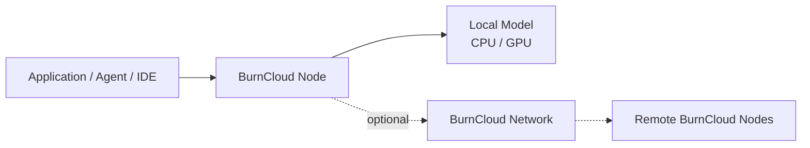

# BurnCloud

BurnCloud 是一个围绕 **AI 模型运行、统一 API 和算力网络**构建的开源基础设施项目。

这份文档首先按 BurnCloud 的主要架构节点组织内容，而不是先从源码目录、HTTP Handler 或 CLI 命令开始。

## 先看两个核心节点



### BurnCloud Node

BurnCloud Node 是最先需要理解的运行节点。

它安装在本地电脑或服务器上，对应用提供一个稳定的 OpenAI-compatible `/v1` API，并负责逐步自动化本地模型、硬件、Runtime 和模型进程的管理。

**先阅读：** [BurnCloud Node](/burncloud-node/)

### BurnCloud Network

BurnCloud Network 是建立在 BurnCloud Node 之上的网络能力。

当 Node 本地不能运行某个模型，或者用户主动选择共享/使用其它节点能力时，Node 可以进一步连接私有网络或 BurnCloud Network。

**先阅读：** [BurnCloud Network](/burncloud-network/)

## 推荐阅读顺序

```text
BurnCloud
   ↓
BurnCloud Node
   ↓
Node 的六个核心功能
   ↓
实际 /v1 请求生命周期
   ↓
BurnCloud Network
   ↓
Technical Reference / Source Atlas
```

如果你的目标只是先理解 BurnCloud，不需要一开始阅读 Technical Reference。只有在需要核对真实 API、CLI、后台任务、调用链或 Rust 源码时，再进入后面的技术参考树。
