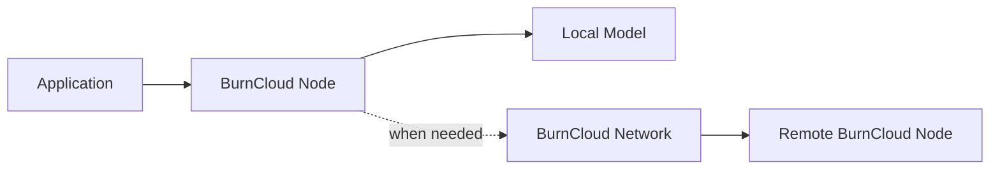

# BurnCloud Network

BurnCloud Network 是建立在 BurnCloud Node 之上的可选网络能力。

它不是 BurnCloud Node 运行本地模型的前提。Node 应该先能独立工作，再选择是否加入私有网络或 BurnCloud Network。



## 设计原则

### 1. Node 先独立运行

```text
BurnCloud Node
   ↓
localhost:3000/v1
   ↓
Local Model
```

即使完全不连接 BurnCloud Network，本地能力仍然成立。

### 2. Network 是可插拔能力

当本地硬件无法运行请求模型，或者用户主动允许远程算力时，Node 才进入网络路径。

未来可以形成：

```text
Local
  ↓ fallback
Private Network
  ↓ fallback
BurnCloud Network
```

### 3. 供应商控制自己的 Node

供应商在自己的网络中部署 BurnCloud Node / Server 后，Network 不应该直接获得供应商内部 GPU 的 root 控制权。

```text
BurnCloud Network
       ↓ request
Supplier BurnCloud Node
       ↓ local policy
Supplier GPU / Runtime
```

供应商决定开放哪些模型、多少容量以及什么时候退出 Network。

## Network 以后需要展开的主题

本页目前只定义 Network 的位置。后续独立文档会逐步增加：

- Node Identity；
- Join / Leave；
- Provider Capability；
- Private Network；
- Request Routing；
- Usage Receipt；
- Reconciliation；
- Settlement；
- Trust / Verification。

## 当前状态

**🔭 Architecture / Future**：当前文档首先集中完成 BurnCloud Node v0.1。BurnCloud Network 会建立在稳定的 Node、统一 `/v1`、本地模型生命周期和 Node Identity 之上，不应反过来阻塞 Node MVP。
