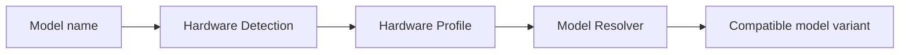

# Hardware Detection

**Hardware Detection** 把一台机器转换成 BurnCloud Node 可以理解的硬件能力描述。

用户不应该先判断自己的机器能不能跑某个模型。Node 应先知道本机有哪些资源，再把这份能力交给 Model Resolver。

## 需要检测什么

最小硬件画像包括：

| 类别 | 字段示例 |
|---|---|
| OS | Windows / Linux / macOS |
| CPU | 架构、核心数、可用指令集 |
| Memory | 总 RAM、可用 RAM |
| GPU | Vendor、Model、数量 |
| VRAM | 每张 GPU 总显存、可用显存 |
| Driver | 驱动 / Runtime 兼容信息 |
| Disk | 可用空间、模型缓存目录容量 |

目标内部结构可以抽象为：

```json
{
  "os": "windows",
  "cpu_arch": "x86_64",
  "ram_mb": 65536,
  "gpu": [
    {
      "vendor": "nvidia",
      "model": "RTX 5090",
      "vram_mb": 32768
    }
  ],
  "disk_free_mb": 390000
}
```

## 在请求流程中的位置



Hardware Detection 不直接决定下载哪个 GGUF。它只提供真实能力数据。

## 为什么单独做成组件

如果把硬件判断散落在 Model Manager、Runtime Manager 和 UI 中，很快会出现三套不同的判断结果。

BurnCloud 应该只有一份统一 `HardwareProfile`：

```text
Hardware Detector
       ↓
HardwareProfile
       ├─ Model Resolver
       ├─ Runtime Manager
       ├─ UI
       └─ diagnostics
```

## 刷新策略

硬件静态信息和动态信息应分开：

```text
Static
- CPU architecture
- GPU model
- total VRAM

Dynamic
- available RAM
- available VRAM
- free disk
- device availability
```

静态信息可以在 Node 启动时缓存；动态资源在准备模型前重新检查。

## 失败情况

需要明确处理：

- GPU 驱动不可用；
- GPU 可见但 Runtime 不兼容；
- 显存不足；
- RAM 不足；
- 磁盘不足；
- 多 GPU 信息不完整；
- 权限不足导致设备探测失败。

这些错误应该转成可读诊断，而不是直接让 Runtime 启动失败。

## 当前源码 / 目标

- **✅ Current**：现有 BurnCloud 已有系统监控相关 CPU / memory / disk 采集能力。
- **🎯 Node v0.1**：形成专门面向本地模型决策的统一 `HardwareProfile`，并补齐 GPU / VRAM / Runtime compatibility 信息。
